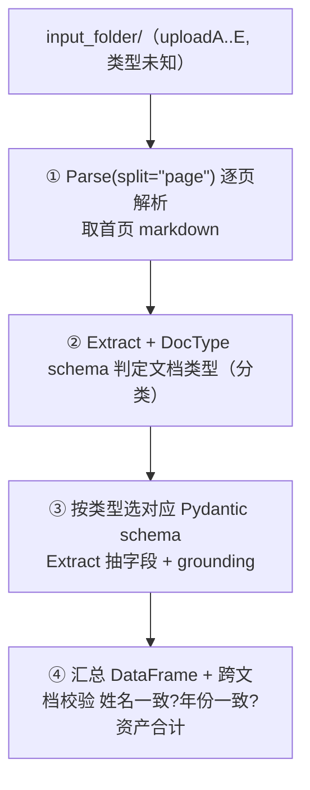

# L9 · 混合文档处理管线（分类 → 抽取 → 校验，贷款场景，Lab 4 练习三）

> 课程：Document AI: From OCR to Agentic Doc Extraction（DeepLearning.AI × LandingAI）
> 本课任务（Lab 4 续，Andrea）：扮演银行贷款审核员，搭一条**真实、完整**的文档处理管线——用户上传一堆命名混乱、类型未知的财务文件，管线要**解析 → 判断类型 → 按类型抽字段 → 跨文档校验**，全程只用 ADE 作主 API。

## 0. 场景与管线

申请贷款时你会上传：收入证明（pay stub）、税表（W-2）、银行/投资对账单、政府 ID……银行收到时它们名字千奇百怪（uploadA、image456）。银行要做两件事：**① 搞清每份是什么；② 抽出关心的 KV（如总资产）**。



预览 5 份样本（讲师提醒是从网上匿名拼凑、非同一人）：A=Fidelity 投资对账单、B=工资单、C=银行对账单、D=护照、E=美国 W-2。「我人眼一秒认出，但管线怎么懂?」

## 1. 用 Pydantic 定义 schema（分类器 + 抽取器）

练习一用 JSON schema，本练习改用 **Pydantic**——ADE 两种都吃，底层会把 Pydantic 转 JSON。先定义**分类用**的 schema：枚举五种类型 + 每种的丰富描述：

```python
from enum import Enum
from pydantic import BaseModel, Field
from landingai_ade.lib import pydantic_to_json_schema

class DocumentType(str, Enum):
    ID = "ID"; W2 = "W2"; pay_stub = "pay_stub"
    bank_statement = "bank_statement"; investment_statement = "investment_statement"
    def describe(self):     # 每个枚举值配一段「长什么样」的描述，帮模型分类
        return {"ID":"护照/驾照等政府身份证件",
                "W2":"年终 W-2，报告年度应税工资与代扣", ...}[self.value]

class DocType(BaseModel):
    type: DocumentType = Field(description="被分析文档的类型", title="Document Type")
```

再定义**每种文档专属的抽取 schema**（各自要什么字段），末尾映射成简写名：

```python
class IDSchema(BaseModel):        # 政府 ID
    name: str = Field(description="此人全名")
    issuer: str = Field(description="签发的州或国家")
    issue_date: str = Field(description="签发日期")
    identifier: str = Field(description="唯一号，如护照号/驾照号")

class W2Schema(BaseModel):        # 美国税表
    employee_name: str; employer_name: str
    w2_year: int = Field(description="W-2 年份")          # 一个 int
    wages_box_1: float = Field(description="box 1 全年总工资")  # 一个 float
# ... 另外 3 套：pay_stub / bank_statement / investment_statement
# schema_per_doc_type = {类型简写: 对应 Schema 类}
```

## 2. 步骤①② · 逐页解析 + 分类

**关键参数 `split="page"`**：让每页各返回一份 markdown（11 页投资对账单 → 11 份 markdown）。因为**认出文档类型通常只需首页**，分类只喂 `splits[0].markdown` 省算力：

```python
document_types = {}
for document in input_folder.iterdir():
    if document.is_dir(): continue          # 跳过子目录，别让 ADE 去 parse 目录
    parse_result: ParseResponse = client.parse(
        document=document, split="page", model="dpt-2-latest")

    first_page_markdown = parse_result.splits[0].markdown   # 只取首页

    extraction_result: ExtractResponse = client.extract(     # 用分类 schema
        schema=doc_type_json_schema,
        markdown=first_page_markdown)
    doc_type = extraction_result.extraction["type"]
    document_types[document] = {"document_type": doc_type,
                                "parse_result": parse_result}
```

结果全对：C=bank_statement、A=investment_statement、E=W2、D=ID、B=pay_stub。（讲师注：这里串行发送，可并行加速。）

> **架构师视角**：这里 schema 干了两份工——先当**分类器**（DocType 枚举 + 描述 → 路由键），再当**抽取器**（每类专属 schema）。用「同一个 Extract API + 换 schema」实现了 route-then-extract，无需另训分类模型、无需写规则。而且分类只喂首页 markdown、抽取才喂整篇——**按信息需求分配 token**。这正是 `11-design-patterns.md` 的 router 模式落在文档域的样子：路由决策本身也是一次结构化抽取。代价是分类质量依赖枚举描述写得好不好，属于 prompt/schema 工程而非模型工程。

## 3. 步骤③ · 按类型抽字段 + 复用同一份 parse

拿到类型后，查表选 schema，把**整篇 markdown**（非首页）送去抽字段——注意此处**复用了②里已缓存的 `parse_result`，不再重复 parse**：

```python
document_extractions = {}
for document, extraction in document_types.items():
    json_schema = pydantic_to_json_schema(         # Pydantic → JSON
        schema_per_doc_type[extraction["document_type"]])
    extraction_result: ExtractResponse = client.extract(
        schema=json_schema,
        markdown=extraction["parse_result"].markdown)   # 复用已 parse 的结果
    document_extractions[document] = {
        "extraction": extraction_result.extraction,
        "extraction_metadata": extraction_result.extraction_metadata}  # 含 visual grounding
```

抽取样例：D(护照)=日本签发、issue_date 2025-03-24；E(W-2)=John Doe、2024 年、box1 工资 $2323。`extraction_metadata` 里的长 chunk id 可回连原文档（L8 讲过）。

### 3.1 两种 grounding 可视化

```python
# (a) 画全部 chunk 的 bbox
draw_bounding_boxes_2(extraction["parse_result"].grounding, document, base_path=...)

# (b) 只画 schema 里抽到的字段 —— 把人眼引到关键位置
for label, meta in extraction["extraction_metadata"].items():
    chunk_id = meta["references"][0]
    document_grounds[chunk_id] = parse_result.grounding[chunk_id]
draw_bounding_boxes_2(document_grounds, document, base_path=...)
```

(b) 对 human-in-the-loop 系统尤其有用：只高亮抽到值的字段（姓名/总额/日期在哪），审核员一眼定位。

> **对比课程 19「Event-Driven Agentic Document Workflows with LlamaIndex」**：那门课把「解析→路由→抽取→校验」建成显式的**事件驱动 workflow**（每步是事件、可分支/重试/插人审）。本课用一段朴素 Python for-loop + dict 就实现了同一逻辑骨架——解析、按类型路由、抽取、校验。差别在编排**成熟度**：LlamaIndex workflow 给你并发、可观测、可恢复的编排基建；裸循环胜在直白、易懂、易改。选型看规模：几十份文档的批处理裸循环足矣；要做成有 SLA、要并发要重试的生产服务，才值得上事件驱动 workflow 框架。ADE 在两者里都只当「解析+抽取」的底层能力。

## 4. 步骤④ · 汇总与确定性校验

把所有抽取拍平成 Pandas DataFrame（申请人目录 / 文档名 / 类型 / 字段 / 值），这就是一份「此人提交了什么」的总表——省去逐份开文档、人眼找数、手敲进系统的功夫。

然后是三段**确定性校验**（纯 Python/pandas，不动 LLM）：

```python
# ① 姓名一致性：五份文档的姓名字段是否指向同一人（防上传邻居的材料）
name_fields = {"account_owner", "employee_name", "name"}
all_names_match = df[df["field"].isin(name_fields)]["value"].nunique() == 1

# ② 年份一致性：贷款要求近期材料，用正则从各类日期抠出 4 位年份
def extract_year(v):
    m = re.search(r"\b(19|20)\d{2}\b", str(v)); return int(m.group(0)) if m else None

# ③ 资产汇总：银行余额 + 投资余额 = 总资产
total_assets = (pd.to_numeric(df_bank["value"], errors="coerce").sum()
              + pd.to_numeric(df_invest["value"], errors="coerce").sum())
```

因是演示材料，姓名/年份校验会「不匹配」（本就来自不同人、混了旧文件）——正好演示如何**触发告警/退回申请人**。

> **架构师视角**：注意校验层刻意**不用 LLM**——姓名比对、年份提取、金额求和都是确定性规则。这是成熟文档管线的分工：**LLM/VLM 负责从非结构化像素里抽出结构化字段（一次性、易错、需 grounding 兜底），确定性代码负责在结构化字段上做业务规则判断（可测试、可审计、零幻觉）**。把「跨文档姓名是否一致」交给 LLM 是反模式——既贵又不可靠还没有审计价值。对应 `7-safety-guardrails.md`：能用确定性校验做的护栏，绝不外包给概率模型。

## 本课总结

| 要点 | 一句话 |
|---|---|
| route-then-extract | schema 先当分类器（DocType 枚举+描述）再当抽取器（按类型专属 schema） |
| split="page" | 逐页 markdown；分类只喂首页省算力，抽取喂整篇 |
| Pydantic schema | ADE 吃 Pydantic/JSON，底层统一转 JSON；描述质量决定抽取质量 |
| parse 复用 | 一份 parse_result 供分类与抽取两次消费，不重复 parse |
| 双 grounding | 画全部 chunk / 只画抽到的字段（人审定位） |
| 确定性校验 | 姓名一致/年份一致/资产汇总用纯 pandas，不用 LLM |
| LLM×代码分工 | 概率模型抽字段，确定性代码判规则 |

> **记忆点（引出 L10）**：至此 ADE 已能把任意布局、任意语言的文档变成干净、带 grounding 的结构化数据。下一个自然问题——**这些结构化数据拿去干嘛？** L10（David）给出答案之一：喂 **RAG**。把一份 74 页的 Apple 10-K 变成可查询知识库，讲清为何关键词检索会失效（语义错配/上下文盲/信息碎片），以及 ADE 的干净输出如何成为「garbage-in-garbage-out」链条里那个决定成败的上游。

## 与我的资产映射

- 设计模式：`agent/skills/agent-selection/11-design-patterns.md`（router：路由决策=结构化抽取；route-then-extract）
- 安全护栏：`agent/skills/agent-selection/7-safety-guardrails.md`（确定性校验优先于概率模型判断）
- 检索层：`agent/skills/agent-selection/3-retrieval.md`（parse 复用、按需求分配 token）
- 对比课程：`agent/courses/19-Event-Driven Agentic Document Workflows with LlamaIndex`（裸循环 vs 事件驱动编排）
- 面试包：文档分类+抽取+校验的端到端管线，human-in-the-loop 定位
- [[project_selection_matrix]]
