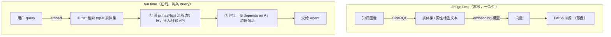

# L4 · 图谱增强的 API 发现：向量检索 + 流程边扩展（FAISS + SPARQL）

> 课程：Knowledge Graphs for AI Agent API Discovery（DeepLearning.AI × SAP）
> 本课任务：在 L2/L3 构好的知识图谱上实现 **API Discovery**——先用 embedding 做平面（flat）检索缩小候选，再用图谱里的**业务流程边**补齐漏检、并给 Agent 附上流程上下文。

## 0. 本课目标与路线：design time / run time 两段式

真实业务场景常有**数千个 API**。把它们全塞给 LLM 既不高效（token 上限、延迟），多数情况下也不现实——必须针对每条用户 query 把 API 选择空间缩到一个**小而相关的子集**。本课的流水线分两段：



新增依赖：`faiss`（IndexFlatL2/IndexFlat，相似度检索）、`tqdm`（进度条）、`langchain_openai.OpenAIEmbeddings`（`text-embedding-3-large`）；沿用 `helper.parameterize_sparql` 做 SPARQL 参数化。图谱直接 `graph.parse("odata_knowledge_graph.ttl")` 加载前几课的成果。

## 1. 为什么 flat 检索不够：两类失败模式

纯 embedding 检索能缩小候选，但有两个结构性问题——**这正是知识图谱介入的位置**：

| 失败模式 | 含义 | 图谱怎么救 |
|---|---|---|
| **False negatives** | 相关 API 与 query 语义距离不够近，检索直接漏掉 | 第二步沿业务流程边扩展，把"true positives 触及的流程"补完整，漏掉的 API 仍可达 |
| **False positives** | 语义相近但实际无关的 API 混进候选 | 给候选附上流程信息，Agent 看到"谁依赖谁"后能主动排除不在流程里的干扰项 |

> **对比 3-retrieval 的向量检索/GraphRAG**：这就是 GraphRAG "向量召回 + 图扩展" 的工具发现版——向量检索管**语义相似**，图遍历管**结构相关**。纯向量方案的召回上限由"query 措辞 vs API 描述措辞"的贴近程度决定；图谱把召回上限改写为"语义命中任意一个流程节点，整条流程可达"。两者是互补而非替代。

## 2. Design time ①：把实体集"属性子图"压成一段文本

回忆 L2：每个 entity set 的全部属性都存在图谱里。第一步用 SPARQL 把它们捞出来。先看单个实体集（PurchaseOrder）的属性长什么样：

```sparql
SELECT DISTINCT ?entity_set ?property_label
WHERE {
    BIND(<...Service/API_PURCHASEORDER_2/EntitySet/PURCHASEORDER>
         as ?entity_set_uri)                       # 锚定到采购订单实体集
    ?entity_set_uri rdf:type odata:EntitySet.      # 确认它确实是 EntitySet
    ?entity_set_uri odata:name ?entity_set.        # 取实体集名字
    ?entity_set_uri odata:entityType ?entity_type_uri.
    { ?entity_type_uri odata:property ?property_uri.
      ?property_uri odata:label ?property_label. } # 沿 entityType→property 拿属性标签
}
```

结果是 (entity_set, property_label) 对：Address Number、Incoterms、Purchasing Organization、Quotation Date……

真正用于 embedding 的是第二个查询 `q_embedding_string`——在 SPARQL 里**直接完成文本拼接**（不是在 Python 里拼）：

```sparql
SELECT ?entity_set_uri
    (CONCAT("entity set: ", ?entity_set_name,
            "; properties: ",
            group_concat(?property_label; separator=", "))
     AS ?embedding_string)                          # 实体集名 + 全部属性标签拼成一句话
WHERE {
    ?entity_set_uri a odata:EntitySet ;
        odata:name ?entity_set_name ;
        odata:entityType/odata:property/odata:label ?property_label .
        # ↑ property path：一步走完 entityType→property→label 三跳
}
GROUP BY ?entity_set_uri ?entity_set_name           # 每个实体集聚合成一行
```

样例输出（BillingDocument）：`entity set: BillingDocument; properties: Document Number, Posting Status, Value Days, Billing Date, ...`

课程特别点出：这只是图谱灵活性的**冰山一角**——embedding 文本想加什么就沿图再走几跳：属性的 data type、max length，甚至业务流程信息，都在图里现成可取。

> **架构师视角**：这一步的本质是**"embedding 文本的构造逻辑 = 一条 SPARQL 查询"**。要调检索效果（加属性类型？加流程上下文？），改的是查询字符串，不是 Python 代码——和 L2"声明式构图"是同一个哲学。对照 4-tools.md 里工具描述工程（tool description engineering）的痛点：工具描述通常手写、难批量重构；这里的"工具描述"是从图谱**投影**出来的，schema 一变、全量重生成，天然一致。

## 3. Design time ②：生成 embeddings、建 FAISS 索引、落盘

```python
embeddings, entity_set_uris = [], []
for row in tqdm.tqdm(graph.query(q_embedding_string)):
    embeddings.append(embedding_model.embed_query(row.embedding_string))
    entity_set_uris.append(str(row.entity_set_uri))   # 向量与 URI 按位置对齐

xb = np.array(embeddings).astype("float32")
index = IndexFlatL2(xb.shape[1])   # L2 距离的暴力精确索引（课程说明：任何向量库都行）
index.add(xb)

pickle.dump(index, ...)            # 索引 + URI 列表分别 pickle 落盘
pickle.dump(entity_set_uris, ...)  # 供 L5 的 Agent 直接加载
```

小结这半段：**图谱查子图 → 标签拼接成串 → 串变向量 → 向量入索引，且每个向量关联回 entity set 的 URI**。URI 是向量世界和图谱世界之间的外键——检索命中后靠它回到图上继续走边。

## 4. Run time ①：flat 检索，以及它漏了什么

```python
def query_index(index, entity_set_uris, embedding_model, query, top=5):
    x_query = np.array([embedding_model.embed_query(query)])  # query 同模型向量化
    _, indices = index.search(x_query, top)                   # FAISS 取 top-k 近邻
    return [entity_set_uris[i] for i in indices[0]]           # 下标翻译回 URI
```

示例 query（贯穿全课）：**"Create a purchase order for 5 pencils in purchasing group 002 and purchasing organization 3000"**。

top-5 结果里大量 purchase order 相关实体集——符合预期（课程提到此处可以再加一步 rerank，暂略）。但关键观察：

- 检索到了 **PurchaseRequisitionItem**；
- 却漏了 **PurchaseRequisitionHeader**——而它是创建采购订单的**重要前置**（先有采购申请，才有采购订单）。到此为止就停的话，Agent 根本不知道它的存在。

这就是第 1 节说的 false negative 的活体样本。

## 5. Run time ②：沿 pr:hasNext 流程边扩展候选

L3 加入的业务流程数据现在派上用场。查询目标：给定一组实体集，找出所有**指向它们或从它们出发**的流程依赖：

```sparql
SELECT DISTINCT ?entitySetA ?entitySetB ?nameA ?nameB
WHERE {
    {   VALUES ?entitySetA { var:::entity_set_uris }   # 命中集合作为"源"
        ?activityA  pr:entitySet ?entitySetA ;
                    pr:hasNext ?activityB .            # 流程边：A 活动之后是 B 活动
        ?activityB  pr:entitySet ?entitySetB .
        ?entitySetA odata:name ?nameA .
        ?entitySetB odata:name ?nameB .
    } UNION {
        VALUES ?entitySetB { var:::entity_set_uris }   # 命中集合作为"目标"
        ...同样的模式...                                 # UNION 合并两个方向
    }
}
```

三个机制点：

1. **走的是 activity 层**：实体集不直接相连，而是各自挂在流程活动（activity）上，`pr:hasNext` 连的是活动——所以模式是 `entitySet ← activity —hasNext→ activity → entitySet` 两跳；
2. **`VALUES` + `parameterize_sparql`**：运行时把检索命中的 URI 列表拼成 `<uri1> <uri2> ...` 注入 `var:::entity_set_uris` 占位符，一次查询批量扩展；
3. **`UNION` 双向**：命中的实体集既可能是流程上游也可能是下游，两个方向都要补。

包装成 `get_process_dependencies(entity_set_uris, graph)`，返回 `(URI_A, URI_B, nameA, nameB)` 四元组列表。用示例 query 的 top-5 去跑：结果里出现了 purchase requisition 与 purchase order 的依赖对——**PurchaseRequisitionHeader 被流程边"捞"了回来**。

## 6. 合体：discover_apis_and_process

```python
def discover_apis_and_process(query, graph, index, entity_set_uris, embedding_model):
    retrieved = query_index(..., query=query, top=5)          # ① 向量召回
    dependencies = get_process_dependencies(retrieved, graph)  # ② 图扩展

    merged = set(retrieved)                    # set 去重合并
    process_information = []
    for dep in dependencies:
        merged.add(dep[0]); merged.add(dep[1]) # 依赖两端都并入候选
        process_information.append(
            f"{dep[3]} depends on {dep[2]}")   # B depends on A：hasNext 反读成依赖

    return {"entity_sets": merged,             # 给 Agent 的候选 API 集
            "process_information": process_information}  # 给 Agent 的流程上下文
```

对示例 query 的最终输出：purchase order 相关实体集 + **补回的 PurchaseRequisitionHeader**，外加一条关键流程语句——*PurchaseOrder depends on PurchaseRequisition*。注意返回的不只是"更全的 API 列表"，还有**自然语言化的流程知识**，后者就是帮 Agent 排除 false positives、并按正确顺序编排调用的依据。

> **对比课程 10-MCP 的 list_tools**：MCP 的 `list_tools` 返回全量平面清单，等价于"没有第一步、也没有第二步"；主流改良（工具 RAG）等价于只有第一步 flat 检索——本课演示了它必然产生 false negative。`discover_apis_and_process` 相当于一个**图谱驱动的 tool gateway**：输入 query，输出"小候选集 + 工具间依赖"。工具规模上千时（4-tools.md 的工具爆炸），这层 gateway 是刚需组件而非优化项。

> **架构师视角**：注意成本分布——图谱查询、文本拼接、向量化、建索引全部发生在 **design time**；run time 只有一次 query embedding + 一次 ANN 检索 + 一次本地 SPARQL，**没有任何 LLM 调用**。发现层做得越"便宜且确定"，编排层（L5 的 Agent）拿到的上下文就越干净。这与课程 12/12a/12b 记忆系统的分层同构：离线整理（consolidation）换在线检索的低延迟高精度。

## 7. 本课总结

| 要点 | 一句话 |
|---|---|
| 两段式流水线 | design time 建索引，run time 三步：flat 检索 → 流程边扩展 → 附流程信息 |
| embedding 文本来自图谱 | SPARQL `CONCAT + group_concat` 把"实体集名+属性标签"压成一句话，构造逻辑即查询 |
| URI 是两界外键 | FAISS 向量按位置关联 entity set URI，命中后回图谱继续走边 |
| False negative 的解 | PurchaseRequisitionHeader 被 flat 检索漏掉，被 `pr:hasNext` 流程边补回 |
| False positive 的解 | "B depends on A" 流程语句让 Agent 有依据排除语义相近的无关 API |
| 双向 UNION + VALUES | 流程扩展查上下游两个方向，URI 列表运行时参数化注入 |

> **记忆点（引出 L5）**：本课产出的 `discover_apis_and_process` 是一个纯检索函数——它只**找到**"该用哪些 API、谁依赖谁"，还没有**动手**。L5 把它交给 AI Agent：针对"查采购订单/建采购订单"这类用户请求，Agent 用它发现 API，然后真正**执行**调用，闭环完成任务。

## 与我的资产映射

- 工具层：`agent/skills/agent-selection/4-tools.md`——工具爆炸的第三条路线：平面清单 → 工具 RAG → **图谱 gateway（召回+扩展+依赖注释）**，本课是完整参考实现
- 检索层：`agent/skills/agent-selection/3-retrieval.md`——GraphRAG"向量召回 + 图遍历扩展"模式在 API 发现域的实例；false negative/false positive 双问题可直接用作选型论据
- 面试包：`02-tool-gateway`——`discover_apis_and_process` 的三步结构（embed 召回 / hasNext 扩展 / 依赖文本化）可整段引用
- [[project_selection_matrix]]
