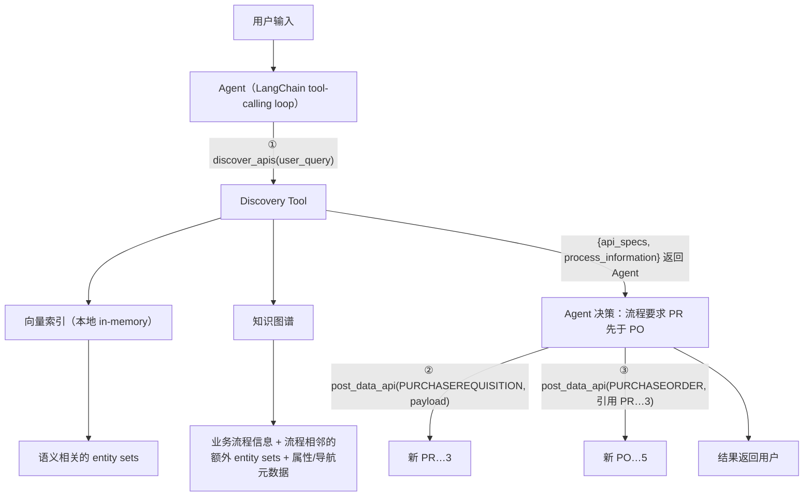

# L5 · 业务流程 Agent：发现并执行 API（LangChain Tool-Calling Agent）+ 全课收官

> 课程：Knowledge Graphs for AI Agent API Discovery（DeepLearning.AI × SAP）
> 本课任务：把 L4 的"发现能力"接入一个 LangChain Agent——用 **Discovery / GET Data / POST Data 三个工具**，让 Agent 端到端完成"查采购订单"和"按业务流程创建采购订单"。这是全课最后一课，结尾并入课程 Conclusion。

## 0. 本课目标与路线

L4 已经实现了"给一句自然语言，返回相关 entity sets + 业务流程信息"的发现函数；本课把它变成 Agent 的工具，再补上两个执行工具，走通**发现 → 决策 → 执行**闭环。三个工具分工：

| 工具 | 职责 |
|---|---|
| **Discovery Tool** | 按用户 query 检索 API 元数据：properties、navigations、业务流程信息 |
| **GET Data Tool** | 处理"查采购订单"类读请求（mock OData GET） |
| **POST Data Tool** | 按图谱里的业务流程信息创建 purchase requisition / purchase order（mock OData POST） |

技术栈：`rdflib`（图谱）+ pickle 加载的 in-memory 向量索引（L4 产物）+ LangChain `@tool` / `create_tool_calling_agent` / `AgentExecutor`，LLM 用 `gpt-4o`（temperature=0），embedding 用 `text-embedding-3-large`。

## 1. 装配：加载图谱、索引与 API 规范查询

老三样：加载前几课构建的知识图谱、L4 建好的 entity set 嵌入索引，再准备一个"取 API 规范"的辅助函数。

```python
graph = Dataset(default_union=True)
graph.parse("./ro_shared_data/odata_knowledge_graph.ttl",   # L3 连通后的完整图谱
            format="turtle")

with open(".../entity_sets_index.pickle", "rb") as f:
    index = pickle.load(f)                                   # L4 的嵌入索引（本地 in-memory）
```

`fetch_entity_specification` 从图谱里取出一个 entity set 的**属性 + 导航**（Discovery Tool 的原料）。用 PURCHASEORDER 试跑，返回里能看到：

- 所属 service 与 entity set 名；
- properties：PurchasingProcessingStatus、PurchasingGroup 等，且标出 **PurchaseOrderNumber 是 key**；
- navigations：关联 PurchaseOrderItem，**cardinality 为 one_to_many**（一张订单可含多个行项目）。

这些正是 Agent 拼 API 调用 payload 时需要的"接口说明书"。

## 2. Discovery Tool：语义检索 + 流程扩展 + 规范拼装

复用 L4 的 `discover_apis_and_process`（向量检索相关 entity sets，再从图谱补齐业务流程信息）。试跑 query "Show me the active purchase orders..."，返回的 entity sets 包含 PurchaseOrder / PurchaseOrderItem，**还捎带了 PurchaseRequisition（Item）**，以及流程事实"PurchaseOrder 依赖 PurchaseRequisition"——纯向量检索给不出的那一半。

用 `@tool` 装饰器把它包成 Agent 工具，并为每个命中的 entity set 附上完整规范：

```python
@tool
def discover_apis(user_query: str) -> dict:
    """按用户 query 发现相关 API 规范与流程信息"""      # docstring 即工具描述
    discovery = discover_apis_and_process(query=user_query,
        graph=graph, index=index, entity_set_uris=entity_set_uris,
        embedding_model=embedding_model)
    api_specs = [fetch_entity_specification(graph, uri)   # 每个 entity set 补全属性+导航
                 for uri in discovery["entity_sets"]]
    return {"api_specs": api_specs,
            "process_information": discovery["process_information"]}
```

> **对比课程 10-MCP 的 list_tools**：MCP 是"启动时一次性列出全部工具"，工具数上百就撑爆上下文（4-tools.md 的工具爆炸问题）；这里 Agent 只挂 **3 个元工具**，具体调哪个 API 由 discover_apis 在运行时按 query 动态检索——相当于把 `list_tools` 从"静态全量清单"升级成"语义化按需发现"。工具规模一大，这就是工具网关（tool gateway）的标准形态。

## 3. Mock 数据服务与 GET/POST 工具

课程用 mock 函数模拟 OData 后端。先看 mock 数据库的初始状态：

| 数据集 | 初始内容 |
|---|---|
| Purchase Requisitions | 2 张：PR…1（1 个 item：ruler）、PR…2（items 10/20：pencil、pen） |
| Purchase Orders | 3 张：PO…1/2/3，各一个 item（ruler/pencil/pen），**每个 PO item 都引用对应的 PR item** |

PO item 引用 PR item 这一点是后面例 2 的伏笔——"订单引用申请"正是图谱里那条流程规则在数据层的体现。

两个 mock 函数直接试跑：

```python
post_data_mock(data=data, service_name="API_PURCHASEORDER_2",
    entity_set="PURCHASEORDER",
    payload={"PurchaseOrderItem": [                     # header+items 一次调用（利用 navigation）
        {"Material": "mouse", "OrderQuantity": 5},
        {"Material": "keyboard", "OrderQuantity": 3}]})
# → 新建 PO…4（含 mouse/keyboard 两个 item）

get_data_mock(data=data, service_name="API_PURCHASEORDER_2",
    entity_set="PURCHASEORDER",
    filter_string="PurchasingGroup eq '005' and PurchasingOrganization eq '3000'",
    selects_string="PurchaseOrder,PurchasingGroup,PurchasingOrganization")
# → 打印生成的 OData 调用，返回匹配的 PO…1
```

再用同一个 `@tool` 装饰器包成 `get_api(service_name, entity_set, filter_string, selects_string)` 和 `post_data_api(service_name, entity_set, payload)`——签名即 OData 调用的最小参数面。

## 4. 组装 Agent：流程事实在图谱里，通用规则在 prompt 里

用 LangChain 预置的 agent loop，喂入三个工具和一份 prompt：

```python
agent = create_tool_calling_agent(
    llm=llm, tools=[discover_apis, get_api, post_data_api], prompt=prompt)
agent_executor = AgentExecutor.from_agent_and_tools(
    agent=agent, tools=[...], verbose=True,
    return_intermediate_steps=True)          # 保留中间步骤便于观察决策链
```

prompt 里写的是**通用调用规则**（摘录要点）：

1. 先用**完整的用户 query** 调 discover_apis 做发现；
2. 若发现了相关**业务流程信息，必须遵循流程**去服务用户请求；
3. 若 entity set 有 navigations，可在**对父对象的一次调用里同时创建父与子**（payload 里子对象以 `child_entity_set_name: [...]` 内嵌）；
4. 不先建父就不许建子；注意 navigation 的 cardinality（one_to_many 时子对象可为列表）；
5. **不许编造属性值**——用户没给的字段不进 payload；key 属性由后端生成，创建时不要带；
6. 引用已创建对象时用其 key；建完对象不要再查询验证。

> **架构师视角**：注意分工——"PR 必须先于 PO"这条**领域流程事实不在 prompt 里**，它存在图谱中、由 discovery 工具运行时取回；prompt 只写"如果发现了流程信息就遵循它"这类**领域无关的元规则**。流程变了改图谱数据即可，prompt 与代码零改动。这与课程 12/12a/12b 的 memory 思路同构：把易变知识外置成可查询的数据，而不是烧进 prompt——图谱在这里就是 Agent 的外置 semantic memory。

## 5. 例 1：查 active 采购订单——一次失败与图谱级热修复

Query："Show me active purchase orders in purchasing group 002 and purchasing organization 3000"。

**第一次运行（失败）**：Agent 正确地先 discover 再调 get_api，但 filter 里直接用了字面值 `PurchasingProcessingStatus eq 'active'`——而后端存的是**技术编码**（`02`），于是返回"没有 active 订单"。典型的企业系统坑：自然语言词汇 ≠ 后端 code。

**修复：不改代码、不改 prompt，往图谱里 INSERT 一组 fixed value helpers**（状态码 ↔ 描述的映射）：

```sparql
INSERT DATA {
  <.../Property/PURCHASINGPROCESSINGSTATUS> odata:valueHelp
      [ odata:key "01" ; odata:value "In process" ],
      [ odata:key "02" ; odata:value "Active" ],      # ← 关键映射
      [ odata:key "03" ; odata:value "In release" ],
      ...
      [ odata:key "08" ; odata:value "Rejected" ] .
}
```

`graph.update(...)` 之后**重跑同一 query**：discovery 返回的属性规范里现在带着 value help，Agent 自动把 "active" 映射成 `PurchasingProcessingStatus eq '02'`，正确查回 2 张 active 订单。

> **架构师视角**：这是全课最值得记的一幕——Agent 的行为缺陷用一条 SPARQL INSERT 修好，**知识图谱成了可热更新的"Agent 行为配置面"**。对比常见做法：把 code 映射硬编码进工具实现（要发版）或塞进 system prompt（膨胀且按 API 数量线性增长）；图谱方案让映射跟着"被发现的 API"按需进入上下文，且业务团队可以不碰 Agent 代码就维护它。

## 6. 例 2：创建采购订单——Agent 自主遵循业务流程

Query："Create a purchase order for 5 pencils in purchasing group 002 and purchasing organization 3000"。难点：用户只说了建 PO，但流程要求**先有 purchase requisition，PO 必须引用它**。

Agent 的实际执行链（verbose 输出可见）：

1. `discover_apis` → 拿到 PO/PR 的规范（属性、navigations）+ 流程信息"PR 应先于 PO 创建"；
2. 识别出应遵循流程 → `post_data_api(API_PURCHASEREQUISITION, ...)`，**单个 payload 同时创建 PR header 和 item**（利用 one_to_many navigation）→ 新建 PR…3；
3. 再 `post_data_api(API_PURCHASEORDER_2, ...)`，payload 中**以 PR…3 的 key 作为引用** → 新建 PO…5。

事后查 mock 数据库验证：多了 PR…3（item 10）和 PO…5，且 **PO…5 的 item 确实引用 PR…3**——Agent 遵守了"先申请后订单"的业务规则，而这条规则从头到尾没出现在用户输入里。

## 7. Agent 全流程回顾

课程收尾用 create purchase order 例串起完整数据流：



> **对比 3-retrieval 的向量检索/GraphRAG**：这条流水线是典型的**两跳混合检索**——第一跳向量索引做语义召回（找到"像"的 entity sets），第二跳图遍历做**结构扩展**（沿流程边拉进"必须一起用"的 entity sets 和依赖顺序）。纯向量检索止步于第一跳，会漏掉 PR（用户 query 里根本没提"申请"二字）；这正是 GraphRAG 主张"关系不可被相似度替代"在工具发现场景的实证。

## 本课总结

| 要点 | 一句话 |
|---|---|
| 三工具架构 | discover_apis（元数据）+ get_api / post_data_api（执行），Agent 只挂 3 个元工具 |
| 发现即上下文 | 工具返回 api_specs + process_information，Agent 据此自主编排调用顺序 |
| prompt 分工 | 通用调用规则进 prompt，领域流程事实留在图谱、运行时检索 |
| valueHelp 热修复 | "active"→"02" 映射失败，用一条 SPARQL INSERT 修复，零代码变更 |
| 流程遵从 | 建 PO 前 Agent 自主先建 PR 并引用之，业务规则来自图谱而非用户输入 |
| navigation 利用 | one_to_many 导航支持 header+items 单次调用创建父子对象 |

## 与我的资产映射

- 工具层选型：`agent/skills/agent-selection/4-tools.md`——工具爆炸的图谱解法：N 个 API 收敛为 3 个元工具 + 运行时语义发现，可作为 tool gateway 路线的完整参考实现
- 检索层：`agent/skills/agent-selection/3-retrieval.md`——"向量召回 + 图结构扩展"两跳混合检索的落地样例
- 面试包：`02-tool-gateway`（本课 = 图谱驱动 tool gateway 的最小可运行叙事：发现→流程编排→执行→valueHelp 热修复）
- 记忆视角：课程 12/12a/12b——图谱作为 Agent 的外置 semantic memory，知识可热更新
- [[project_selection_matrix]]

## 全课收官

### Conclusion 要点

课程结语很短，三层意思：

1. 知识图谱为企业数据带来**结构与语义**，把 API 和业务流程连接起来，给 AI Agent 相关的业务上下文；
2. 你学会了用知识图谱帮 Agent **更智能地发现、使用 API 并采取行动**——这是在真实企业环境中构建 Agent 的基础；
3. 下一步：**拿自己的数据试**，探索知识图谱能为你的 AI 应用做什么。

### 五课一张回顾表

| 课 | 一句话 |
|---|---|
| L1 | 知识图谱是什么（三元组/本体）、怎么构建，为何企业 Agent 的 API 发现需要它 |
| L2 | SPARQL CONSTRUCT 从 CSV（EDMX 规范）声明式构建 API 图谱，诊断出 API 孤岛 |
| L3 | 注入业务流程数据（process/activity），把断连的 API 孤岛连成有依赖语义的大陆 |
| L4 | 设计时给 entity sets 建嵌入索引，运行时"向量召回 + 图谱扩展"实现 API 发现 |
| L5 | 三工具 Agent 闭环：发现 → 按流程编排 → 执行 API，valueHelp 演示图谱级热修复 |

> **架构师的裁决**：KG 驱动的 API 发现不是默认答案，是规模与结构到位后的答案。**该用**：API/工具目录大（数十到上千，平面清单塞不进上下文）；调用之间有流程/依赖顺序（PR→PO 这类，纯相似度检索必漏）；存在术语↔编码映射等需热更新的领域知识；且有机器可读规范（OData/OpenAPI）可**确定性构图**。**不必用**：工具 ≤20 直接进 system prompt 或 MCP list_tools 就够；工具彼此独立无编排约束时，纯向量检索已达标；没有结构化规范、只能靠 LLM 抽取构图时，构建/维护成本与幻觉风险可能吃掉收益。判据一句话：**看"关系"是否承载了检索必需的信息——工具间没有关系就不要为它建图**。
