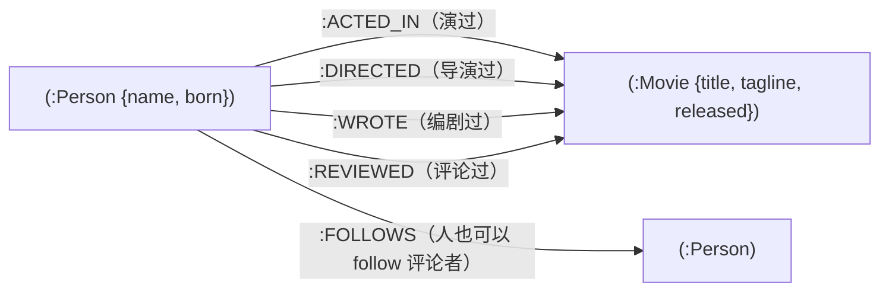

# L2 · 用 Cypher 查询电影知识图谱（Neo4j + LangChain Neo4jGraph）

> 课程：Knowledge Graphs for RAG（DeepLearning.AI × Neo4j）
> 本课任务：在一个现成的"演员-电影"知识图谱上练 **Cypher** 全套基本功——MATCH 模式匹配、按 label/属性过滤、WHERE 条件、多节点关系模式，以及 CREATE / MERGE / DELETE 写操作。

## 0. 环境搭建：LangChain 的 Neo4jGraph 是唯一入口

导入很轻：`dotenv` 读环境变量，LangChain 的 `Neo4jGraph` 类负责与 Neo4j 通信。

```python
from langchain_community.graphs import Neo4jGraph

load_dotenv('.env', override=True)
NEO4J_URI = os.getenv('NEO4J_URI')            # 连接串：Neo4j 在哪、什么端口
NEO4J_USERNAME = os.getenv('NEO4J_USERNAME')  # 用户名 + 密码 + database 名
NEO4J_PASSWORD = os.getenv('NEO4J_PASSWORD')
NEO4J_DATABASE = os.getenv('NEO4J_DATABASE')

kg = Neo4jGraph(url=NEO4J_URI, username=NEO4J_USERNAME,
                password=NEO4J_PASSWORD, database=NEO4J_DATABASE)
# 之后所有交互都是 kg.query("...Cypher 字符串...")
```

整课的交互模式只有一个：**`kg.query(cypher)` → 返回 list[dict]**，dict 的 key 就是 Cypher `RETURN` 子句里写的名字。

## 1. 电影图谱的 Schema：关系决定"你是谁"

数据集是 Neo4j 经典的 movie graph（171 个节点、38 部电影）：



- **Person**：属性 `name`（string）、`born`（出生年，integer）；
- **Movie**：属性 `title`、`tagline`（string）、`released`（上映年，integer）；
- 读出来就是自然语言句子："a person **acted in** a movie"——这是全课反复匹配的基本模式。

讲师强调两点：① 一个人"是演员还是导演"**不是节点上的类型字段，而是由他周围的关系决定的**（acted in 了什么他才成为 actor）；② 图上画的是**潜在关系**（schema），具体某人某片有哪几条边由数据动态决定。

> **架构师视角**：LPG（Labeled Property Graph）把"身份"外化成关系而不是内化成字段，天然适合"角色随上下文变化"的领域——同一 Person 在这部片是 actor、那部片是 director。对 Agent 记忆图谱同理：与其给实体打死板的 type，不如让"它连着什么"来定义它。

## 2. MATCH 基本功：从数节点到精确定位

Cypher 是 Neo4j 的查询语言，核心思想是**模式匹配（pattern matching）**——用 ASCII 艺术画出你要找的子图形状：`()` 是节点，`-[]->` 是带方向的关系。

```cypher
MATCH (n)                              -- 匹配图里所有节点，n 是变量
RETURN count(n) AS numberOfNodes       -- AS 重命名，返回 dict 的 key 更友好
```

逐步收窄的四连击：

```cypher
MATCH (m:Movie) RETURN count(m) AS numberOfMovies
-- ① 加 :Movie label 只数电影（38 部）；变量名 n→m 纯为可读性，结果不变

MATCH (people:Person) RETURN count(people) AS numberOfPeople
-- ② 换 label 数人

MATCH (tom:Person {name:"Tom Hanks"}) RETURN tom
-- ③ 花括号 = 属性精确匹配（value-based criteria），返回整个节点（name + born）

MATCH (cloudAtlas:Movie {title:"Cloud Atlas"})
RETURN cloudAtlas.released, cloudAtlas.tagline
-- ④ 点号只取想要的属性，不返回整个节点
```

> **对比《Knowledge Graphs for AI Agent API Discovery》(SAP) 的 SPARQL**：SPARQL 的 WHERE 是**三元组模式的集合**（`?s :p ?o` 一行一条边，靠共享变量拼图形），Cypher 的 MATCH 是**一笔画出的路径模式**（`(a)-[:REL]->(b)` 视觉上就是图）。表达力相当，但 Cypher 对"路径"型问题（谁和谁合作过）书写体验碾压；SPARQL 胜在 W3C 标准、跨库联邦。这也是 RDF 三元组存储 vs LPG 属性图两大阵营在查询语言上的直接投影——属性放哪里（RDF 里属性也是三元组节点，LPG 里属性内嵌在节点/边上）决定了查询语言长什么样。

## 3. WHERE 条件匹配：花括号管相等，WHERE 管区间

花括号只能表达"等于"；范围、不等式、组合逻辑交给 `WHERE`：

```cypher
MATCH (nineties:Movie)
WHERE nineties.released >= 1990
  AND nineties.released < 2000       -- 90 年代电影
RETURN nineties.title
```

## 4. 关系模式：Cypher 的真正威力

单节点查询 SQL 也擅长；**多节点+关系的图模式**才是 Cypher 主场。

```cypher
MATCH (actor:Person)-[:ACTED_IN]->(movie:Movie)
RETURN actor.name, movie.title LIMIT 10
-- "谁演了什么"：箭头方向 = 关系方向

MATCH (tom:Person {name:"Tom Hanks"})-[:ACTED_IN]->(tomHanksMovies:Movie)
RETURN tom.name, tomHanksMovies.title
-- 条件匹配 + 关系模式组合：Tom Hanks 演过的所有电影
```

进阶：**两跳模式**找合作演员——从 Tom 出发到电影，再逆着另一条 ACTED_IN 回到别人：

```cypher
MATCH (tom:Person {name:"Tom Hanks"})-[:ACTED_IN]->(m)<-[:ACTED_IN]-(coActors)
RETURN coActors.name, m.title
-- m 连 label 都不用写（能被 ACTED_IN 指向的必是电影）
-- 注意第二个箭头是 <- ：别人"演入"同一部 m
```

一条查询解决"和 Tom Hanks 合作过的所有人"——这正是向量检索给不了的**多跳关系问题**。

## 5. 写操作：DELETE / CREATE / MERGE

查询里发现 "Emil Eifrem" 演了 The Matrix——他其实是 Neo4j 创始人，不是演员。人可以留在图里，但这条 ACTED_IN 边该删：

```cypher
MATCH (emil:Person {name:"Emil Eifrem"})-[actedIn:ACTED_IN]->(movie:Movie)
DELETE actedIn        -- 只删关系不删节点；关系也可绑变量（actedIn）
```

创建节点用 `CREATE`，连关系用 `MERGE`（先 MATCH、不存在才创建，**幂等**）：

```cypher
CREATE (andreas:Person {name:"Andreas"})   -- 讲师把自己加进图谱
RETURN andreas
```

```cypher
MATCH (andreas:Person {name:"Andreas"}), (emil:Person {name:"Emil Eifrem"})
-- 关系连接两个节点，所以先 MATCH 找到两端
MERGE (andreas)-[hasRelationship:WORKS_WITH]->(emil)
-- MERGE ≈ CREATE，但已存在就不会重复建边
RETURN andreas, hasRelationship, emil
```

> **架构师视角**：CREATE vs MERGE 的区别就是"非幂等写 vs 幂等 upsert"。任何会**重跑**的图谱构建管道（ETL 重试、增量同步）一律用 MERGE——L4 批量建 Chunk 节点时正是靠 MERGE + 唯一约束保证重跑不产生脏数据。这是把数据库 upsert 直觉迁移到图上的一等公民操作。

## 6. 本课总结

| 要点 | 一句话 |
|---|---|
| 交互模式 | `kg.query(cypher)` → list[dict]，key 来自 RETURN 子句 |
| 模式匹配 | `(n:Label {prop: val})-[:REL]->(m)`，ASCII 画图即查询 |
| 过滤两层 | 花括号管相等匹配，WHERE 管区间/组合条件 |
| 多跳查询 | `-[:ACTED_IN]->(m)<-[:ACTED_IN]-` 一条语句找合作演员 |
| 写操作 | DELETE 删边、CREATE 建节点、MERGE 幂等建关系 |
| LPG 哲学 | 身份由关系决定，属性内嵌节点/边，schema 是"潜在关系" |

> **记忆点（引出 L3）**：本课全程是**结构化查询**——你得预先知道 label、属性名和关系类型才写得出 MATCH。但 RAG 的入口是自然语言问题，匹配的是"语义相近"而非"结构精确"。L3 给图里的文本字段（movie tagline）算 **embedding 并建向量索引**，让知识图谱也能做向量相似度检索——Cypher 精确骨架 + 向量模糊入口，两条检索路径开始合流。

## 与我的资产映射

- 检索层：`agent/skills/agent-selection/3-retrieval.md` 第七节 GraphRAG——"沿关系多跳遍历"的底层能力就是本课的多跳 MATCH 模式
- 黄金对比：《Knowledge Graphs for AI Agent API Discovery》L2（rdflib + SPARQL）——RDF/SPARQL vs LPG/Cypher 两大图谱阵营的查询语言分野
- [[project_selection_matrix]]
