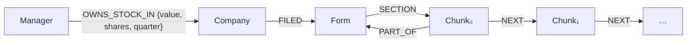

# L6 · 接入 Form 13 扩展图谱：外部结构化数据并入 + 投资上下文增强问答

> 课程：Knowledge Graphs for RAG（DeepLearning.AI × Neo4j）
> 本课任务：引入第二个 SEC 数据集 **Form 13**（机构投资管理公司的持仓申报），创建 Company / Manager 节点并用 FILED / OWNS_STOCK_IN 关系接进现有图谱——检索上下文第一次跨出单份文档，能回答"谁投资了 NetApp"这类**组合数据集**才答得了的问题。

## 0. 本课目标与数据

Form 13 由机构投资管理公司（institutional investment managers）向 SEC 申报，说明自己持有哪些上市公司的股份。原始格式是 XML，课程已在数据准备阶段抽取字段转成 CSV。Setup 照旧（`Neo4jGraph` + 四个向量常量），读入方式是标准库：

```python
import csv
all_form13s = []
with open('./data/form13.csv', mode='r') as csv_file:
    csv_reader = csv.DictReader(csv_file)   # 表头行作 key，每行 → 一个字典
    for row in csv_reader:
        all_form13s.append(row)

len(all_form13s)   # → 561：561 家管理公司，全部投了同一家公司 NetApp
```

每行的字段分三组：**管理公司**（managerCik / managerName / managerAddress）、**被投公司**（cusip6 / cusip / companyName——全是 NetApp）、**这笔投资**（value 金额 / shares 股数 / reportCalendarOrQuarter 申报季度）。

## 1. Company 节点与 FILED 关系：靠 cusip6 对齐

```python
first_form13 = all_form13s[0]        # 先拿第一行试跑（本课贯穿的节奏）

cypher = """
MERGE (com:Company {cusip6: $cusip6})    # cusip6 作唯一键
  ON CREATE
    SET com.companyName = $companyName,
        com.cusip = $cusip
"""
kg.query(cypher, params={ 'cusip6': first_form13['cusip6'], ... })
```

图里已有 L5 建的 Form（10-K）节点，而它身上恰好也有 `cusip6`——L5 预埋的外键此刻兑现，两个数据集**确定性 join**：

```python
MATCH (com:Company), (form:Form)
  WHERE com.cusip6 = form.cusip6       # 跨数据集按业务主键配对
SET com.names = form.names             # 用 10-K 里更全的公司名回填 Company

MERGE (com)-[:FILED]->(form)           # 公司"提交了"这份 10-K
```

> **架构师视角**：Form 13 并入图谱**没有用一行 LLM**——`cusip6`、`CIK` 这类业务主键让实体对齐（entity resolution）完全确定性。GraphRAG 教程常给人"构图必须靠 LLM 抽实体"的印象，但企业数据大多自带主键；LLM 抽取只该留给真正的非结构化残余。判据和 SAP 课 L2 一致：**源数据有 schema 就走确定性 ETL**。

## 2. Manager 节点：约束 + 全文索引

```python
cypher = """
  MERGE (mgr:Manager {managerCik: $managerParam.managerCik})  # CIK 作唯一键
    ON CREATE
        SET mgr.managerName = $managerParam.managerName,
            mgr.managerAddress = $managerParam.managerAddress
"""
for form13 in all_form13s:                     # 561 行逐条 MERGE
  kg.query(cypher, params={'managerParam': form13})
```

配套两个数据库对象——**唯一性约束**（防重复）和**全文索引**（关键词检索）：

```python
CREATE CONSTRAINT unique_manager IF NOT EXISTS
  FOR (n:Manager) REQUIRE n.managerCik IS UNIQUE

CREATE FULLTEXT INDEX fullTextManagerNames IF NOT EXISTS
  FOR (mgr:Manager) ON EACH [mgr.managerName]

# 用法与向量索引同构：也是返回 node + score
CALL db.index.fulltext.queryNodes("fullTextManagerNames", "royal bank")
  YIELD node, score
RETURN node.managerName, score        # → Royal Bank of Canada
```

讲师给的类比值得记：**向量索引按"相似概念"搜，全文索引按"相似字符串"搜**。至此图谱里已有三种检索通道：向量（语义）、全文（关键词）、Cypher 模式匹配（结构）。

## 3. OWNS_STOCK_IN：带属性的投资关系

```python
cypher = """
MATCH (mgr:Manager {managerCik: $ownsParam.managerCik}),
      (com:Company {cusip6: $ownsParam.cusip6})
MERGE (mgr)-[owns:OWNS_STOCK_IN {
    reportCalendarOrQuarter: $ownsParam.reportCalendarOrQuarter
}]->(com)                                # 季度进 MERGE 键：同一家季度不同算多笔投资
  ON CREATE
    SET owns.value  = toFloat($ownsParam.value),    # 金额/股数存在边上，注意类型转换
        owns.shares = toInteger($ownsParam.shares)
"""
for form13 in all_form13s:
  kg.query(cypher, params={'ownsParam': form13})
# sanity check：MATCH (:Manager)-[o:OWNS_STOCK_IN]->(:Company) RETURN count(o) → 561
```

`refresh_schema()` 后，全图 schema 成形：



## 4. 从 Chunk 一路走到投资人

图谱探索环节：任取一个 chunk 存下 `ref_chunk_id`，然后**一跳一跳扩展 pattern**——chunk → form → 提交它的公司 → 投资这家公司的 managers：

```python
MATCH (:Chunk {chunkId: $chunkIdParam})-[:PART_OF]->(f:Form),
      (com:Company)-[:FILED]->(f),
      (mgr:Manager)-[:OWNS_STOCK_IN]->(com)     # 一个大 pattern 拆三段写
RETURN com.companyName, count(mgr.managerName) as numberOfinvestors
# → NetApp, 561
```

再进一步，把图模式匹配的结果**直接拼成自然语言句子**——结构化数据的"文本化"：

```python
RETURN mgr.managerName + " owns " + owns.shares +
    " shares of " + com.companyName +
    " at a value of $" +
    apoc.number.format(toInteger(owns.value)) AS text   # 金额格式化，方便 LLM/人读
LIMIT 10
```

## 5. plain_chain vs investment_chain：图上下文进 RAG

把上面的"图模式→句子"装进 L5 学的 `retrieval_query` 钩子：向量命中 chunk 后，沿图走到投资人，把**持股最多的前 10 条**拼成句子、前置在 chunk 文本之前：

```python
investment_retrieval_query = """
MATCH (node)-[:PART_OF]->(f:Form),          # node 来自向量检索
    (f)<-[:FILED]-(com:Company),            # 箭头反向，倒着读
    (com)<-[owns:OWNS_STOCK_IN]-(mgr:Manager)
WITH node, score, mgr, owns, com
    ORDER BY owns.shares DESC LIMIT 10      # 只取前 10 大投资人
WITH collect(
    mgr.managerName + " owns " + owns.shares + " shares in " +
    com.companyName + " at a value of $" +
    apoc.number.format(toInteger(owns.value)) + "."
) AS investment_statements, node, score
RETURN apoc.text.join(investment_statements, "\n") +
    "\n" + node.text AS text,               # 投资句子 + 原 chunk 文本
    score, { source: node.source } as metadata
"""
```

两条链对比实验（问题一字之差）：

| 问题 | plain_chain（裸向量） | investment_chain（+图上下文） |
|---|---|---|
| "tell me about NetApp." | 云公司简介，正常 | **几乎相同**——LLM 直接忽略了不相关的投资信息 |
| "tell me about NetApp **investors**." | 从 10-K 文本里硬凑（"多元化的客户群"之类），**答非所问** | 用真实投资人数据作答 |

两个教训：① 增强上下文只在**问题问到它**时才起作用，白给的上下文 LLM 会忽略；② 让 LLM 理解你塞给它的信息"仍带着一点艺术成分"（讲师原话）——上下文的措辞、格式、与问题的匹配度都需要调。

> **对比 3-retrieval 的 GraphRAG**：`agent/skills/agent-selection/3-retrieval.md` 里"向量+图混合检索"的标准形态在本课完整落地——**向量索引负责入口定位（模糊、语义），图遍历负责上下文组装（精确、结构）**。与微软 GraphRAG 的社区摘要路线不同，这里不预生成任何摘要，全部上下文在查询期由 Cypher 现算；代价是 retrieval_query 得针对 schema 手写。规模小、schema 稳时手写 Cypher 更可控，问题开放、语料无 schema 时才考虑社区摘要那套重炮。

> **记忆点（引出 L7）**：本课所有图查询还是**人手写的 Cypher**，问答链的问题也只能命中向量入口。L7 收官：把图 schema 和少量示例喂给 LLM，让它**现场生成 Cypher**（Text2Cypher）——自然语言直接驱动结构化图查询，向量检索都不再是必经之路。

## 6. 本课总结

| 要点 | 一句话 |
|---|---|
| Form 13 数据 | 561 行 CSV（XML 抽取而来），管理公司 → NetApp 的持仓申报 |
| 实体对齐 | cusip6 / CIK 业务主键确定性 join，零 LLM 参与 |
| Company / Manager | MERGE 按主键幂等创建 + 唯一性约束兜底 |
| 全文索引 | 第三条检索通道：向量搜概念、全文搜字符串、Cypher 搜结构 |
| OWNS_STOCK_IN | 投资金额/股数/季度存在**边上**——LPG 关系属性的典型用法 |
| 图上下文增强 | 图模式→自然语言句子→retrieval_query 前置注入；只在问题相关时生效 |

## 与我的资产映射

- 检索层选型：`agent/skills/agent-selection/3-retrieval.md`（GraphRAG 一节——"向量定位 + 图组装"混合模式的可运行参考实现；查询期组装 vs 预生成社区摘要的取舍）
- 记忆/数据层：实体对齐靠业务主键 vs 靠 LLM 的分野，可迁移到 Agent 记忆图谱的实体消歧设计
- 对照课程：《Knowledge Graphs for AI Agent API Discovery》L3 用业务流程数据连通 API 孤岛——与本课"外部数据集并入"是同一动作的 RDF 版
- [[project_selection_matrix]]
