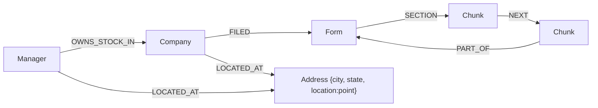

# L7 · 与图谱对话：Text2Cypher 少样本生成（收官篇）

> 课程：Knowledge Graphs for RAG（DeepLearning.AI × Neo4j）
> 本课任务：图谱已建成，进入"最好玩的部分"——先用 Cypher 直接探索（地理、聚合、全文检索），再用 **few-shot learning 教 GPT-3.5 写 Cypher**（`GraphCypherQAChain`），自然语言直接驱动结构化图查询。含 Conclusion 与全课收官。

## 0. 构图方法论回顾：最小可行图谱 + Extract / Enhance / Expand

开场讲师把整门课的构图过程提炼成一个可复用的循环：从 **minimum viable graph**（最小可行图谱——先让数据以最简形态进图）起步，然后反复三步：

| 步骤 | 含义 | 本课程中的实例 |
|---|---|---|
| **Extract** | 把数据里有价值的信息抽成独立节点 | 文本→Chunk；Chunk 元数据→Form；Form 13 CSV→Company/Manager |
| **Enhance** | 给数据"充能"——加索引、加 embedding | 向量索引、全文索引、（本课新增）地理索引 |
| **Expand** | 把新数据连回已有的图 | NEXT / PART_OF / SECTION / FILED / OWNS_STOCK_IN |

还能继续扩展的方向：把 10-K 里提到的供应商/合作伙伴解析出来**连通公司之间**；接入更多外部数据集；甚至**把用户也建成节点**——记录用户对答案的反馈与交互，图谱随使用越用越好。

本课的数据已被预先扩展了一步：Manager 和 Company 的地址字符串抽成了独立的 **Address 节点**（含 city / state，以及 `location` 属性——存经纬度的 **point** 类型），并建了地理空间索引。最终 schema：



## 1. Cypher 探索：全文入口 + 聚合统计

一组渐进式查询，全部是 L2-L6 积木的组合：

```python
# 全文索引找入口（score 与向量检索值域不同，但同样"越高越匹配"），再接图遍历
CALL db.index.fulltext.queryNodes("fullTextManagerNames", "royal bank")
  YIELD node, score
WITH node as mgr LIMIT 1
MATCH (mgr:Manager)-[:LOCATED_AT]->(addr:Address)
RETURN mgr.managerName, addr        # → Royal Bank of Canada，在加拿大

# 聚合：哪个州投资机构最多（count 聚合 + 排序）
MATCH (:Manager)-[:LOCATED_AT]->(address:Address)
RETURN address.state as state, count(address.state) as numManagers
  ORDER BY numManagers DESC LIMIT 10   # → 纽约、加州领跑
```

同款查询换成 Company 统计州/城市分布，发现有趣事实：样本里上市公司聚在 Santa Clara / San Jose / Sunnyvale / Cupertino，而投资机构聚在 San Francisco——**两拨人在完全不同的城市**。再叠加边属性求和，就是"旧金山 Top 10 投资机构"：

```python
MATCH (mgr:Manager)-[:LOCATED_AT]->(address:Address),
      (mgr)-[owns:OWNS_STOCK_IN]->(:Company)
WHERE address.city = "San Francisco"
RETURN mgr.managerName, sum(owns.value) as totalInvestmentValue  # 边属性聚合
  ORDER BY totalInvestmentValue DESC LIMIT 10
```

## 2. 地理检索：二维空间里的"向量检索"

讲师类比：地理近邻搜索"很像向量检索，只是在二维空间里、用笛卡尔距离代替余弦相似度"。**in Santa Clara** 是精确匹配，**near Santa Clara** 是距离函数：

```python
MATCH (sc:Address) WHERE sc.city = "Santa Clara"
MATCH (com:Company)-[:LOCATED_AT]->(comAddr:Address)
  WHERE point.distance(sc.location, comAddr.location) < 10000  # 单位：米
RETURN com.companyName, com.companyAddress
```

三种检索通道还能串联。"哪些投资机构在 Palo Alto Networks 附近？"——哪怕公司名**拼错**（"Palo **Aalto** Networks"）也能答，因为入口是容错的全文索引：

```python
CALL db.index.fulltext.queryNodes("fullTextCompanyNames",
     "Palo Aalto Networks") YIELD node, score   # 拼写错误被全文索引吸收
WITH node as com
MATCH (com)-[:LOCATED_AT]->(comAddress:Address),
      (mgr:Manager)-[:LOCATED_AT]->(mgrAddress:Address)  # 两段 pattern 无连接
  WHERE point.distance(comAddress.location, mgrAddress.location) < 10000
RETURN mgr, toInteger(point.distance(...) / 1000) as distanceKm
  ORDER BY distanceKm ASC LIMIT 10
```

## 3. Text2Cypher：few-shot 教 LLM 写查询

读了一整课的 Cypher 之后，转折点来了：这是生成式 AI 的时代，**GPT-3.5 见过足够多的 Cypher，可以替你写**。技术是 few-shot learning——prompt 里给任务说明 + schema + 示例：

```python
CYPHER_GENERATION_TEMPLATE = """Task: Generate Cypher statement to
query a graph database.
Instructions:
Use only the provided relationship types and properties in the
schema. Do not use any other relationship types or properties that
are not provided.                        # 护栏①：只许用 schema 里有的东西
Schema:
{schema}                                 # 图 schema 运行时注入（来自 kg）
Note: Do not include any explanations or apologies in your responses.
Do not respond to any questions that might ask anything else than
for you to construct a Cypher statement. # 护栏②：只输出 Cypher，别跑题
Examples: ...
# What investment firms are in San Francisco?   # 示例 = 问题注释 + 参考查询
MATCH (mgr:Manager)-[:LOCATED_AT]->(mgrAddress:Address)
    WHERE mgrAddress.city = 'San Francisco'
RETURN mgr.managerName
The question is:
{question}"""
```

用 LangChain 的图谱问答集成把它装配成链：

```python
CYPHER_GENERATION_PROMPT = PromptTemplate(
    input_variables=["schema", "question"],
    template=CYPHER_GENERATION_TEMPLATE)

cypherChain = GraphCypherQAChain.from_llm(   # 新链型：NL→Cypher→执行→NL 答案
    ChatOpenAI(temperature=0),               # 生成查询，温度归零求稳定
    graph=kg,                                # schema 从这个图实例自动提取
    verbose=True,                            # 打印生成的 Cypher，可审计
    cypher_prompt=CYPHER_GENERATION_PROMPT)
```

## 4. 泛化能力与"失败→加示例"的教学循环

四连问，展示 few-shot 的泛化边界：

| 问题 | 结果 | 说明 |
|---|---|---|
| investment firms in **San Francisco** | ✔ | 就是示例本身 |
| investment firms in **Menlo Park** | ✔ | 换掉 WHERE 里的字符串字面量 |
| **companies** in Santa Clara | ✔ | 没教过 Company！靠 schema 自行泛化出同构 pattern |
| investment firms **near** Santa Clara | ✘ | `point.distance` 没教过，泛化不出来 |

失败的处理方式不是改模型而是**改 prompt**：把 notebook 里现成的 near 查询贴进模板当第二个示例，重建 prompt 和 chain，再问就对了。第三个示例更进一步，把结构化查询接回**文本 chunk**——回答 "What does Palo Alto Networks do?"：

```python
# What does Palo Alto Networks do?
CALL db.index.fulltext.queryNodes("fullTextCompanyNames",
     "Palo Alto Networks") YIELD node, score
WITH node as com
MATCH (com)-[:FILED]->(f:Form),
    (f)-[s:SECTION]->(c:Chunk)      # SECTION 边定位链表头（L5 建的）
WHERE s.f10kItem = "item1"          # item1 = "公司是做什么的"章节
RETURN c.text                        # 图查询的产出是文本，交给 LLM 总结作答
```

工程纪律：**每次改模板必须重建 `PromptTemplate` 和 `GraphCypherQAChain`**——三个对象是链式依赖，改上游不重建下游等于没改。

> **架构师视角**：示例库就是这套系统的**能力边界**，"失败→从 notebook 挑一个能用的查询→贴进 prompt→重建链"是一个纯运营的能力扩展循环，与 Voyager/skill library 的思想同构：能力沉淀为数据（示例），不沉淀为代码。生产化时的清单也随之清晰——示例库要版本管理、生成的 Cypher 要只读账号执行 + 语法白名单校验、verbose 日志进观测面板做审计。Text2Cypher 最大的风险不是写错查询（会报错，fail loud），而是写出**合法但语义错**的查询（fail silent），eval 集必须覆盖后者。

> **对比 SAP 课 L5（Agent 用图谱发现 API）**：同样是"LLM × 知识图谱"，两门课的图谱角色相反。本课是**图谱增强问答**——人提问，图谱作为检索后端供出上下文/答案，LLM 是翻译官（NL↔Cypher↔NL）；SAP 课 L5 是 **Agent 用图谱规划行动**——图谱（RDF/SPARQL）描述 API 之间的流程关系，Agent 查图是为了决定"下一步调哪个工具"。前者图谱回答"**是什么**"，后者图谱回答"**怎么做**"。技术栈上，本课 LLM 生成 Cypher、SAP 课 Agent 生成 SPARQL，few-shot + schema 注入的配方完全相同——**Text2Query 是图谱路线无关的通用模式**，选 LPG 还是 RDF 不影响这一层。

## 5. 全课收官

### 5.1 Conclusion 要点（neo4j_c1_09）

- 恭喜完课：你构建了一个 **Knowledge Graph powered RAG 系统**，用它与 SEC 财务文档直接对话——"公共记录能聊天之后有趣多了"。
- 课程里的 SEC 案例**代表了企业界正在用 KG + 生成式 AI 构建的一类真实应用**，不是玩具场景。
- 继续学习：Neo4j 官网有大量资源，可注册免费云托管账号，探索更多构图工具。

### 5.2 L1-L7 全课回顾

| 课 | 一句话 |
|---|---|
| L1 | 知识图谱基础：节点-关系-属性的 LPG 数据模型，关系是一等公民 |
| L2 | Cypher 速成（MATCH/MERGE/参数化查询）+ 向量索引的创建与查询 |
| L3 | 文本预处理：10-K JSON 按 item 分节、RecursiveCharacterTextSplitter 切 chunk、附带元数据 |
| L4 | 从文本构图：chunk 逐条 MERGE 进图 + 生成 embedding + 建向量索引，最小可行图谱成形 |
| L5 | 加关系还原文档结构（Form/NEXT/PART_OF/SECTION），retrieval_query 实现查询期窗口扩展 |
| L6 | Form 13 外部数据集并入（cusip6 确定性对齐），图模式→句子的投资上下文增强 |
| L7 | Text2Cypher：few-shot + schema 注入让 LLM 写图查询，GraphCypherQAChain 收口 |

一条主线贯穿：**minimum viable graph 起步，Extract → Enhance → Expand 循环迭代**；检索能力从单通道（向量）长成四通道（向量/全文/图模式/地理），增强方式从"拼相邻 chunk"长成"拼跨数据集事实"，最后连查询本身都交给 LLM 生成。

> **架构师的裁决**：**什么时候值得上 KG 增强 RAG**——① 问题需要跨文档/跨数据集组合事实（"谁投资了 NetApp"，纯向量永远答不对，因为答案不在任何一个 chunk 里）；② 需要聚合、排序、计数、地理这类**运算型查询**（向量检索无法 sum）；③ 数据自带结构和主键（文档层级、业务外键），弃之可惜；④ 答案要可溯源、可审计。**什么时候纯向量就够**——语料是一堆同质、无结构关联的文档，问题是"找到相关段落并总结"式的单点语义命中，且没有跨源 join 需求；此时上图谱是为 5% 的问题付 100% 的建模与运维成本。中间地带记住本课的最小配方：**向量找入口 + retrieval_query 扩上下文**，图谱化可以渐进，不必一步到位。
> **两条图谱路线的选型判据**——**LPG + Cypher（本课）**：关系可带属性（OWNS_STOCK_IN 的 value/shares 直接挂边上）、开发者体验好、apoc/全文/地理索引开箱即用，适合**应用内**的检索增强、以查询性能和迭代速度优先的场景；**RDF + SPARQL（SAP 课）**：全局 URI、标准本体、跨系统联邦查询与推理（reasoning），适合**跨组织数据交换**、schema 需要与行业标准对齐、需要机器可推理语义的场景。一句话：应用私有的图谱默认 LPG，要当"数据交换标准"用的图谱才上 RDF；两条路线上层的 Text2Query 玩法是相通的。

## 6. 本课总结

| 要点 | 一句话 |
|---|---|
| Extract/Enhance/Expand | 构图方法论：最小可行图谱起步，三步循环迭代 |
| Address + point | 地址抽成节点、经纬度存 point 类型，解锁 `point.distance` 近邻查询 |
| 四通道检索 | 向量（概念）/ 全文（字符串、容错拼写）/ Cypher（结构）/ 地理（距离），可串联 |
| Text2Cypher | 任务说明 + schema 注入 + few-shot 示例 + 输出护栏，temperature=0 |
| GraphCypherQAChain | NL→生成 Cypher→图上执行→结果交 LLM 组织成答案，verbose 可审计 |
| 教学循环 | 泛化失败 → 加示例 → 重建 prompt 与 chain；示例库 = 能力边界 |

## 与我的资产映射

- 检索层选型：`agent/skills/agent-selection/3-retrieval.md`（GraphRAG 一节可增补：Text2Cypher 是向量+图混合之外的第三种图谱消费方式——结构化查询直达，无需向量入口）
- 工具/框架层：GraphCypherQAChain 作为"LLM 生成查询 + 受控执行"模式的参考实现，生产化清单（只读账号/语法校验/eval 覆盖 fail-silent）可进面试包 `02-tool-gateway` 素材
- 对照课程：《Knowledge Graphs for AI Agent API Discovery》全程（RDF/SPARQL 路线）——两课合读即 LPG vs RDF 的完整选型依据
- [[project_selection_matrix]]
