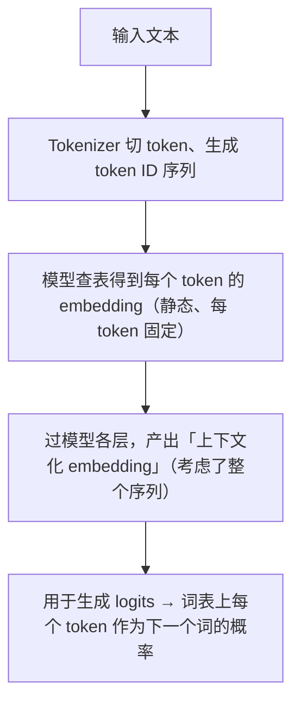
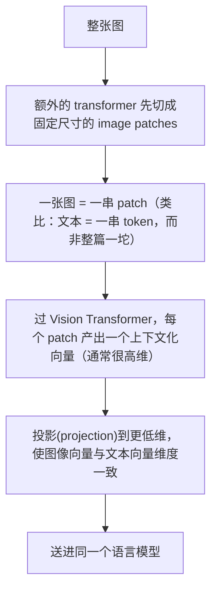

# L2 · ColPali：把 late interaction 搬到图像与复杂文档

> 课程：Multi-vector Image Retrieval（DeepLearning.AI × Qdrant，C2）
> 本课任务：理解 **ColPali** 如何在 VLM 之上复刻 ColBERT 的多向量思路——**把文档直接当图片处理**，切成 patch、每个 patch 一个向量，用 MaxSim 匹配 query token 与图像 patch。跳过 OCR 与版面解析，一个模型通吃所有文档类型；并在 Qdrant 上对《Attention is all you need》做端到端检索。

## 0. 本课定位

大量有用信息不是文本，而是**图片、扫描件、PDF、幻灯片**——这些本质都是图像。VLM 早就能同时吃文本和图像，瓶颈一直在**检索**这一步。本课主角 ColPali 把 L1 的 late interaction 从 token 迁到 image patch。路线：**传统文档解析的痛 → ColPali 是什么 → VLM 如何改造成检索模型 → 代码（分 patch / 可解释性热力图 / Qdrant 检索）→ 内存代价**。

## 1. 为什么不用传统版面解析

文档（幻灯片、PDF 页）常是文字、图片、图表、表格的**复杂混排**。传统做法：先用专门模型**检测版面（layout detection）**，再按内容类型分别解析。问题：

- 要搭一套复杂的定制系统，且**仍然会出错**；
- 为一种文档调好的管线，**换一种文档往往就不работает**。

**ColPali** 一次绕过所有这些问题。

## 2. ColPali 是什么

**ColPali = Contextualized Late Interaction over PaliGemma**。PaliGemma 是 Google 的一个 VLM。和 ColBERT 一样，ColPali 既指一个具体模型，也常用来泛指**一整族**基于同样原理的模型：**建在 VLM 之上、能同时吃图像和文本的多向量嵌入模型**。

它的好处：

- **跳过易错的版面/格式检测步骤**，对所有文档类型灵活通用；
- 单次运行虽有成本，但长期可能**更便宜**——系统只依赖**一个模型**，而非传统方案的一堆模型。

> **对比 L1 的 ColBERT**：ColBERT 是"文本 token → 向量 → MaxSim"，ColPali 是"图像 patch → 向量 → MaxSim"。同一套 late interaction 骨架，换了输入模态。两者都是"具体模型名 + 一族技术"的双关命名。

## 3. VLM 如何被改造成检索模型（概念）

### 3.1 纯文本 LLM 的常规流程



### 3.2 加一路视觉：图像的预处理管线

视觉是完全不同的模态，不能直接转成文本，所以它有**自己的预处理管线**，目标是把图像也变成一串 embedding 喂进语言模型（和文本一样）：



要点：VLM 就是在纯 LLM 上给图像加一段额外处理，**文本处理保持不变**。无论输入哪种模态，语言模型都产出一个 embedding。

### 3.3 从"生成"改成"检索"：去掉 pooling，加投影层

VLM 默认还是在**预测下一个 token**（生成式）。检索不要生成式，要的是能表示输入的**向量嵌入**。改法：在语言模型最后一层产出 hidden states 之后，**再加一个投影层**：

- 这个投影层把 embedding 降维以便高效存储：Gemma 里从 **2048 → 128** 维（不同模型不同）；
- **末尾不做 pooling**——整个输入序列（不管什么模态）经稠密网络变换后，得到**等长**的一串向量表示输入。这正是多向量（每 patch/每 token 一个向量）。

### 3.4 还需要训练：LoRA 低秩适配

光把 VLM 拿来做检索不够，投影层和语言模型参数都要**额外训练**。多数论文用 **LoRA（低秩适配）**：给冻结的基座模型加低秩矩阵。"低秩"= 一个大矩阵可拆成两个小矩阵之积：

```
全量训练 2048×2048 权重 ≈ 400 万+ 参数
LoRA 拆成 2048×32 与 32×2048 ≈ 13.1 万参数  →  减少约 97%
```

训练会为有效检索而调整整个模型，但因这些优化，比全量微调更快更省。

> **架构师视角**：ColPali 的工程价值在于**用一个模型替掉一整条"版面检测→分类解析→OCR"管线**。取舍是把复杂度从"多模型编排"转移到"单模型的内存开销"（见 §6）。实践中不必懂上面这些细节就能用——但懂了才知道成本从哪来、该在哪优化。

## 4. 代码（上）：加载模型、分 patch、看维度

### 4.1 按硬件选模型：ColPali vs ColSmol

```python
import torch
if torch.cuda.is_available():                 # 有 GPU：用大模型
    from colpali_engine.models import ColPaliProcessor, ColPali
    model_name = "vidore/colpali-v1.3"
    processor = ColPaliProcessor.from_pretrained(model_name)
    model = ColPali.from_pretrained(model_name, torch_dtype=torch.bfloat16, ...)
else:                                          # 无 GPU：用小模型 ColSmol
    from colpali_engine.models import ColIdefics3Processor, ColIdefics3
    model_name = "vidore/colSmol-256M"         # 2.56 亿参数，DeepLearning 平台可跑
    processor = ColIdefics3Processor.from_pretrained(model_name)
    model = ColIdefics3.from_pretrained(model_name, torch_dtype=torch.bfloat16, ...)
```

**ColPali** 更强但吃内存、最好有 GPU；**ColSmol** 是 256M 的小变体，能在课程平台上跑。无论哪个都需要一个 **processor** 把原始数据转成模型能处理的表示。

### 4.2 分 patch

拿《Attention is all you need》的一页（含图、公式、大量文字）做例子。ColPali 把图像切成 **patch 网格**（类比 Vision Transformer）：

- **ColPali v1.3**：**固定 32×32 网格**；
- **ColSmol**：网格随图像宽高比自适应。

```python
batch_images = processor.process_images([image]).to(model.device)
# 该 batch 含 input_ids / attention_masks / pixel_values
len(batch_images.input_ids[0])     # ColPali 约 1031；ColSmol 约 1139
# 解码可见：序列里有 1024 个特殊 image token（= 32×32 patch），后跟指令 token
```

### 4.3 生成文档向量、隔离出 image patch 向量

```python
with torch.no_grad():
    image_embeddings = model(**batch_images)   # 每个 token 一个 128 维向量

# 检索时通常只要「图像 patch」的向量，不要指令 token
image_mask = processor.get_image_mask(batch_images)
masked = image_embeddings[image_mask]          # 隔离出 1024 个 image patch 向量
```

## 5. 代码（中）：可解释性热力图 + Qdrant 检索

### 5.1 ColPali 的杀手锏：可解释性

多向量的 token 级 embedding 能让我们**看到 query 里每个词对应图像的哪些区域**（dense 只给一个不透明的整体相似度分）：

```python
query = "How does a single transformer layer look like?"
batch_queries = processor.process_queries([query]).to(model.device)
query_embeddings = model(**batch_queries)      # 每个 query token 也是 128 维；本例 21 token

n_patches = processor.get_n_patches(image_size=image.size, patch_size=...)
similarity_maps = get_similarity_maps_from_embeddings(   # 每个 query token × 每个 patch
    image_embeddings=image_embeddings, query_embeddings=query_embeddings,
    n_patches=n_patches, image_mask=image_mask,
)
# 取 "layer" 这个 token 的相似度图，叠加到原图上：暖色=更相关区域
```

价值：调试与理解真实系统——能确认模型是否聚焦在对的内容、发现意外匹配、向用户解释检索结果。**ColSmol vs ColPali 的差异**：ColSmol 做了 pixel shuffling，`layer` token 会关注到一些**背景 patch**（略反常）；大 ColPali 则正确聚焦到页面上多次出现的 "layer" 一词。

### 5.2 建 Qdrant collection 并索引全文

配置和 L1 的 ColBERT 一模一样的三件套——DOT 距离 + MaxSim + 关 HNSW：

```python
client.create_collection(
    collection_name,
    vectors_config={vector_name: models.VectorParams(
        size=model.dim,                          # 128
        distance=models.Distance.DOT,
        multivector_config=models.MultiVectorConfig(
            comparator=models.MultiVectorComparator.MAX_SIM),
        hnsw_config=models.HnswConfigDiff(m=0),  # 关 HNSW，多向量用不了
    )},
)

# 索引论文所有页；load_precomputed=True 直接读预算好的向量而非现算
embeddings_df = load_or_compute_attention_embeddings(load_precomputed=True, ...)
for _, row in embeddings_df.iterrows():
    client.upsert(collection_name, points=[models.PointStruct(
        id=uuid.uuid4().hex,
        vector={vector_name: row["image_embedding"]},
        payload={"file_path": row["file_path"]},   # 存图片路径当元数据
    )])
```

> **对比 L1 / Qdrant C1**：collection 配置几乎与 L1 ColBERT 逐字相同（DOT + MAX_SIM + m=0）——**同一套多向量存储范式，文本 patch 换成 image patch 而已**。这也印证了 L1 记忆点：ColPali 就是 ColBERT 的图像版。

### 5.3 检索

```python
def search(query, limit=3):
    batch_queries = processor.process_queries([query]).to(model.device)
    query_embeddings = model(**batch_queries).to(dtype=torch.float32)
    return client.query_points(collection_name,
        query=query_embeddings[0].cpu().numpy(),
        using=vector_name, limit=limit, with_payload=True).points
```

三次检索的观察：

| query | 结果 |
|---|---|
| `model architecture` | 最著名的架构图排第一；标题为 "Model Architecture" 的正文页也被选中 |
| `scaled dot-product attention` | 对应示意图 + 名为 "Scaled Dot-Product Attention" 的正文段都被召回 |
| `experiment results` | 含表格/性能指标的页被召回；第一页也意外上榜（结果可能在摘要/脚注里提过），第二三名是效率对比表——符合预期 |

**结论**：ColPali 同时理解**文本内容**和**表格、图表等视觉元素**，无需 OCR 或复杂文档处理，直接把文档当图片处理就自然捕获文字 + 视觉语义。

## 6. 代价：内存

多向量的老问题在图像上更凶：

```
假设每文档 0.5 MB × 100 万文档 ≈ 500 GB 内存，仅用来存 ColPali 向量做搜索
```

千级文档的小项目还行；但实践中常是**十亿级**，内存需求巨大。而且这些向量通常含**大量冗余信息**——这正是下一课优化的切入点。

## 本课总结

| 要点 | 一句话 |
|---|---|
| ColPali 定义 | Contextualized Late Interaction over PaliGemma，建在 VLM 上的多向量嵌入模型 |
| 核心价值 | 把文档当图片，跳过版面检测/OCR，一个模型通吃所有文档类型 |
| VLM→检索改造 | 图像切 patch 过 ViT 投影到与文本同维；去掉末尾 pooling，加投影层降维（2048→128） |
| 需训练 | 投影层 + 语言模型用 LoRA 低秩适配，比全量微调省约 97% 参数 |
| 分 patch | ColPali 固定 32×32=1024 patch；ColSmol 随宽高比自适应 |
| 可解释性 | token 级相似度热力图看 query 词对应图像哪块区域，利于调试/取信 |
| Qdrant 配置 | 与 ColBERT 同：DOT + MAX_SIM + m=0 关 HNSW |
| 代价 | 每文档约 0.5 MB，百万级即 500 GB，向量含大量冗余 |

> **记忆点（引出 L3）**：ColPali 检索质量强，但**内存是硬伤**，且因 MaxSim 非对称仍**无法用 HNSW**。好在 patch 向量里有大量冗余。L3 专治内存：**量化**（scalar/binary，把 float32 压到 int8 甚至 1 bit）与**池化**（row/column/hierarchical，把 1024 个 patch 向量并成更少的代表向量），并在同一个 Qdrant collection 里用多命名向量把七种优化方案并排比质量。

## 与我的资产映射

- 检索层选型：`agent/skills/agent-selection/3-retrieval.md`（多向量 late interaction 从文本 token 扩到 image patch——ColPali 是"文档即图片"这条多模态检索路线的代表）
- 已学课程 06《Advanced Retrieval》（复杂文档检索质量——ColPali 用单模型替掉版面检测/OCR 管线的取舍）
- Qdrant C1《Retrieval Optimization》（HNSW 前置；本课内存代价引出 C1 的量化手段在 L3 复用）
- [[project_selection_matrix]]（框架/检索/模型分层：ColPali = 检索层 + 模型层耦合的一体化选择）
