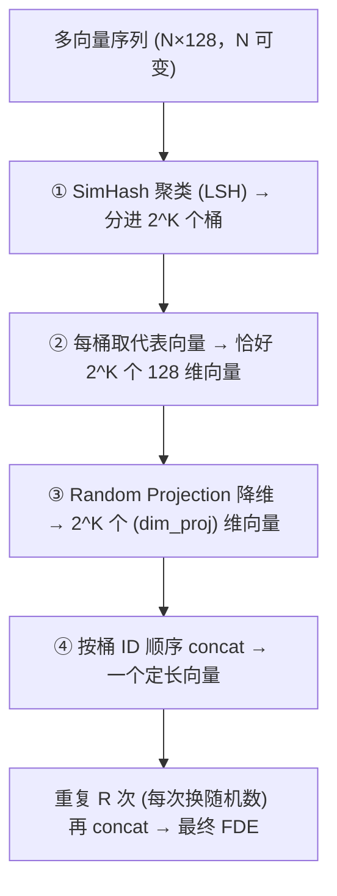

# L4 · MUVERA：把多向量压成定长向量，重新解锁 HNSW

> 课程：Multi-vector Image Retrieval（DeepLearning.AI × Qdrant，C2）
> 本课任务：ColPali 的多向量表示虽精，但无法用 HNSW、只能暴力扫描。MUVERA 用一套「LSH 聚类 + 随机投影 + 拼接 + 多次重复」的流水线，把变长向量序列压成**一个定长向量（FDE）**，从而重新用上近似最近邻，配合两阶段召回兼顾速度与精度。

## 0. 承接 L3：优化了内存，仍解决不了「扫描」

L3 把 ColPali 的显存问题基本压住了——scalar/binary quantization 省 4×~32× 显存、hierarchical token pooling 把 1031 个向量砍到一半而精度几乎不掉。但优化后**仍然不 scale**，因为：

> ColPali can't be used with HNSW search... As a result, ColPali requires a brute force search technique that takes linear time.

原因在相似度度量：MaxSim 是**非对称**的（query 每个 token 各自去 doc 全部 token 里取最大点积再求和），没法建 HNSW 图。要在一百万文档里搜 ColPali，就得算一百万次 MaxSim——**线性时间**。本课 MUVERA 换个思路：把变长序列转成**高维单向量**，于是能用 HNSW，**对数时间**，轻松扩到百万乃至十亿文档。

> **对比 Qdrant C1《Retrieval Optimization》**：C1 的量化/降维是在「单向量已经能用 HNSW」的前提下省内存、提速；本课的痛点在更前面一层——多向量**压根建不了 HNSW 图**。MUVERA 不是又一种压缩，而是把多向量「翻译」成单向量这个索引结构能吃的形状，属于**换赛道**而非**同赛道优化**。

## 1. MUVERA 算法四步

核心目标：`变长的 N 个 token 向量` → `固定长度的一个向量`，且尽量保留 MaxSim 想捕捉的语义距离。



### ① SimHash 聚类：用随机超平面把空间切成 2^K 个桶

MUVERA 论文用 **SimHash**（一种 locality sensitive hashing）：生成 **K 个随机超平面**，每个把向量空间一分为二；一个 token 落在超平面哪一侧就记 0 或 1。K 个超平面 → 每个 token 得到一个 **K bit 的桶 ID** → 共 `2^K` 个桶。示意（K=2，4 个桶）：

```
        H1
   10   |   11
  ------+------  H2      每个 token 落进四象限之一
   00   |   01          桶 ID = 「在 H1 哪侧」「在 H2 哪侧」
```

同桶的 token 归为一簇。

### ② 每桶取一个代表向量（文档与查询处理不同）

| | 文档（document） | 查询（query） |
|---|---|---|
| 聚合方式 | 桶内 token 向量**取平均** | 桶内 token 向量**求和**（保留 query 词项自然分布，簇越大幅值越大，利于检索） |
| 空桶处理 | 用 Hamming 距离最近的非空簇的值**填充** | **不填充**，直接置零向量 |
| 为何这样 | 文档长，空桶少 | query 短、空桶多；填充会让每个词在点积里贡献多次，引入噪声 |

> Hamming 距离 = 两个桶 ID 相差的 bit 数；相差 1 bit 即距离 1。

无论文档还是查询，结束时**每簇恰好一个向量**——不管输入多少 token，永远得到 `2^K` 个代表向量（每个 128 维，128 是多向量单向量的典型长度）。K 常设 ≥5 → 32 簇 → `32×128 = 4096` 维，**已经很大**。

### ③ Random Projection：高维降维还几乎不失真

4096 维太难处理。**随机投影**：把高维数据乘上一个填满 ±1 的随机矩阵（形状 `原维度 × 目标维度`），就投到低维空间。神奇之处——**距离几乎不变**，理论保证来自 **Johnson-Lindenstrauss 引理**：只要目标维度选得够，降维就是安全的。

课程给的实验（10000 个 8096 维随机向量）：误差在 4000 维、1000 维处基本不变，直到逼近 **100 维**才明显上升。所以能大幅降维只引入极小的相对距离误差。这招不只对 MUVERA 有用，**给任意向量降维都能用**。

```python
# 概念示意：cluster 矩阵 (2^K × 128) 乘随机 ±1 矩阵 (128 × dim_proj)
reduced = simhash_matrix @ random_pm1_matrix   # → (2^K × dim_proj)
```

### ④ 拼接 + 多次重复

此刻还是「多向量」，但已是**等长序列**（每簇一个 dim_proj 维向量）。HNSW 只要**一个**向量，所以**按簇 ID 顺序把它们 concat** 成一条长向量，长度由 Random Projection 参数控制。

但 MUVERA 重度依赖随机：运气不好，SimHash 超平面可能把「本该相近的两个 token」切到不同桶（"dog is the only animal that can bark"，两 token 却可能分家）。对策——**整个流程重复 R 次**（SimHash 与 Random Projection 每次都换随机数），把结果全部 concat。R 常设 ≥10。

> **架构师视角**：MUVERA 是「用随机性换可索引性」的典型——SimHash/Random Projection 都是随机算法，靠**多次重复取共识**把方差压下来。这里三个旋钮 `k_sim / dim_proj / r_reps` 构成一个「维度 ↔ 精度 ↔ 速度」的可调三角，跟 3-retrieval.md 里检索器的「召回参数面板」同构：**架构师的价值不在跑通默认值，而在知道每个旋钮往哪拧、代价是什么**。另外必须固定 `random_seed`——文档与查询要过**同一套**超平面和投影矩阵，否则两边向量根本不在一个空间、无法比较，这是可复现性的硬约束。

## 2. 代码：配置 MUVERA 并落到 Qdrant

生产配置（`fastembed` 自带实现，不必手写）：

```python
from fastembed.postprocess.muvera import Muvera

muvera = Muvera(
    dim=128,        # ColPali 单 token 维度
    k_sim=6,        # 2^6 = 64 个簇
    dim_proj=16,    # 每簇随机投影压到 16 维
    r_reps=20,      # 整个流程重复 20 次再拼接
    random_seed=42, # 固定随机种子，保证文档/查询同空间、可复现
)
# 最终 FDE 维度 = 64 簇 × 16 维 × 20 次 = 20480 维/文档
```

`process_document()` 走「平均 + 空桶填充」，`process_query()` 走「求和 + 空桶置零」——**API 层就把文档/查询的差异封好了**：

```python
muvera_fde   = muvera.process_document(row["image_embedding"])  # 文档
muvera_qe    = muvera.process_query(np.stack(query_embedding))  # 查询
```

Qdrant 一个 collection 里放**两个 named vector**，原始多向量与 FDE 并排存，方便直接对比：

```python
client.create_collection(collection_name, vectors_config={
    "colpali_original": models.VectorParams(
        size=128, distance=models.Distance.DOT,
        multivector_config=models.MultiVectorConfig(
            comparator=models.MultiVectorComparator.MAX_SIM),
        hnsw_config=models.HnswConfigDiff(m=0),  # m=0 关掉 HNSW → 暴力 MaxSim
        on_disk=True,
    ),
    "muvera_fde": models.VectorParams(
        size=20480, distance=models.Distance.DOT,
        on_disk=True,   # 无 multivector 配置 = 普通单向量 → 默认走 HNSW
    ),
})
```

> 上传后 Qdrant 立即可搜，但 HNSW 图可能还在后台构建。测近似搜索前需轮询 `collection.status == GREEN` 确认索引就绪（生产中一般不用管）。

## 3. 实验结果：MUVERA 单用「快但不准」

对同一批 PDF 讲义页（每页 1031 个 token 向量 → 压成 20480 维 FDE），3 个查询各跑 10 次：

| 指标 | MUVERA vs ColPali |
|---|---|
| 速度 | 平均 **~17× 更快**（单查询 18×） |
| Query1「coffee mug」精度 | 40% |
| Query2 精度 | 偏低 |
| Query3「one learning algorithm」精度 | **0%** |

结论直白：**MUVERA 单独用有巨大精度损失**。快是真快，但「if you really care about the quality of search」它不合格。原因——FDE 是有损压缩，近似召回可能压根没把最佳文档捞进来。

## 4. 两阶段召回：MUVERA 粗筛 + ColPali 精排

生产正解——**两者组合**：MUVERA 快速拉一批候选，再用原始 ColPali 多向量对这批做 MaxSim **重排**。Qdrant 的 **prefetch** 机制一次 API 调用搞定：

```python
def two_stage_retrieval(query_colpali, query_muvera, limit=5):
    final = client.query_points(
        prefetch=[models.Prefetch(          # 阶段一：MUVERA 粗筛
            query=query_muvera, using="muvera_fde",
            limit=limit * 10,               # 过采样 10×，多捞候选
        )],
        collection_name=collection_name,
        query=query_colpali, using="colpali_original",  # 阶段二：ColPali 精排
        limit=limit,
    )
    return final.points
```

拿到「单向量搜索的速度 + late interaction 模型的精度」——因为在**小子集**上跑 MaxSim 足够快。两阶段结果：

| Query | 两阶段精度 | 说明 |
|---|---|---|
| Q1「coffee mug」 | 80% | 比 MUVERA 单用的 40% 好一截 |
| Q2 | 100% | 与纯 ColPali 完全一致 |
| Q3 | 仍很差 | MUVERA 没捞到最佳匹配，精排也救不回 |

**关键限制**：ColPali 只能对「MUVERA 交给它的候选集」重排序。**若 MUVERA 阶段就漏掉了最佳文档，精排只能在这堆次优里排个序**。补救——**调大过采样率**（oversampling rate 从 10 提到 20 → 精排 100 个候选）。整体上两阶段平均耗时仍远低于纯 ColPali，但精度是否够用取决于业务对「最佳匹配」的苛刻程度。

> **对比「课程 06 reranker」的检索-重排范式**：经典 reranker 是「bi-encoder 粗召回 + cross-encoder 精排」，用便宜模型换召回、贵模型保精度。本课两阶段是**同一模型家族内部**的粗/精分工——粗筛用 ColPali 的 MUVERA 压缩视图（可 HNSW），精排用 ColPali 原始多向量（MaxSim）。相同点：**都是「用可扩展的近似换召回、用昂贵的精确保排序」**，且都受制于「精排救不回粗召回漏掉的东西」这条铁律，所以过采样率是两种范式共有的核心旋钮。

> **记忆点（引出 L5）**：到这里工具箱齐了——ColPali 出多向量、L3 的量化/池化省内存、MUVERA + 两阶段兼顾速度精度。L5 把这些零件**组装成一个能跑的多模态 RAG**：ColPali/MUVERA 负责检索 PDF 页面图像，GPT-4o 直接「看图」生成答案，全程不用 OCR。

## 本课总结

| 要点 | 一句话 |
|---|---|
| 痛点 | ColPali 的 MaxSim 非对称，建不了 HNSW → 暴力扫描线性时间 |
| MUVERA 本质 | 变长多向量 → 定长单向量（FDE），解锁 HNSW 对数时间 |
| 四步 | SimHash 聚类 → 每桶代表向量（doc 平均/query 求和）→ Random Projection 降维 → 拼接，再重复 R 次 |
| 文档 vs 查询 | 文档平均+空桶填充；查询求和+空桶置零（避免噪声） |
| 理论支撑 | Johnson-Lindenstrauss 引理保证随机投影几乎不改距离 |
| 单用效果 | ~17× 更快，但精度可低至 0% |
| 生产正解 | 两阶段：MUVERA 过采样粗筛 + ColPali MaxSim 精排，过采样率是核心旋钮 |
| 硬约束 | 固定 random_seed，文档/查询必须过同一套超平面与投影矩阵 |

## 与我的资产映射

- 检索层选型：`agent/skills/agent-selection/3-retrieval.md`（多向量 late interaction 的可扩展化路径——FDE + 两阶段，补进「精度 vs 存储 vs 延迟」三角）
- 姊妹课：`agent/courses/Retrieval Optimization: Tokenization to Vector Quantization/`（Qdrant C1；量化/降维在单向量赛道，本课是多向量→单向量的换道）
- 面试素材：检索-重排范式的「过采样率救不回漏召回」是高频追问点
- [[project_selection_matrix]]
