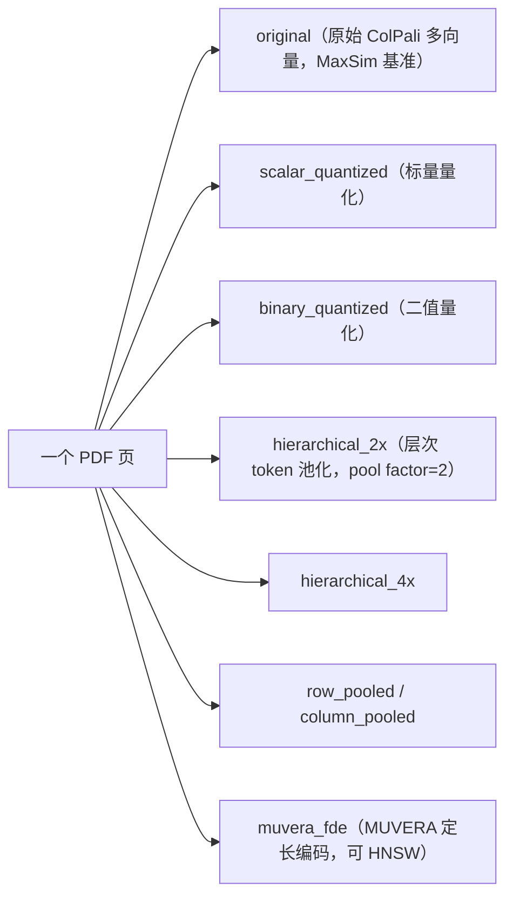

# L5 · 把所有零件组装成多模态 RAG（ColPali 检索 + GPT-4o 看图生成）

> 课程：Multi-vector Image Retrieval（DeepLearning.AI × Qdrant，C2）
> 本课任务：把前四课的零件——ColPali 多向量、L3 的量化/池化、L4 的 MUVERA 两阶段——组装成一个**能跑的多模态 RAG**：检索直接作用在扫描件/PDF/图像页上，生成交给 GPT-4o **直接读图**，全程无 OCR。

## 0. 承接 L4：从「检索技巧」到「端到端系统」

前面几课把检索侧打磨完了：ColPali 出多向量、量化/池化省内存、MUVERA + 两阶段兼顾速度与精度。本课收口——接上**生成**：

> This approach lets you answer questions about documents by retrieving relevant pages and having a vision capable language model read them directly. **No OCR needed.**

RAG 两段式：**retrieve（找到相关页面图像）→ generate（VLM 看图作答）**。关键前提是「今天大家用的 LLM 多数其实是 VLM（vision language model），读图和读文一样在行」——所以能跳过 OCR，把版式、图表、公式原封不动喂给模型。

## 1. 重建 collection：把所有优化并排存

为让本课能独立运行（不依赖 L3），先重建 L3 那个装满优化向量的 collection，再加上 L4 的 MUVERA：

```python
from fastembed.postprocess.muvera import Muvera
muvera = Muvera(dim=128, k_sim=6, dim_proj=16, r_reps=20, random_seed=42)  # 与 L4 同配置

recreate_colpali_optimizations_collection(qdrant, "colpali-optimizations", muvera=muvera)
```

`recreate_...` 这个 helper 一次性导入了 L3 讨论过的全部内存优化，并为原始 ColPali 多向量生成 MUVERA 表示。一个文档因此挂着**多份向量**：



> **架构师视角**：把 7~8 种优化向量**同库并排存**，本质是把「选型」变成「运行期可切换的参数」而非「上线前的一次性押注」。检索时只改 `using="..."` 就能 A/B 不同优化，成本是**多份存储**换**决策的可逆性**。这跟 3-retrieval.md 的主张一致——检索策略应可插拔、可基准测试；架构师要评估的是「多存这几份向量的显存代价」是否配得上「随时能换、能量化对比」的敏捷性。

## 2. 两个检索 helper：单阶段 vs 两阶段

**单阶段** `retrieve()`——按 named vector 名检索，**关键是关掉 rescore**：

```python
def retrieve(query_text, using, top_k=3):
    query_embedding = embed_query(query_text)       # 用预计算的 ColPali query 向量
    results = qdrant.query_points(
        collection_name=collection_name,
        query=query_embedding,
        using=using,                                 # 指定用哪份优化向量检索
        search_params=models.SearchParams(
            quantization=models.QuantizationSearchParams(rescore=False)  # 关键
        ),
        limit=top_k,
    )
    return [(p.payload["image_path"], p.score) for p in results.points]
```

为什么 `rescore=False`：量化方法在 Qdrant 里默认会用原始向量做一次 rescore「找补」。若开着，量化的检索质量会被抬高——那就**测不出量化本身的真实水平**了。要公平对比，就得让量化向量裸奔。

**两阶段** `retrieve_with_two_stage()`——MUVERA 粗筛 + **可换的**精排：

```python
def retrieve_with_two_stage(query_text, top_k=3, prefetch_multiplier=5, rerank_using="original"):
    query_colpali = embed_query(query_text)
    query_muvera  = muvera.process_query(query_colpali)
    results = qdrant.query_points(
        collection_name=collection_name,
        prefetch=[models.Prefetch(               # 阶段一：MUVERA 快速召回候选
            query=query_muvera, using="muvera_fde",
            limit=top_k * prefetch_multiplier,   # 过采样
        )],
        query=query_colpali,
        using=rerank_using,                      # 阶段二：精排向量可任意选
        limit=top_k,
    )
    return [(p.payload["image_path"], p.score) for p in results.points]
```

**本课的新意在 `rerank_using` 可换**：L4 里精排固定用原始 ColPali，这里精排可以用 `original`、`binary_quantized`、`hierarchical_2x` 任一种——MUVERA 负责「快」，精排阶段自由权衡「准 vs 省」。

> **对比 L4 的两阶段**：L4 证明了「MUVERA 粗筛 + ColPali 精排」这个模式成立；L5 把精排阶段**参数化**了。同一 MUVERA prefetch，换不同精排向量得到不同 trade-off：原始 ColPali 精度最高（全多向量 MaxSim）；binary quantized 精排更快、省显存、精度略降；hierarchical pooling 减少参与比较的向量数，是另一个速度/精度平衡点。**MUVERA 管召回的可扩展性，精排向量管质量/成本——两个自由度解耦了。**

## 3. 生成：GPT-4o 直接读页面图像

```python
def generate_answer(query_text, image_paths, model="gpt-4o", max_tokens=500):
    messages = [{
        "role": "system",
        "content": ("You are a helpful assistant that answers questions based on the "
                    "provided document images. ... Answer in Markdown and highlight "
                    "the most important parts"),   # 只据图作答 + 输出 Markdown
    }]
    user_content = [{"type": "text", "text": query_text}]
    for image_path in image_paths[:10]:            # OpenAI 单请求最多 10 张图
        base64_img = pil_image_to_base64(Image.open(image_path))
        user_content.append({
            "type": "image_url",
            "image_url": {"url": f"data:image/png;base64,{base64_img}"},
        })
    messages.append({"role": "user", "content": user_content})
    resp = openai_client.chat.completions.create(model=model, messages=messages, max_tokens=max_tokens)
    return resp.choices[0].message.content
```

要点：① system prompt 约束「**只**依据提供的文档图像作答」→ 抑制幻觉、答案 grounded 在检索到的页面上；② 输出 Markdown 便于渲染；③ 检索到的页面图像 base64 内联进 user message，**不做任何 OCR/文本抽取**——版式、图、公式让 VLM 自己看。

## 4. 端到端对比：不同优化在 RAG 里的表现

跑三个查询（"one learning algorithm" / "size vs performance tradeoff" / "coffee mug"），观察不同检索配置最终喂给 GPT-4o 的页面：

| 检索配置 | 观察 |
|---|---|
| Original ColPali（基准） | 页面选得好，答案 grounded，表现最稳 |
| Binary Quantized | 输入页面**略有不同**，但仍给出了合理答案 |
| Hierarchical 2x | 实验里「甚至更好」，表现优 |
| 两阶段（MUVERA + ColPali 精排） | 输入页面质量很好，LLM 输出 grounded，接近基准 |

**不同精排策略（同一 MUVERA prefetch）的取舍**：

| 精排向量 | 精度 | 速度 | 显存 |
|---|---|---|---|
| Original ColPali | 最高（全多向量 MaxSim） | 慢 | 大 |
| Binary Quantized | 略降 | 快 | **大幅省** |
| Hierarchical Pooling | 平衡点 | 快（参与比较的向量少） | 省 |

生产选择：**成本敏感 → binary quantization；精度至上 → 原始 ColPali**。课程一句总结口径：「memory optimization is typically not enough」——省内存的量化/池化解决的是**显存**，MUVERA 解决的是**可扩展检索**，两者正交、常常叠加使用。

> **架构师视角**：这套 RAG 的可组合性来自「一库多向量 + prefetch 里 `rerank_using` 可换」。真正的生产决策不是「选一个最优优化」，而是**给不同 SLA 的查询路由到不同配置**：便宜档走 binary 精排，关键档走 original 精排，全部共享 MUVERA 的 HNSW 粗筛。这正是 3-retrieval.md 里「检索是可调策略层、不是固定管道」的落地形态。

> **记忆点（引出 L6）**：至此端到端多模态 RAG 已经跑通——检索（ColPali/MUVERA/量化/池化）+ 生成（GPT-4o 看图）。L6 是收官课，把全程五课串成一条主线，并把「多向量的两大顽疾——高显存 & 不兼容 HNSW」各自的解法钉死，给出架构师的最终裁决。

## 本课总结

| 要点 | 一句话 |
|---|---|
| RAG 两段式 | retrieve 找页面图像 → GPT-4o 直接看图生成，无 OCR |
| VLM grounding | system prompt 约束「只据图作答」+ 输出 Markdown |
| 一库多向量 | 原始/量化/池化/MUVERA 并排存，检索时改 `using` 即可切换 |
| rescore=False | 公平对比量化时必须关掉，否则测不出量化真实质量 |
| 两阶段可参数化 | MUVERA 固定粗筛 + `rerank_using` 自由选（准/快/省解耦） |
| 生产路由 | 成本敏感用 binary，精度至上用 original，共享 MUVERA 粗筛 |
| 正交性 | 量化/池化解决显存，MUVERA 解决可扩展检索，可叠加 |

## 与我的资产映射

- 检索层选型：`agent/skills/agent-selection/3-retrieval.md`（「一库多向量 + 运行期可切换优化」补进检索策略层的可插拔论证）
- RAG 架构：`agent/courses/Retrieval Augmented Generation (RAG)/`（多模态 RAG 无 OCR 路线，与传统文本 chunk RAG 对照）
- 姊妹课：`agent/courses/Retrieval Optimization: Tokenization to Vector Quantization/`（量化/池化的显存视角）
- [[project_selection_matrix]]
