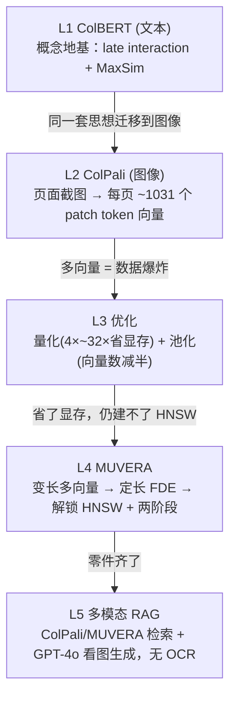

# L6 · 收官：多向量检索的两大顽疾与架构师的裁决

> 课程：Multi-vector Image Retrieval（DeepLearning.AI × Qdrant，C2）
> 本课是末课（无单独 Conclusion）。讲师把全程串成一条主线，并把「多向量的两大顽疾」各自的解法钉死。本篇作为**收官笔记**，除本课要点外，附全课回顾表与架构师的最终裁决。

## 0. 全课主线：从文本到图像再到能跑的系统

讲师的收束口径，一句话串起五课：

> foundational concepts of multi-vector retrieval, starting with text retrieval with **ColBERT** → multi-vector image retrieval with **ColPali** → **optimization techniques** to reduce memory footprint → **MUVERA** allows ColPali to be used with HNSW → a working **RAG** application built around all these techniques.

## 1. 本课要点：两大顽疾，各有解法

讲师把多向量表示的问题收敛成**两条**，并给出对应解法：

| 顽疾 | 根因 | 解法 | 代价 |
|---|---|---|---|
| **① 高显存** | 每页上千个向量，全存下来占用巨大 | Quantization（scalar/binary）或 Pooling（row/column/hierarchical），甚至多法叠加 | 精度略降；binary/pooling 有损 |
| **② 不兼容 HNSW** | MaxSim 非对称，建不了近似最近邻图 → 默认全量扫描，不 scale | MUVERA 把变长序列转成定长表示，解锁近似搜索 | FDE 单用精度低 |

第二条的标准补丁——**原始向量仍用于重排**，兼得速度与质量：

> Typically, original vectors are still used for reranking to achieve both speed and high quality.

把这两条解法拼起来，就得到 L5 那个「灵活、高性能的多模态 RAG」。

> **对比 L3/L4 各自的局部结论**：L3 的结尾是「量化/池化能省显存但省不了扫描」，L4 的结尾是「MUVERA 能上 HNSW 但单用不准」。L6 把两句话合成一个完整判断——**两大顽疾正交、必须分别下药再叠加**：显存问题用量化/池化，扩展问题用 MUVERA，质量问题用原始向量精排。任何一条单独都不够。

## 2. 全课收官

### ① 全课要点速览

- **多向量 vs 单向量**：单向量把整页压成一个大向量、粗粒度匹配；多向量用许多小向量表示 patch/token，**细粒度匹配** query token ↔ image patch。精度更高，代价是数据量与检索复杂度。
- **late interaction / MaxSim**（ColBERT→ColPali 的共同内核）：query 每 token 对 doc 全部 token 取最大相似度再求和。**非对称**，这正是它建不了 HNSW 的根源。
- **ColPali**：VLM 把页面当 32×32 patch 网格，每页 ~1031 个 token 向量，直接在扫描件/PDF/图像上检索，**无需 OCR**。
- **优化四法**：scalar quantization（4×，几乎无损，数据集自适应、collection 级配置最省事）、binary quantization（32×，激进有损）、row/column pooling（降到 32 向量，本课数据上质量差）、hierarchical token pooling（聚类池化，质量好且 pool factor 影响小）。
- **MUVERA**：SimHash 聚类 → 每桶代表向量（doc 平均/query 求和）→ Random Projection 降维（J-L 引理保距）→ 拼接 → 重复 R 次。得定长 FDE，可 HNSW，对数时间。
- **两阶段召回**：MUVERA 过采样粗筛 + 原始/量化/池化向量精排，精排向量可换以调 trade-off；精排救不回粗筛漏掉的最佳匹配 → 过采样率是核心旋钮。
- **多模态 RAG**：一库多向量 + prefetch 可换精排 + GPT-4o 看图生成，按 SLA 路由不同配置。

### ② L1–L6 回顾表

| 课 | 主题 | 核心概念 | 一句话结论 |
|---|---|---|---|
| L1 | ColBERT 文本多向量 | late interaction、MaxSim、token 级向量 | 多向量检索的思想地基，先在文本上讲清 |
| L2 | ColPali 图像多向量 | 页面→32×32 patch 网格、~1031 向量/页、无 OCR | 把 late interaction 迁到图像/文档页 |
| L3 | 内存优化 | scalar/binary quantization、row/column/hierarchical pooling | scalar 量化与 hierarchical 池化最稳；省了显存但仍要全扫描 |
| L4 | MUVERA | SimHash + Random Projection → 定长 FDE、HNSW、两阶段 | 解锁近似搜索；单用快但不准，需原始向量精排 |
| L5 | 多模态 RAG | 一库多向量、rescore=False、可换精排、GPT-4o 看图 | 零件组装成端到端系统，配置可运行期路由 |
| L6 | 收官 | 两大顽疾（高显存 / 不兼容 HNSW）正交下药 | 量化/池化 + MUVERA + 原始向量精排三管齐下 |

### ③ 架构师的裁决

> **架构师的裁决**：**多向量 late interaction（ColPali/MaxSim）vs 单向量 + reranker**，取舍落在三个轴上——
>
> **精度**：多向量 late interaction 上限更高，因为它保留 token↔patch 的细粒度对齐，对「文字+图表+版式混排」的复杂文档尤其能打；单向量把整页压成一个点，细节在压缩中丢失，靠外挂 reranker 找补，天花板受粗召回质量制约。**要精度上限，选多向量。**
>
> **存储**：多向量是**数量级**劣势——每页上千向量 vs 单向量一个。这是它的原罪，必须靠量化（4×~32×）/池化（÷2~÷32）压，且往往组合上；即便如此仍显著重于单向量方案。**显存/成本敏感、文档量巨大，单向量 + reranker 更省心。**
>
> **延迟**：原生多向量最差——MaxSim 非对称、建不了 HNSW、线性全扫描，不 scale；单向量天然吃 HNSW、对数时间。MUVERA 是**把多向量拉回近似搜索赛道**的关键补丁（FDE + 两阶段），但它单用精度会崩，必须原始向量精排，且救不回粗筛漏召回。**要低延迟且大规模，多向量必须走 MUVERA 两阶段，否则直接单向量。**
>
> **落点**：文档视觉信息密集、精度是硬指标（合同/发票/科研 PDF/幻灯）→ **ColPali + MUVERA 两阶段 + 量化精排**，用工程手段把存储和延迟拉回可接受区间；语料以纯文本为主、规模极大、成本敏感 → **单向量 + cross-encoder reranker** 更划算。二者不是对立信仰，而是**按「视觉密度 × 精度要求 × 规模成本」定位的两个象限**——架构师的活儿是判断落在哪个象限，并知道 MUVERA 与量化是把多向量从「精度好但太贵太慢」搬进生产的那座桥。

## 本课总结

| 要点 | 一句话 |
|---|---|
| 全课主线 | ColBERT → ColPali → 优化 → MUVERA → RAG |
| 顽疾① 高显存 | 量化 / 池化 / 组合，正交于扩展问题 |
| 顽疾② 不兼容 HNSW | MUVERA 转定长 FDE 解锁近似搜索 |
| 质量补丁 | 原始向量精排，兼得速度与质量 |
| 裁决三轴 | 精度看多向量、存储看单向量、延迟看有没有 MUVERA 两阶段 |
| 象限思维 | 视觉密度 × 精度要求 × 规模成本 决定选哪条路 |

## 与我的资产映射

- 检索层选型：`agent/skills/agent-selection/3-retrieval.md`（多向量 late interaction vs 单向量+reranker 的「三轴裁决 + 象限定位」可直接沉淀为选型条目）
- 姊妹课对照：`agent/courses/Retrieval Optimization: Tokenization to Vector Quantization/`（Qdrant C1，量化/降维在单向量赛道）；`agent/courses/Retrieval Augmented Generation (RAG)/`（文本 RAG 对照多模态 RAG）
- 面试素材：「多向量为何不能直接上 HNSW / MUVERA 怎么解 / 两阶段的过采样率」是一组连环追问
- [[project_selection_matrix]] · [[project_asset_reuse]]
