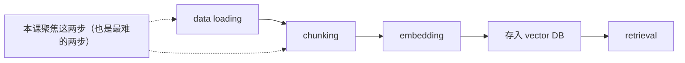
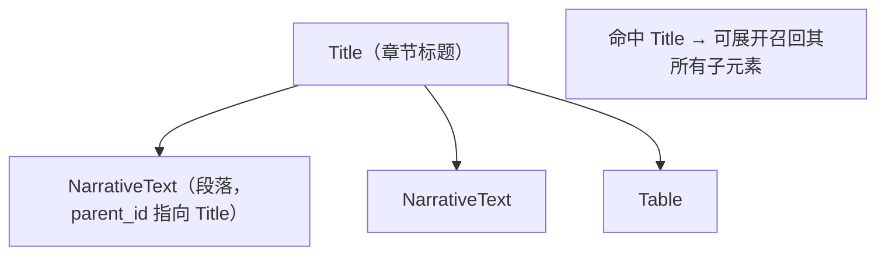

# L0 · 课程介绍：为什么非结构化数据预处理是 RAG 的隐形瓶颈

> 课程：Preprocessing Unstructured Data for LLM Applications（DeepLearning.AI × Unstructured）
> 讲师：Matt Robinson（Unstructured 产品负责人）+ Andrew Ng 开场
> 本课定位：把 RAG 流水线里"最被忽视却最关键"的一环——**数据加载与分块（data loading & chunking）**——单独拎出来讲透。

## 这门课解决什么问题

企业 RAG 已经大规模落地。一条典型 RAG 流水线的关键组件是：

Andrew 在开场里点出核心矛盾：**data loading 和 chunking 之所以难，是因为同一批知识散落在大量不同的文件类型和数据格式里**。

- 数值数据在 Excel 表格里；
- 文字报告在 PDF 或 Markdown 里；
- 演示材料在 PowerPoint / Slides / Keynote 里；
- 沟通记录在 Outlook / Slack / Teams 里。

更麻烦的是——**每一种文件类型内部还可能嵌套多种格式**：一个 PDF 或 PPTX 里同时含有 tables、images、bulleted lists。所以一个合格的 data loader 必须先能**解析（parse）多种文件格式**，然后还得回答"解析出来之后怎么办"。

## 课程给出的三个核心动作

Matt 把预处理拆成三件事，构成全课主线：

| 动作 | 含义 | 收益 |
|---|---|---|
| **Extract content**（抽取内容） | 从各种文档里拿到文本内容，用来构造 prompt | 让 LLM 能引用私有知识 |
| **Normalize**（归一化） | 把 PDF/PPTX/HTML 里的 table、bulleted list 等**统一表示成同一种结构** | 下游 chunking/filtering 一套代码通吃 |
| **Enrich with metadata**（补充元数据） | 用元数据保留原文档结构（如"某段落的父节点是章节标题"），支持 hybrid search | 提升 RAG 检索质量 |

> **架构师视角**：这门课本质上在讲 RAG 流水线的**上游 ETL**。业界的注意力长期集中在 embedding 模型和检索算法（下游），但真实项目里 60%+ 的效果损失发生在"文档还没进 vector DB 之前"——解析错了、结构丢了、chunk 切碎了。normalize 这一步的战略价值在于：它把"N 种文件格式 × M 种下游操作"的组合复杂度，降维成"1 种统一元素结构 × M 种操作"。

## 归一化 + 元数据带来的能力：树形结构检索

Andrew 举了一个很能说明 metadata 价值的例子：如果在预处理时记录下"某段落的 parent 是章节标题"，那么当一个 query 命中该章节时，就能**沿树形层级把子节点文本一并召回**。这正是 L3 会动手实现的 hybrid search（元数据过滤 + 语义相似）的雏形。

> **对比已学课程 04「Chat with Your Data」的 document loading**：课程 04 用 LangChain 的各类 Loader（PyPDFLoader 等）把文档读成 `Document` 对象，重点是"读进来 + 切块"这条快路径。本课更深一层——它不只把文档读成一坨文本，而是识别出 **document elements（Title / NarrativeText / List / Table）** 并保留结构与 metadata。一句话区分：LangChain Loader 给你"文本 + 少量 metadata"，Unstructured 给你"**带类型的结构化元素 + 丰富 metadata**"，后者才撑得起 element-aware chunking 和 hybrid search。

> **对比 Document AI（LandingAI 那类文档抽取）**：Document AI 通常面向"表单/发票/合同"做**字段级抽取**（把"发票号=xxx"抽成键值对），目标是结构化数据入库。本课的 Unstructured 面向 **RAG 语料化**——目标不是抽字段，而是把任意文档打散成"可检索、可分块、带来源元数据"的元素流。两者上游都要解析文档，但下游诉求不同：一个进数据库表，一个进 vector DB。

## 课程路线图（本课覆盖前半：L0–L3）

| 课 | 主题 | 关键产出 |
|---|---|---|
| L0 | 课程介绍 | 理解 normalize / metadata 的战略价值 |
| L1 | 预处理基础 | RAG 回顾、document elements、element metadata、为什么难 |
| L2 | 归一化多格式内容 | `partition_html` / `partition_pptx` / PDF 走 API，统一成 JSON |
| L3 | 元数据 + 分块 | hybrid search（Chroma 元数据过滤）+ `chunk_by_title` |
| （后续）L4+ | PDF/图像的模型化处理、表格抽取、构建 RAGbot | document layout detection、vision transformer 等 |

技术栈：`unstructured` 开源库（规则解析 HTML/PPTX）+ Unstructured API（模型解析 PDF/图像）+ `chromadb`（in-memory vector DB）。

> **记忆点（引出 L1）**：这门课的一切都建立在一个抽象之上——把任意文档打散成**统一的 document elements（Title / NarrativeText / List / Table）+ element metadata**。L1 就先把这个抽象的"零件清单"讲清楚，并解释"为什么跨格式归一化这么难"，为 L2 动手解析打地基。

## 与我的资产映射

- 检索层：`agent/skills/agent-selection/3-retrieval.md`（本课是 RAG 上游"数据摄取解析"环节——检索质量的天花板由这里决定）
- 对照已学课程 04「Chat with Your Data」的 document loading（LangChain Loader vs Unstructured elements）
- [[project_selection_matrix]]
