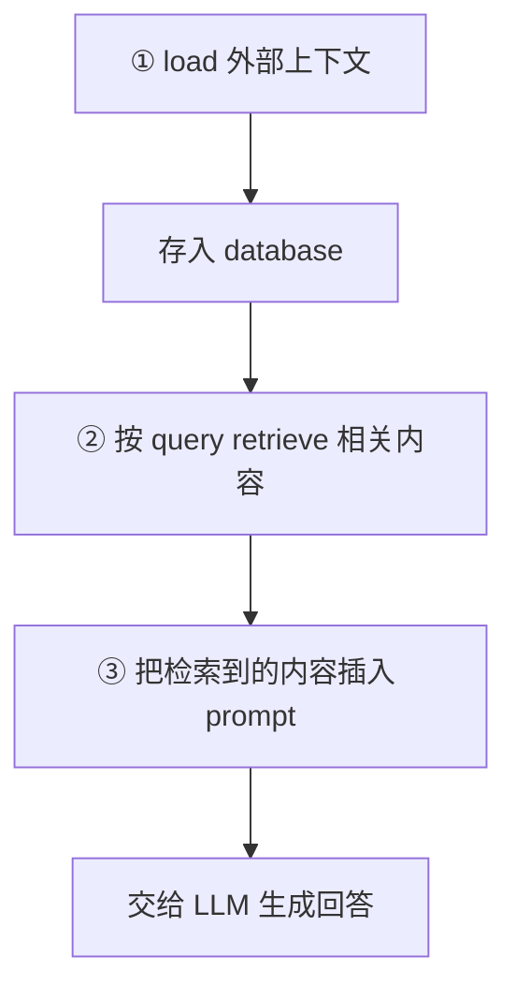
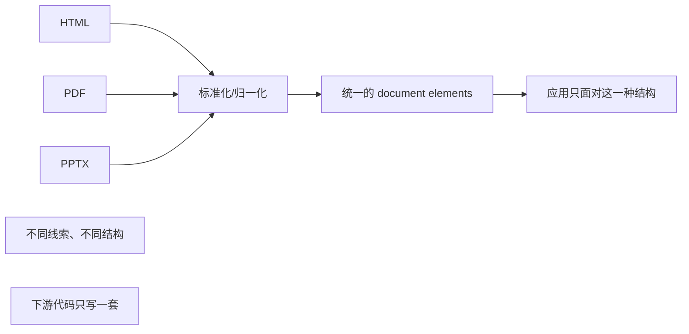

# L1 · 预处理基础：document elements、element metadata 与"为什么难"

> 课程：Preprocessing Unstructured Data for LLM Applications（DeepLearning.AI × Unstructured）
> 本课任务：在动手写解析代码前，先建立三个基础概念——**RAG 回顾 → 预处理三步 → 为什么难**，把 L2/L3 会反复用到的词汇（document element、element metadata）定义清楚。本课无代码，是纯概念课。

## 1. 先复习 RAG：预处理服务于谁

RAG（Retrieval Augmented Generation）是一种**用经过验证的外部信息给 LLM 回答"接地气（grounding）"**的技术，比如把企业内部信息喂给模型。这些信息散落在 emails / PDFs / PowerPoint slides 等各种文档类型里。

概念上 RAG 应用做三件事：

关键点：等一个问题到达 LLM 时，prompt 里已经**夹带了外部信息**，LLM 用它来构造答案。而组织数据"以各种格式存在"这一现实，正是本课要处理的入口难题。

## 2. 预处理三步：extract → elements → metadata

Matt 把"预处理一份文档"拆成几个动作：

**第一步：抽取文档内容（extract content）**
拿到文档里的文本内容——这就是后续用来构造 prompt 的原料。

**但只有文本还不够，还要抽两类关键信息：**

| 要抽的东西 | 定义 | 用途 |
|---|---|---|
| **document elements**（文档元素） | 文档的基本构成单元：**titles、narrative text、lists、tables** | 支撑 RAG 的 chunking 和 filtering |
| **element metadata**（元素元数据） | 每个元素附带的信息：**page number、file type** 等 | 支撑 hybrid search（在 vector DB 里按元数据过滤） |

> **架构师视角**：document element 是这门课的"原子抽象"。传统 RAG 直接对"整篇文本 → 定长切块"，等于把文档的语义结构碾平了；而先识别出"这是标题、这是正文、这是列表、这是表格"，等于给下游保留了一份**结构地图**。有了这份地图，chunking 才能"遇到标题就断开"、filtering 才能"只留 narrative text 丢掉页眉页脚"。抽象选得好，下游全部操作都变简单——这是典型的"上游多花一分力，下游省十分力"。

## 3. 为什么数据预处理这么难：三个根因

Matt 给出三条让预处理棘手的原因，也解释了为什么需要 Unstructured 这类专门工具：

**根因一：不同文档类型有不同的"内容线索（content cues）"**

同样是判断"这段文字是不是标题"，不同格式给的信号完全不同：

| 文档类型 | 判断元素类型靠什么线索 |
|---|---|
| HTML | **标签名**（`<h1>` 大概率是标题，`
` 大概率是正文）——半结构化线索 |
| PDF / 图像 | **视觉线索**（加粗、下划线、字号、版面位置）——完全不同的另一套信号 |
| PPTX | 底层 XML 的结构标记——规则可解析 |

想用**统一方式**处理所有类型，就必须理解"每种格式各自如何标示元素类型"。这是难点的核心。

**根因二：格式五花八门，需要标准化（standardize）**

理想状态下，你的应用**只需要知道"外部信息是什么"，而不该关心"源文档是 HTML 还是 PDF"**。通过标准化，所有文档在终端应用里都能被同样对待。但标准化本身很难——正因为上面说的"不同格式线索不同"。而且**不同文档结构还不一样**：一篇期刊论文和一张表单的排布完全不同，预处理技术得能兼顾。

**根因三：要理解文档结构才能抽出有意义的 metadata**

只有读懂文档的层级结构（谁是谁的 parent），才能抽出可用于 filtering 等操作的元数据。这一条直接指向 L3 的 hybrid search。

> **对比已学课程 04「Chat with Your Data」**：课程 04 的 document loading 默认"文档 → 文本 + 基础 metadata（来源、页码）"就够了，把重心放在下游的 split / embed / retrieve。本课把镜头拉回上游，指出**"文本 + 基础 metadata"其实丢掉了元素类型和层级结构**这两类高价值信息。判断何时需要 Unstructured 这类重型预处理：语料以**结构复杂的 PDF/PPTX/含表格文档**为主、且检索质量吃紧时，就值得上；如果只是纯 txt/markdown 知识库，LangChain 的轻量 Loader 足矣。

## 4. 全课主线：这些概念会在哪里兑现

Matt 在结尾预告了这些基础概念的落地位置：

- **document elements** → L3 的 element-aware chunking（`chunk_by_title`）；
- **element metadata** → L3 的 hybrid search（在 vector DB 里按 page/section 等字段 filtering）；
- **归一化** → L2 就动手，用 `partition_*` 系列函数把 HTML/PPTX/PDF 都变成同一种元素列表。

一句话收束本课：**预处理有很多活动部件、并不简单，但它是让 RAG 应用真正跑起来的必经之路。**

## 本课总结

| 要点 | 一句话 |
|---|---|
| RAG 三步 | load → retrieve → 插入 prompt 交给 LLM |
| 预处理产出 | 文本内容 + document elements + element metadata |
| document elements | titles / narrative text / lists / tables，是 chunking/filtering 的原子 |
| element metadata | page number / file type 等，支撑 hybrid search |
| 为什么难 | ① 不同格式线索不同 ② 需跨格式标准化 ③ 需理解结构才能抽 metadata |

> **记忆点（引出 L2）**：本课把"要抽什么"（elements + metadata）和"为什么难"（三根因）讲清了，但全程没写一行代码。L2 立刻动手：用 `unstructured` 库的 `partition_html` / `partition_pptx` 把 HTML 和 PowerPoint 规则解析成元素列表，PDF 因为是"模型化重活"改走 Unstructured API——三种格式最终**归一化成同一份 JSON**。

## 与我的资产映射

- 检索层：`agent/skills/agent-selection/3-retrieval.md`（本课定义的"文档预处理难点三根因"是评估任何检索方案上游成本的清单）
- 对照已学课程 04「Chat with Your Data」的 document loading（何时用轻量 Loader vs 重型 Unstructured）
- [[project_selection_matrix]]
