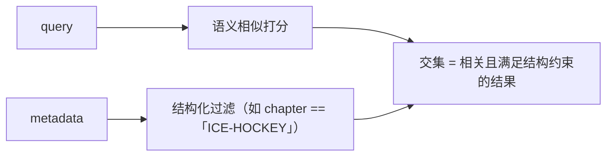
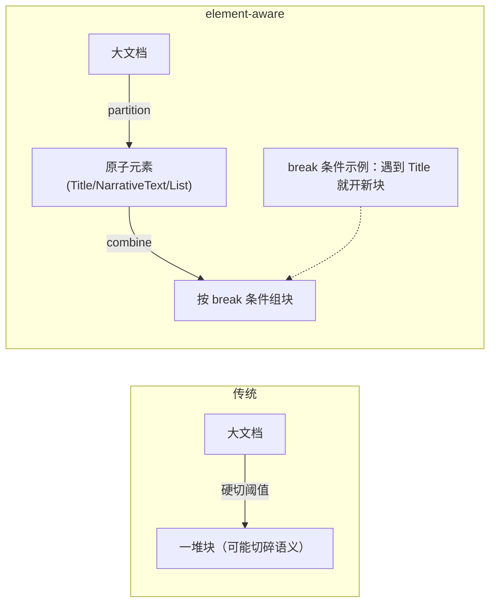

# L3 · 元数据与分块：hybrid search（Chroma 过滤）+ chunk_by_title

> 课程：Preprocessing Unstructured Data for LLM Applications（DeepLearning.AI × Unstructured）
> 本课任务：用一本《瑞士冬季运动》电子书（EPUB），演示两件事——① 用 **element metadata（parent_id）** 把每段内容归属到章节，在 Chroma 里做 **hybrid search**（语义相似 + 章节过滤）；② 用 **element-aware chunking（`chunk_by_title`）** 按章节标题智能切块。

## 1. 什么是 metadata：文档级 vs 元素级

metadata 是预处理时额外抽取的信息，两个维度理解：

| 分类维度 | 取值 | 例子 |
|---|---|---|
| **粒度** | 文档级 / 元素级 | 整篇文件名 vs 单个元素的页码 |
| **来源** | 直接抽取 / 推断得到 | 从文档信息直接读（last modified date、file name）vs 预处理时推断（元素类型 category、元素间层级关系） |

实践中一个元素长这样：**text（抽出的原始内容）+ 一堆其他字段**（page number、language、file name、element type……）。这些字段在构建 RAG（尤其 hybrid search）时全都用得上。

## 2. 先理解语义搜索，再理解它的短板

**语义搜索（semantic search）** 是 RAG 检索的最基础形态：把 query 和文档都嵌入向量空间，按**相似度（距离度量）**找最近的内容。Matt 的直觉例子：一个 "tomato dog" 在向量空间里同时靠近 tomato 和 dog；动物们聚成一簇，tomato（水果）离得远。

但纯语义相似有三个短板：

| 短板 | 场景 |
|---|---|
| **匹配太多** | 文档大量围绕同一主题时，一搜一大把 |
| **无法按其他维度加权** | 想偏向"更近期"的信息，纯相似度做不到 |
| **丢失结构信息** | 章节等信息本可辅助检索，纯语义把它丢了 |

Matt 的 Super Bowl 例子最直观：查"最新的超级碗信息"，语义搜索会同时返回 2/12 的赛果和 2/11 的赛前预测；但比赛已结束，你其实只想要 2/12 之后的信息。

## 3. hybrid search：语义相似 + 元数据过滤

**hybrid search = 相似度搜索 + 用文档元数据做结构化过滤（filtering）**。把 metadata 当过滤条件：

- 想限定某个 section → 按该 metadata 字段过滤；
- 想只要近期信息 → 加 `date > 2/12` 的条件。



> **架构师视角**：hybrid search 的本质是**把"非结构化的语义"和"结构化的属性"这两种检索范式缝在一起**。纯向量检索假装世界只有"语义相似"一个维度，但真实查询几乎总夹带硬约束（时间、部门、章节、权限）。这些硬约束用相似度是表达不了的——它们要的是"精确等于/大于"，不是"差不多接近"。所以元数据过滤不是锦上添花，而是**让检索从"找相似"升级到"找相似且合规"的必要条件**。而元数据从哪来？正是 L1/L2 预处理时保留下来的——这就把整门课的价值链闭合了：上游多抽一份 metadata，下游才能做 hybrid search。

## 4. 实战：用 parent_id 把内容归属到章节

数据是《Winter Sports in Switzerland》EPUB。**EPUB 走 API**——因为它会先被转成 HTML 再预处理，依赖较多，交给 API 省事。

```python
from unstructured.chunking.basic import chunk_elements
from unstructured.chunking.title import chunk_by_title
from unstructured.staging.base import dict_to_elements
import chromadb                       # in-memory 向量库，本课用来做相似度搜索

# —— 走 API 解析 EPUB ——
filename = "example_files/winter-sports.epub"
with open(filename, "rb") as f:
    files = shared.Files(content=f.read(), file_name=filename)
req = shared.PartitionParameters(files=files)   # EPUB → 先转 HTML → 预处理
resp = s.general.partition(req)
JSON(json.dumps(resp.elements[0:3], indent=2))  # 第一个元素是书名，type=Title
```

**核心机制 parent_id**：预处理时每个元素会拿到一个 `parent_id`，把它挂到某个 **Title 元素**（也就是它所属 section 的标题）。于是"元素 → 所属章节"的映射就成立了。

```python
# ① 先找出所有含 hockey 的 Title 元素（过滤操作：type==Title 且文本含 hockey）
[x for x in resp.elements
 if x['type'] == 'Title' and 'hockey' in x['text'].lower()]
# 能同时找到目录里的 "ICE-HOCKEY" 和正文章节开头的 "ICE-HOCKEY" 标题

# ② 从目录抄下章节名清单
chapters = [
    "THE SUN-SEEKER", "RINKS AND SKATERS", "TEES AND CRAMPITS",
    "ICE-HOCKEY", "SKI-ING", "NOTES ON WINTER RESORTS",
    "FOR PARENTS AND GUARDIANS",
]

# ③ 遍历元素，找出"章节标题"对应的 element_id → 章节名
chapter_ids = {}
for element in resp.elements:
    for chapter in chapters:
        if chapter in element["text"] and element["type"] == "Title":
            chapter_ids[element["element_id"]] = chapter
            break

# ④ 反查验证：某元素的 parent_id 若等于 ICE-HOCKEY 标题的 element_id，它就属于冰球章节
chapter_to_id = {v: k for k, v in chapter_ids.items()}
[x for x in resp.elements
 if x["metadata"].get("parent_id") == chapter_to_id["ICE-HOCKEY"]][0]
```

**逻辑闭环**：章节标题的 `element_id`，会成为该章节内其他元素的 `parent_id`。所以"某元素属于哪一章" = "它的 parent_id 匹配哪个章节标题的 id"。这就是用元数据重建文档层级。

> **对比 filtering 的灵活性**：上面第 ① 步演示的 `type == 'Title'` 过滤可以随意换维度——改成 `NarrativeText` 就能拿到所有提到 hockey 的正文段落。这正是 L1 说的"document elements 支撑 filtering"的兑现：元素类型本身就是一个可过滤的元数据字段。

## 5. 灌入 Chroma，做带章节过滤的 hybrid search

```python
# 建库（in-memory，可 reset）
client = chromadb.PersistentClient(
    path="chroma_tmp",
    settings=chromadb.Settings(allow_reset=True))
client.reset()

# 建 collection —— 注意这里的 metadata 是"向量库自身配置"，不是文档元数据！
collection = client.create_collection(
    name="winter_sports",
    metadata={"hnsw:space": "cosine"}   # 用余弦相似度做相似度搜索
)

# 逐元素入库，把"章节名"作为文档元数据一并写入
for element in resp.elements:
    parent_id = element["metadata"].get("parent_id")
    chapter = chapter_ids.get(parent_id, "")   # 用第4节的映射把 parent_id 翻成章节名
    collection.add(
        documents=[element["text"]],
        ids=[element["element_id"]],
        metadatas=[{"chapter": chapter}]        # ← 这才是用于过滤的文档元数据
    )

collection.peek()   # 抽查入库内容
```

**关键区分**（课程特意强调）：`create_collection` 里的 `metadata={"hnsw:space": "cosine"}` 是**向量库自身的配置**（用什么距离度量），**不是**从文档抽出的元数据；真正用于过滤的文档元数据，是 `add()` 里的 `metadatas=[{"chapter": ...}]`。

```python
# hybrid search：语义 query + 章节硬过滤
result = collection.query(
    query_texts=["How many players are on a team?"],  # 语义部分
    n_results=2,
    where={"chapter": "ICE-HOCKEY"},                  # 结构化过滤：只在冰球章内搜
)
print(json.dumps(result, indent=2))
```

效果：即使文档里还有别的团队运动，`where` 过滤保证只返回**冰球章节内**关于"每队几人"的内容，不会串到其他运动。

## 6. Chunking：为什么需要 + element-aware 的优势

**chunking = 把长文档切成小块**，再送进 vector DB / 塞进 prompt。两个刚需理由：

- **上下文窗口有限**：整篇塞不进 LLM，必须切；
- **省钱**：更大的上下文窗口往往更贵，切小块降低推理成本。

而且**切法直接影响检索质量**：chunk 切得好 → 相似搜索结果更相关 → prompt 更好 → LLM 答案更好。

**传统定长切块（by characters / by tokens）的毛病**：到达阈值就硬切，会把一个 section 的内容"漏"进下一个 chunk。Matt 的例子：搜 "open domain question answering"，定长切块让第二个 chunk 里混进了不相关的 "abstract question answering"。

**element-aware chunking 的不同思路**：



即**先把文档拆成原子元素，再按 break 条件把元素组合成块**。用 "遇标题就断" 做 break 条件，能把**同一 section 的内容聚在同一个 chunk**——因为标题往往标志新 section 开始。这样查询时只召回目标 section 的内容，不掺杂质。

> **架构师视角**：element-aware chunking 是"上游结构投资在下游兑现"的又一个实例。它不发明新信息，只是**复用了 L2 预处理时已经识别出的元素边界**。还有个隐藏收益：因为 chunking 作用在"已归一化的元素列表"上（而非重新解析文档），你可以**极低成本反复试不同 chunk 参数**——呼应 L2 那条"抽取贵、下游便宜"。把昂贵的解析和廉价的分块解耦，是这套流水线最值钱的架构决策。

## 7. 实战：chunk_by_title

```python
elements = dict_to_elements(resp.elements)   # 反序列化：JSON dict → 元素对象

chunks = chunk_by_title(
    elements,
    combine_text_under_n_chars=100,   # 小于100字符的元素合并，避免碎块
    max_characters=3000,              # 块超过上限就断开，避免超大块
)
JSON(json.dumps(chunks[0].to_dict(), indent=2))

len(elements)   # 752 个元素
len(chunks)     # 255 个块 —— 元素被合并成更少、更大的块
```

两个参数是 element-aware chunking 的调节旋钮：`combine_text_under_n_chars` 防碎、`max_characters` 防巨。运行后 **752 个元素 → 255 个 chunk**，验证了元素确实被合并成"更少但更大、语义更完整"的块。第一个 chunk 里，书名 Title 和它下面的电子书介绍被合到了一起。

> **对比已学课程 04「Chat with Your Data」的 splitter**：课程 04 用 `RecursiveCharacterTextSplitter`（按分隔符递归切 + chunk_overlap 重叠）——这属于本课说的"传统定长切块"改良版，靠字符/分隔符启发式切，仍不知道"这是标题"。本课 `chunk_by_title` 高一个抽象层：它切在**语义元素边界**上。选择依据：纯文本/markdown 语料，`RecursiveCharacterTextSplitter` 够用且零依赖；结构化文档（有明确标题层级的 PDF/EPUB/报告），`chunk_by_title` 能显著减少跨 section 串味，检索质量更高。

## 本课总结

| 要点 | 一句话 |
|---|---|
| metadata 分类 | 文档级/元素级 × 直接抽取/推断得到 |
| 语义搜索短板 | 匹配太多、无法按其他维度加权、丢结构信息 |
| hybrid search | 语义相似 + 元数据过滤（`where={"chapter": ...}`） |
| parent_id | 元素挂到章节 Title，重建"元素→章节"层级 |
| Chroma 两种 metadata | 建库配置(`hnsw:space`) ≠ 文档元数据(`add` 里的 chapter) |
| chunking 理由 | 上下文窗口有限 + 省推理成本 |
| element-aware chunking | 先拆原子元素再按 break 条件组块，遇标题断块 |
| chunk_by_title | `combine_text_under_n_chars` 防碎、`max_characters` 防巨；752 元素→255 块 |

> **记忆点（引出 L4）**：到此为止，PDF 都是"甩给 API 的黑盒"——我们只享受了它返回的元素，没看它内部怎么把一页图像变成 Title/Table。L4 掀开这个黑盒：讲 **document image analysis**——**document layout detection（版面检测）** 和 **vision transformer**，解释为什么 PDF 和图像"需要模型才能预处理"，以及这些视觉模型如何识别版面元素。

## 与我的资产映射

- 检索层：`agent/skills/agent-selection/3-retrieval.md`（hybrid search = 语义 + 结构化过滤，是纯向量检索之外的必备升级；element-aware chunking 是 chunking 策略选型的一档）
- 对照已学课程 04「Chat with Your Data」：`RecursiveCharacterTextSplitter`（字符启发式切）vs `chunk_by_title`（语义元素边界切）
- [[project_selection_matrix]]
