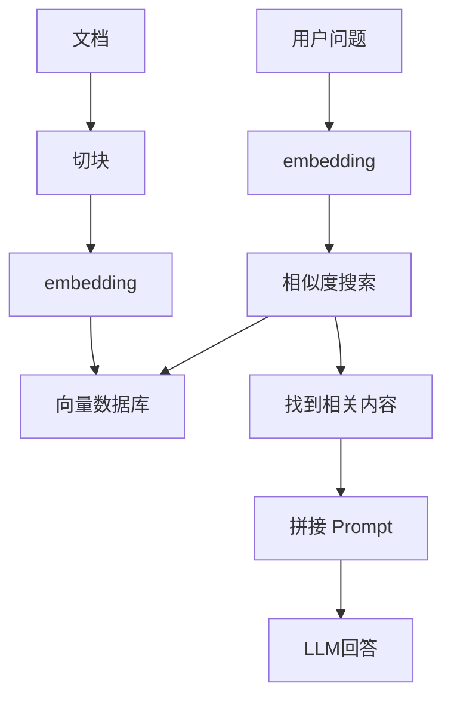

**Retrieval-Augmented Generation（RAG）** 是现在 AI Agent / 企业知识库里非常核心的一种架构。

中文一般翻译：

> 检索增强生成

或者：

> 基于检索的生成

---

它解决的问题是：

# “LLM 不知道你的私有数据怎么办？”

因为普通大模型：

* 不知道你的公司文档
* 不知道最新数据
* 不知道数据库内容
* 不知道用户上传的 PDF
* 不知道实时信息

于是：

> 先“查资料”，再让模型回答。

这就是 RAG。

---

# 1. 最直观理解

传统 LLM：

```text id="5yd58k"
用户提问
   ↓
LLM直接回答
```

---

RAG：

```text id="wqj6rq"
用户提问
   ↓
先搜索相关资料
   ↓
把资料塞给LLM
   ↓
LLM基于资料回答
```

---

所以：

# Retrieval = 检索资料

# Augmented = 增强上下文

# Generation = 模型生成答案

---

RAG = Retrieval-Augmented Generation，检索增强生成：

- R — Retrieval（检索）：拿用户问题去外部知识源（向量库、文档、数据库）里找相关资料
- A — Augmented（增强）：把检索到的资料拼进 prompt，"增强"模型本次调用的上下文
- G — Generation（生成）：LLM 基于被增强过的上下文生成回答，而不是只靠参数里的训练记忆

三个词正好对应流程的三步：先查 → 再塞 → 后答。注意 Augmented 修饰的是 Generation——语法上这个词组的主体是"生成"，检索只是给生成过程做增强的手段，所以 RAG 本质上是一种生成策略，不是一种检索技术。

# 2. 一个现实例子

例如公司内部 AI：

用户问：

```text id="hch30o"
“公司的报销标准是多少？”
```

普通 GPT：

* 不知道
* 可能胡编

---

RAG 系统：

先去：

* Notion
* Confluence
* PDF
* 数据库
* 企业文档

搜索：

```text id="63ijc4"
“报销标准”
```

找到：

```text id="y54phg"
差旅住宿：
东京上限 1200 元/晚
```

然后把这段内容给 LLM：

```text id="4s3zqt"
Context:
……
东京上限1200元/晚
……
```

最后回答：

```text id="uy65ry"
东京住宿报销上限是1200元/晚。
```

---

# 3. RAG 的核心流程

标准 RAG：



---

# 4. 什么是 embedding

embedding：

> 把文字变成向量（数字坐标）

例如：

```text id="9t9u3t"
“苹果手机”
```

变成：

```text id="y0ngh8"
[0.123, -0.882, 0.532 ...]
```

这样系统就能：

* 算相似度
* 找最相关文本

---

# 5. 为什么要“切块（chunking）”

因为文档太长。

例如一本手册：

```text id="5rbodv"
500页 PDF
```

不能整本塞给模型。

所以会拆成：

```text id="o4mlaq"
每500字一个 chunk
```

然后：

* 每个 chunk 做 embedding
* 存进向量库

---

# 6. 向量数据库（Vector DB）

专门存 embedding。

常见：

| 向量库      | 公司       |
| -------- | -------- |
| Pinecone | Pinecone |
| Weaviate | Weaviate |
| Milvus   | Milvus   |
| Qdrant   | Qdrant   |
| Chroma   | Chroma   |

---

# 7. RAG 和“微调（fine-tuning）”区别

很多人混淆。

---

## Fine-tuning

是：

> “把知识训练进模型参数”

特点：

* 成本高
* 更新慢
* 训练复杂
* 不适合频繁更新

---

## RAG

是：

> “不训练模型，只给它外挂知识库”

特点：

* 更新快
* 实时
* 便宜
* 企业最常用

---

所以现在：

# 大多数企业 AI = RAG

而不是 fine-tuning。

---

# 8. RAG 最大优点

## （1）减少幻觉（hallucination）

因为模型：

> “照着资料回答”

而不是瞎猜。

---

## （2）支持私有知识

例如：

* 公司内部文档
* 法律库
* 医疗资料
* 用户上传文件

---

## （3）支持实时更新

改文档即可。

不用重新训练。

---

# 9. RAG 的问题

RAG 也不是万能。

---

## （1）检索错了

叫：

> garbage in, garbage out

搜错内容：

模型也会答错。

---

## （2）Chunk 切不好

太小：

* 上下文丢失

太大：

* 检索不精准

---

## （3）Top-k 不合理

例如：

```text id="ckutnm"
只取前1条
```

可能漏信息。

---

## （4）Embedding 不够好

会导致：

* 搜不到真正相关内容

---

# 10. 现代高级 RAG

现在已经不只是：

```text id="k4d7qo"
search → answer
```

了。

高级版会有：

---

## Hybrid Search（混合检索）

结合：

* BM25（关键词）
* Vector Search（语义）

---

## Re-ranking（重排序）

先搜 20 条。

再用 reranker 排最相关。

---

## Agentic RAG

Agent 自动：

* 多轮搜索
* 改写 query
* 查数据库
* 查网页
* 汇总答案

---

## Graph RAG

结合：

* Knowledge Graph
* 实体关系

微软很推这个。

---

# 11. 一个最小 RAG 示例

伪代码：

```python id="bt7o5u"
question = "东京住宿报销多少"

query_embedding = embed(question)

docs = vector_db.search(query_embedding)

prompt = f"""
根据下面资料回答：

{docs}

问题：
{question}
"""

answer = llm(prompt)
```

---

# 12. OpenAI 生态里的 RAG

OpenAI 官方也大量支持 RAG：

* embedding API
* file search
* vector store
* assistants
* responses API tools

包括：

* LangChain
* LlamaIndex

都在围绕 RAG。

---

# 13. 一句话总结

RAG（Retrieval-Augmented Generation）：

> 先检索相关资料，
> 再让大模型基于资料生成答案。

核心目标：

# “让 LLM 能使用外部知识，而不是只靠训练记忆。”
