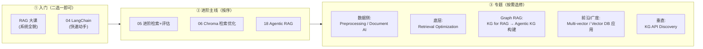

# RAG 课程导览：13 门课怎么选、按什么顺序学

> RAG 是什么、解决什么问题 → 先读同目录的 [RAG.md](RAG.md)（概念速成）。
> 本文帮你回答的是另一个问题：**这 13 门课各讲什么，我该先学哪个。**

## 一张表看全部课程

| 课程 | 一句话描述 | 定位 | 优先学，如果你… |
|---|---|---|---|
| **Retrieval Augmented Generation (RAG)** | DeepLearning.AI 体系化大课，从零系统讲 RAG 全貌（本地目前只有 Module 1: RAG Overview + 2 个 lab） | 主线·入门 | 想要系统教材而不是专题拼盘（注意：未下全） |
| **04-LangChain: Chat with Your Data** | LangChain 全链路动手课：文档加载→切块→向量库→检索→QA→多轮对话 | 主线·入门 | 想最快跑通第一个"和自己文档聊天"的 demo（API 偏老，看思路别抄代码） |
| **05-Building and Evaluating Advanced RAG** | LlamaIndex 两种进阶检索（sentence-window / auto-merging）+ RAG Triad 三元评估指标 | 主线·进阶 | 已能跑通基础 RAG，想知道"怎么度量它好不好"——评估是本课独有卖点 |
| **06-Advanced Retrieval for AI with Chroma** | 检索质量优化三板斧：query expansion、cross-encoder 重排、embedding adapters，附 UMAP 可视化诊断检索陷阱 | 主线·进阶 | 检索结果不准，想要一套"先诊断再对症"的优化手法 |
| **18-Building Agentic RAG with LlamaIndex** | 从固定管线到 agent 主动查：路由查询引擎→工具调用→推理循环→多文档 agent | 主线·进阶 | 做 Agent 方向——这是"RAG 管线"跨到"Agentic RAG"的转折课 |
| **Preprocessing Unstructured Data for LLM Applications** | RAG 的上游数据工程：多格式归一化、元数据分块、PDF/图片视觉预处理、表格抽取 | 专题·数据侧 | 你的语料是乱七八糟的 PDF/PPT/HTML——"垃圾进垃圾出"的解药 |
| **Document AI: From OCR to Agentic Doc Extraction** | 最重的文档智能课：OCR 四十年演进→布局检测→VLM→agentic 抽取（ADE）→接 RAG→AWS 无服务器落地 | 专题·数据侧 | 主战场就是扫描件/复杂版式文档，且要落地生产（14 课，量大） |
| **Retrieval Optimization: Tokenization to Vector Quantization** | Qdrant 底层课：文本→向量逐层拆解、亲手训 tokenizer、IR 指标、HNSW 调参、向量量化 | 专题·底层 | 想搞懂检索层的"为什么"和性能/内存调优——面试硬通货 |
| **Multi-vector Image Retrieval** | 前沿专题：ColBERT/ColPali late-interaction 多向量检索、MUVERA 压缩、多模态 RAG 组装 | 专题·前沿 | 要检索图表/截图/版面（文本 embedding 搜不动的东西） |
| **Building Applications with Vector Databases** | Pinecone 广度课：向量库六大应用——RAG、推荐、混合搜索、人脸检索、日志异常检测 | 专题·广度 | 想知道向量库除了 RAG 还能干嘛；单看混合搜索那课也值 |
| **Knowledge Graphs for RAG** | Neo4j 入门：属性图模型、Cypher、给图谱建向量索引、用关系增强检索、Text2Cypher | 专题·Graph RAG | 数据里"关系"比"段落"重要（公司-高管-持股这类）——Graph RAG 从这门开始 |
| **Agentic Knowledge Graph Construction** | 多 Agent（Google ADK）自动建图：schema 提案 + critic 精炼循环、NER/Fact 双专家、确定性+非结构化两段构建 | 专题·Graph RAG | 学完上一门后想解决"图谱谁来建"的工程化问题；也是很好的多 Agent 设计案例 |
| **Knowledge Graphs for AI Agent API Discovery** | 垂直场景：用 SPARQL 建 API 知识图谱，agent 靠"向量检索+流程边扩展"发现并执行企业 API | 专题·垂直 | 做企业内 agent 工具编排/API 治理这个特定场景，否则可跳过 |

## 推荐学习路径

**三条经验规则：**

1. **入门二选一，别都学**：要系统感选 RAG 大课，要手感选 04；04 的 LangChain API 已偏老，重点吸收"加载→切块→检索→QA"的流程骨架。
2. **05 一定要学**——13 门里只有它正面回答"RAG 好不好怎么量化"（RAG Triad），没有评估意识的 RAG 优化都是盲调。
3. **专题按痛点触发，不按顺序刷**：语料脏 → 数据侧；检索不准 → 06 + 底层课；要查"关系型"知识 → Graph RAG 线；做 Agent 方向 → 18 必学，且可与 memory 课程 12a 的 Toolbox/知识库记忆互相印证。

## 与其他课程组的衔接

- **Agent 记忆**（`../memory/`）：12a 把 RAG 定位为"知识库记忆"的一种用法（RAG ⊂ 记忆），18 课的 agentic RAG 与 12a L3 的语义工具检索是同一思想在不同对象上的应用
- **评估**：05 的 RAG Triad 是 RAG 专用评估入门，通用 LLM 评估方法论见 eval 相关课程组
