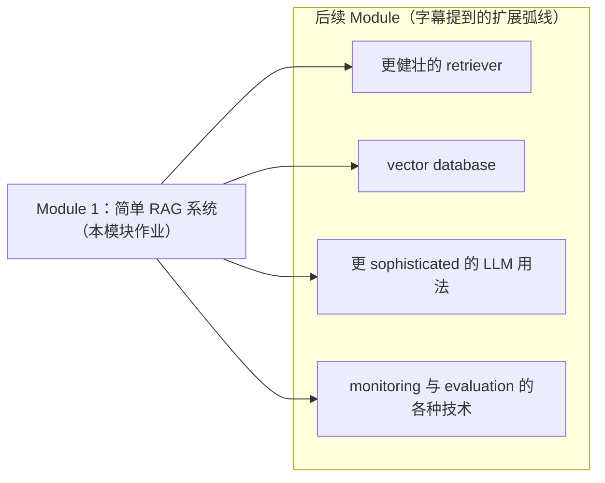

# L01-02 · 课程定位与模块总览（Andrew Ng 对谈 + Module 1 地图）

> 课程：Retrieval Augmented Generation (RAG)（DeepLearning.AI 自制，2025 生产级 RAG 总览，共 5 个 Module）
> 讲师：Zain Hasan——先后任职 Weaviate（向量数据库，RAG 关键组件供应商）与 Together AI（LLM 服务商），检索与推理两侧都做过。
> 一句话定位：**RAG = 把经典搜索系统（classical search）与 LLM 的推理能力（reasoning abilities）配对**——概念不复杂，但实现方式有无数种，**设计选择（design choices）直接决定系统的准确率与速度**，本课教的就是这些取舍。

## 0. 为什么现在还要学 RAG（对谈要点）

Andrew 开场给的定义：RAG 是**当今最广泛使用的提升 LLM 回答质量与准确性的技术**。LLM 出厂只知道训练数据（大体是公开互联网）里的信息；要用**专有数据**（如自己的文档）回答问题，RAG 通过给模型提供额外数据的访问能力做到这一点。日常可见的例子：ChatGPT / Claude / Gemini 回答前提示"正在搜索网页"——就是在做检索增强。

落地面（Andrew 的判断：**RAG 可能是当今世界上被构建得最多的 LLM 应用类型**）：

| 谁在用 | 用来做什么 |
|---|---|
| 大公司 | 客户答疑（产品问题）、员工内部问答（公司政策等） |
| 创业公司（垂直领域） | 医疗（回答医学问题）、教育（多学科辅导）等 |

**即使 AI 领域快速演化，RAG 也不会消失**——LLM 永远受益于高质量相关数据的接入（Zain 的原话方向）。

## 1. 2025 视角：LLM 演进如何重塑 RAG 最佳实践

对谈里最有信息量的部分：LLM 技术每前进一步，RAG 的最佳实践就跟着改写。四条增量：

| LLM 侧变化 | 对 RAG 的影响 |
|---|---|
| 新一代模型对给定文档/上下文的 **grounding 能力大幅变强** | 近一年 RAG 系统的**幻觉率持续下降** |
| **Reasoning models** 出现 | 能在检索到的上下文之上做推理，处理复杂得多的问题 |
| **Context window 持续变大** | 超参调优（塞什么进 prompt、文档怎么切块）的最佳实践随之演化——不再需要把信息硬挤进小窗口 |
| **Agentic document extraction** 等技术成熟 | 可以更容易地在 PDF、slides 等文档类型之上直接建 RAG |

另一个结构性变化：随着团队构建多步 agentic workflow，**RAG 越来越常作为复杂工作流中的一个组件**——比如企业内部流程的第 5 步、第 7 步，由 RAG 给 Agent 提供处理文档或理解客户请求所需的信息。

> **对比老版三部曲（courses/RAG/04-06，2023-24）**：老课的世界观是"context window 小而贵，人工把检索链路每一步都调到极致"（chunk size、top-k、压缩全靠工程师手调）。本课开篇就承认这些超参的最佳实践**已被大 context window 和更强 grounding 改写**——老课教的"术"部分过时了，但"检索质量决定生成质量"的"道"没变。读本课时重点收集 2025 新结论，与 3-retrieval.md 里标注的 ✅稳定/⚠️快照结论逐条对照。

## 2. 从 Basic RAG 到 Agentic RAG（课程的能力上界）

Andrew 与 Zain 对比了两代 RAG 的控制权归属：

```
早期 RAG（人写规则）                     Agentic RAG（Agent 自主决策）
────────────────────                    ────────────────────────────
人类工程师写代码/规则决定：              给 Agent 检索工具，由它决定：
· 长文档怎么切块                        · 下一步要不要 web search？用什么关键词？
· 怎么检索                              · 要不要查某个专门数据库？
· 取 7 个片段塞进 context               · 第一轮检索结果够不够？要不要再来一轮？
= 人决定给 LLM 什么上下文               = 系统自己决定检索什么来满足信息需求
```

Zain 对 agentic RAG 的定义：**多个 LLM 组成的系统，每个负责大工作流中的一环，并拥有"决定检索什么数据"的 agency**。价值在于应对真实世界的 messiness——搞砸了可以路由回去修正方法。这是当前公司推 LLM 应用性能的最前沿。

课程覆盖范围（Zain 总结）：从 basic RAG 到 advanced agentic RAG 的全谱系，既讲核心原理与 mental frameworks，也讲实操（如"多长的 chunk size 合适"这类超参怎么调、怎么管理 context）；还包括多模态、reasoning models，以及 **RAG vs fine-tuning vs 长上下文模型的权衡**。

> **架构师视角**：对谈里藏着一条选型主线——RAG / fine-tuning / long-context 是三种"给模型补知识"的路线，而 basic RAG → agentic RAG 是"检索控制权从人移交给模型"的谱系。架构师的活不是全都会写，而是判断：数据多新、多私有、查询多复杂、预算多少 → 落在谱系哪一格。这正是 3-retrieval.md 决策树的思路，本课相当于给那棵树补 2025 版的叶子节点。

## 3. Module 1 地图（L2：blueprint 先行）

Module 1 的目标：学 RAG 基础概念、认识 RAG 系统的主要组件、动手搭第一个可运行的 RAG 系统。各节安排：

| 节 | 内容 |
|---|---|
| L3 Introduction to RAG | RAG 是什么、为什么用、如何提升 LLM 回答质量 |
| L4 Applications of RAG | 生产级 RAG 系统实例，反思自己项目里的 RAG 机会 |
| L5 RAG architecture overview | 架构总览：LLM + retriever + knowledge base 如何协作 |
| L6 Introduction to LLMs | 组件深潜之一：LLM 的工作原理、强项与局限 |
| L7 Introduction to information retrieval | 组件深潜之二：retriever 与信息检索 |
| 编程作业 | 实现一个简单 RAG 系统的若干部分 |

模块贯穿动手样例代码，结尾是第一个编程作业。**Module 1 同时是整门课的 roadmap**。

## 4. 全课弧线（后续 Module 在此系统上叠加）

字幕给出的后续扩展方向——在 Module 1 的简单系统上逐层加码：



> **对比 courses/RAG/RAG.md 综述**：综述把 RAG 归纳为"先查资料、再让模型基于资料回答"的四步流水线，是静态结构图；本课的组织方式是**同一个系统的五轮迭代**（跑通 → 检索强化 → 向量库 → LLM 用法 → 监控评估），是动态演进路径。生产系统的正确姿势正是后者：先 end-to-end 跑通最简版，再按瓶颈逐层升级——与 3-retrieval.md "最轻方案起步"原则同构。

## 本课总结

| 要点 | 一句话 |
|---|---|
| RAG 定位 | 最广泛使用的 LLM 质量提升技术，可能是被构建最多的 LLM 应用类型 |
| 核心思想 | 经典搜索系统 × LLM 推理能力配对 |
| 2025 增量 | grounding 变强/幻觉下降、reasoning models、大 context window 改写超参实践、agentic 文档抽取 |
| 能力谱系 | basic RAG（人写规则定上下文）→ agentic RAG（Agent 自主决定检索什么、检索几轮） |
| RAG 的新角色 | 从独立应用变为复杂 agentic workflow 中的一个组件 |
| Module 1 路线 | 概念 → 应用 → 架构 → LLM 深潜 → IR 深潜 → 编程作业；兼作全课 roadmap |

> **记忆点（引出 L3）**：对谈把"为什么学 RAG"讲透了，但"RAG 到底怎么工作"还只有一句话——检索 + 生成。L3 用"温哥华酒店为什么这周末特别贵"这个三层递进的例子，把 retrieval 与 generation 两阶段拆开讲清楚。

## 与我的资产映射

- 检索层选型：`agent/skills/agent-selection/3-retrieval.md`（本课是它的 2025 版课程输入源；对谈提到的"超参实践随 context window 演化"呼应其中"结论分级 ✅/⚠️"的时效管理）
- 旧课回溯：`courses/RAG/04-06`（2023-24 三部曲，本课的对照基线）、`courses/RAG/18`（agentic RAG 的 LlamaIndex 实现，对应本课第 2 节谱系右端）、`courses/RAG/RAG.md`（综述）
- [[project_selection_matrix]]
