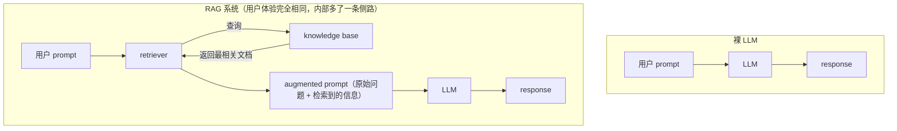

# L03-05 · RAG 核心思想、应用版图与系统架构

> 课程：Retrieval Augmented Generation (RAG)（DeepLearning.AI，Module 1: RAG Overview）
> 本篇覆盖：L3 Introduction to RAG（是什么/为什么）+ L4 Applications of RAG（用在哪）+ L5 RAG architecture overview（怎么运转 + 五大优势 + 最小代码骨架）。

## 1. 三个递进问题：人也需要"先检索再回答"（L3）

RAG 的直觉从一个人类类比开始——三个关于酒店的问题，信息需求逐级上升：

| 问题 | 需要的信息 | 你怎么答 |
|---|---|---|
| 为什么酒店周末贵？ | 无需额外信息 | 常识直接答：周末出行多，房间竞争激烈 |
| 为什么温哥华**这个**周末的酒店特别贵？ | 需要查一点 | 上网一查：Taylor Swift 本周末在此连开两场 |
| 为什么温哥华市中心附近酒店容量不多？ | 需要大量专门信息 | 深入研究温哥华开发史、城市规划…… |

人回答问题分两个阶段：**① 收集必要信息 → ② 在信息之上推理并作答**。在 RAG 里：收集有用信息的过程叫 **retrieval（检索）**，在信息之上推理并响应的过程叫 **generation（生成）**。**"LLM 和你一样受益于检索阶段"——这就是 RAG 的核心思想**。

LLM 为什么需要这个阶段：它是在海量互联网数据上训练出的数学模型，训练时学到了训练数据里包含的信息。你发 prompt 时，是在"赌"相关信息曾出现在训练数据里（最好还出现过很多次）。但总有大量信息不在其中：

- 公司的**私有数据库**；
- **隐藏或难以访问**的信息；
- **每分钟都在产生的新闻**——永远存在模型没训过的信息。

## 2. 解法一句话：把信息放进 prompt（L3）

> The short answer: just put it in the prompt.

RAG 系统的 key idea：**在发送给 LLM 之前修改 prompt**——在用户原始问题之外，加入帮助 LLM 回答的信息（augmented prompt）。信息从哪来？由 **retriever** 负责：它管理一个由**可信、相关、可能私有**的信息组成的 **knowledge base**；收到 prompt 时，从知识库中找出并取回**最相关**的信息交给 LLM，模型再基于这些检索内容作答。

名字由此拆解（承认它拗口）：**Retrieval-Augmented Generation = 先从知识库检索相关信息，来增强 LLM 生成文本的方式**。

## 3. 应用版图：五类生产场景（L4）

RAG 模式 = 现成 LLM（off-the-shelf）+ 一个它训练时没见过的知识库。判据一句话：**只要你手里有"大概率没进过训练数据"的信息集合，就存在建 RAG 应用的机会**——甚至能让 LLM 进入原本不可能的场景。

| 场景 | 知识库 | 要点 |
|---|---|---|
| **代码生成** | 你自己的代码仓库 | LLM 见过全网公开代码，但写对**你项目**的代码需要项目内的类/函数/定义与整体 coding style；检索相关类、定义、文件后生成质量大增 |
| **企业定制 chatbot** | 企业文档（产品/政策/沟通规范） | 对外：客服 bot（产品信息、库存、排障步骤）；对内：政策问答/文档导航。知识库把回答**锚定**在公司自己的产品与政策上，减少泛泛或误导性回复 |
| **医疗与法律** | 案件法律文书、新发表的医学期刊等 | 精度攸关 + 小众且私有的信息量巨大 → **RAG 可能是唯一**能达到足够准确率且用得上私有信息的落地方式 |
| **AI 辅助 web 搜索** | **整个互联网** | 搜索引擎历来就是 retriever（query → 相关网页）；如今的 AI 摘要 = 以全网为知识库的 RAG 系统 |
| **个人助理** | 你的短信/邮件/通讯录/日历/文档夹 | 知识库**小而密**——这类文档上下文密度极高，小规模个人信息就能让任务完成得显著更贴合你正在做的事 |

> **架构师视角**：这张表隐含一个双轴分类——**知识库规模**（全网 ↔ 个人文件夹）与**错误代价**（闲聊 ↔ 医疗法律）。规模轴决定检索基础设施投入（是否需要向量库/分布式索引），代价轴决定评估与 grounding 投入（是否必须引用溯源、上 RAG Triad 验收）。接需求时先在这两轴上定位，比直接谈技术栈更快收敛——这就是 3-retrieval.md 场景推荐表的第 0 步。

## 4. 系统架构：一次请求的完整旅程（L5）

组件就三个：**LLM 本体、knowledge base（实践上就是一个有用文档的数据库）、能搜索知识库的 retriever**。对比裸 LLM 与 RAG 的请求路径：



augmented prompt 长这样："回答以下问题：为什么温哥华这个周末酒店这么贵？这里有 5 篇可能帮到你的相关文章：<文章正文>"。之后系统就和普通 LLM 一样运作——模型基于**训练数据学到的知识 + 检索文档提供的额外上下文**双源作答。用户体验不变（输入 prompt、得到回复，也许多一点延迟），但回复**准确、新鲜、上下文相关**的概率更高。

## 5. 一个 retriever 换来五项优势（L5）

RAG 与裸 LLM 的差别只是加了个 retriever，但这个"相当直接的加法"带来五项优势：

| # | 优势 | 机制 |
|---|---|---|
| 1 | **信息可达**（最重要） | 公司政策、个人信息、今早头条——RAG 常是让 LLM 拿到某些信息的**唯一**方式 |
| 2 | **降低幻觉** | 幻觉常因话题不在/极少出现于训练数据；把相关信息直接放进 prompt 为回答提供 grounding，减少泛泛或误导文本 |
| 3 | **知识可热更新** | 重训模型昂贵耗时；RAG 只需像更新普通数据库一样更新知识库条目，**一旦变更被索引**，LLM 立刻能基于新信息作答 |
| 4 | **可引用来源** | 在 augmented prompt 里附上引用信息，LLM 在最终回复中带出——既 ground 了回答，也让人类读者能深挖验证 |
| 5 | **分工各展所长** | retriever 从信息海洋里过滤、找出最重要相关的并精炼呈现；LLM 专注写好回复，不再被指望做事实查找/过滤——**每个组件干自己最强的事** |

> **对比老版三部曲（courses/RAG/04-06）**：老课直接从 LangChain 的 loader/splitter/vectorstore 零件讲起，"为什么值得加这个组件"是默认前提；本课先用整整一节把 retriever 这一个增量的**五项收益**说清，再进零件——生产级课程的叙事方式：先论证架构决策，再谈实现。给团队引入 RAG 时，这张五优势表就是现成的立项论据（尤其 #3 热更新和 #4 引用，是 fine-tuning 路线给不了的差异化卖点）。

## 6. 最小代码骨架（L5 demo）

课程用两个抽象掉细节的函数演示全流程：

```python
def retrieve(query):   # retriever 的包装:文本查询 -> 知识库中的相关文档
    ...
def generate(prompt):  # LLM 的包装:文本 prompt -> LLM 的回复
    ...

prompt = "Why are hotel prices in Vancouver super expensive this weekend?"
generate(prompt)                       # ① 裸 LLM:答不准(缺信息)

docs = retrieve(prompt)                # ② 看 retriever 能补什么
augmented_prompt = f"""Respond to the following prompt: {prompt}
Using the following information retrieved to help you answer: {docs}"""
generate(augmented_prompt)             # ③ 准确回答,融合了检索到的信息
```

课程原话收束："That's really all there is to RAG"——**给 prompt 补充额外上下文，帮 LLM 答得更准**。整门课后面的内容都是把 `retrieve()` 和 `generate()` 这两个黑盒逐层打开。

## 本课总结

| 要点 | 一句话 |
|---|---|
| 核心思想 | 人答题分"收集信息 + 推理作答"两阶段，LLM 同样受益 → retrieval + generation |
| Key idea | 发送前修改 prompt：原始问题 + 检索到的信息 = augmented prompt |
| 三组件 | LLM + knowledge base（有用文档的数据库）+ retriever（搜索知识库） |
| 应用判据 | 手里有训练数据大概率没有的信息 → 就有 RAG 机会 |
| 五大场景 | 代码生成 / 企业 chatbot / 医疗法律 / AI web 搜索 / 个人助理 |
| 五项优势 | 信息可达、降幻觉、热更新、可引用、组件分工 |
| 最小实现 | `generate(augment(prompt, retrieve(prompt)))` 一行框架 |

> **记忆点（引出 L6-L7）**：架构图里 LLM 和 retriever 还都是黑盒——为什么把信息塞进 prompt 模型就能用（它训练时明明没见过）？retriever 又凭什么从一库文档里挑出"最相关"的几篇？接下来两节分别打开这两个黑盒：L6 讲 LLM 的 next-token 生成原理与 context window 约束，L7 讲信息检索的 index、相关性打分与取舍。

## 与我的资产映射

- 检索层选型：`agent/skills/agent-selection/3-retrieval.md`（第 3 节双轴定位 → 场景推荐表；第 5 节五优势 → 立项论据）
- 旧课回溯：`courses/RAG/04-LangChain: Chat with Your Data`（同一架构的 2023 实现视角）、`courses/RAG/RAG.md`（四步流水线综述，与本篇第 4 节架构图互为印证）
- [[project_selection_matrix]]
