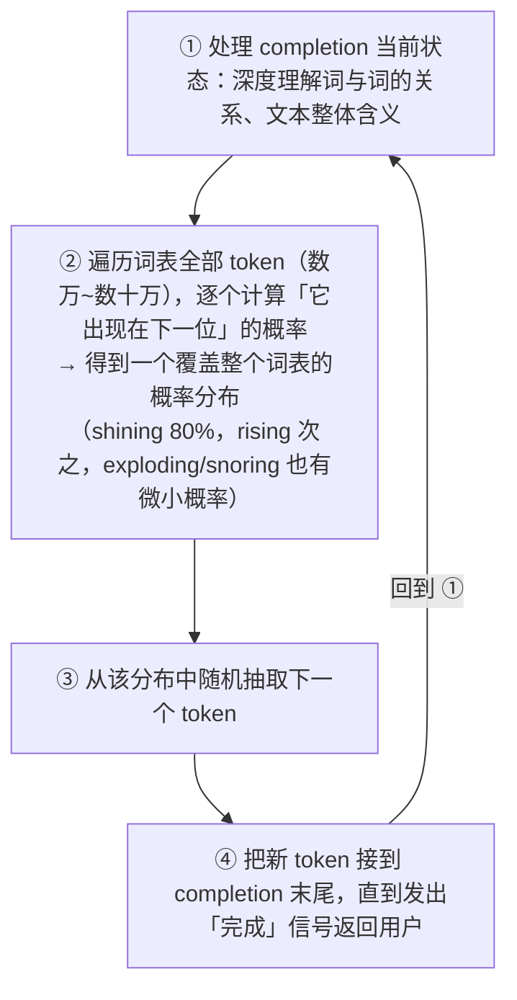
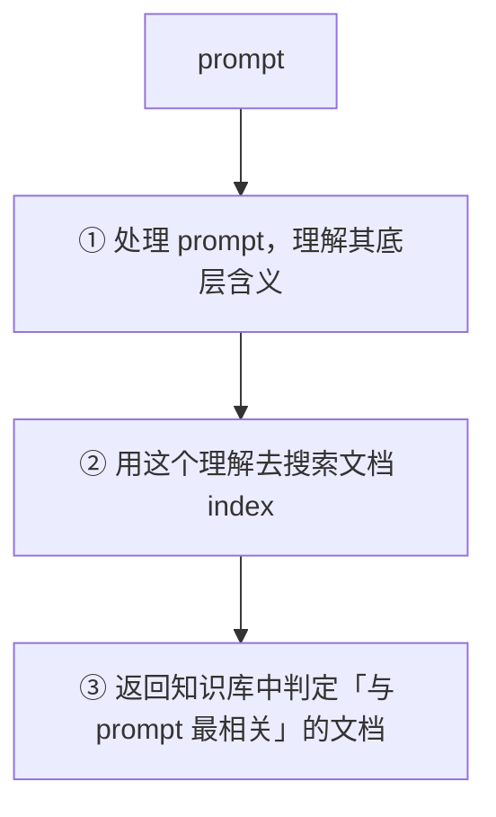
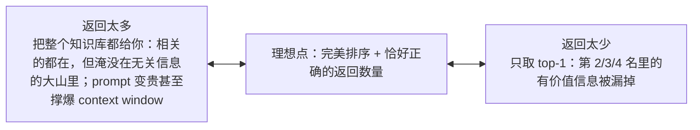

# L06-07 · 打开双黑盒：LLM 生成原理与信息检索入门

> 课程：Retrieval Augmented Generation (RAG)（DeepLearning.AI，Module 1: RAG Overview）
> 本篇覆盖：L6 Introduction to LLMs（LLM 组件深潜：next-token 生成、训练、幻觉本质、prompt 约束）+ L7 Introduction to information retrieval（retriever 组件深潜：知识库/索引/相关性打分/返回数量取舍/向量库定位）。Module 1 收官篇。

## 1. LLM 的全部工作：预测下一个词（L6）

课程先给一个"玩笑但公道"的定义：LLM 常被戏称为 **fancy autocomplete**，而这个描述其实是准确的——**LLM 做的所有事情就是预测一段文本中应该出现的下一个词**。

例子：不完整短语 "what a beautiful day, the sun is..."——你我都能猜出补什么词，LLM 也能。术语对齐：

| 术语 | 含义 | 例子 |
|---|---|---|
| **prompt** | 原始的不完整短语 | "the sun is..." |
| **completion** | 补全后的最终短语 | "the sun is shining" |

关键洞察藏在反例里："the sun is **exploding**" 这个 completion 错在哪？**不是语法错——它是合法英语——而是这个短语"不可能"（improbable）**。太阳通常不会爆炸，尤其在这样的好天气。人对词语的用法有直觉；语言模型某种意义上也有：它底层是一个巨大而复杂的**语言数学模型**（神经网络），存储着哪些词常一起用、通常以什么顺序出现，以及更高层面上这些词**在上下文中的含义**。模型最终就用这套数学表示来生成新文本。

## 2. Token 与生成循环：概率分布 + 随机采样 + 自回归（L6）

严格说 LLM 生成的不是 word 而是 **token**——"词的片段"的泛称：

- London、door 这类词可能独占一个 token；programmatically、unhappy 这类常见复合词通常拆成多个 token；句号、逗号、问号等标点也可有自己的 token；
- 多数 LLM 的词表（vocabulary）规模在 **1 万到 10 万+ token**；
- 用小片段拼复合词的灵活性，让模型**无需给每个词分配 token 就能构造任何可能的词**。

每追加一个新 token 前，LLM 走一遍固定流程：

100 次里 80 次会选 shining——但仍可能选 rising，甚至 exploding。第二轮时，completion 里多数词来自原 prompt，但有一个是刚生成的 shining——**早期的 token 选择会影响后续选择**。这是想要的行为（新 token 会与已选 token 的上下文自洽），但也意味着模型一旦随机选了某个方向就会一路走下去：选了 shining 就接 "in the sky"；如果第一个词随机成了 warming，后面就接 "our faces"。这种行为叫 **autoregressive（自回归，self-influencing 自我影响）**。

**随机性 + 自回归**两者叠加的直接后果：同一个 prompt 在同一个 LLM 上跑多次，通常得到不同的 completion。

## 3. 训练：从 gibberish 到"事实 + 文风"（L6）

LLM 能理解 prompt 含义、做出合理预测，是因为**在大规模文本集合上训练过**：

| 阶段 | 发生了什么 |
|---|---|
| 训练前 | 模型有数十亿 parameters（数值权重），只会输出 gibberish |
| 训练中 | 反复看训练数据里的不完整文本片段 → 预测下一个词 → 按预测准确度更新内部参数 |
| 训练后 | 模型学会复现训练数据中的**事实信息**与**语言风格**两样东西 |

今天许多 LLM 在**数万亿 token**（主要来自公开互联网）上训练，所以能以各种风格谈论各种话题——因为那些风格的样例、那些话题的信息就在训练数据里。

## 4. 幻觉的本质：probable ≠ truthful（L6）

理解了原理，幻觉（hallucination）就不神秘了。**LLM 能做的只有基于训练数据学到的模式生成"概率上合理"的词序列**。问它公司私有数据或今天的新闻——这些几乎肯定不在训练数据里——模型就处在一个不适合回答的位置，有时会给出**听起来对但实际不真**的回复。

课程特意正名：虽然叫"幻觉"，但模型既不是精神失常也谈不上故障——**LLM 的设计目标就是生成 probable text，而非 truthful text**。对 LLM 而言，"真"只意味着"这个词序列在其训练数据的意义上概率高"。训练数据质量高时，人类直觉的"真"与模型数学上的"概率高"可以保持对齐；挑战在于**确保 LLM 能拿到尽可能多的相关信息**。

RAG 的解法利用的正是 LLM 强大的上下文理解力：把相关信息加进 prompt，模型就能理解并融入回复——**即使这些信息从未出现在训练数据里**。术语：这些信息为 LLM 的回复提供 **grounding**。

但"把找到的所有相关信息都塞进 prompt"在实践中行不通，两个硬约束：

| 约束 | 机制 |
|---|---|
| **计算成本** | 生成每个新 token 前，模型要对 completion（含原 prompt）里**每一个已有 token** 做一次计算复杂的扫描——prompt 越长，每步生成越贵 |
| **context window** | 模型一次能处理的最长序列。老模型只有几千 token，新模型可达数百万——但总有上限 |

后果：retriever 往 augmented prompt 里加的信息越多，先是让 prompt 越来越贵，最终会把 context window 整个用完。

> **对比 1-model.md（LLM 选型）**：本课把选型表里两个常见指标还原成了机理——"context window 大小"不是营销参数，而是"能塞多少检索结果"的硬上限；"输入 token 单价"背后是每步生成都要重扫全部已有 token 的计算结构。这解释了 1-model.md 里"长上下文模型 ≠ 免费午餐"的取舍：窗口变大只是把约束从"塞不下"推迟为"塞得起吗"——检索精度（少而准）永远比窗口容量更值钱。这也呼应 L1 对谈：大窗口改写的是超参实践，不是"要不要检索"本身。

课程实操侧注：本课用 **Together AI**（托管众多流行开源模型的服务商）做 LLM 供给——开源模型便于"掀开引擎盖"观察课程要教的概念。L6 的 takeaway 一句话：**LLM 的设计使它能把 prompt 里的信息融入回复，即使该信息不在训练数据中**——于是问题转移给 retriever：这些信息从哪来？

## 5. Retriever 解剖：图书馆类比 → 三组件三步骤（L7）

retriever 的目的此时已经清楚：**把模型训练时可能拿不到的有用信息提供给 LLM**。它怎么工作？课程用图书馆类比（问题："怎么在家做纽约风披萨？"）：

| 图书馆 | Retriever | 作用 |
|---|---|---|
| 藏书 collection | **knowledge base**（文档集） | 信息的来源 |
| 按主题/体裁/作者组织的分区与书架 | **index**（文档索引） | 让文档保持有组织、易搜索 |
| 图书馆员：听懂问题 → 直奔烹饪/意大利菜/纽约区 | **检索过程** | 理解查询含义，定位相关文档 |

对应 retriever 内部的三步：

## 6. 相关性打分与"返回几篇"的两难（L7）

搜索时 retriever 按"与 prompt 的相关度"给知识库文档**排序**：每篇文档得到一个量化相关性的**数值分数**——通常是 prompt 文本与文档文本之间**某种相似度度量**（具体算法课程后面展开），得分最高的文档被返回。

好 retriever 的标准是双向的：**既要返回相关文档，也要扣住不相关文档**。两个失败方向：

现实是残酷的：retriever 总会把一些相关文档排太低、一些无关文档排太高，"返回几篇"因此难以自信决定。课程的工程答案：**长期监控 + 反复实验不同设置**——这正是本课后续大量篇幅要做的事。

> **架构师视角**：这一节其实预演了检索评估的两个经典指标——"漏掉第 2/3/4 名"就是 recall 损失，"淹没在无关信息里"就是 precision 损失，而"返回几篇"就是 top-k 这个最基础的超参。课程刻意不抛术语、先建立张力：**top-k 不存在静态最优解，只能靠监控数据驱动地调**。架构含义：检索层从第一天起就要埋观测点（5-observability-eval.md 的 RAG Triad 三角里，context relevance 这条边评的就是这里），否则调 k 全凭玄学。

## 7. IR 的血统与向量库的定位（L7）

课程把 retriever 放回技术史：很多熟悉的软件干的就是类似的活——**web 搜索引擎**（检索与搜索词相关的网页）、**关系型数据库**（检索匹配 SQL 查询的行和表）。**information retrieval（信息检索）这个领域在 LLM 出现之前就已经成熟**，而它的思想正是 retriever 与 RAG 系统设计的底层。

实现选择上课程给了一个诚实的取舍表述：

- 理论上 retriever 的实现方式很多。多数公司数据本来就在传统关系型数据库里，"数据留在原地、想办法从关系库里检索来驱动 RAG"看起来很美好；
- 但**在规模化场景下，多数 retriever 会构建在 vector database 之上**——一种专门优化"快速找出知识库中与 prompt 最匹配的文档"的数据库。注意措辞：向量库**并非严格必需（not strictly necessary）**，是 at scale 的选择。

本课后续会两条线并行：**通用信息检索原理**（支撑各种搜索技术）+ **vector database**（生产级 RAG 系统里典型的 retriever 载体）。

> **对比老版三部曲（courses/RAG/04-06，2023-24）**：老课从第一行代码就默认 embedding + 向量库是唯一路径（04 直接 `Chroma.from_documents`，06 干脆整门课讲 Chroma），"为什么用向量库"没有论证过程。本课的增量有二：其一，把 retriever 认祖归宗到**成熟的 IR 领域**——搜索引擎、SQL 数据库都是 retriever，向量检索只是 IR 谱系的新成员；其二，明确"向量库不是必需、是规模化下的优选"——这为 3-retrieval.md 里"pgvector 起步 / 专用向量库扩展"的渐进路线补上了课程级依据。生产系统选检索方案时，先问"我的规模配得上专用向量库吗"，而不是条件反射上 Pinecone。

## Module 1 收官

| 节 | 一句话回顾 |
|---|---|
| L1 对谈 | RAG = 经典搜索 × LLM 推理；2025 增量：grounding 变强、reasoning models、大窗口改写超参、agentic RAG 谱系 |
| L2 模块地图 | Module 1 = 概念 → 应用 → 架构 → 双组件深潜 → 编程作业，兼作全课 roadmap |
| L3 核心思想 | 人答题分"收集信息 + 推理作答"，LLM 同样受益 → retrieval + generation |
| L4 应用版图 | 判据"手里有训练数据没有的信息"→ 代码生成/企业 chatbot/医疗法律/AI 搜索/个人助理五场景 |
| L5 系统架构 | LLM + knowledge base + retriever；augmented prompt 一条侧路换五项优势 |
| L6 LLM 深潜 | next-token 概率采样 + 自回归；幻觉 = probable ≠ truthful；grounding 受成本与 context window 约束 |
| L7 IR 深潜 | knowledge base/index/相似度打分三件套；返回数量两难靠监控实验解；向量库是 at scale 的选择而非必需 |

## 本课总结

| 要点 | 一句话 |
|---|---|
| LLM 本质 | fancy autocomplete：对整个词表算概率分布 → 随机采样 → 自回归续写 |
| token | 词的片段；1 万~10 万+ 词表用小片段拼出任意词 |
| 训练 | 数万亿 token 上做 next-word prediction，学到事实信息 + 语言风格 |
| 幻觉本质 | 模型生成的是 probable text 而非 truthful text；话题不在训练数据时两者脱钩 |
| RAG 为何有效 | LLM 能理解并融入 prompt 里的上下文，即使该信息不在训练数据中（grounding） |
| prompt 约束 | 每步生成要重扫全部已有 token（成本）+ context window 上限（容量） |
| retriever 三件套 | knowledge base（文档集）+ index（组织与可搜索）+ 相似度打分排序 |
| 返回数量两难 | 太多淹没且撑爆窗口，太少漏掉次名相关文档 → 监控 + 实验调优 |
| 向量库定位 | IR 老领域的新成员；not strictly necessary，at scale 才是典型选择 |

> **记忆点（引出 Module 2）**：Module 1 的 RAG 系统里，retriever 还停留在"某种相似度打分"的一句话抽象——这个分数到底怎么算？Module 2 就从这里接手：进入检索本身的技术细节（关键词匹配的稀疏方法到语义向量的稠密方法，及其工程取舍），把"retrieve() 黑盒"真正打开，也为编程作业里那个最简 RAG 系统换上更强的检索内核。双黑盒已开其一（LLM），另一个才是这门课的主战场。

## 与我的资产映射

- 检索层选型：`agent/skills/agent-selection/3-retrieval.md`（第 6 节 top-k 两难 → 其"top-k 无静态最优、观测驱动调参"条目；第 7 节"向量库非必需"→ 其 pgvector 起步的渐进路线依据）
- 模型层选型：`agent/skills/agent-selection/1-model.md`（第 4 节 context window 与逐 token 成本机理 → 长上下文 vs 检索精度的取舍依据）
- 旧课回溯：`courses/RAG/04-LangChain: Chat with Your Data`、`05-Building and Evaluating Advanced RAG`、`06-Advanced Retrieval for AI with Chroma`（默认向量库路径的 2023-24 对照基线）
- [[project_selection_matrix]]
