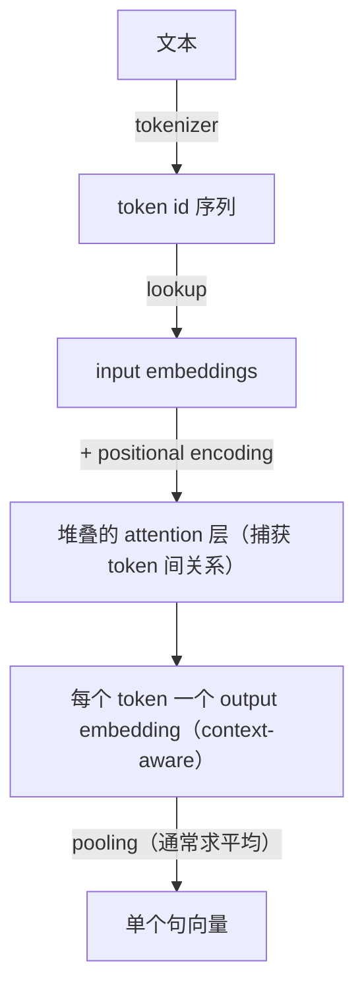

# L1 · 文本如何逐层变成向量（拆解 sentence-transformer 的内部）

> 课程：Retrieval Optimization（DeepLearning.AI × Qdrant，C1）· Lesson 1
> 本课任务：打开一个真实的开源 embedding 模型 `all-MiniLM-L6-v2`，一层层看**文本 → token → input embedding → output embedding → 单向量**的全过程，建立"tokenizer 是最前面那道门"的直觉。

## 1. 为什么从 embedding 讲起

向量检索（含 RAG）的成败**系于 embedding 模型的选择**。讲师给的反例很扎心：**模型在学术论文上训练，你的数据全来自 Twitter，搜索质量必崩**。而"令人惊讶的是，很少有人真做评估"——评估本该是第一步。所以优化向量检索的起点，是**为你的数据选对 embedding**。

embedding 模型的契约：把任意文本 → **固定维度的单个向量**，于是任意两篇文档可以比距离、判相似。但模型**不直接吃文本**——中间必须有一层把文本切成小块，这层就是 **tokenizer**。

## 2. 架构：encoder-only transformer

标准 transformer（出自 *Attention Is All You Need*）是完整的 **encoder-decoder**；而 embedding 模型通常是 **encoder-only**。输入的处理链路：



关键约束：**transformer 只能消化它训练时见过的输入符号**。embedding 模型只认训练数据里出现过的文本单元——只在英文上训练就处理不了日文，反之亦然。

**token id 是 tokenizer 与模型之间的"契约"**：训练一结束，id 的含义就固定了，所以**不能随意替换组件**（换 tokenizer = 换了一套 id 语义，模型就废了）。

## 3. 切分粒度的三种取舍

| 粒度 | 优点 | 缺点 |
|---|---|---|
| **字符/字节级** | token 数极少，词表小，任何词都能表示（无 OOV） | 单字符在各种上下文出现，embedding 无意义；网络得从零学字符组合成词的关系 |
| **词级** | 每个词一个 id，起点就带意义 | 词表巨大→更多训练数据和时间；**遇到没见过的词无法表示**（OOV）；忽略了词内部的公共结构 |
| **子词级** | 两者的折中：常见词整体成 token，罕见词拆成有意义的部件 | —— |

理想的 tokenization 算法应能找到**词根**并给它独立 token（`walk` / `walking` / `walked` 共享词根意义）。传统 NLP 的 stemming / lemmatization 靠语言学知识做，但**换语言就失效**（语法不同）。于是转向**基于训练数据统计**的算法（BPE / WordPiece / Unigram，L2 细讲），它们语言无关。

## 4. 代码：亲手拆开 all-MiniLM-L6-v2

课程全程用 `sentence-transformers` 的 `all-MiniLM-L6-v2`（不是刷榜冠军，但开源、好拆解）。换模型只需换个名字。

```python
from sentence_transformers import SentenceTransformer
model = SentenceTransformer("all-MiniLM-L6-v2")
# 该模型 = Transformer + mean-pooling 层 + normalization；tokenizer 被藏在里面

# ① 切分：接受字符串列表，返回 input_ids
tokenized = model.tokenize(["walker walked a long walk"])

# ② id 不便读，转回 token 看切法
model.tokenizer.convert_ids_to_tokens(tokenized["input_ids"][0])
# → 每个词对应一个 token，外加技术 token：
#   [CLS] 起始、[SEP] 结束（方括号标注）
```

**取第一层（transformer 本体），再取它最前面的 embedding 层**：

```python
first_module = model._first_module()          # 堆叠模块的第一个，token 是它的输入
embeddings = first_module.auto_model.embeddings
# 输入层含三种 embedding：word / position / token-type
# word_embeddings 最重要——承载每个 token 的意义
```

### 4.1 input token embedding 是"上下文无关"的

```python
import torch
from sentence_transformers import util

first = "vector search optimization"
second = "we learn to apply vector search optimization"
with torch.no_grad():
    ft = model.tokenize([first]);  st = model.tokenize([second])
    fe = embeddings.word_embeddings(ft["input_ids"])   # 直接查 word_embeddings 表
    se = embeddings.word_embeddings(st["input_ids"])
# 对两句里的每个 token 两两算 cosine，画 heatmap
distances = util.cos_sim(fe.squeeze(), se.squeeze())
```

**关键观察**：input token embedding 就是一张 **lookup 表**——同一个 token 无论在哪句、什么位置、什么顺序，**永远拿到同一个向量**。这一步还没有任何上下文信息。

### 4.2 可视化整张词表：语义空间已初步成形

```python
# 取出整张 word_embedding 矩阵：形状 (30522, 384)
# 30522 = 词表大小；384 = 向量维度
token_embeddings = first_module.auto_model.embeddings.word_embeddings.weight \
    .detach().cpu().numpy()

# 按 token id 排序词表，用 t-SNE 压到 2 维
from sklearn.manifold import TSNE
tsne = TSNE(n_components=2, metric="cosine", random_state=42)
tsne_2d = tsne.fit_transform(token_embeddings)

# 按 token 类型染色：技术token / 子词后缀 / 前缀与整词
for token in sorted_tokens:
    if token[0] == "[" and token[-1] == "]":  color = "red"    # 技术 token
    elif token.startswith("##"):              color = "blue"   # 子词后缀（双井号前缀）
    else:                                       color = "green"  # 前缀与整词
```

词表分成三簇：**① 技术 token（模型专用）、② `##` 开头的子词后缀、③ 前缀与整词**。眼看散点图（eyeballing）就能发现规律：数字聚在一起，**年份是数字里的一个子簇**；`Cromwell` 这个 token 最靠近 16 世纪的年份（那是位英国政治家）；非英文字符成团；人名彼此靠近。结论——**语义空间的每个子区都聚着意义/功能相近的 token**。这就是 embedding 模型的**起点**。

### 4.3 output token embedding 是"上下文相关"的

```python
# encode() 直接给整句单向量
model.encode(["walker walked a long walk"]).shape        # (1, 384)

# 但也能拿每个 token 的 output embedding——这些才是 context-aware 的
model.encode(["walker walked a long walk"],
             output_value="token_embeddings")

# 对同样两句取 output token embedding，再两两算 cosine：
# 这次 "vector search optimization" 里的 token 在两句中不再全等了
```

对比 4.1：input embedding 恒定；**output embedding 因上下文而变**。中间发生了什么——

## 5. 从 input 到 output：三步

1. **加 positional encoding**：input 序列本身不含位置信息，用 sine 函数生成的位置编码加进去，token embedding 变得也能反映位置/关系。位置编码矩阵**维度固定**——若模型最多支持 256 token，超长序列无保证，tokenizer 通常直接**丢弃尾部超长 token**。
2. **过堆叠的 attention 层**：每层用 attention 捕获 token 间关系，把跨 token 信息写进 output embedding。**上下文无关 → 上下文相关**就发生在这里。
3. **pooling**：把每个 token 的 output 向量**求平均**，得到整段文本的单一句向量。

至此不再是"查词典式"的 word→vector 映射，而是**依上下文编码**。

## 6. 本课总结

| 要点 | 一句话 |
|---|---|
| tokenizer 是门 | 模型不吃文本，只吃它见过的 token id；id 是 tokenizer↔模型的契约，不能换 |
| 三种粒度取舍 | 字符级无 OOV 但无意义、词级有意义但 OOV+词表爆炸、子词级折中 |
| input embedding | lookup 表，上下文无关，同 token 恒得同向量；整张表已聚出语义空间 |
| output embedding | 过 positional + attention + pooling 后，上下文相关，才是句向量 |
| 度量维度 | 词表大小 = input embedding 数量；最大 token 数由位置编码矩阵定死 |

> **架构师视角**：这课把 embedding 模型从"黑箱 API"变成"可诊断的分层管线"。选型时能落到具体旋钮——**训练语料域**（学术 vs 社媒决定 token 是否命中）、**词表大小/tokenizer 算法**（决定 OOV 和子词切法）、**max token 数**（决定长文档被截断的位置）。这正是我 `3-retrieval.md`"选 embedding"一节缺的下一层：不止看 MTEB 分数，还要看 tokenizer 在**你的数据**上产生多少 unknown token。

> **对比已学课程 06 Advanced Retrieval**："Similarity ≠ Relevance"在那门课从检索后处理（rerank / query expansion）解释；本课给出**更上游的根因**——如果 tokenizer 在输入端就把你的关键词切碎或丢弃，output embedding 再怎么 attention 也救不回。相似度低有时不是模型笨，是**输入根本没进去**。

> **记忆点（引出 L2）**：L1 只是"用"了一个现成 tokenizer 并观察其行为。它的词表和切法从何而来？L2 亲手**训练** BPE / WordPiece / Unigram / SentencePiece 四种 tokenizer，看它们在同一份训练数据上学出**完全不同的词表**——因为 tokenizer 决定 transformer 看到什么，值得格外上心。

## 与我的资产映射

- 检索层：`agent/skills/agent-selection/3-retrieval.md`（选 embedding 时增加"tokenizer 在本域数据上的 OOV/子词表现"这一诊断维度）
- 已学课程 06 Advanced Retrieval（Similarity≠Relevance 的输入端根因）
- 姊妹课 Qdrant C2《Multi-vector Image Retrieval》（同样从"文本/图像→token→向量"链路出发，只是多向量）
- [[project_selection_matrix]]
