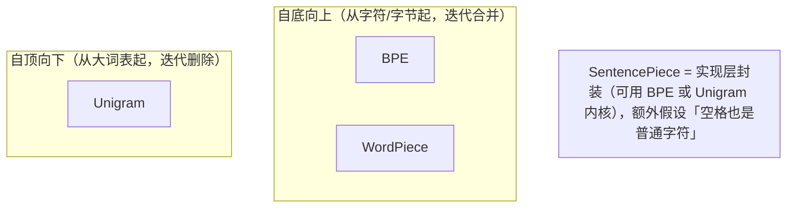

# L2 · 亲手训练四种 tokenizer（BPE / WordPiece / Unigram / SentencePiece）

> 课程：Retrieval Optimization（DeepLearning.AI × Qdrant，C1）· Lesson 2
> 本课任务：用 HuggingFace `tokenizers` 库，在同一份极简训练数据 `"walker walked a long walk"` 上训练四种 tokenizer，看它们学出**不同的词表和切法**，理解各算法的取舍。

## 0. tokenizer 训练的两个前提

- **tokenizer 是可训练组件**，它为给定训练数据学"最好"的词表。但"最好"没有唯一定义，所以算法众多。
- 与神经网络不同，**tokenizer 训练是完全确定性的**——纯粹基于输入数据的统计，同数据同参数必得同词表。
- **词表大小（vocab size）是必须预先选的超参**，通常至少 30,000；多语言模型可能几倍于此（要支持的字符集更宽、序列更多）。

各家选择不同：**OpenAI 用 BPE**；**WordPiece 常见于 sentence-transformers 等开源 embedding 模型**；**Cohere 英文模型用 WordPiece、多语言模型用 Unigram**。

四种算法可分两大思路：



## 1. BPE（Byte-Pair Encoding）——自底向上、按频率合并

流程：
1. 先按**空白字符**切（`Whitespace` pre-tokenizer），词的自然边界保留，**一个 token 绝不跨越两个词**；
2. 词表用训练集**所有字符**初始化；
3. 迭代：选出**最常相邻**的两个 token 合并成新 token，加入词表；**旧 token 不删**（留着还能拼别的词）；
4. 直到达到目标 vocab size。

```python
from tokenizers import Tokenizer
from tokenizers.models import BPE
from tokenizers.trainers import BpeTrainer
from tokenizers.pre_tokenizers import Whitespace

training_data = ["walker walked a long walk"]

bpe_tokenizer = Tokenizer(BPE())          # tokenizer = 通用外壳 + 传入的模型
bpe_tokenizer.pre_tokenizer = Whitespace() # 先按空格切成词
bpe_trainer = BpeTrainer(vocab_size=14)    # 实战至少几千，这里 14 便于演示

bpe_tokenizer.train_from_iterator(training_data, bpe_trainer)
bpe_tokenizer.get_vocab()                  # 看学到的 token；按 id 顺序 = 加入顺序

bpe_tokenizer.encode("walker walked a long walk").tokens  # 用它切训练句
bpe_tokenizer.encode("she walked").tokens                 # 也能切新文本
```

**BPE 的坑——未见字符直接消失**：

```python
bpe_tokenizer.encode("wlk").tokens
# 若某字母训练时没出现（如例中的 s、h），它在输出里被直接省略——
# 因为没有对应 token。（大模型里 BPE 通常在字节级而非字符级，就没这问题）
```

## 2. WordPiece——自底向上、按 score 合并，区分词首/词中

WordPiece 与 BPE 相似，主要区别：**用 `##` 前缀区分"词首字母"和"词中字母"**。理念：**前缀承载意义、屈折后缀不改变太多意义**——`walk / walking / walked / walks` 指同一活动，理想情况一个 token 表"walk 的抽象概念"、另一个表时态。

初始词表 = 每个词的首字母 + 加了 `##` 的词中字母。合并时**不选最频繁对，而是按 score**，score 还考虑这两个 token 在**其他上下文**中各自出现的频率（若两 token 总是相邻，就会被选中合并）。因为要额外收录所有单字母和 `##` 中间字母，**通常需要更大的词表**。

```python
# 课程用了两套实现——
# ① real_wordpiece：为本课专门实现，真正用 score 选择合并（贴近论文）
from real_wordpiece.trainer import RealWordPieceTrainer
from tokenizers.models import WordPiece

rw_tokenizer = Tokenizer(WordPiece())
rw_tokenizer.pre_tokenizer = Whitespace()
RealWordPieceTrainer(vocab_size=27).train_tokenizer(training_data, rw_tokenizer)
rw_tokenizer.encode("walker walked a long walk").tokens
# 训练能找到多次出现的前缀，符合预期
rw_tokenizer.encode("she walked").tokens
# ⚠️ 遇未知字符直接抛错——必须指定 fallback 的 unknown token
```

```python
# ② HuggingFace 原生 WordPiece：不算 score，像 BPE 一样选最频繁对，
#    但给词中字母加 ## 前缀。需显式传 [UNK]。
from tokenizers.trainers import WordPieceTrainer
unk_token = "[UNK]"
wp = Tokenizer(WordPiece(unk_token=unk_token))
wp.pre_tokenizer = Whitespace()
wp_trainer = WordPieceTrainer(vocab_size=28, special_tokens=[unk_token])
#                             ↑ vocab_size 比目标 +1，给 [UNK] 留个 id
wp.train_from_iterator(training_data, wp_trainer)

wp.encode("she walked").tokens
# 未知字符 → 自动变成 [UNK] 特殊 token（约定俗成，也可换别的值）
```

> 两种实现结论：HuggingFace 变体倾向**用整 token 覆盖整词**更好一些；real_wordpiece 更贴论文（score 选择）。对错字，两者都**不应有大变化**。

## 3. Unigram——自顶向下、按 loss 删除

思路反过来：**先用 BPE 建一个远超目标的大词表，再按 loss 逐步删 token**。

- 大词表允许一个词有**多种切法**；所有可能切法的集合用来算 loss。
- 每轮：计算"删掉某 token 会让整体 loss 增加多少"，选**增加最少**的删。token 概率由其频率定义（例中共 63 次出现），某切法的概率 = 所用各 token 频率之积。
- 逐步删，直到词表 ≤ 目标（**只保证不超过，不保证等于**——所以最终可能比设的 14 小）。

```python
from tokenizers.models import Unigram
from tokenizers.trainers import UnigramTrainer

ug = Tokenizer(Unigram())
ug.pre_tokenizer = Whitespace()
ug_trainer = UnigramTrainer(vocab_size=14, special_tokens=[unk_token], unk_token=unk_token)
ug.train_from_iterator(training_data, ug_trainer)
ug.get_vocab()   # 可能短于 14；且不再有 BPE/WordPiece 那样的双字母 token，
                 # 只剩基础字母 + 词的常见前缀
```

**Unigram 的独特优势——解决 glitch token**：它会**删掉训练数据里用不到的 token**，而 BPE/WordPiece 会把它们留在词表里（那些就是所谓 glitch token 的温床）。对未知字符序列，Unigram 用一个 unknown token 表示（但看 `.tokens` 不一定明显，要看 `.ids`）。

## 4. SentencePiece——不是新算法，是实现 + 一个假设

SentencePiece **只是 BPE/Unigram 这些算法的一种实现**，多加了一个关于文本的假设：**不按空白切，把空格当普通字符对待**。

带来两点能力：
- **支持不用空格分词的语言**（如中日）；
- **token 可以跨多个词**。这对两类数据关键：
  - **代码**（如 Python，缩进决定语义）——空格进 token 有意义；
  - **专有名词**——`San Francisco`、`Real Madrid` 用单个 token 表示有时更好。

## 5. 四种算法对比

| 算法 | 方向 | 合并/删除依据 | 词首/词中区分 | 未见字符 | 特点 |
|---|---|---|---|---|---|
| **BPE** | 自底向上 | 最频繁相邻对 | 无 | 直接省略（字符级实现时） | OpenAI 用；LLM 常用字节级 |
| **WordPiece** | 自底向上 | score（含其他上下文频率）/ HF 版按频率 | `##` 前缀 | 需 [UNK] fallback | embedding 模型常用；词表更大 |
| **Unigram** | 自顶向下 | 删 loss 增加最小的 | 无双字母 token | unknown token | 解决 glitch token；词表可小于目标 |
| **SentencePiece** | 实现层 | 内核用 BPE/Unigram | —— | —— | 空格当普通字符；跨词 token；支持无空格语言/代码 |

> **架构师视角**：tokenizer 算法不是"选个默认就行"的细节，它是**领域适配的第一道杠杆**。经验规则：**多语言/无空格语言/代码 → 倾向 Unigram 或 SentencePiece**；**纯英文 + 想让屈折词共享词根 → WordPiece**；**要和 OpenAI 生态对齐 → BPE**。而且它是确定性的——可以在**自己的语料**上训个 tokenizer，量化"平均每个词切成几个 token / 有多少 unknown"，这个数越低往往检索越好（见 L3 引用的论文）。这条应补进 `3-retrieval.md` 的 embedding 选型清单。

> **对比 Qdrant C2《Multi-vector Image Retrieval》**：C2 处理图像时用的是 image patch / 视觉 token，同样面临"把连续输入切成离散单元"的粒度取舍——patch 太大丢细节、太小算力爆，与这里 BPE 的字符级 vs 词级取舍同构。**"切分粒度是检索质量与成本的第一权衡"**这条直觉跨模态通用。

> **记忆点（引出 L3）**：L2 看的是 tokenizer 在**玩具数据**上的行为。真实世界里这些切法会**具体坑到谁**？L3 用 emoji、错字、产品型号、价格、日期五类真实输入，展示 tokenization 如何让"语义搜索"翻车，并给出 payload filter 这类工程解法。

## 6. 本课总结

| 要点 | 一句话 |
|---|---|
| 训练确定性 | tokenizer 训练纯统计、可复现；vocab size 是预设超参（通常 ≥30k） |
| BPE | 按频率自底向上合并，旧 token 保留；未见字符可能丢 |
| WordPiece | 类 BPE 但 `##` 分词首/词中、按 score 合并；词表更大 |
| Unigram | 自顶向下按 loss 删；能清掉 glitch token；词表可小于目标 |
| SentencePiece | 实现层封装，空格当普通字符，支持无空格语言/代码/跨词 token |

## 与我的资产映射

- 检索层：`agent/skills/agent-selection/3-retrieval.md`（embedding 选型清单加"tokenizer 算法 × 领域"匹配规则：多语言/代码→Unigram/SentencePiece，英文屈折→WordPiece）
- 已学课程 06 Advanced Retrieval（tokenizer 是"输入端"优化，与检索后 rerank 互补）
- 姊妹课 Qdrant C2（切分粒度取舍跨模态通用）
- [[project_selection_matrix]]
