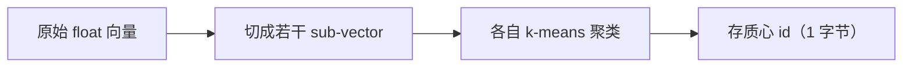
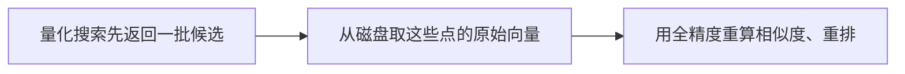

# L6 · 向量量化：用可控质量损失换内存与速度（PQ / SQ / BQ）· 收官

> 课程：Retrieval Optimization: Tokenization to Vector Quantization（DeepLearning.AI × Qdrant）
> 本课任务：把优化从"质量维度"切到"成本/速度维度"——三种向量量化（Product / Scalar / Binary）各压缩多少、掉多少精度、rescore 怎么救回来，最后横比裁决。这是全课收官篇。

## 0. 本课定位：优化的最后一站——内存与速度

L4 度量、L5 调 HNSW 都在质量维度打转。L6 面对的是**成本墙**：向量本身太占内存。量化（quantization）用少量质量损失换取巨大的内存压缩和速度提升。

## 1. 为什么必须量化：算一笔内存账

embedding 默认是 float32——**每个维度 32 bit = 4 字节**：

```
OpenAI 常见模型: 1500+ 维 × 4 字节 ≈ 6 KB / 每个 chunk
  × 文档总数（还要加向量库结构开销）
  → 百万级尚可，再往上消费级机器扛不住
```

过去的唯一解是"把数据放磁盘"（慢）。量化更强：**让语义检索更省钱，且质量损失很小**。

## 2. Product Quantization（PQ）：切子向量 + 聚类换码本

流程：



- **切几段由压缩率决定**：压缩率以字节计。压缩率 16 → 每个 sub-vector 4 维（4 维 float = 16 字节）；
- **质心数固定 256**：正好是一个字节能表示的取值数，所以每个 sub-vector 只需存 1 字节的质心 id；
- **压缩效果**：16 字节 → 1 字节，压缩率 = 16。

"Product"之名的由来：把高维向量切成子空间，每个子空间用**自己的码本（codebook）**独立量化，组合起来就是各码本的**笛卡尔积（Cartesian product）**，用子空间的乘积去近似原始高维空间。

```python
client.update_collection("wands-products",
    quantization_config=models.ProductQuantization(
        product=models.ProductQuantizationConfig(
            compression=models.CompressionRatio.X64,  # 最激进：64 倍
            always_ram=True,                          # 量化向量常驻内存
        )))
```

**代价（讲师明确）：**
- PQ **一定**降低检索精度。本课 32 倍压缩把 precision 从原始 ~0.98 打到 **~0.66**，64 倍更甚——"预算紧才考虑 64 倍，但很少够准"；
- 建库**更慢**，因为要跑 k-means 聚类；
- 有时能小幅提速。

## 3. rescore：量化掉的质量怎么救回来

量化的根本问题：**相似的向量会被压成完全相同的表示**（sub-vector 落到同一质心 → 同坐标 → 同分数），导致同一邻域里的点无法区分。

**rescore 机制：**



向量库因此**在磁盘保留原始向量**。rescore 能显著改善质量，**关闭它应是一个有意识的决定**（换取更低延迟）。代码里就是一个开关：

```python
search_params=models.SearchParams(
    quantization=models.QuantizationSearchParams(
        rescore=True   # False = 不用原始向量重排，更快但更糙
    ))
```

## 4. Scalar Quantization（SQ）：float → int8

思路极简：把 float 转成整数。

- 原始 float 落在某个**具体区间**（只是全体 float 的一个子集），新来的向量区间还会变，所以**不能全局量化，要分段（segment）做**——这正好复用 L5 的 segment 设计：每段不可变，可测出该段的 min/max，再把数值线性映射到整数区间（`0~255` 或 `-128~127`）；
- **压缩率固定 4**：4 字节 → 1 字节，内存降约 **75%**；
- 有精度代价，但**也有速度收益**。

```python
client.update_collection("wands-products",
    quantization_config=models.ScalarQuantization(
        scalar=models.ScalarQuantizationConfig(
            type=models.ScalarType.INT8, always_ram=True)))
```

> 讲师定调：**Scalar quantization 通常是想让检索更快更省时"第一个该考虑"的方案**——压缩温和、质量损失小、还提速。

## 5. Binary Quantization（BQ）：float → 1 bit

把压缩推到极致——每个 float 压成一个布尔值：

```
规则：正数 → 1 ；负数或 0 → 0
32 bit → 1 bit ，压缩率 32
```

关键配套是 **over-sampling（过采样）**：因为大量点会被压成完全相同的表示，**要多取一些候选**，再用原始 float 向量算 query 到它们的真实距离来区分（本质就是 BQ 版的 rescore）。

```python
client.update_collection("wands-products",
    quantization_config=models.BinaryQuantization(
        binary=models.BinaryQuantizationConfig(always_ram=True)))
```

收益（讲师给的量级）：**内存最高降 32 倍，检索速度最高提 40 倍**——但精度依赖 rescore 救回。

## 6. 横比裁决：谁赢？

对所有方法跑 `compare`（precision@25，参照系仍是 exact KNN）：

```python
compare(qrels=qrels, runs=[
    product_name_pq_run, product_name_pq_rescore_run,
    product_name_sq_run, product_name_sq_rescore_run,
    product_name_bq_run, product_name_bq_rescore_run,
], metrics=["precision@25"])
```

| 方法 | 压缩率 | 精度表现（本课数据） | 提速 | 备注 |
|---|---|---|---|---|
| PQ | 可到 16/32/64 | 最差（32×→~0.66） | 有时略快 | 建库慢（k-means） |
| SQ (int8) | 固定 4 | **最高**（含/不含 rescore 都好） | 是 | 首选起点 |
| BQ | 32 | rescore 后也不错 | 最高（可达 40×） | 强依赖 over-sampling/rescore |

**裁决：本课数据里 Scalar quantization 精度最高（rescore 与否都稳）；Binary quantization 配 rescore 也胜任。** 但讲师收尾强调：**没有普适最优，选哪种取决于项目的具体需求和所用模型。**

> **架构师视角**：量化把"内存/速度"变成一个可调旋钮，但真正的决策变量是**三角权衡：精度 ↔ 内存 ↔ 速度**，而 rescore 是这三角里的"回血开关"。生产落地的判断链是：① 先上 SQ（温和、低风险）作为默认；② 内存吃紧到极限才上 BQ，且**必配 rescore + over-sampling**；③ PQ 只在极端预算下考虑，且要接受精度大跌。始终用 L4 的 ranx 指标卡住"降到多少精度还能接受"——**量化是拿业务可容忍的质量换真金白银的内存/速度，不度量就是盲降。**

> **对比 8-cost-economics 的成本旋钮**：选型矩阵成本层的旋钮多在"模型/token"侧（换小模型、缓存、批处理）；量化是**检索基础设施侧**的成本旋钮。二者互补——量化不改变生成成本，但把"能不能在消费级机器上跑百万级向量库"从不可能变可能。架构师要清楚：**embedding 选型定质量上限（L1/L4），HNSW 定近似质量（L5），量化定内存/速度地板（L6）——三层分工，别混着调。**

## 全课收官

### ① Conclusion 要点

结课语只有几句，但点透了主线：

- 你走通了 embedding 模型的内部机理，并学会为真实应用优化语义检索；
- **The R in RAG stands for retrieval**——管好检索结果的质量，才有可靠的 AI 应用；
- 检索质量是 RAG 可靠性的根，不是可选项。

### ② L1-L6 全课回顾表

| 课 | 主题 | 一句话拿走 | 优化维度 |
|---|---|---|---|
| L1 | Embedding 模型内部 | 文本经多层网络变成定长向量；选错领域的模型质量必崩 | 表示上限 |
| L2 | 训练 tokenizer | tokenizer 是可训练、确定性组件；BPE/WordPiece/Unigram 各家不同，词表大小是超参 | 表示上限 |
| L3 | 向量检索的盲区 | emoji/前后缀/罕见 token 等关系向量抓不住；"更多 token ≠ 更好向量" | 表示上限 |
| L4 | 度量检索质量 | 不能度量就不能优化；ranx Qrels/Run + precision/recall/MRR/NDCG | 质量度量 |
| L5 | 调优 HNSW | M/ef 只调近似质量、调不动模型天花板；最小够用；segment 分段 | 近似质量 |
| L6 | 向量量化 | PQ/SQ/BQ 用质量换内存/速度；rescore 回血；SQ 首选、BQ 最省 | 成本/速度 |

### ③ 架构师的裁决

> **架构师的裁决**：检索优化的四类手段有**明确的优先级和排序**——
>
> **1. Embedding 选型 / tokenizer（L1-L3）= 最高优先级、最大杠杆。** 它决定质量的天花板，下游一切调参都在这个上限之下腾挪。选错领域模型（学术库 vs 推特数据）、tokenizer 处理不了你的输入（emoji、专有词、多语言），后面怎么调都是徒劳。**先做 offline eval 选对模型，再谈其他。**
>
> **2. 度量（L4）= 一切优化的前置门，不是一个手段而是元手段。** 没有 ranx 这样的确定性指标，后三项调参都是盲调。它便宜（比 LLM-as-judge 简单太多）、该进 CI。
>
> **3. HNSW 调参（L5）= 中等优先级，但常是低 ROI。** 默认配置往往已到 0.99+，把工程时间花在 0.998→0.999 上不值。**先量化"离上限差多少"，差得多才调；差得少就别碰。**
>
> **4. 量化（L6）= 触发条件明确的成本手段，不是质量手段。** 只在"内存/速度撞墙"时启用：SQ 作温和默认 → BQ 在极端省内存时上（必配 rescore）→ PQ 仅极端预算。用 L4 指标卡住可容忍的精度下限。
>
> **一句话排序：选对模型 ＞ 建好度量 ＞（按需）量化省成本 ＞ 微调 HNSW。** 顺序反了——比如不选好模型先调 M/ef、或不建 ground truth 就上激进量化——都是把力气用在杠杆最短的地方。

## 本课总结

| 要点 | 一句话 |
|---|---|
| 内存墙 | float32 × 千维 × 百万文档 = 消费级机器扛不住 |
| PQ | 切子向量 + k-means 存质心 id；压缩大但精度跌得多、建库慢 |
| SQ | float→int8，压 4 倍省 75% 内存，精度稳、提速——首选起点 |
| BQ | float→1bit，压 32 倍、提速最高 40×，强依赖 rescore/over-sampling |
| rescore | 用磁盘上的原始向量重排，量化的"回血开关" |
| 无普适最优 | 选哪种取决于项目需求与所用模型，用指标裁决 |

## 与我的资产映射

- 检索层：`agent/skills/agent-selection/3-retrieval.md`（量化是向量库落地的成本/速度旋钮；PQ/SQ/BQ + rescore 决策树）
- 成本经济：`agent/skills/agent-selection/8-cost-economics.md`（检索基础设施侧的成本手段，与 token/模型侧旋钮互补；量化让百万级向量库跑上消费级机器）
- 观测·Eval 层：`agent/skills/agent-selection/5-observability-eval.md`（量化必须用 ranx 指标卡精度下限，否则是盲降）
- 全课主线映射：L1-L3→表示上限（模型/tokenizer 选型），L4→度量门，L5→近似质量，L6→成本地板——检索优化的分层决策框架
- 面试包：向量量化 PQ/SQ/BQ 原理与取舍、rescore 机制是向量检索进阶考点
- [[project_selection_matrix]]
