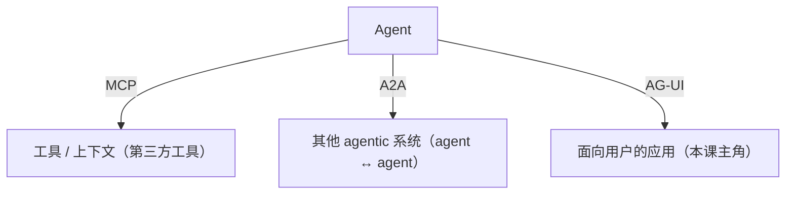
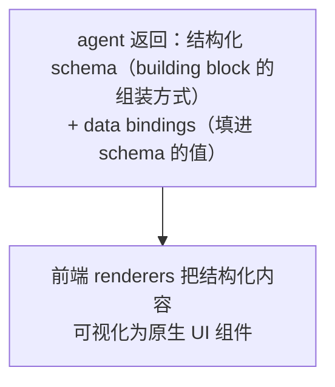

# L1 · Generative UI 光谱：controlled / declarative / open-ended 三支柱

> 课程：Build Interactive Agents with Generative UI（DeepLearning.AI × CopilotKit）
> 本课任务：建立整门课的**心智模型**——generative UI 是一条光谱，控制权从开发者流向 agent；讲清三支柱各自的取舍与适用 surface，并把 AG-UI 放进 MCP / A2A / AG-UI 三角里定位。
> 本课纯概念，无代码 notebook。

## 1. 一个挑衅式论断：all UI will become AI

Atai 开场抛出一句挑衅：**未来几年，一切 UI 都会变成 AI**——每一次人与技术的交互都会越来越多地被 agentic 系统中介。不只是 HubSpot / Zendesk / Figma 这类复杂软件，甚至你家**冰箱**：路过时对它说一句"把今晚千层面缺的配料订了"。方向是 **agent 与人无处不在的交互**。

现状呢？当下的 agentic 界面很像 1980 年代的 **MS-DOS 命令行**——对早期采用者够用，撑不起大众普及。今天的 agent 正从 MS-DOS 时代毕业、迈向 **Windows/Mac 时代**。做得好的例子：Claude Code / Cursor（与 agent 并肩工作、看见它在做什么、连贯地纠偏）、Notion（agent 在应用里替你动手）、Manus（把 agent 的动作流式呈现成漂亮 UI）。

## 2. 为什么"把 agent 接给用户"这么难：agent 打破了 request/response 范式

开发者初次做 agentic 应用时，往往只盯着 agent 本身，以为造好 agent 后**丢到 API 后面**再接前端就行——像过去三十年做前后端那样。真做时撞上第二组意料之外的问题：**agent 从传统软件视角看是只"怪鸟"**。

| agent 的"怪癖" | 传统软件的假设 |
|---|---|
| **长时运行**：要边跑边流式吐进度，支持重连、中断、跑到一半被纠偏 | 一次请求一次响应 |
| **结构化 + 非结构化数据同时**：文本、语音、tool call、state 更新混在一起 | 单一结构化响应 |
| 体验上像"在一个传统应用里同时实现 Slack + Zoom" | 表单/按钮/页面跳转 |

结果是**撞墙撞墙再撞墙**，最终发现要为 agentic 时代**重新实现被我们默认了三十年的胶水代码**。

**CopilotKit + AG-UI 就是补这块的**：

- **CopilotKit** = 开源开发者 SDK + 云平台，用于构建面向用户的 agentic 应用，**为 agentic 时代原生设计**，而非从 request/response 范式硬改。
- **AG-UI** = **Agent-User Interaction Protocol**，开放、轻量、**基于事件**。让造 agent 框架/harness 的人只要遵守一套简单标准，就能把 agent 接进各种面向用户的生态——"一切自动工作"。已被 Google / Microsoft / Amazon / LangChain / Oracle 等广泛采纳。

## 3. AG-UI 在三角中的定位

- **MCP**：把 agent 连到第三方**工具与上下文**；
- **A2A**：把 agent 连到**其他 agentic 系统**；
- **AG-UI**：三角的第三条腿——把 agent 连到**面向用户的应用**。

AG-UI 脱胎于 CopilotKit 与 LangChain、CrewAI 的最初合作。方向可逆：既能"用 AG-UI 把任意 agent 接给你的用户",也能"用 AG-UI 把任意用户接到你的 agent"。可用于 Web / mobile / Slack / 短信等任意前端——**本课聚焦 Web，具体是 React（主流 Web 框架）**。

> **架构师视角**：AG-UI 的价值不在"又一个协议"，而在**把 agent 的怪癖标准化成事件**（文本/工具/状态/生命周期），让前端只面对一套稳定事件模型。这正是 `10-agent-ux.md` 里区分的**协议层 ≠ 传输层(SSE/WebSocket) ≠ 呈现层(前端怎么渲染)**：AG-UI 定协议层的事件 schema，CopilotKit 在其上做呈现层的 React runtime + 组件。选了 AG-UI/CopilotKit 会**反向约束后端框架**——后端最好有 AG-UI 适配（如 LangGraph），所以这个决策 plan 期就要拍。

## 4. 什么是 Generative UI

**Generative UI = 由 LLM/agent 使能、且服务于 LLM/agent 的 UI 范式**。LLM/agent 给软件带来了新能力也带来了新挑战，generative UI 就是那个**既利用新能力改善体验、又应对新挑战**的 UI 范式。

所有方案排在**一条光谱**上，轴 = **控制权从开发者流向 agent 的程度**。三支柱：**Controlled → Declarative → Open-ended**。现代 agentic 应用**需要整条光谱**——不同段各有 pros/cons，适配不同 use case 与 surface。

## 5. 三支柱逐个拆解

### ① Controlled Generative UI（受控，"劳模")

开发者提供**预建、全定制**的 UI 组件，agent 按需调用来增强交互。**开发者控外观，agent 控意图**。

- ✅ **最大化定制/可预测/像素级完美**；开发体验熟悉（就是 pre-agentic 时代的前后端那套）。
- ✅ 被称为 generative UI 世界的**劳模(workhorse)**——因为你产品**最高频的 surface**最需要定制与可预测。
- ❌ **每个想让 agent 支持的交互都要专门设计一个组件** → 实现复杂度**随能力线性增长**。
- 本课用 AG-UI + CopilotKit 实现（L3）。

### ② Declarative Generative UI（声明式）

开发者声明一套**乐高式 building-block 目录**，agent 按需**动态拼装**成渲染组件。底层机制：

- 适用：消费级应用的**长尾 surface**（灵活性比完美更值），以及**内部应用**（重功能与易实现、轻极致体验）。
- ❌ **做不到像素级完美**（只能用预建积木的标准组合）；**确定性比 controlled 低**（同一 query 不同时候可能拼出不同组合）；因需更多生成计算而**更慢**。
- 工具：CopilotKit + **A2UI**（Google 牵头的开放规范，CopilotKit/AG-UI 是发起与设计伙伴）。AG-UI 让 A2UI 可配任意 agentic 后端。L4 实现。

### ③ Open-ended Generative UI（开放式）

光谱最右端。先经 **MCP apps**，再到**完全开放式**。

- **MCP apps** = MCP 的官方扩展，是嵌入 AI 聊天窗口的 widget 乃至完整应用，底层用 **iframe** 实现；被 ChatGPT / Claude App Store 支持并深度优化。
  - ✅ 把任意第三方 app 带进聊天体验，**保留其品牌**、无需改造宿主 app。
  - ❌ 这种约束带来**固有的间接性**（app 套 app）→ 实现复杂、安全挑战、窗口外定制受限；且**绑 iframe** → 不适合 Web 之外（mobile/Slack）。
  - 本课借 **AG-UI ↔ MCP apps 的握手**，把原本为 ChatGPT/Claude app store 造的 app（Salesforce、HubSpot、Figma、Spotify…）带进你自己的 agentic 应用。
- **完全开放式** = UI 由 agent 按用户请求**完全按需生成**（多数人一听"generative UI"想到的就是这个）。
  - 适用：**极长尾 query** + 用今天标准看"意料之外"的惊喜体验。
  - ❌ 要**多得多的 thinking tokens** → 更慢更贵、更不可预测/不稳健；**目前仍是实验阶段**，但代表 agentic UI 的完整愿景。
  - 本课用 CopilotKit + AG-UI middleware 实现 → 可即刻接任意 agentic 后端。

## 6. 一张表收敛：谁配哪种 surface

| 支柱 | 控制权 | 定制/像素级 | 确定性 | 速度/成本 | 最适 surface |
|---|---|---|---|---|---|
| **Controlled** | 开发者 | 最高（像素级） | 最高（不会幻觉出没注册的组件） | 最快/最省 | **最高频**核心界面 |
| **Declarative** | 半开发者半 agent | 中（积木组合） | 中 | 中 | **长尾** + 内部应用 |
| **Open-ended** | agent | 最灵活/无界 | 最低 | 最慢/最贵 | **第三方系统** + 极长尾 |

> **对比 `10-agent-ux.md` 呈现层三候选**：那张表把呈现方案分成 **AG-UI/CopilotKit（开箱可视化工具调用/状态/审批卡）**、**Vercel AI SDK UI（chat/补全范式、上手最快）**、**自建 SSE + 前端（零抽象、全自控）**。本课这条光谱是在**选定 CopilotKit 之后**的下一层细分：同一个 CopilotKit 框架内部，再按 surface 在 controlled/declarative/open-ended 之间取舍。**先选呈现层框架（10-agent-ux），再选支柱（本课）——两层决策别混。**

## 本课总结

| 要点 | 一句话 |
|---|---|
| 大势 | all UI is becoming AI；agent 从 MS-DOS 迈向 Windows/Mac 时代 |
| 难点根因 | agent 打破 request/response：长时运行、流式、重连中断纠偏、结构化+非结构化并存 |
| AG-UI 定位 | MCP(工具)/A2A(agent)/AG-UI(用户) 三角的第三条腿；标准化 agent↔前端事件 |
| 三支柱 | controlled(劳模/高频) → declarative(长尾/A2UI) → open-ended(第三方/极长尾) |
| 选型轴 | 控制权从开发者流向 agent；整条光谱按 surface 分层用 |

> **记忆点（引出 L2）**：L1 只搭了心智模型。L2 开始动手——先在 **CopilotKit + AG-UI** 上搭一个**生产级的 agent chat 地基**（LangChain Deep Agent → AG-UI FastAPI 端点 → CopilotRuntime → React `CopilotChat`），并现场把后端从 LangChain/OpenAI **热切换**到 Google ADK/Gemini 而前端零改动——这块地基是后面三支柱全部要往上长的根。

## 与我的资产映射

- 呈现层选型：`agent/skills/agent-selection/10-agent-ux.md`（本课光谱 = 选定 CopilotKit 后的支柱细分；协议层/传输层/呈现层的三段划分与本课 AG-UI 三角互为印证）
- 协议层细节：`agent/skills/agent-selection/2-framework/06-protocols.md`（AG-UI 事件 schema）
- [[project_selection_matrix]]
