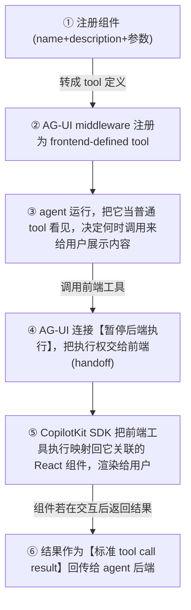

# L3 · Controlled Generative UI：用 `useComponent()` 注册前端组件

> 课程：Build Interactive Agents with Generative UI（DeepLearning.AI × CopilotKit）
> 本课任务：迈出纯文本——用 **Controlled Generative UI**（generative UI 的劳模）。程序员定全定制 React 组件，agent 决定何时用、填什么数据。用 `useComponent()` 注册 showMyName / pieChart / flightCard 三个组件。
> 代码：`code/L3.ipynb`。

## 1. 定位：程序员控外观，agent 控意图

上一课 agent 只能回文本。走出文本立刻带来**沟通优势**：以前一大坨难读的文字墙，瞬间变成清爽的表格或饼图。

**Controlled Generative UI = generative UI 最直接、最广用的变体**：开发者定义一组 agent 可在回复里使用的自定义组件，连同这些组件期望从 agent 拿到的参数。技术上对任何前端开发者都**极其熟悉**——它就是标准前端组件定义的镜像。一句话分工：

> **你（程序员）控制 look & feel，agent 控制 intent（意图）。**

因为每个交互配一个自己的组件定义，controlled 变体给了开发者**组件显示后的最大灵活性**：组件可交互、可轻易影响应用其他部分、可像素级完美贴合设计规范。本课探索的标准变体让 **agent 自己决定何时用哪个组件**。

## 2. 为什么叫"劳模"（workhorse）：pros / cons

| Pros | 说明 |
|---|---|
| **全品牌控制** | 每个组件可完全定制，像素级完美 |
| **强安全** | agent **永远不会幻觉出你没注册的组件**；最坏也只是"在错的时机调错组件"或"填错数据"，且这远不易发生 |
| **最快最可靠** | 光谱上速度与可靠性最高 |
| **80/20 好方案** | 最适合产品**最高频的 surface** |

| Cons | 说明 |
|---|---|
| **线性复杂度** | 每个新能力都要一个专门的组件定义，实现复杂度随 agent scope **线性增长** |

## 3. 工作原理（under the hood）

每个注册组件关联 **name + description + 参数列表**，这些被转成 **tool 定义**，由 **AG-UI middleware** 注册为**前端定义的工具（frontend-defined tools）**。之后 agent 眼里它们**和任何其他 tool 一样**。完整回路：



> **架构师视角**：注意 ④ 的 **halt backend / handoff to frontend** 与 ⑥ 的 result 回传——这是一条完整的**前端在环（frontend-in-the-loop）**回路，等价于把"人在 UI 上的操作"编码成一次 tool call 的返回值。这正对口 `10-agent-ux.md` 的第 ④ 轴 **HITL 审批与中断恢复**：controlled 组件既能是纯展示（flight card），也能是可交互审批卡（点批准 → 结果回传 agent 续跑）。**呈现层和 HITL 环路在这里是同一套机制**，别拆成两套实现。

## 4. `useComponent()` hook

注册一个 React 组件为 `<CopilotChat/>` 内 agent 可调的 tool，**四个参数**：

```tsx
useComponent({
  name: "component_name",          // 暴露给模型的 tool 名（必填 string）
  description: "什么时候该调这个组件",  // 选填 string，但很重要：教 agent 何时/如何用
  parameters: z.object({ ... }),   // 选填 Zod schema：结构化 props 作为参数传入
  render: MyComponent,             // 必填：React 组件(<Component {...args}/>)，或收 {args,status} 的函数
});
```

- **description** 虽是一句话却很关键——它告诉 agent 何时用。若 agent 该显示时没显示，**尽管往里加描述**（有的应用这里写几十行，精确刻画某个组件该出现的场景）。
- **parameters** 用 **Zod** 定 schema（参数名 + 参数类型）。**Zod ≈ TypeScript 版 Pydantic**：一次定义，同时用于 TS 类型和 `useComponent` 的 `parameters`。
- **render** 可是内联函数组件，也可传一个现成 React 组件（组件本身就是"收 props、返回渲染结果"的函数）。

注册位置灵活：可在应用初始化时集中注册，也可在不同 region/page 分散注册——用户走到哪，对应组件就对 agent 激活。**行为和任何 React hook 一致**，后端复杂度框架自动兜。

## 5. 三个组件：从 hello-world 到像素级定制

在 `App.tsx` 里加三次 `useComponent`（+ 一个建议 hook）：

```tsx
import { z } from "zod";
import { CopilotChat, useComponent } from "@copilotkit/react-core/v2";
import { FlightCard, FlightCardProps } from "@/components/flight-card";
import { PieChart, PieChartProps } from "@/components/pie-chart";
import { useExampleSuggestions } from "@/hooks/use-example-suggestions";

export default function App() {
  // ① 最简组件：把名字显示在卡片里（render 内联）
  useComponent({
    name: "showMyName",
    description: "Show the user's name in a card",
    parameters: z.object({ name: z.string() }),
    render: ({ name }) => <div className="bg-blue-500 p-4">Hi, {name}!</div>,
  });

  // ② 饼图：agent 不只挑组件，还要想清楚填什么数据
  useComponent({
    name: "pieChart",
    description: "Controlled Generative UI that displays data as a pie chart.",
    parameters: PieChartProps,   // 直接复用预建组件的 props schema
    render: PieChart,            // 传一个现成 React 组件
  });

  // ③ 航班卡：像素级定制设计的例子
  useComponent({
    name: "flightCard",
    description: "Controlled Generative UI that displays a single flight summary card.",
    parameters: FlightCardProps,
    render: FlightCard,
  });

  // 给 chat 加可点击的预设建议（省得记要输什么）
  useExampleSuggestions();

  return <CopilotChat />;
}
```

- **showMyName**：hello-world，单参数 `name: string`，`render` 内联。演示时问"Show my name"，agent 先反问名字，答"Atai"后**不再回文本**，而是用蓝底卡片渲染——因为它调了 `showMyName` 组件。
- **pieChart**：description 告诉 agent 可用来把数据画成饼图；agent 从**类型**就能推断何时/如何用；`parameters` 直接**导入预建组件的 props**（标准 React props）；`render` 传现成组件。
- **flightCard**：像素级定制。三个都是**标准 React 组件，没有任何特殊之处**，可任意定制、甚至做成与应用其他部分联动的全交互组件。

**FlightCard 全貌**（一次定义、TS 类型与 `parameters` 共用同一 Zod schema）：

```tsx
import { z } from "zod";

export const FlightCardProps = z.object({
  title: z.string().describe("Flight card title"),
  airline: z.string().describe("Airline name"),
  origin: z.string().describe("Departure airport/city"),
  destination: z.string().describe("Arrival airport/city"),
  departure_time: z.string().describe("Departure time"),
  price: z.string().describe("Price display"),
});
type FlightCardProps = z.infer<typeof FlightCardProps>;

export function FlightCard({ title, airline, origin, destination,
                            departure_time, price }: FlightCardProps) {
  return (
    <div className="rounded-lg border bg-white p-3 space-y-2">
      <div className="font-semibold">{title}</div>
      <div className="rounded border p-2 text-sm">
        <div className="font-medium">{airline}</div>
        <div>{origin} → {destination}</div>
        <div>Departs: {departure_time}</div>
        <div className="font-semibold">{price}</div>
      </div>
    </div>
  );
}
```

`.describe(...)` 把字段说明也喂给模型，帮它把 prompt 里的信息正确填进对应参数。

> **对比 A2A 课的 client 端**：A2A 里一个 agent 作为另一个的 client，靠 **Agent Card** 声明能力、用结构化消息调用——是 **agent↔agent** 的机器契约；本课 `useComponent` 的 name+description+Zod schema 是 **agent↔前端** 的契约，最终渲染给**人**看。两者形态相似（都是"声明能力 + 结构化参数"），落点不同：一个回传给 agent 续跑，一个渲染成人能操作的 UI。理解了 A2A 的 client 契约，`useComponent` 几乎零学习成本。

## 本课总结

| 要点 | 一句话 |
|---|---|
| 分工 | 程序员控 look&feel，agent 控 intent |
| 机制 | 组件→tool 定义→AG-UI 注册为 frontend tool→agent 调用→halt 后端/handoff 前端→SDK 映射回 React 组件→结果回传 |
| `useComponent` | name / description / parameters(Zod) / render 四参数 |
| Zod | TS 版 Pydantic，一份 schema 同供类型与参数 |
| 取舍 | 安全/可预测/最快（不会幻觉未注册组件），代价是复杂度随能力线性增长 |

> **记忆点（引出 L4）**：Controlled 给足控制与定制，但**每个交互都要一个专门组件**。L4 转向 **Declarative Generative UI**（光谱中段）：用 Google 牵头、CopilotKit 深度合作的 **A2UI** 开放规范——不再为每个用例建组件，而是定义一套**乐高式 building-block 目录**，让 agent 按需**拼装**它们成布局。用灵活性换像素级完美。

## 与我的资产映射

- 呈现层选型：`agent/skills/agent-selection/10-agent-ux.md`（第 ② 轴"生成式/交互式 UI" = controlled 组件；第 ④ 轴"HITL 审批与中断恢复" = 组件交互结果回传 agent 的同一回路）
- 协议层：`agent/skills/agent-selection/2-framework/06-protocols.md`（frontend-defined tools 走的 AG-UI 工具事件）
- [[project_selection_matrix]]
