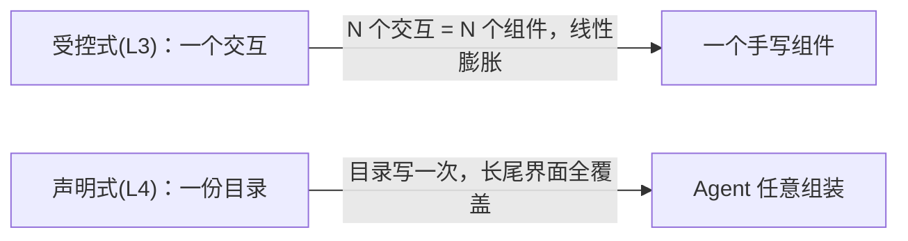
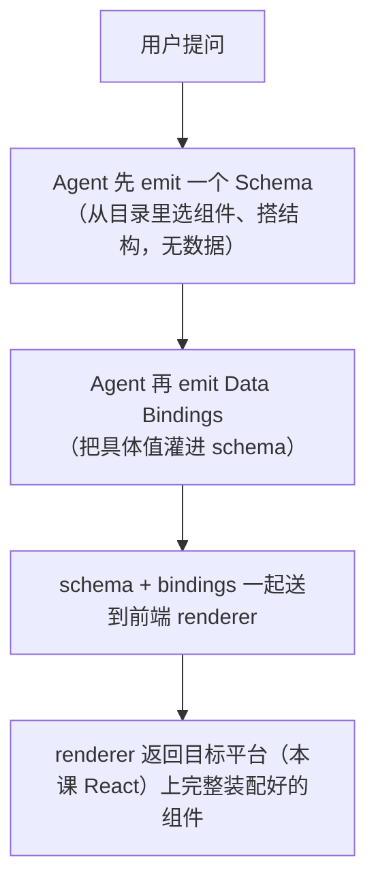
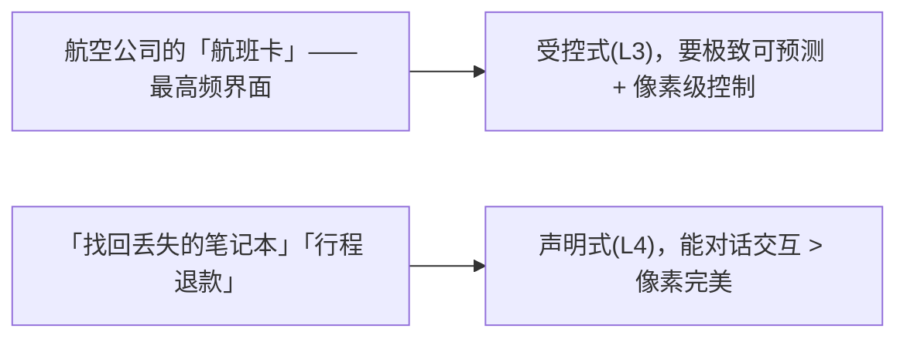

# L4 · 声明式生成式 UI：用 A2UI 组件目录让 Agent 自己拼界面

> 课程：Build Interactive Agents with Generative UI（DeepLearning.AI × CopilotKit）
> 本课任务：不再为每种交互手写一个组件，而是**预先声明一套「乐高积木」组件目录（catalog）**，让 Agent 在运行时按需组装成 dashboard、机票卡片轮播等富界面。技术栈：LangChain Deep Agent（GPT-4.1）+ CopilotKit + A2UI（Google 主导、CopilotKit 深度共建的开放规范）。

## 0. 承上：从 L3「受控」到 L4「声明式」

L3 用的是 **Controlled Generative UI（受控式）**：程序员为每一类要展示的东西**手写一个专用 React 组件**，Agent 只负责填数据。好处是对每个元素**完全可控、像素级定制**；代价是——**每加一个新能力就要从零手写一个组件**。20 个组件时还好，到 200 个组件就成了灾难。

L4 的 **Declarative Generative UI（声明式）** 把这个等式翻转过来：不再逐个定义组件，而是**预先声明一份组件目录**，然后让 Agent 自己把这些积木拼起来。



## 1. 声明式生成式 UI 的三块拼图

一句话心智模型——**乐高**：目录是「那盒零件」，schema 是「零件怎么拼在一起」，data bindings 是「运行时填进去的最终内容」。

| 拼图 | 是什么 | 类比 |
|---|---|---|
| **Component Catalog（组件目录）** | 应用支持的 UI 原语集合，分**两部分**（见 §2） | 那盒乐高零件 |
| **Schema（结构）** | 描述用哪些组件、怎么嵌套、彼此关系——**尚未填数据** | 零件的拼装图纸 |
| **Data Bindings（数据绑定）** | 运行时填入的真实值（机票详情、指标、记录） | 图纸上填进去的实物 |

**运行时流程**（Agent 一次回答的内部时序）：



结果：组件形态可以千变万化，但**始终被约束在你控制的那份「有界菜单」之内**。

## 2. 组件目录 = 定义（Definitions）+ 渲染器（Renderers）

目录**刻意拆成两半**，这是声明式方案跨平台的关键：

- **Definitions（定义）**：**平台无关**的描述——每个组件的 name、description、以及用 **Zod schema** 声明的 props 类型。
- **Renderers（渲染器）**：**平台相关**的实现——吃一个描述组件的 JSON payload，返回该平台（本课 React，同样模式可扩展到 mobile/Slack）上真正渲染出的组件。

### 2.1 Definitions：声明积木（`definitions.ts`）

```ts
// 一个 dict，key = 组件名，value = { 描述 + Zod props 契约 }
export const demonstrationCatalogDefinitions = {
  Title: {
    description: "A heading. Use for section titles and page headers.",
    props: z.object({ text: z.string(), level: z.string().optional() }),
  },
  Text: {
    description: "A text element. Use for labels, values, captions.",
    // text 可以是字面量，也可以是 { path } —— path 指向 data binding
    props: z.object({
      text: z.union([z.string(), z.object({ path: z.string() })]),
      variant: z.enum(["h1","h2","h3","body","caption"]).optional(),
    }),
  },
  Card:    { description: "A generic card container...", props: z.object({ child: z.string().optional() }) },
  List:    { description: "A list of children...", props: z.object({ /* children/direction/gap */ }) },
  // Icon / Image / Divider / Column / Row ... 一长串
};
```

> 字幕原话：这份长清单是**声明式方案固有的成本**——你必须**预先把所有乐高积木备齐**，Agent 才能拼。这是用「一次性建目录的前期投入」换「后续长尾界面零边际成本」。

### 2.2 Renderers：给积木上样式（`renderers.tsx`）

```tsx
// CatalogRenderers<Definitions> 是泛型——用定义作为类型参数，
// 编译期强制 renderer 与 §2.1 的组件类型「严丝合缝」对齐
const demonstrationCatalogRenderers: CatalogRenderers<DemonstrationCatalogDefinitions> = {
  Title: ({ props }) => {                 // props 已带上 §2.1 声明的类型
    const Tag = props.level === "h1" ? "h1" : props.level === "h3" ? "h3" : "h2";
    return <Tag style={{ fontWeight: 600, /* 你的设计规范 */ }}>{resolveText(props.text)}</Tag>;
  },
  // 每个组件一个 renderer，都是普通 React 函数；图表用 recharts 画
  // ...
};

// 组装目录：定义 + 渲染器 + catalogId
export const demonstrationCatalog = createCatalog(
  demonstrationCatalogDefinitions,
  demonstrationCatalogRenderers,
  { catalogId: "app-dashboard-catalog" },
);
```

字幕点睛：**自定义 renderer 正是声明式方案里「注入你自己品牌样式」的地方**——让每个 renderer 感知你的设计规范即可，Agent 拼出来的界面就自动符合 design guidelines。

## 3. 后端 Agent：A2UI 与普通工具并肩

后端仍是标准 LangChain Deep Agent，关键是挂上 `CopilotKitMiddleware` 开启 A2UI，并给一个真实的取数工具：

```python
@tool
def get_sales_data() -> str:
    """取当前销售指标（生产环境这里查真实 DB/API，本课硬编码）"""
    return json.dumps({"totalRevenue": "$1.2M", "newCustomers": 3842,
                       "revenueByCategory": [...], "monthlySales": [...]})

graph = create_agent(
    model=ChatOpenAI(model="gpt-4.1"),
    tools=[get_sales_data],
    middleware=[CopilotKitMiddleware()],       # ← 开启 A2UI 能力
    checkpointer=MemorySaver(),
    system_prompt=(
        "先调 get_sales_data 取数，再调 generate_a2ui 可视化成 dashboard。\n"
        "调完工具后不要在文本里复述数据——UI 已自动渲染，只需确认渲染了什么。"),
)
```

前端 CopilotRuntime 只多一行 A2UI 配置：

```ts
const runtime = new CopilotRuntime({
  agents: { default: langGraphAgent },
  a2ui: { injectA2UITool: true },      // ← 自动注入 generate_a2ui 工具给 Agent
});
```

再在 `main.tsx` 把目录挂到 Provider 上：`<CopilotKit a2ui={{ catalog: demonstrationCatalog }}>` —— 这行把「Agent 的 A2UI 输出」接到「你的 React 渲染层」。

> **A2UI 的两层工具调用（under the hood）**：**外层工具调用**在 Agent 决定生成 A2UI 时触发（把 A2UI 逻辑与 Agent 其余行为隔离）；**内层工具调用**才装着结构化 A2UI payload，middleware 拦截其参数以支持**流式**渲染。生成结果也作为一次 tool call result 进入对话历史。开发者不用手写这套流程。

## 4. 两种口味：Dynamic Schema vs Fixed Schema

声明式生成式 UI 有两种变体，区别只在「谁负责搭 schema」：

| | **Dynamic Schema（动态）** | **Fixed Schema（固定）** |
|---|---|---|
| **谁搭结构** | Agent 运行时**即兴组装** | 程序员**预先写死** |
| **Agent 职责** | 选组件 + 搭结构 + 填数据 | **只填数据** |
| **一致性** | 因请求而异 | 最高，每次一模一样 |
| **灵活性** | 高，随请求自适应 | 低，换布局要改代码 |
| **适合** | 长尾、探索性、内部界面 | 打磨过的高频界面（机票卡、发票） |

字幕原话：**实践中很多应用两者并用**——高频/品牌敏感的界面用 fixed，其余全用 dynamic。

### 4.1 Dynamic 演示

点「Sales Dashboard」建议按钮 → Agent 先调 `get_sales_data`，再**从目录里现场拼**出 Title + Text（总营收/新客/转化率）+ 饼图 + 柱状图的完整仪表盘。这就是动态 schema：**先从零搭 schema，再灌 data bindings**。

### 4.2 Fixed 演示：A2UI Composer + `display_flights`

固定 schema 第一步是「定 schema」，但那份 JSON 是**给机器写的、又大又乱、不该手写**。A2UI 生态有个 **A2UI Composer**（a2ui.org）——内置 copilot，你用自然语言描述想要的组件，它并排给出 schema、可编辑的示例数据、以及渲染预览；满意后 `Copy JSON`。

关键：**任何工具都能返回 A2UI operations**，只要把结果包成 `a2ui.render(...)`：

```python
CATALOG_ID = "copilotkit://app-dashboard-catalog"   # 指向前端定义的目录
SURFACE_ID = "flight-search-results"                 # 标识一个具体 A2UI 组件（可更新而非仅追加）
FLIGHT_SCHEMA = [ {"id":"root","component":"List","children":{"path":"/flights"},...}, ... ]  # Composer 产物

@tool
def display_flights(flights: list[Flight]) -> str:
    """把机票渲染成一行卡片。schema 固定，只有 flights 数据每次变。"""
    return a2ui.render(operations=[
        a2ui.create_surface(SURFACE_ID, catalog_id=CATALOG_ID),   # ① 新建 surface
        a2ui.update_components(SURFACE_ID, FLIGHT_SCHEMA),        # ② 灌入固定 schema
        a2ui.update_data_model(SURFACE_ID, {"flights": flights}),  # ③ 灌入运行时数据
    ])
```

`Flight` 用 `TypedDict` 声明，**其形状必须与 schema 里的 `{path}` 绑定精确对齐**——固定 schema 下 schema 是程序员定的，但填数据仍是 Agent 的活，用类型约束保证对齐。Agent 拿到 `get_sales_data / search_flights / display_flights` 三个工具，靠 system prompt 决定何时调哪个（机票走 `display_flights`，销售走 `generate_a2ui`）。

## 5. 何时用声明式：优缺点与定位

**优点**：① 有护栏的灵活性（Agent 自适应但跳不出你的组件系统）；② 自带组件（你定原语、Agent 定组合）；③ 每个界面工作量小（目录建一次到处复用）；④ **天生跨平台**（同一份 JSON schema 渲染到 web/mobile/Slack/短信）；⑤ 比开放式生成 UI **更省 token**（Agent 从固定词汇表工作，而非生成任意代码）。

**缺点**：不够像素级、不够可预测、更易出错（schema/绑定可能微妙失败，需校验与兜底）、需前期设计目录。

字幕给的定位判断非常清晰：



> **架构师视角**：声明式生成 UI 的本质是**把「UI 布局」这件易变的事从代码搬进数据**——布局写在 Agent emit 的 schema 里，而非写死在 React 组件里。这与 L2 SPARQL 课「图形状写在 CONSTRUCT 模板里、不写在 Python 循环里」、与 Procedural Memory「prompt 即数据」同构：**把易变逻辑抽成数据，系统就获得不发版演化的能力**。代价是可预测性下降——所以它天然属于「长尾 + 内部工具」，把「高频 + 品牌门面」留给受控式。这不是二选一，而是**同一应用里按界面重要性分层混用**。

> **对比 `10-agent-ux.md` 的「② 生成式/交互式 UI」维度**：我的选型卡里，Agent-UX 呈现层第二档就是「流式渲染组件（表单/图表/画布），靠 `STATE_SNAPSHOT` + `STATE_DELTA` JSON-Patch」。A2UI 正是这一档的**具体协议实现**——它把「schema（结构快照）+ data bindings（增量数据）」标准化，落在 AG-UI 事件模型上。选型卡告诉你「要不要点亮这一档」；本课告诉你「点亮后 CopilotKit/A2UI 这条路具体怎么落地、dynamic 与 fixed 怎么取舍」。两者是「决策轴 ↔ 实现细节」的关系。

> **记忆点（引出 L5）**：L3 受控、L4 声明式——都还把 Agent 关在「你预先备好的组件/目录」里。L5 要**彻底拆掉这个约束**：先用 **MCP Apps** 让 Agent 把控制权交给第三方现成应用（Excalidraw、Figma、HubSpot，即 ChatGPT/Claude 应用商店那套），再用 `openGenerativeUI` 让 Agent **当场手写全新界面**。这就是生成式 UI 光谱最远的一端——最灵活，也最不可控。

## 本课总结

| 要点 | 一句话 |
|---|---|
| 声明式 = 翻转等式 | 不逐个写组件，而是建一份目录让 Agent 自己拼；解 200 组件膨胀问题 |
| 三块拼图 | Catalog（definitions+renderers）+ Schema（结构）+ Data Bindings（数据） |
| 目录两拆 | Definitions 平台无关（Zod props）、Renderers 平台相关（React + 你的样式），泛型对齐 |
| Dynamic vs Fixed | Agent 搭结构 vs 程序员写死结构；长尾/探索 vs 高频/品牌门面；可并用 |
| A2UI 落地 | 后端 `CopilotKitMiddleware`、前端 `a2ui:{injectA2UITool}` + `catalog`；任何工具都能 `a2ui.render` |

## 与我的资产映射

- 呈现层选型：`agent/skills/agent-selection/10-agent-ux.md`（②生成式 UI 维度、AG-UI/CopilotKit 方案行——A2UI 是「流式渲染组件」这一档的协议实例）
- 设计模式：`agent/skills/agent-selection/11-design-patterns.md`（「易变逻辑抽成数据」的声明式模式）
- 面试包：`agent/interview/1.md`（前后端 Stream 流事件模型——`STATE_SNAPSHOT`/`STATE_DELTA` 与 A2UI schema+bindings 的映射）
- [[project_selection_matrix]]
