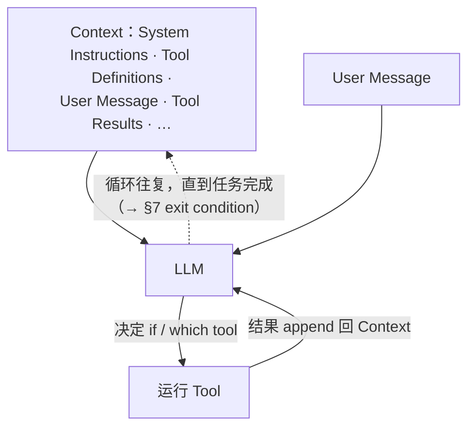

# L1 · Coding Agent 的内部机制（LLM + Tools in a Loop with Context）

> 课程：Building Coding Agents with Tool Execution（DeepLearning.AI × E2B）
> 本课任务：搞清 coding agent 是什么、它如何在任务中推理、如何用 code execution 与 file system 这类工具完成任务——以及选模型、管 context、追错误、挑执行环境这四个构建时的真实挑战。

## 0. 本课目标与开场示例

开场展示本课程最终要构建的 coding agent：你给它一句需求，它把请求变成一个**可运行的应用**——自己写代码文件、执行它们、并即刻在云端把 web 应用服务起来，全程自主完成。本课先把这台机器拆开看内部。

## 1. Agent 的最小定义：LLM calling Tools in a Loop with Context

一个 AI Agent 可以被极简地定义为：**an LLM calling Tools in a Loop with Context**。三个成分：

| 成分 | 是什么 | 例子 |
|---|---|---|
| **Tools** | Agent 运行的代码，或它能调用的外部服务 | 操作文件、搜索 web、可视化数据洞见 |
| **Context** | LLM 的任何输入 | System Instructions、Tools Definitions、User Message 等 |
| **Loop** | LLM 依据 context 决定是否调用、调用哪个 tool → Agent 调用并运行该 tool → 结果 append 回 context → 重复，直到任务完成 | 两条 user message 之间发生的一切 |

## 2. Coding Agent 和一般 Agent 差在哪

一般的 AI Agent 可能只是推理一会儿、翻翻自己的资源、返回一个答案——比如帮你订机票、做主题调研并写摘要。而 **Gemini CLI、Claude Code、Cursor** 这类 coding agent 要**写代码、跑代码**，以及做相关任务：生成长脚本、调试、编辑项目里几十个文件。由此带来四项额外需求：

| 额外需求 | 为什么 |
|---|---|
| **受控环境中的 code execution** | 要在代码上一遍遍迭代 |
| **filesystem 访问** | 读、改、写文件是编码任务的基本盘 |
| **long-running sessions** | 编码复杂：装依赖、编译、跑测试、修错误、重试，一个任务跨很长的会话 |
| **更强的 security** | 未受信任的代码必须被妥善处置——实验不能弄坏你的机器，恶意行为者不能借此获得系统访问权 |

> **架构师视角**：这张表其实是"coding agent 为什么难"的需求分解——四行分别指向执行环境（L3/L4）、工具设计（本课 §5/§6）、context 管理（本课 §4）、安全隔离（7-safety-guardrails.md）。面试被问"coding agent 和普通 tool-use agent 的区别"，答这四轴比背产品名有说服力。

## 3. 选模型：三个判据

Coding agent 的核心同样是一个 LLM，怎么挑？

1. **支持 function calling**：模型能被提供一组 tools，并自行决定何时、如何使用它们；
2. **context size 够大**：研究显示 **约 30k tokens 的 context 是 Agent 能可靠处理真实任务的第一个临界点**——约 40–50 页文本，相当于一个中等规模的 GitHub repo。之所以需要，是因为处理 Django、PyTorch 这类更大的项目要求模型读写许多文件，轻松用掉数万 tokens；
3. **用编码专项 benchmark 评估**：最常用的是 **SWE-bench**——测模型能否拿一个真实 GitHub issue、生成 patch、通过该 repo 的单元测试（课程展示了 2025 年 10 月的 leaderboard）。但记住这只是一种可选指标，**应按你自己的 use case 评估模型**。

## 4. Context Engineering 与 context rot

**Context 是 LLM 看到的一切**。对 coding agent 而言包括：system prompt、外部输入（PDF、数据库搜索结果）、user prompts、tools 与 tool 执行结果，还有当前 branch commit、文件摘要、先前的 patch notes、依赖版本、来自更早运行的短期记忆事实等。

**Context Engineering** 的定义：**在把 context 保持得尽量小的同时，为模型提供完成当前任务最相关的信息**的艺术。必须管理 context 长度，因为 coding agent 的 context 膨胀得特别快：

- 每一轮 edit–run–debug 循环都往对话里加文本；
- tool 输出可能极其庞大（大 JSON、长日志）；
- 上面再叠加反复出现的 error stack。

结果就是所谓 **context rot**：token 数增长后，模型对真正要紧的内容投入的注意力下降，输出质量随之下滑。

> **对比《AI Agentic Design Patterns with AutoGen》L5 的 code executor**：AutoGen 那课的 executor 把代码块的 stdout **原样**塞回对话，几轮下来对话史里全是原始输出——当时没讲这是隐患。本课补上了缺失的一课：原始 tool 输出正是 context rot 的头号来源，executor 与 context 管理必须一起设计，而不是"执行归执行、对话归对话"。

## 5. 控制 context 的三招（针对 raw tool outputs）

Coding agent 里最常见的 token 来源是**原始 tool 输出**，三种缓解手段：

| 招式 | 做法 | 例子 |
|---|---|---|
| **输出保持 small / consistent / structured** | 解析原始响应，只返回 LLM 真正需要的数据 | `get_weather` 工具 ping API 后若原样返回 response data 会淹没 context；应解析后只留必要字段 |
| **日志裁剪** | 日志同样会疯长：截取最后几行、丢弃重复消息 | 不只 JSON 响应适用，logs 也一样 |
| **文件列表分页 + 过滤** | 大项目一个目录可能几百个文件，全返回会灌爆 context：分页返回并允许模型按需请求下一页；或先过滤（只看 Python 文件 / 特定目录） | Agent 频繁按 pattern 列文件时，让模型只看到要紧的部分 |

## 6. 两类核心工具

Coding agent 至少需要两类工具：**运行代码**和**访问文件系统**。

### 6.1 运行代码：untrusted by default

讲师的原则：**LLM 生成的代码应一律视为 untrusted**。运行规则：

1. 避免把 code actions 直接跑在 host 上，理想情况是进入一个**与系统其余部分隔离**的更安全环境；
2. 对 **CPU、内存、执行时间施加严格限制**——失控进程不能把整个系统拖垮；
3. 除非任务明确需要，**默认封锁 network 与 filesystem 访问**；
4. 通过指定你选定的 tech stack **把模型摁在正轨上**——否则它会开始幻觉出库名、或使用你不想要的工具。

> **对比 7-safety-guardrails.md（沙箱安全）**：本节四条正是选型包里"执行面护栏"的最小集——隔离层、资源配额、默认拒绝的网络/文件系统、白名单化的依赖。区别在于选型包按"威胁模型 → 护栏强度"分档，本课直接给出 CodeAct 场景的默认档位：**untrusted by default，能力按需开洞**，而不是"先全开再封堵"。

### 6.2 文件系统：圈定地盘 + 两种搜索

编码任务要求读、改、写文件，所以 Agent 需要 filesystem 访问。良好实践：

- **严格权限**：只允许 Agent 在一个特定的 working directory 内工作；
- **跨文件搜索**：给 Agent 配 **regex-based file search**；
- **文件内搜索**：用 **fuzzy matching**——即便与查询没有精确匹配，Agent 也能找到相关内容或模式。

## 7. Loop 的边界：exit condition 与错误追踪

**Loop 就是两条 user message 之间发生的一切。** 多数任务需要多轮推理，模型会一次次调用 tools，有时反复调用同一个 tool。但必须知道**何时停下**：

- **必须有 exit condition**。Agent 并不完美——它们会失败，也可能在试图恢复错误时失控空转；
- 结果可能需要**评估**：human in the loop 或用另一个 LLM 来评。

错误追踪要**系统化**——任务越长越复杂，Agent 越容易出错，甚至可能**永远卡在修同一个错误上**。对策：

| 对策 | 做法 |
|---|---|
| 记录错误 + **maximum retry counter** | 到达上限就停，不许无限重试 |
| 请用户介入 | 让 user 提供输入、帮忙解决错误 |
| **错误聚类** | 把同类错误 cluster 到一起、移除旧的，在帮助模型的同时保持 context 干净 |

## 8. 执行环境选型：六个判据

Coding agent 在哪儿跑代码？业界三条路线：**Cursor 用 local execution，一些 Agent 用 Docker，Lovable、AInauts、Perplexity 这类用 sandbox**。决策时考虑六个维度：

| 判据 | 关心什么 |
|---|---|
| **Security** | attack surface 多大？是否把自己的操作系统暴露出去？ |
| **Developer experience** | 避免代码 workaround，让用户用得舒服 |
| **可定制环境** | 支持多种语言、工具、预装 packages |
| **可维护性 / 可靠性** | 好的维护工具、减少基础设施 downtime，给终端用户可靠支撑 |
| **启动速度** | 环境要**起得快** |
| **规模** | 以上全部要在 scale 下成立——准备好让 Agent 服务数百万终端用户 |

> **架构师视角**：这六轴里前两轴（security、DX）是常见共识，真正拉开差距的是后四轴——**启动速度和百万级并发**是把 Docker 和 microVM sandbox 区分开的硬指标，也是 E2B 这类产品存在的理由。做环境选型时别只画"安全 vs 便利"二维图，把"冷启动延迟 × 并发规模"补进去，答案常常会翻转（细节在 L3 展开）。

## 9. 本课总结

| 要点 | 一句话 |
|---|---|
| Agent 最小定义 | LLM calling Tools in a Loop with Context，结果 append 回 context 直到任务完成 |
| Coding agent 四需求 | 受控代码执行、filesystem 访问、long-running sessions、更强安全 |
| 选模型三判据 | function calling / ~30k tokens 起步线 / SWE-bench 等按 use case 评估 |
| Context Engineering | context 保持小而相关；否则 edit–run–debug 循环 + 大 tool 输出 + 重复 error stack → context rot |
| 输出瘦身三招 | 结构化精简输出、日志裁剪、列表分页 + 过滤 |
| 代码执行规则 | untrusted by default：隔离、资源限额、默认断网断盘、锁定 tech stack |
| 文件系统规则 | 只在 working directory 内工作；regex 跨文件搜索 + fuzzy 文件内搜索 |
| Loop 收尾 | 必须有 exit condition；max retry、请用户介入、错误聚类 |
| 环境选型 | local / Docker / sandbox，按 security、DX、可定制、可靠、启动速度、规模六轴判断 |

> **记忆点（引出 L2）**：本课给了完整的图纸——loop 骨架、两类工具、context 与错误的管理原则。L2 跟着 Francesco 把图纸变成代码：**动手构建第一个简单的 coding agent**，让"LLM calling Tools in a Loop"从一句定义变成一段能跑的程序。

## 与我的资产映射

- 行动范式层：`agent/skills/agent-selection/0-action-paradigm.md`（本课 §6.1"代码即动作 + 必须隔离"是 CodeAct 档取舍的逐条落地）
- 安全护栏层：`agent/skills/agent-selection/7-safety-guardrails.md`（untrusted by default、资源限额、默认拒绝网络/文件系统）
- 工具层：`agent/skills/agent-selection/4-tools.md`（工具输出瘦身 / 分页 / 过滤——工具设计影响 context 预算的实例）
- 模型层：`agent/skills/agent-selection/1-model.md`（function calling + context size + 编码 benchmark 的选模型判据）
- [[project_selection_matrix]]
