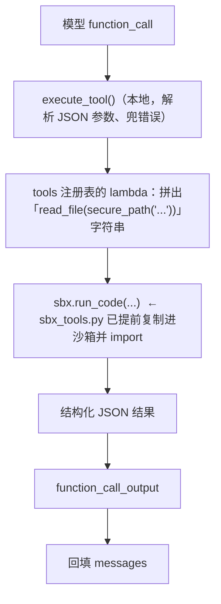
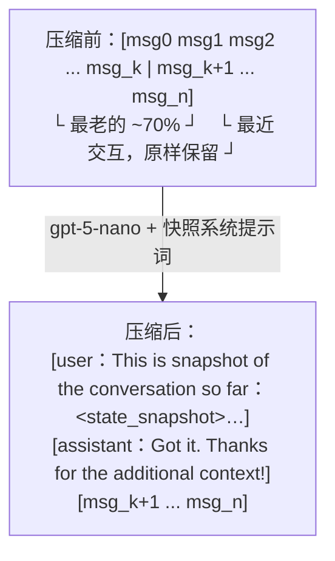
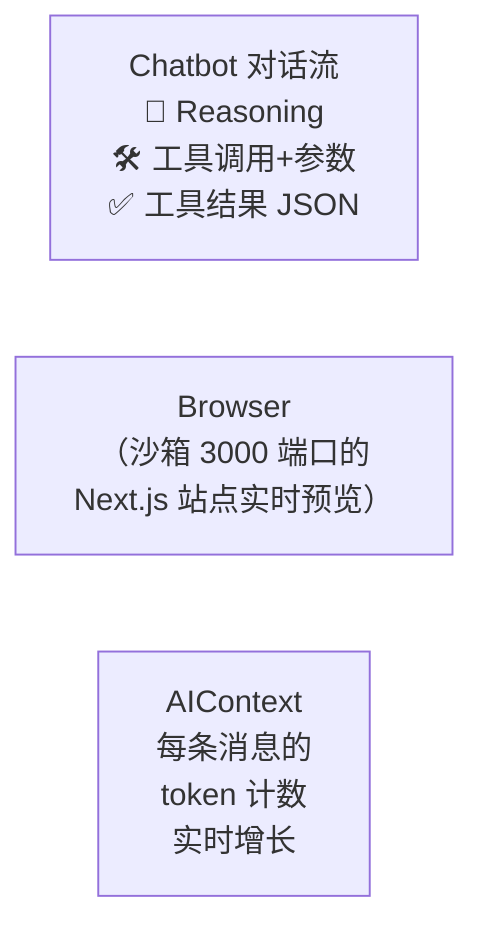

# L6 · 全栈 Agent 与运行时上下文压缩（文件系统工具 + Runtime Summary）

> 课程：Building Coding Agents with Tool Execution（DeepLearning.AI × E2B）
> 本课任务：给 agent 加上**一整套文件系统工具**，让它能编辑多个文件、生成完整 Next.js web app；同时引入 **Runtime Summary** 机制，在 agent 运行中动态压缩上下文，扛住"几十轮 loop 才能做完一个任务"的长程消耗。

## 0. 本课目标与路线

L2 搭了本地 agent loop，L4 把执行搬进 E2B 云沙箱，L5 做出数据分析 agent——但那些任务几个 loop 就能收工。**创建 web app 是复杂任务**：大量文件编辑、代码生成，agent 需要几十次循环，上下文会飞快填满。所以本课两条线并行：

1. **能力线**：新增 6 个文件系统工具 + 更复杂的 web dev 系统提示词 + 预装 Next.js 运行时的沙箱模板；
2. **工程线**：Runtime Summary——上下文超阈值时，把最老的 70% 消息压缩成一份结构化快照，替换原消息后继续跑（做法跟随 Gemini CLI）。

## 1. 文件系统工具：从"执行代码"到"操作项目"

L5 的 agent 只有 `execute_code` / `execute_bash`；写 web app 要在一个项目目录里反复找文件、读文件、改文件，于是补上 6 个工具（全部在 `lib/sbx_tools.py`）：

| 工具 | 作用 | 关键设计 |
|---|---|---|
| `list_directory` | 列目录 | 分页返回，目录排在文件前 |
| `read_file` | 读文件 | 支持 offset/limit，防一次读爆上下文 |
| `write_file` | 写文件 | 自动创建父目录 |
| `search_file_content` | 按内容搜索 | 支持子串/regex/模糊匹配，分页 |
| `replace_in_file` | 字符串替换 | 先校验 `expected_replacements` 次数，不符即报错 |
| `glob` | 按文件名模式找文件 | 自动读 `.gitignore` 过滤，按修改时间排序 |

三个贯穿所有工具的工程惯例：

```python
class ToolError(Exception): ...   # L2 定义的自定义异常，工具失败时抛出，被捕获后作为 error 返回给模型

def _paginate_results(results, offset=0, limit=16):
    # 所有可能返回大量条目的工具统一分页：
    # {"pagination": {"total", "offset", "limit", "has_more"}, "results": [...]}
    ...

def secure_path(requested_path):
    # 用 os.path.realpath 解析后强校验：目标必须在工作目录内
    if not target_real.startswith(wd_real + os.sep) and target_real != wd_real:
        raise ToolError(f"Path '{requested_path}' escapes working directory...")
```

课堂演示 `search_file_content("sbx", limit=4)`：返回分页 JSON——总共 65 处命中、本页 4 条、`has_more: true`。**工具返回结构化 + 分页，是给模型看的 API 设计**，不是给人看的。

> **对比 7-safety-guardrails**：`secure_path` 是典型的**路径越狱防护**（path jail）——即使代码已经跑在沙箱里，仍然把 agent 的读写锁死在 `/home/user/` 项目目录内。这体现分层防御：沙箱隔离保护宿主机（infrastructure 层），`secure_path` 保护沙箱内的其他文件（application 层）；`replace_in_file` 的次数校验则是操作级 guardrail——预期改 1 处、实际匹配 3 处就拒绝执行，防止模型"顺手"改坏无关代码。

## 2. 工具执行链路：工具代码住在沙箱里

和 L5 不同，这些工具**不在本地进程里执行**——`sbx_tools.py` 会被整个复制进沙箱，agent 的每次工具调用被翻译成一行沙箱内的 Python 调用（`lib/tools.py`）：

```python
tools = {
    "execute_code": execute_code,                 # 直接 sbx.run_code
    "execute_bash": lambda **a: execute_code(**a, language="bash"),
    "read_file": lambda **a: execute_code(       # 文件工具 = 拼一行 Python 代码丢进沙箱执行
        a["sbx"],
        f"read_file(secure_path({repr(a.get('file_path', ''))}), ...)",
    ),
    # list_directory / write_file / replace_in_file / search_file_content / glob 同理
}
```



课程明确说不逐一实现每个工具，但**注册表是开放的**：在 `sbx_tools.py` 实现一个新函数、加进 `tools` 注册表和 `tools_schemas`，agent 立刻就能用——这就是给 agent 扩能力的全部成本。

## 3. Runtime Summary：运行时上下文压缩

### 3.1 策略（跟随 Gemini CLI）

压缩上下文的策略很多，本课选 **Runtime Summary**，四步：

1. 定一个上下文 token 上限（字幕举例 40k；代码里 `TOKEN_LIMIT = 60_000`）；
2. 用量超过上限的 70%（`COMPRESS_THRESHOLD = 0.7`）即触发；
3. **从最老的消息开始**取约 70% 的内容送给一个小模型总结，**最近的交互保持原样**；
4. 用"合成 user 消息（携带快照）+ 合成 assistant 确认消息"这对消息**替换**被压缩的旧消息，loop 继续。



### 3.2 快照系统提示词：给"记忆"定结构

压缩不是自由发挥的摘要。`SYSTEM_PROMPT_COMPRESS_MESSAGES` 强调"快照将成为 agent 对过去的**唯一记忆**"，要求先在私有 `<scratchpad>` 里推理，再输出固定 XML 结构：

```xml
<state_snapshot>
    <overall_goal>      <!-- 一句话：用户的高层目标 -->
    <key_knowledge>     <!-- 必须记住的事实/约定/约束（如构建命令、API 端点） -->
    <file_system_state> <!-- 已创建/读取/修改/删除的文件清单 + 关键发现 -->
    <recent_actions>    <!-- 最近几个重要动作及结果 -->
    <current_plan>      <!-- 分步计划，标注 [DONE]/[IN PROGRESS]/[TODO] -->
</state_snapshot>
```

### 3.3 代码实现：`maybe_compress_messages` 的三个边界处理

```python
def maybe_compress_messages(client, messages, usage):
    if usage <= TOKEN_LIMIT * COMPRESS_THRESHOLD:   # ① 没超阈值，原样返回
        return messages
    compress_index = get_compress_message_index(messages)  # ② 按字符数累计找到 ~70% 的切点
    compress_index += get_first_user_message_index(messages[compress_index:])
    # ③ 切点对齐到下一条 user 消息，不从对话中间拦腰截断
    last_message = messages[compress_index - 1]
    if last_message.get("type") == "function_call":
        compress_index += 1   # ④ 边界情况：function_call 和它的 output 必须成对，不能拆开
    return [*compress_messages(client, messages[:compress_index]),
            *messages[compress_index:]]
```

`compress_messages` 用 **gpt-5-nano**（便宜的小模型干总结的活）生成快照，正则抽出 `<state_snapshot>` 后包装成 user/assistant 消息对。agent loop（`coding_agent`）里的接入点只有一行——**每次调模型前先过一遍压缩检查**：

```python
while steps < max_steps:
    messages = maybe_compress_messages(client, clean_messages_for_llm(messages), usage)
    response = client.responses.create(model=model, input=[...], tools=tools_schemas)
    usage = response.usage.total_tokens   # 用上一轮真实 usage 驱动下一轮的压缩判断
```

> **架构师视角**：Runtime Summary 是**上下文工程的有损压缩层**，三个决策值得抄走：(1) 压缩预算前置——`token 上限 × 触发水位 × 压缩比例` 三个数定死行为，可测可调；(2) **摘要 schema 化**——固定 XML 骨架把"LLM 总结"从玄学变成结构化 ETL，`current_plan` 带状态标记等于把 TODO list 塞进了记忆；(3) 切点对齐语义边界（user 消息处、function_call/output 成对）——消息序列是有配对约束的协议流，不是随便可切的文本。任何长程 agent（不只 coding agent）都要在"截断 / 摘要 / 外置记忆"里选一个，本课给了摘要路线的完整参考实现。

## 4. Web Dev 系统提示词：复杂任务需要重上下文

`lib/prompts.py` 的 `SYSTEM_PROMPT_WEB_DEV`（重度参考 Gemini CLI 的系统提示词）比 L5 的一句话 system 复杂得多，五类信息：

| 板块 | 内容 |
|---|---|
| 角色 + 思考协议 | "Senior Nextjs programmer"；强制 **Reason then Act**：每轮先在 `<scratchpad>` 写推理，再调工具；任务完成才输出无 scratchpad 的纯文本 |
| 项目来历 | 项目用 `bunx create-next-app@15.5.0` + `shadcn init/add --all` 生成，位于 `/home/user/`，只能读写这里 |
| 技术栈 | bun / Next.js 15 / TypeScript / shadcn 组件 / tailwind |
| 操作规约 | 从 `app/page.tsx` 改起；新页面必须链接回主页；**每次改完文件必须跑 `bunx tsc --noEmit` 自检**，且只编辑改过的文件 |
| 硬约束 | 应用已在 3000 端口后台运行，**禁止再次启动**；用 state/hooks 的组件必须加 `use client` |

> **架构师视角**：这份提示词的本质是**把"项目的隐性知识"显式化**——脚手架命令、包管理器、端口占用、TS 校验流程，全是 agent 自己探索会浪费几十个 loop（甚至把环境搞坏）的信息。"每次改动后必须 `tsc --noEmit`"是把 CI 检查内联进 agent 的行为规范，让 agent 形成"写→编译→修"的自愈小循环，这比事后人工发现类型错误便宜一个数量级。

## 5. 组装与实操：Win95 风格 To-Do App

### 5.1 启动全栈 agent（L6.ipynb 核心 cell）

```python
sbx = create_sandbox(template="dlai-nextjs-developer")  # 自定义模板：Next.js 运行时已预装

demo = ui(
    coding_agent, messages,
    host=f"https://{sbx.get_host(3000)}",   # 沙箱 3000 端口的公网 URL → UI 里内嵌浏览器
    client=OpenAI(), sbx=sbx,
    max_steps=100,                          # 复杂任务，loop 上限拉到 100
    system=SYSTEM_PROMPT_WEB_DEV,
    tools=tools, tools_schemas=tools_schemas,
    model="gpt-5-mini",
)
demo.launch(share=True, height=800)
```

两处和 L5 不同：`create_sandbox` **传入 template ID**（并带缓存逻辑：本地 `sbx.cache` 记名字，同名 RUNNING 沙箱直接重连，不重复创建）；创建后 `setup_sandbox` 会往沙箱里 pip 装依赖并**把 `lib/sbx_tools.py` 复制进去** `import`，工具才能在沙箱内被调用。

### 5.2 Gradio UI 三栏：对话 + 实时预览 + 上下文面板

`lib/ui.py` 这次加了新元素——**Browser 组件**内嵌沙箱里跑着的网站，模型每次改动都能实时看到；右侧 **AIContext 面板**用 tiktoken 逐条统计消息 token，让你亲眼看着上下文增长（这正是第 3 节压缩机制的可视化动机）。



### 5.3 两轮任务演示

**第一轮**："在主页创建一个 Windows 95 风格的 to-do list"。agent 的轨迹：`list_directory` 列项目文件 → `read_file` 读当前 `page.tsx` → 生成新代码 `write_file` → `execute_bash` 跑编译自检 → 确认 OK。耗时几分钟、生成几千 token，上下文肉眼可见地涨。应用直接在内嵌浏览器里可用。

**第二轮**（迭代修改）："to-do app 顶部导航图标现在是白色的，看不清，改得更醒目"。agent 重新读文件后用 **`replace_in_file`**（老字符串→新字符串的精准替换，而非整文件重写）把图标改成金属色。事后复盘工具使用：`replace_in_file`、`execute_bash`、`read_file` 等各司其职。

> **对比 10-agent-ux**：这套 UI 是 **generative UI + 实时预览**的极简标准件——agent 改的是"活的"产品（沙箱内真实运行的 Next.js 站点），用户看到的不是代码 diff 而是渲染结果，反馈回路从"读代码想象效果"缩短为"看一眼再下一条指令"。第二轮"图标看不清→改醒目"就是这种 UX 的直接产物：用户以产品视角（而非代码视角）驱动迭代。同时 AIContext 面板把 token 消耗透明化——agent 的成本/状态可观测，也是 agent UX 的一部分。

课程收尾鼓励：去 `sbx_tools.py` 读工具实现、写自己的工具加进注册表、用自己的 prompt 试着造点东西。

## 6. 本课总结

| 要点 | 一句话 |
|---|---|
| 文件系统工具 | 6 个工具（list/read/write/search/replace/glob），统一 ToolError + 分页 + secure_path |
| 工具住沙箱 | sbx_tools.py 复制进沙箱，本地 lambda 拼调用字符串经 run_code 执行 |
| Runtime Summary | 超 60k×0.7 触发，最老 ~70% 消息 → gpt-5-nano 生成 state_snapshot → user/assistant 对替换 |
| 切点纪律 | 对齐 user 消息边界，function_call 与 output 永不拆对 |
| 重系统提示词 | 项目来历 + 技术栈 + tsc 自检规约 + 端口禁令，参考 Gemini CLI |
| 全栈组装 | Next.js 模板沙箱 + Gradio 三栏（对话/Browser 预览/AIContext token 面板），max_steps=100 |

> **记忆点（引出 L7）**：到这里，"工具 schema → agent loop → 沙箱部署"的完整链路已经在数据分析（L5）和全栈 web（L6）两个场景各跑通一遍。L7 不再喂新知识，而是把方向盘交给你：在 Jupyter AI 辅助下，按同样的三步法从零构建并部署一个属于你自己的沙箱 coding agent。

## 与我的资产映射

- 工具层选型：`agent/skills/agent-selection/4-tools.md`（工具注册表模式、分页/结构化返回是给模型的 API 设计）
- 记忆/上下文层：`agent/skills/agent-selection/5-memory.md`（Runtime Summary = 运行时有损压缩，与截断/外置记忆的三选一）
- 安全护栏：`agent/skills/agent-selection/7-safety-guardrails.md`（secure_path 路径 jail + replace 次数校验的分层防御）
- Agent UX：`agent/skills/agent-selection/10-agent-ux.md`（Browser 实时预览 + token 面板的可观测性）
- [[project_selection_matrix]]
