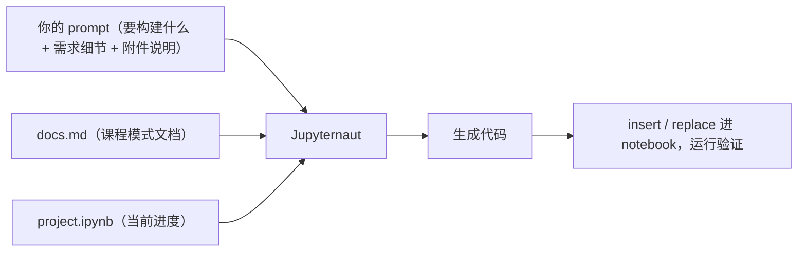

# L7 · 动手项目：用 Jupyter AI 自建沙箱 Coding Agent（+ 全课收官）

> 课程：Building Coding Agents with Tool Execution（DeepLearning.AI × E2B）
> 本课任务：收官项目——用全课所学**从零构建一个 coding agent 并部署进沙箱**。可以做数据分析应用、简单 web app，或任何你想做的东西；项目环境内置 Jupyter AI 助手 + 课程文档，走"三步法"完成。（本篇以字幕描述的项目要求为准，项目代码不在本地素材中。）

## 0. 项目定位：从"跟课"到"自己造"

讲师的开场定调："Building is an important part of the learning process"。这个项目的价值主张有三层：

1. **练习**：为构建 sandbox agent 积累实战手感——课程演示看十遍不如自己跑一遍；
2. **自由度**：可照着示例做数据分析应用或小计算器 web app，也可以完全自选题目（"whatever moves you"）；
3. **作品集**：鼓励把成果上传到自己的公开 GitHub repo，作为 agentic 工作的展示——对求职建 portfolio 是"a very good idea"。

## 1. 项目环境：JupyterLab + Jupyter AI

项目页面和 DeepLearning.AI 其他课程不同：打开即进入 **JupyterLab**，右侧是项目 notebook（`project.ipynb`），左侧面板可浏览项目文件、打开聊天。

环境预装了 **Jupyter AI**——在 JupyterLab 里做 AI 辅助编程的框架。点聊天图标 → 点加号，即可与聊天机器人 **Jupyternaut** 对话（本项目后端跑的是 OpenAI 模型）：

| 能力 | 操作 |
|---|---|
| 对话 | 像用 Claude/Gemini/ChatGPT 一样直接聊 |
| 代码插入 | 聊天里生成代码后，点 **insert below active cell** 插入 notebook 新 cell |
| 代码替换 | 选中目标 cell，点 **Replace selection** 用生成代码覆盖 |
| 附加上下文 | 回形针图标附加文件（`docs.md`、`project.ipynb`）作为对话上下文 |

讲师类比：用法与 Cursor / Windsurf / Antigravity 里的 AI chat 相似；没用过也没关系，流程会演示。（Jupyter AI 本身另有一门与 Jupyter 的 Brian Granger 合作的短课可深入。）

> **对比 0-action-paradigm**：注意这里的分工——**Jupyternaut 是 copilot（人在环内的代码建议者），你要构建的才是 agent（自主跑 loop 的执行者）**。Jupyternaut 只生成代码，插入、运行、验证全由人点按钮；而你写出来的 coding agent 拿到任务后自己决定调哪个工具、自己执行、自己看结果迭代。用 copilot 造 agent，一次项目同时体验行动范式的两端，边界感恰恰是这门项目课的隐藏教学点。

## 2. `docs.md`：把课程知识变成可附加的上下文

项目文件里有一份 `docs.md`（可用 Markdown Preview 打开）：**全课内容的浓缩文档**——OpenAI Client 设置、创建 sandbox、给 agent 配工具、课程中出现的常用模式等基础要点。

它的用法是这门项目的方法论核心：**把 `docs.md` + `project.ipynb` 作为每次任务的附件上下文喂给 Jupyternaut**，让助手基于"这门课教过的写法"生成代码，而不是凭空发挥。

notebook 顶部有 introduction 和 instructions，给出可跟做的示例（完整数据分析 agent、小计算器 web app），每个构建步骤处也留有"课程里怎么实现的"提醒上下文。

> **架构师视角**：`docs.md` 是**给 AI 助手准备的项目级知识文件**——和 Claude Code 的 CLAUDE.md、Cursor 的 rules 是同一物种：把"这个项目该用什么模式写代码"沉淀成一份随任务附加的稳定上下文，AI 生成质量的方差立刻收窄。可迁移的判断：让 AI 助手参与任何项目前，先花时间写这份文档，比事后逐条纠正生成结果便宜得多；而且它和 L6 的 SYSTEM_PROMPT_WEB_DEV 一样，本质都是"显式化隐性知识"，只是一个喂给 copilot、一个喂给 agent。

## 3. 三步构建法

项目结构与课程主线严格同构，三步走：

| 步骤 | 内容 | 对应课程 |
|---|---|---|
| ① 定义工具 | 写 tool schema + 工具执行的函数定义 | L2 / L6 |
| ② 实现 agent loop | 模型调用 → function_call → 执行 → 回填 → 循环 | L2 |
| ③ 部署进沙箱 | 创建 E2B sandbox，让代码在云端执行 | L4 / L5 / L6 |

每一步的做法相同：**在 notebook 找到对应小节 → 复制/改写示例 prompt（数据分析 agent 和 calculator agent 各有一条现成的）→ 附上 `docs.md` 和 `project.ipynb` → 发给 Jupyternaut → 把生成代码 Replace 进目标 cell → 运行**。

示例 prompt 的结构也值得留意（讲师拆解过）：开头声明"你在协助什么"，然后是**要构建之物的需求细节**，最后说明将附加哪些文件作上下文——一份朴素但完整的任务规格书。

课程视频只演示到第一步完成（"I've got my tools defined"），第二、三步刻意不剧透（"I don't want to spoil the whole project"），照同样流程走完即可。

## 4. 实践建议

- 提供的工具可以**原样用、改造用、或者完全弃掉自己造**——三档自由度自己选；
- 做完把项目传上公开 GitHub repo，展示给他人 / 加入个人作品集；
- 核心信条重复一遍：**动手构建本身就是学习过程的重要部分**。

## 全课收官

### Conclusion 要点

结语只有四句，但把全课主线压缩得很准：这门课教会你 coding agent 如何**思考（think）、行动（act）、并在沙箱环境中安全地执行代码（execute code safely inside sandbox environments）**——从单个代码片段一路到完整 web 应用。"We can't wait to see what you build next."

### L1–L7 全课回顾

| 课 | 一句话 |
|---|---|
| L1 | Coding agent = LLM 在 loop 里带上下文调工具；写代码类任务需要代码执行、文件系统、长会话与更强安全 |
| L2 | 本地从零实现最小 agent loop：tool schema → function_call → 执行 → 结果回填 → 循环至无工具调用 |
| L3 | 执行环境对比：直接本地执行 / 容器 / 云沙箱在隔离性、开销、能力上的取舍 |
| L4 | E2B 云沙箱上手：创建沙箱、run_code、文件操作、生命周期管理，agent 的代码执行搬进云端隔离环境 |
| L5 | 数据分析 agent：沙箱里跑数据处理与图表生成，配 Gradio UI 形成可交互产品 |
| L6 | 全栈 agent：6 个文件系统工具 + web dev 重系统提示词 + Runtime Summary 运行时上下文压缩，生成完整 Next.js 应用 |
| L7 | 动手项目：Jupyter AI（Jupyternaut）辅助下，按"定义工具 → agent loop → 部署沙箱"三步法自建一个 coding agent |

> **架构师的裁决**：**什么场景该给 agent 配代码执行沙箱？** 判据一条：任务是否需要"生成代码 → 运行 → 看结果 → 修正"的验证闭环。数据分析、代码生成、web app 搭建、批量文件加工都属于此类——LLM 生成的代码永远该当作**不可信输入**，只要它要被执行，隔离就不是可选项而是前提（L1 就点明了 security 这层需求）。反之，纯检索、纯文本生成、只调受控 API 的 agent，配沙箱是过度设计。**本地 vs 云沙箱怎么选？** 四个维度：① *隔离强度与爆炸半径*——本地 subprocess 几乎零隔离，Docker 共享内核，云沙箱（E2B 类 microVM）隔离最强，多租户产品直接淘汰前两者；② *环境供给*——需要预置运行时（L6 的 Next.js 模板）、长会话、按用户并发扩缩时，云沙箱的模板 + 按需创建机制是本地方案要自己造的基础设施；③ *数据边界*——数据不能出域（合规/敏感数据）时反向裁决，只能本地/私有化容器；④ *成本与延迟*——单用户内部工具、低频调用、可信代码来源，本地 Docker 够用且省钱。一句话：**面向外部用户的产品化 coding agent 上云沙箱，个人/内网工具视数据边界选本地容器**——L3 的对比表是这条裁决的展开版。

## 本课总结

| 要点 | 一句话 |
|---|---|
| 项目目标 | 自建 coding agent 并部署进沙箱：数据分析 / web app / 自选题 |
| 环境 | JupyterLab + Jupyter AI，Jupyternaut（OpenAI 后端）做 copilot |
| 上下文方法论 | 每个任务都附加 docs.md + project.ipynb，让生成代码贴合课程模式 |
| 三步法 | ① 工具（schema + 函数）② agent loop ③ 沙箱部署，与课程主线同构 |
| 工作流 | prompt → Jupyternaut 生成 → insert/replace 进 cell → 运行验证 |
| 产出去向 | 上传公开 GitHub repo，纳入个人 portfolio |

## 与我的资产映射

- 行动范式：`agent/skills/agent-selection/0-action-paradigm.md`（copilot vs autonomous agent 的分工边界，本项目同时用到两者）
- 沙箱/执行层裁决：`agent/skills/agent-selection/4-tools.md`（代码执行工具）与 L3/L4 笔记的环境对比，对应上面"架构师的裁决"
- 上下文工程：`docs.md` 模式 ↔ CLAUDE.md / rules 文件——项目级知识文件是 AI 辅助开发的第一笔投资
- 面试包：`agent/interview/jd-senior-agent-engineer/`（"如何安全执行 LLM 生成的代码"是高频考点，本课 L3-L6 是完整答案素材）
- [[project_selection_matrix]]、[[project_asset_reuse]]
