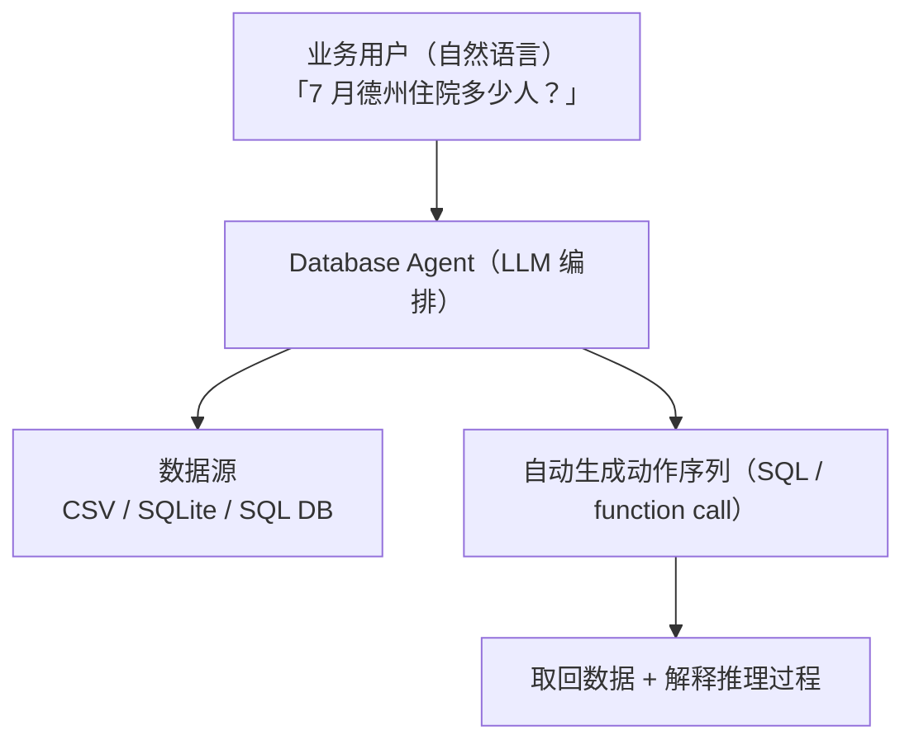
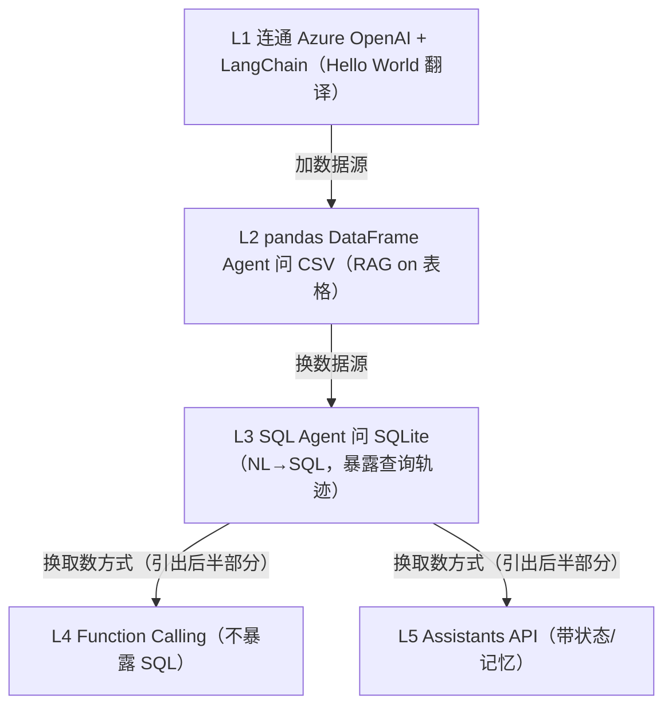

# L0 · 课程介绍：Building Your Own Database Agent

> 课程：Building Your Own Database Agent（DeepLearning.AI × Microsoft）
> 讲师：Adrian Gonzalez Sanchez（Microsoft Data & AI 专家、Azure OpenAI O'Reilly 书作者）
> 一句话定位：用 LLM 作为数据库之上的"提取层（extraction layer）"，让业务用户用自然语言问数据，Agent 自动把问题翻译成一串动作（function calls / SQL）取回结果。

## 这门课在解决什么问题

传统链路里，一个业务问题要落到数据上，往往要经过"业务用户 → 数据分析师 → 手写 SQL → 数据库"。瓶颈在中间那个会写查询语言的人。这门课要做的，是把这个中间层换成一个 **database agent**：

讲师把这件事称为 **data democratization（数据平民化）**：用户不需要学 SQL，不管底层是什么数据库提供商、什么数据模型、什么类型语言，都能问。

## 五个交付能力（课程主线）

| # | 能力 | 对应正课 |
|---|---|---|
| 1 | 部署 LLM 搭第一个 AI Agent | L1（本笔记 L1，字幕 02） |
| 2 | 对表格数据做 RAG | L2（CSV，字幕 03） |
| 3 | 开发自己的 database agent | L3（SQLite + NL→SQL，字幕 04） |
| 4 | 构建 function calling 系统 | L4（字幕 05，后半部分） |
| 5 | 集成 Azure OpenAI Assistants API | L5（字幕 06，后半部分） |

技术栈固定为 **Azure OpenAI（GPT-4）+ LangChain agents 框架**。讲师强调：虽然全程用 database agent 当贯穿案例，但这些组件（部署、RAG、function calling、Assistants API）对搭任何 Agent 都通用。

## 两条知识定制路线（贯穿全课的取舍）

课程开篇就把"如何把企业私有知识灌进 LLM"归成两条路，本课选前者：

| 路线 | 做法 | 代价 | 本课是否采用 |
|---|---|---|---|
| **RAG（检索增强）** | 用编排工具（LangChain）把模型连到数据源，不改模型 | 低，换模型无痛 | ✅ 全课采用 |
| **Fine-tuning（微调）** | 在特定数据集上重训模型再重新部署 | 高，资源密集、运维复杂，能产出 IP 但少见 | ❌ 仅提及 |

RAG 的核心优势是**灵活**：未来换模型或升级模型，用同一套连接机制即可无缝接入，数据基础设施不动。

> **架构师视角**：这门课的真正主张不是"教你写 NL→SQL"，而是"**把 LLM 当成数据库前面的一层可替换适配器**"。选 RAG 而非 fine-tuning，本质是把"易变的模型"和"稳定的数据接入"解耦——模型是消耗品、会迭代，数据连接机制才是要沉淀的资产。这与选型矩阵里"模型层可替换、检索/工具层要稳定"的分层思路一致。

> **对比 Snowflake《Building and Evaluating Data Agents》**：两门课同为 data agent，但侧重点互补。本课（Microsoft）重"怎么搭"——Azure OpenAI + LangChain 把管道搭起来，从 CSV 一路演进到 SQL、function calling、Assistants API；Snowflake 那门重"怎么评"——data agent 建好后如何度量它答得对不对。搭 + 评才是生产级 data agent 的完整闭环，学的时候建议对照着看。

## 课程节奏

讲师采用"每课加一个组件、代码一小段一小段跑"的渐进方式，绝不一次实现全部（"We cannot implement everything all at once"）。前半部分（本批笔记 L0–L3）路径为：

## 与我的资产映射

- 检索层：`agent/skills/agent-selection/3-retrieval.md`（RAG vs fine-tuning 的路线取舍，本课是"结构化数据 RAG"的实例）
- 工具层：`agent/skills/agent-selection/4-tools.md`（L4 function calling、L5 Assistants API 的前置概念）
- 对照课程：Snowflake《Building and Evaluating Data Agents》（同为 data agent，评测视角）
- [[project_selection_matrix]]
