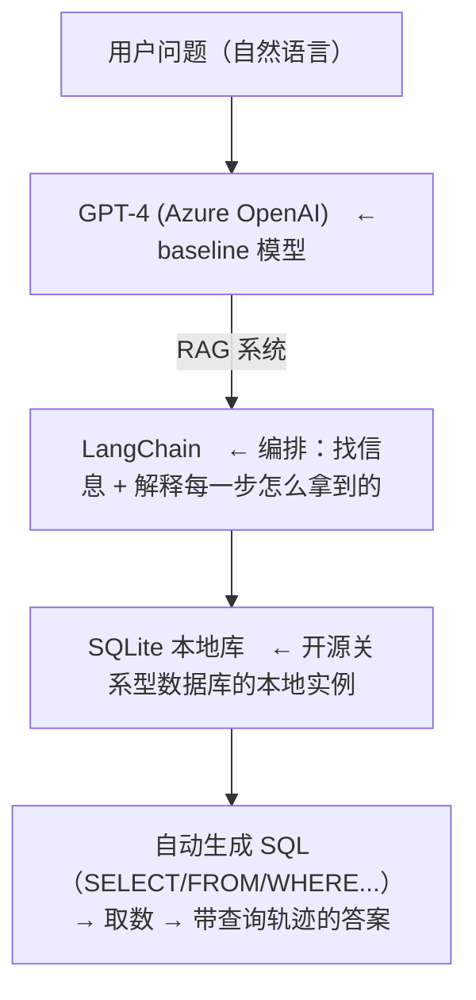

# L3 · 连接 SQL 数据库：SQL Agent 把自然语言翻译成 SQL

> 课程：Building Your Own Database Agent（DeepLearning.AI × Microsoft）· Lesson 3
> 本课任务：把 L2 的 CSV 灌进本地 **SQLite** 数据库，换成 LangChain 的 **SQL agent + SQLDatabaseToolkit**，让 GenAI 把自然语言翻译成 SQL 去查库，并把生成的查询轨迹显式暴露出来。

## 1. 架构：只换数据源，管道不变

L3 是 L2 的"自然演进"——目标从"问 CSV"变成"问真正的数据库"。整体架构：



讲师强调：**过程不变，只是把 CSV 换成 SQL 数据库**。真实应用里结果可接入 Web/移动端等任意平台，还能混合图像、data lake、数据库多源，RAG 负责从合适的源高效定位信息。

> **架构师视角**：L1→L2→L3 三课其实在演示一个关键的架构性质——**取数后端可插拔**。用户接口（自然语言 + `invoke`）和编排层（LangChain agent + prefix/suffix 模式）保持稳定，被替换的只有最底层的数据适配器（模型知识 → DataFrame → SQL DB）。这就是 L0 讲的"LLM 当可替换适配器层"落到了实处：稳定的是接口与编排，易变的是后端。设计 data agent 时应当照此**沿这条接缝解耦**，让换库、换模型都不惊动上层。

## 2. 把 CSV 灌进 SQLite

本课的数据准备：先取回 L2 那份 CSV，用 SQLAlchemy 建引擎，再 `to_sql` 写进 SQLite 文件。（若你的数据本就在 SQL 库里则跳过这步——灌 CSV 只是为教学。）

```python
from sqlalchemy import create_engine
import pandas as pd

# SQLite 只需一个文件路径即可作为数据库
database_file_path = "./db/test.db"
engine = create_engine(f'sqlite:///{database_file_path}')   # 建立引擎

df = pd.read_csv("./data/all-states-history.csv").fillna(value=0)

# 关键差异（相对 L2）：把 DataFrame 用 to_sql 写进库
df.to_sql(
    'all_states_history',
    con=engine,
    if_exists='replace',   # 已存在就整表替换（非增量，第二次跑直接覆盖）
    index=False
)
```

`if_exists='replace'` 表示非增量、每次整表替换——教学场景下重复跑不会叠加脏数据。

## 3. SQL Agent 的 Prefix：角色声明 + 安全护栏

相比 L2 的通用文本 prefix，SQL agent 的 prefix 升级成一套**专业模板**——声明角色、带方言/条数占位符、加一串安全约束：

```python
MSSQL_AGENT_PREFIX = """
You are an agent designed to interact with a SQL database.
## Instructions:
- 给定问题，先生成语法正确的 {dialect} 查询再执行、看结果、回答
- 除非用户指定条数，**总是** limit 到最多 {top_k} 条
- 只查相关列，绝不 SELECT 所有列
- 执行前必须 double check；报错就改写查询重试
- **禁止任何 DML（INSERT / UPDATE / DELETE / DROP 等）**   # 只读护栏
- **禁止编造答案或用先验知识，只用你算出的结果**
- 回答用 Markdown；但 "Action Input" 里的 SQL 不要加 markdown 反引号
- **总是** 在 "Explanation:" 段解释怎么得到答案，并把 SQL 查询包含进去
- 若问题与数据库无关，直接回答 "I don't know"
- 只用下方工具、只用工具返回的信息，绝不编造表名
## Tools:
"""
```

关键护栏逐条对应生产风险：

| 护栏 | 防的风险 |
|---|---|
| 禁 DML | 防 Agent 改/删库（只读） |
| `{top_k}` limit | 防大表全量拉取拖垮库 |
| 只查相关列 | 控开销、控泄露 |
| 执行前 double check + 报错重试 | 提高查询正确率 |
| 禁编造表名、只用工具返回 | 防幻觉出不存在的 schema |
| Explanation 段含 SQL | 可解释 + 可教学 |

> **对比 4-tools.md 的工具护栏**：SQL agent 的 prefix 本质是**给"执行 SQL"这个工具套一圈 policy**——只读、限量、禁幻觉表名，和工具选型里"给危险工具加权限边界/审批"是同一思想，只不过这里用自然语言 prompt 表达而非代码校验。局限也在此：prompt 护栏是"软约束"，模型仍可能违背，生产里 DML 禁止这类硬约束应在数据库连接层（只读账号）再兜一道，而不是只靠 prompt。

## 4. Format Instructions：ReAct 格式 + Few-shot 范例

除 prefix 外，还给一段 **format instructions** 规定输出结构（经典 ReAct 循环），并附一个完整 few-shot 范例教模型照做：

```python
MSSQL_AGENT_FORMAT_INSTRUCTIONS = """
## Use the following format:
Question: 输入问题
Thought: 总是先想该做什么
Action: 采取的动作，取值 [{tool_names}]
Action Input: 动作的输入
Observation: 动作的结果
...（Thought/Action/Action Input/Observation 可重复 N 次）
Thought: I now know the final answer.
Final Answer: 最终答案

Example of Final Answer:   # ← few-shot：给个真实样例让模型对齐格式
Action: query_sql_db
Action Input: SELECT TOP (10) [death] FROM covidtracking WHERE state = 'TX' AND date LIKE '2020%'
Observation: [(27437.0,), (27088.0,), ...]
Thought: I now know the final answer
Final Answer: There were 27437 people who died of covid in Texas in 2020.
Explanation: 我查了 covidtracking 表的 death 列，state='TX' 且 date 以 '2020' 开头 ...
"""
```

format instructions 让答案里既有自然语言结论，又带 `Action Input` 里的真实 SQL——"用自然语言问，但仍拿得到查询本身"。讲师点出这对**公司内学习场景**特别有用：用户既用数据、又能顺便学 SQL 怎么写。

## 5. 组装 SQL Agent 并调用

把模型、数据库工具包、prefix、format 组装成 SQL agent：

```python
from langchain.agents import create_sql_agent
from langchain.agents.agent_toolkits import SQLDatabaseToolkit
from langchain.sql_database import SQLDatabase

llm = AzureChatOpenAI(
    openai_api_version="2023-05-15",
    azure_deployment="gpt-4-1106",
    azure_endpoint=os.getenv("AZURE_OPENAI_ENDPOINT"),
    temperature=0,       # 取数任务要确定性，温度归零
    max_tokens=500,
)

db = SQLDatabase.from_uri(f'sqlite:///{database_file_path}')
toolkit = SQLDatabaseToolkit(db=db, llm=llm)   # 把 LLM 与数据库组合成工具包

QUESTION = """How many patients were hospitalized during October 2020
in New York, and nationwide as the total of all states?
Use the hospitalizedIncrease column"""

# 组装 agent：prefix 定角色与护栏，format_instructions 定输出，top_k 限条数
agent_executor_SQL = create_sql_agent(
    prefix=MSSQL_AGENT_PREFIX,
    format_instructions=MSSQL_AGENT_FORMAT_INSTRUCTIONS,
    llm=llm,
    toolkit=toolkit,
    top_k=30,
    verbose=True,
)

agent_executor_SQL.invoke(QUESTION)   # 入口仍是 invoke
```

注意组装完还没 trace——因为还没发消息；`invoke` 后 Agent 才真正跑起来。`temperature=0` 是取数任务的标配：要可复现、不要创造性。

## 6. 一次真实查询的轨迹

问"2020 年 10 月纽约 + 全国住院人数"，trace 里能看到 Agent 自动生成 `SELECT ... FROM ... WHERE ...`——它自己定位该查哪些列、哪些值。结果：

- **纽约 = 0**（该时段无新增住院记录）
- **全国合计 = 53**

和 L2 的德州=0 同理：Agent 按库里数据如实回答。讲师确认这是正确答案（他事先核对过文件）。整个 SELECT/FROM/WHERE 本来要人手写，现在被 Agent 自动化了。

## 本课总结

| 要点 | 一句话 |
|---|---|
| 架构可插拔 | 只把 CSV 换成 SQLite，用户接口与编排层不变 |
| 灌数据 | `df.to_sql(..., if_exists='replace')` 把 CSV 写进 SQLite |
| SQL prefix | 角色声明 + `{dialect}`/`{top_k}` 占位 + 禁 DML/禁幻觉表名等护栏 |
| format instructions | ReAct 格式 + few-shot 范例，输出带真实 SQL |
| 组装 | `create_sql_agent(prefix, format_instructions, llm, toolkit, top_k)` |
| temperature=0 | 取数任务要确定性 |

> **记忆点（引出 L4）**：L3 的 SQL agent 好处是**把 SQL 显式暴露**（能教学、可审计），但反过来也意味着查询逻辑跑在 prompt 层、SQL 直接进入 LLM 的输入输出。L4 引入 Azure OpenAI 的 **function calling**：改用预建函数把查询发往数据库，**不再把 SQL 暴露给代码**——作为另一种 grounding 方法改进 SQL agent 的设计，把"要不要暴露查询"变成一个可选的架构决策。

## 与我的资产映射

- 工具层：`agent/skills/agent-selection/4-tools.md`（SQL prefix 护栏 = 给"执行 SQL"工具套 policy；prompt 软约束 vs 连接层硬约束的取舍）
- 检索层：`agent/skills/agent-selection/3-retrieval.md`（结构化数据 RAG 的 SQL 实例，NL→SQL）
- 后续对照：本课 07b function-calling 相关内容（L4 的 function calling 是同一取数任务的另一种实现）
- 对照课程：Snowflake《Building and Evaluating Data Agents》（NL→SQL 的正确率需评测度量）
- [[project_selection_matrix]]
