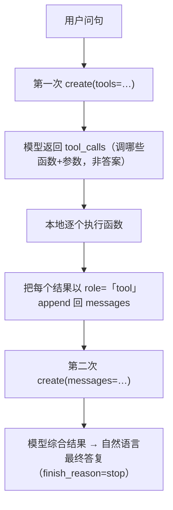

# L4 · 用 Function Calling 把 SQL 封进确定性函数（Azure OpenAI · tools）

> 课程：Building Your Own Database Agent（DeepLearning.AI × Microsoft）
> 本课任务：把上一课"LangChain SQL agent 现场生成并执行 SQL"的做法，换成 Azure OpenAI 的 **function calling**——查询被预先封装进 Python 函数，模型只负责识别意图、填参数，**不再暴露 SQL 翻译过程**，换来更强的确定性与可控性。

## 0. 从 L3 衔接过来：为什么已经能跑还要换

L3 里 LangChain SQL agent 已经能把自然语言问句翻译成 SQL、连 SQLite 跑出正确答案（老师"检查过数据、确认答案正确"）。那为什么还要 function calling？

字幕里讲师自己把这个疑问抛了两遍："if our agent is already working great and fetching the information correctly, what's the additional value?" 答案是一句话：**把不可控的"现场翻译 SQL"换成可控的"调用预置函数"**。

作为开发者，你想掌握并采纳所有可能的 grounding（接地）方法。function calling 就是改进 SQL agent 设计的又一种 grounding 手段，它带来三样东西：

| 能力 | 含义 |
|---|---|
| 指定优先查询类型 | 给系统具体指令：某类问题走哪个函数 |
| 控制结果格式 | 拿到你需要的检索结果与格式 |
| **确定性行为** | queries 被封装进 functions，结构化、可预测，过程可精确控制 |

> **架构师视角**：L3 的 LangChain agent 把 SQL 生成权交给了 LLM——灵活，但你无法预知它会拼出什么查询；function calling 反过来，把查询写死在人工审校过的函数里，LLM 只被降级为"路由器 + 填空器"。这是 agent 设计里一条根本轴线：**把多少自由度留给模型**。自由度越大越灵活、越难保障；越小越可控、越受限于预置能力。

## 1. 先用天气例子讲清"两步走"机制

正式接数据库前，先用一个玩具函数 `get_current_weather` 把机制讲透。

### 1.1 准备：一个普通 Python 函数

```python
def get_current_weather(location, unit="fahrenheit"):
    """按城市返回当前天气；不指定单位时默认华氏"""
    if "new york" in location.lower():
        return json.dumps({"location": "New York", "temperature": "40", "unit": unit})
    elif "san francisco" in location.lower():
        return json.dumps({"location": "San Francisco", "temperature": "50", "unit": unit})
    # ... 其它城市 ...
    else:
        return json.dumps({"location": location, "temperature": "unknown"})
```

这就是个普通函数，**没有任何魔法**——直接调用它不涉及自然语言。

### 1.2 用 `tools` 把函数"教"给模型

关键在于用一份 JSON schema 向 chat completion 引擎描述这个函数：叫什么、干什么、要哪些参数、哪些必填。

```python
messages = [{"role": "user",
             "content": "What's the weather like in San Francisco, New York, and Las Vegas?"}]

tools = [{
    "type": "function",
    "function": {
        "name": "get_current_weather",
        "description": "Get the current weather in a given location...",  # 描述=模型判断何时调用它的依据
        "parameters": {
            "type": "object",
            "properties": {
                "location": {"type": "string", "description": "城市和州，如 San Francisco, CA"},
                "unit": {"type": "string", "enum": ["fahrenheit", "celsius"], "default": "fahrenheit"},
            },
            "required": ["location"],   # 必填参数
        },
    },
}]
```

字幕里讲师的原话点破了 tools 的本质：**"tools 只是向 chat completion 引擎解释——我们在用这些工具，而它们背后依赖已有的函数。"** 现在只有 1 个函数，真实系统里会有 10 个、20 个不同行为、不同结果的函数，模型据 prompt 选其一。

### 1.3 第一步：模型决定"调谁、怎么调"

```python
response = client.chat.completions.create(
    model="gpt-4-1106", messages=messages,
    tools=tools, tool_choice="auto",   # auto=让模型自己决定要不要调、调哪个
)
tool_calls = response.choices[0].message.tool_calls
```

问句里有三个城市 → 模型对**同一个函数发起了三次调用**（不同 location 参数）。但注意：**这一步只拿到"要调用哪些函数、参数是什么"，还不是答案**——如同 L3 的 LangChain agent 会把思考过程打印出来，这里的 `tool_calls` 就是系统的"内心独白"。

### 1.4 第二步：真正执行函数，把结果喂回去要答案

```python
available_functions = {"get_current_weather": get_current_weather}
messages.append(response_message)                       # 先把模型那条"我要调工具"的消息接回上下文

for tool_call in tool_calls:                            # 逐个执行模型点名的调用
    fn = available_functions[tool_call.function.name]
    args = json.loads(tool_call.function.arguments)     # 模型填好的参数（JSON 字符串）
    result = fn(location=args.get("location"), unit=args.get("unit"))
    messages.append({                                   # 以 role="tool" 把结果塞回对话
        "tool_call_id": tool_call.id, "role": "tool",
        "name": tool_call.function.name, "content": result,
    })

second_response = client.chat.completions.create(       # 第二次调用 → 生成自然语言最终答复
    model="gpt-4-1106", messages=messages)
```

两步流程一句话：**第一次问模型"该用什么工具"，你在本地执行工具、把结果拼回消息，第二次再问模型"根据这些结果给我最终答案"。** 最终得到 "The current weather in San Francisco is 50 degrees"。返回里 `finish_reason` = `stop`（请求完成；另一种可能是命中 content safety 过滤器，如仇恨、暴力）。



> **对比 07b Function-calling and data extraction with LLMs**：07b 那门课把 function calling 当作"结构化抽取"的通用范式来讲（让 LLM 吐出符合 schema 的参数）；本课是它在**数据库场景的落地**——参数 schema 不再是抽取目标，而是"查哪个州、哪一天"的查询键。同一机制，两种用途：07b 用它把非结构化文本变结构化，本课用它把自然语言变成对确定性查询函数的调用。面试包 `08-foundations-function-calling-and-rag.md` 是这条线的复习素材。

## 2. 把机制接到 SQL 数据库

天气只是热身。现在把同样的两步机制接到 L3 用过的 Covid 数据（`all-states-history.csv` → SQLite）。

### 2.1 重建数据（沿用 L3）

```python
df = pd.read_csv("./data/all-states-history.csv").fillna(value=0)
engine = create_engine("sqlite:///./db/test.db")
df.to_sql("all_states_history", con=engine, if_exists="replace", index=False)
```

### 2.2 把 SQL 封进两个参数化函数

不再让模型现场写 SQL，而是人工写好两个函数，**SQL 模板固定、只留参数口子**：

```python
def get_hospitalized_increase_for_state_on_date(state_abbr, specific_date):
    query = text(f"""
        SELECT date, hospitalizedIncrease FROM all_states_history
        WHERE state = '{state_abbr}' AND date = '{specific_date}';
    """)                                        # SQL 写死在函数里，模型碰不到
    with engine.connect() as conn:
        result = pd.read_sql_query(query, conn)
    return result.to_dict("records")[0] if not result.empty else np.nan

def get_positive_cases_for_state_on_date(state_abbr, specific_date):
    # 结构同上，只是 SELECT positiveIncrease AS positive_cases
    ...
```

直接调 `get_hospitalized_increase_for_state_on_date("AK", "2021-03-05")` → 阿拉斯加当日新增住院 3 人。讲师强调："there is no magic on this，只是直接调函数，还没用到自然语言。"

### 2.3 用两个函数教会 agent 选路

`tools_sql` 里放**两个** function 定义（住院数 / 阳性数），参数都是 `state_abbr` + `specific_date`（均 required）。然后同样两步走：

```python
messages = [{"role": "user", "content": "how many hospitalized people we had in Alaska the 2021-03-05?"}]

# 第一步：模型识别意图 → 从两个函数里选一个 + 填参数
response = client.chat.completions.create(
    model="gpt-4-1106", messages=messages, tools=tools_sql, tool_choice="auto")

# 第二步：本地执行选中的函数、结果喂回 → 第二次 create 拿最终答案
```

讲师点出多函数下的关键行为：**"这不是你去调用某一个，而是你只管问问题，agent 内部自己决定走住院函数还是阳性函数。"** 最终答复："On March 5th 2021, there were three additional hospitalizations due to Covid-19 reported in Alaska"，`finish_reason=stop`，所有 content safety 过滤器为 false。

> **对比 4-tools.md（工具层选型）**：本课只有 2 个函数，模型选路毫无压力；但讲师明说真实系统会有"10、20 个不同函数"。一旦工具规模上去，`tools=[...]` 全量塞进 prompt 会遇到 4-tools.md 讲的"工具爆炸"——上下文膨胀、选错工具率上升。本课的做法是工具层的**最朴素形态**（静态全量清单 + `tool_choice="auto"`）；生产上要叠工具检索/网关/分组，才撑得住规模。这正是我资产里 `4-tools.md` 与面试包 `02-tool-gateway` 的分界起点。

## 本课总结

| 要点 | 一句话 |
|---|---|
| 换范式动机 | 从"LLM 现场生成 SQL"换成"LLM 调预置函数"，为了确定性与可控 |
| 两步走机制 | ① create(tools) 出 tool_calls（选函数+填参）；② 本地执行、结果喂回，二次 create 出答案 |
| tools schema | JSON 描述 name/description/parameters/required，是模型选路与填参的唯一依据 |
| SQL 封装 | SQL 模板写死在函数里，模型只填 state/date，SQL 不再暴露 |
| 多函数选路 | 放多个 function，`tool_choice="auto"` 让 agent 自己按意图选 |
| 完成信号 | `finish_reason=stop`；content safety 过滤器（hate/violence 等）另有信号 |

> **记忆点（引出 L5）**：本课的 chat completions 是**无状态**的——每次都要手动把历史 messages 拼全再发。L5 换上 **Assistants API**：它是有状态的演进，用 thread 自动维护对话上下文，还能挂 **Code Interpreter** 让 agent 自己写代码、跑失败了自己迭代。同样的 function calling，换个更"有记忆"的壳。

## 与我的资产映射

- 工具层选型：`agent/skills/agent-selection/4-tools.md`（静态工具清单 vs 工具检索/网关，本课是前者的最小形态）
- 动作范式：`agent/skills/agent-selection/0-action-paradigm.md`（function calling 作为一种 grounding/action 机制）
- 安全护栏：`agent/skills/agent-selection/7-safety-guardrails.md`（封装 SQL = 用确定性函数换掉自由 SQL 生成，是一种输入侧护栏）
- 面试包：`08-foundations-function-calling-and-rag.md`（function calling 基础）、`02-tool-gateway-auth-and-contract.md`（工具规模化）
- 关联课程：`07b-Function-calling and data extraction with LLMs`（同机制的抽取视角）
- [[project_selection_matrix]]
