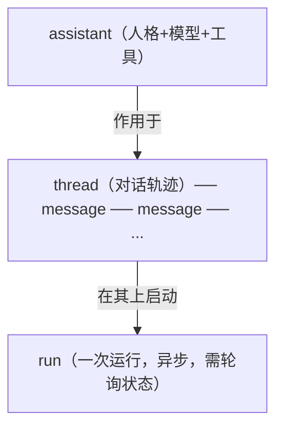

# L5 · 用 Assistants API 做有状态 Agent + Code Interpreter（Azure OpenAI）

> 课程：Building Your Own Database Agent（DeepLearning.AI × Microsoft）
> 本课任务：把 L4 的 chat completions（无状态）升级为 **Assistants API**（有状态）——用 thread 自动维护对话上下文；先用它复刻 L4 的 function calling，再挂上 **Code Interpreter** 让 agent 能自己写 Python、跑失败了自己迭代。这是全课最后一块拼图，凑齐连接 SQL 数据库的多种实现范式。

## 0. 从 L4 衔接：无状态 vs 有状态

L4 用的是 chat completions + GPT-4，**stateless（无状态）**：每一轮都得把完整 messages 历史手动拼好再发。Assistants API 不同——它 **stateful（有状态）**，**动态维护整段对话上下文，自己记住 conversation**。

讲师给的场景锚点是电商："maintaining context across interaction is important"——多轮交互里需要跨轮记住上下文的场景，就该上 Assistants API。

本课在 Assistants API 里做两件事：
1. **复刻 L4 的 function calling**（同样两个 SQL 函数，换成有状态壳）；
2. **新增 Code Interpreter**：让 assistant 能处理 Python 代码，**迭代式运行、改到跑通为止**——"like an environment within your current environment，agent 能改自己的代码去找解"。

> **架构师视角**：chat completions vs Assistants API，本质是"上下文管理放在哪一层"。无状态 API 把上下文管理甩给你（你自己攒 messages、自己截断、自己控 token）；有状态 API 把它收进平台（thread 帮你记）。方便的代价是**上下文策略被平台接管**——你失去了对"记什么、忘什么、怎么压缩"的精细控制。架构师要判断：需要精细上下文工程（裁剪/缓存/召回）时，无状态 + 自管上下文反而更可控；只是想快速搭个多轮 agent，有状态壳更省事。

## 1. Assistants API 的四步骨架

字幕反复强调这是"四步、每次都一样"的固定套路。合并了前几课的配置（endpoint、CSV→SQLite），并从 `Helper.py` 复用 L4 定义的 `tools_sql` 和两个函数。注意 **API version 换成了最新的 `2024-02-15-preview`**（L4 是 `2023-05-15`），因为要用新功能。

```python
from Helper import (get_positive_cases_for_state_on_date,
                    get_hospitalized_increase_for_state_on_date)   # 复用 L4 的函数

client = AzureOpenAI(api_key=..., api_version="2024-02-15-preview", azure_endpoint=...)

# ① 创建 assistant：给指令、选模型、挂工具（就是 L4 的 tools_sql）
assistant = client.beta.assistants.create(
    instructions="You are an assistant answering questions about a Covid dataset.",
    model="gpt-4-1106", tools=Helper.tools_sql)

# ② 创建 thread：一段对话的"轨迹/追踪"，把多条消息关联成一次 user-machine discussion
thread = client.beta.threads.create()          # 返回唯一 thread id + metadata

# ③ 往 thread 里加一条 user 消息
message = client.beta.threads.messages.create(
    thread_id=thread.id, role="user",
    content="how many hospitalized people we had in Alaska the 2021-03-05?")

# ④ 在 thread 上运行 assistant
run = client.beta.threads.runs.create(thread_id=thread.id, assistant_id=assistant.id)
```

四步的关系用一张图：



对象归属很清楚：**message 属于 thread，run 把 assistant 作用到 thread 上**。thread / run 这些对象都是 Assistants API 特有的。

## 2. 在 Assistants API 里做 function calling：轮询 + 提交工具结果

无状态版是"两次 create 一气呵成"；有状态版因为 run 是**异步**的，改成**轮询状态机**。核心：run 跑到 `requires_action` 时，说明模型要你执行工具，你执行完用 `submit_tool_outputs` 把结果交回去。

```python
status = run.status
while status not in ["completed", "cancelled", "expired", "failed"]:   # 终态之外就继续轮询
    time.sleep(5)
    run = client.beta.threads.runs.retrieve(thread_id=thread.id, run_id=run.id)
    status = run.status

    if status == "requires_action":            # 模型点名要调工具了
        available_functions = {
            "get_positive_cases_for_state_on_date": get_positive_cases_for_state_on_date,
            "get_hospitalized_increase_for_state_on_date": get_hospitalized_increase_for_state_on_date,
        }
        tool_outputs = []
        for tc in run.required_action.submit_tool_outputs.tool_calls:
            fn = available_functions[tc.function.name]
            args = json.loads(tc.function.arguments)
            resp = fn(state_abbr=args.get("state_abbr"), specific_date=args.get("specific_date"))
            tool_outputs.append({"tool_call_id": tc.id, "output": str(resp)})

        run = client.beta.threads.runs.submit_tool_outputs(    # 把工具结果交回 run，让它继续
            thread_id=thread.id, run_id=run.id, tool_outputs=tool_outputs)

messages = client.beta.threads.messages.list(thread_id=thread.id)   # 最终从 thread 取全部消息
```

跑同一个阿拉斯加问句，得到 "there were three hospitalizations for Alaska on the specified date"。逻辑和 L4 完全等价，只是**"手动拼 messages 二次调用" → "轮询 run 状态 + submit_tool_outputs"**。状态机词汇表：

| run.status | 含义 |
|---|---|
| （循环中）| 还在跑，未到终态 |
| `requires_action` | 模型要调工具，等你 submit_tool_outputs |
| `completed` | 完成（终态） |
| `cancelled` / `expired` / `failed` | 取消 / 过期 / 失败（终态） |

## 3. Code Interpreter：给 agent 一个会自我迭代的沙箱

第二个新东西：**Code Interpreter**。它是 OpenAI / Azure OpenAI 提供的**代码沙箱**——"a sandbox within this kind of sandbox"，让系统能智能地为复杂任务跑代码，**代码不好就自己迭代、找到能跑通的路**。

用法：换一种工具类型 `code_interpreter`，并把数据文件上传上去给它用。

```python
# 把 CSV 上传为 assistants 可用的文件
file = client.files.create(file=open("./data/all-states-history.csv", "rb"),
                           purpose="assistants")

# 创建 assistant，工具换成 code_interpreter，并挂上文件
assistant = client.beta.assistants.create(
    instructions="You are an assistant answering questions about a Covid dataset.",
    model="gpt-4-1106",
    tools=[{"type": "code_interpreter"}],      # 不再是 function，而是代码沙箱
    file_ids=[file.id])

thread = client.beta.threads.create()
client.beta.threads.messages.create(thread_id=thread.id, role="user",
    content="how many hospitalized people we had in Alaska the 2021-03-05?")
run = client.beta.threads.runs.create(thread_id=thread.id, assistant_id=assistant.id)

# 同样轮询到终态（这里不需要 submit_tool_outputs：代码在沙箱内部自己跑）
status = run.status
while status not in ["completed", "cancelled", "expired", "failed"]:
    time.sleep(5)
    run = client.beta.threads.runs.retrieve(thread_id=thread.id, run_id=run.id)
    status = run.status
    clear_output(wait=True)
messages = client.beta.threads.messages.list(thread_id=thread.id)
```

**function calling 与 code interpreter 的分工**：

| 维度 | Function Calling | Code Interpreter |
|---|---|---|
| 谁写查询逻辑 | 人预先写死在函数里 | agent 自己现场写 Python |
| 你要不要执行 | 要（本地执行 + submit_tool_outputs） | 不要（沙箱内自动执行） |
| 失败处理 | 函数报错就返回 nan | **自己迭代改代码直到跑通** |
| 确定性 | 高（固定 SQL 模板） | 低（现场生成代码） |
| 数据来源 | 连本地 SQLite | 上传文件到沙箱 |

答案格式与 function calling 版几乎一样（同样从 thread messages 里取），差别只在"住院数是 agent 写代码从上传的 CSV 里算出来的"。

> **对比 10-MCP（Build Rich-Context AI Apps with Anthropic）**：Assistants API 的 thread/run + 内置 code_interpreter 是 **OpenAI 私有的、有状态的工具协议**——工具、上下文、沙箱都绑在一家平台里；MCP 走反方向，把"工具/资源如何暴露给模型"抽成**厂商中立的开放协议**，client 与 server 解耦、工具可跨模型复用。同样是"给模型接工具"，Assistants API 用平台锁定换开箱即用，MCP 用协议标准换可移植性。架构师选型：单一 Azure 栈、要快 → Assistants API；多模型/多供应商、要不被锁 → MCP。面试包 `03-mcp-gateway-and-protocol.md` 是这条对比线的复习点。

## 本课总结

| 要点 | 一句话 |
|---|---|
| 有状态升级 | Assistants API 用 thread 自动维护对话上下文，chat completions 是无状态 |
| 四步骨架 | create assistant → create thread → add message → run（作用 assistant 于 thread） |
| 异步轮询 | run 是异步的，轮询 status；`requires_action` 时 submit_tool_outputs 交回工具结果 |
| function calling 复用 | 从 Helper.py 复用 L4 的 tools_sql 与函数，逻辑等价、壳不同 |
| Code Interpreter | 代码沙箱，agent 自己写 Python、跑失败自己迭代，需上传文件（file_ids） |
| API 版本 | 用最新 `2024-02-15-preview` 才有这些新能力 |

> **记忆点（引出 L6）**：到这里，连接 SQL 数据库的四种范式已凑齐——LangChain CSV/SQL agent（L2/L3）、Function Calling（L4）、Assistants API + Code Interpreter（L5）。L6 是收官：回看整条学习路径，并把"NL→SQL agent 到底能不能上生产、边界在哪"这个架构问题一次性裁决掉。

## 与我的资产映射

- 记忆层选型：`agent/skills/agent-selection/6-memory.md`（stateful thread = 平台托管的会话记忆 vs 自管上下文）
- 上下文工程：面试包 `05-context-engineering-and-caching.md`（有状态壳意味着上下文策略被平台接管，何时该自管）
- 工具/协议：面试包 `03-mcp-gateway-and-protocol.md`（Assistants API 私有工具协议 vs MCP 开放协议）
- 关联课程：`10-MCP: Build Rich-Context AI Apps with Anthropic`
- 设计模式：`agent/skills/agent-selection/11-design-patterns.md`（run 状态机 / 工具执行回填是通用的 agent loop 形态）
- [[project_selection_matrix]]
