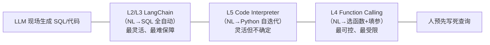

# L6 · 收官：数据库 Agent 的四种范式与生产裁决

> 课程：Building Your Own Database Agent（DeepLearning.AI × Microsoft）
> 本课任务（收官篇）：结语很短——讲师回收全课主线：**生成式 AI + Azure OpenAI service**、**RAG 是高级应用的常态**、用多种方式连接不同的表格型数据源，目标是为终端用户 / 数据分析师 / 业务高管搭一个"你自己的数据库 agent"。本篇把整条学习路径收拢成一张回顾表，并对"NL→SQL agent 能否上生产"做一次架构裁决。

## 0. 结语要点（07 是结语）

字幕全文很短，落在三句话上：

1. **主题**：一次 "AI database agent deep dive"，核心是生成式 AI 与 Azure OpenAI service 的威力；
2. **RAG 是常态**：讲师明确 "RAG patterns are the norm for advanced applications"——本课全程都在做一件事：让 LLM **grounding 到结构化/表格数据**（CSV、SQL），而不是靠模型参数记忆答题；
3. **交付对象**：连接不同表格数据源，为 **end users / data analysts / business executives** 建数据库 agent——让不懂 SQL 的人也能用自然语言问数。

一句话收束全课：**把"找分析师把问题翻成 SQL"这件事，交给 agent 自动完成**（这正是 L1 开篇立的靶）。

> **架构师视角**：这门课的真正价值不在任何单一 API，而在它**并排摆出了四种把 LLM 接到数据库的范式**，且四者是**递进关系**——从"完全交给 LLM 现场生成 SQL"（灵活、难控）一路收紧到"SQL 写死在函数里"（可控、受限），再到"agent 自己写代码迭代"（灵活但不确定）。架构师的工作不是记住哪个 API 怎么调，而是**在这条"自由度 vs 可控性"的光谱上，为具体业务选定位点**。

## 1. 本课总结

| 要点 | 一句话 |
|---|---|
| 全课主线 | 用 Azure OpenAI + RAG 把 LLM grounding 到表格/SQL 数据 |
| RAG 常态 | 高级应用的默认形态：答案来自数据源检索，不靠模型记忆 |
| 四范式递进 | LangChain agent → Function Calling → Assistants API → Code Interpreter，自由度递减/递变 |
| 交付对象 | 让 end users / 分析师 / 高管用自然语言问数，替代人工翻 SQL |

## 全课收官

### ① 结语要点

见上节 0——RAG 是常态、多源表格数据、面向业务人员的自助问数 agent，是本课的三个落点。

### ② 全课回顾表

| 课 | 字幕 | 主题 | 关键机制 | 自由度/可控性 |
|---|---|---|---|---|
| L1 | 02 | 部署 + 第一个 AI agent | Azure OpenAI 实例部署；grounding/RAG 的知识定制层级 | — （打地基） |
| L2 | 03 | CSV 数据 agent | LangChain agent 对 pandas DataFrame 做自然语言查询 | 高自由度：LLM 现场推理 |
| L3 | 04 | SQL 数据库 agent | LangChain SQL agent + SQLite，NL→SQL 现场生成并执行 | 高自由度：SQL 由 LLM 生成 |
| L4 | 05 | **Function Calling** | 两步走：模型选函数填参 → 本地执行回填 → 二次生成；SQL 封进函数 | **收紧**：SQL 写死，LLM 只路由/填参 |
| L5 | 06 | **Assistants API + Code Interpreter** | 有状态 thread/run；function calling 轮询版；代码沙箱自迭代 | 混合：function 可控 / interpreter 又放开 |
| L6 | 07 | 收官 | 回收主线：RAG 常态、多源、面向业务的数据库 agent | — （裁决） |

四范式在"谁生成查询"这条轴上的位置：

> **对比 Building and Evaluating Data Agents（Snowflake data agent）**：本课教你**搭**数据库 agent，但几乎不碰"它答得对不对、怎么系统评估"。Snowflake 那门 data agent 课补的正是这块——把 text-to-SQL 当作可评估系统：用 golden query 集、执行结果比对（execution accuracy）、而非字符串匹配来度量。本课演示"能跑通一个阿拉斯加住院数问句"，Snowflake 视角会追问"200 个真实问句里它对几个、错在哪类"。**Demo 跑通 ≠ 生产可用**，中间隔着一整套 eval——这是本课作为入门课刻意略过、但架构师必须补上的一环（我资产里的 `5-observability-eval.md` / 面试包 `09-eval-driven-development.md`）。

### ③ 架构师的裁决

**问题：NL→SQL agent 能不能上生产？边界在哪？**

裁决：**按"谁用、连什么库、错了后果多大"分层选范式，不存在一个通吃的答案。**

- **LangChain SQL agent（L2/L3，LLM 现场生成 SQL）的生产风险**：
  - SQL 由 LLM 拼出 → **SQL 注入/越权面**、可能生成全表扫描或 JOIN 爆炸的**昂贵查询**、可能改数据（若给了写权限）；
  - 输出不确定，同一问句不同次结果可能不同，**难回归测试**；
  - 适用边界：**内部分析师工具**，且必须配一圈护栏——只读账号、行数/超时限制、表/列白名单、SQL 静态审查、结果脱敏。绝不直接暴露给外部终端用户。

- **Function Calling（L4）的边界**：
  - 优点：SQL 写死、参数受控 → 确定性高、可测、可审计，安全面小；
  - 代价：**只能回答预置函数覆盖的查询形状**，每加一类问法就要工程加一个函数——不灵活、有工程成本；
  - 适用边界：**面向业务用户/高管的高频、已知问法**（"某州某日住院数"这类），用可控性换掉自由度，是生产上最稳的一档。

- **Assistants API + Code Interpreter（L5）的边界**：
  - 有状态 thread 适合多轮场景（如电商），但上下文策略被平台接管，精细上下文工程受限；
  - Code Interpreter 在沙箱里跑任意代码 → 灵活到能处理"没预置函数"的长尾问题，但**非确定、有延迟与成本、结果需校验**；
  - 适用边界：**探索性分析 / 长尾问题**，人在环中复核；不适合无人值守的高可信路径。

**落地建议**：生产系统往往是**混合体**——高频已知问法走 function calling（确定性主干），长尾走受限的 SQL agent 或 code interpreter（探索旁路），全链路套 eval（Snowflake 视角）与护栏（`7-safety-guardrails.md`）。选型的第一性问题永远是那句：**这个查询答错了，谁受影响、损失多大**——后果越重，越往"人预先写死"那端靠。

## 与我的资产映射

- 检索层：`agent/skills/agent-selection/3-retrieval.md`（本课的 RAG-over-tabular 是结构化数据检索的一支）
- 观测·eval：`agent/skills/agent-selection/5-observability-eval.md`（本课缺失的一环：text-to-SQL 的系统化评估）
- 安全护栏：`agent/skills/agent-selection/7-safety-guardrails.md`（自由 SQL 生成的注入/越权/昂贵查询防护）
- 工具层：`agent/skills/agent-selection/4-tools.md`（function calling 的工具规模化）
- 面试包：`08-foundations-function-calling-and-rag.md`、`09-eval-driven-development.md`、`03-mcp-gateway-and-protocol.md`
- 关联课程：`Building and Evaluating Data Agents`（Snowflake，补 eval）、`10-MCP`（补开放工具协议）、`07b-Function-calling and data extraction with LLMs`
- [[project_selection_matrix]]
