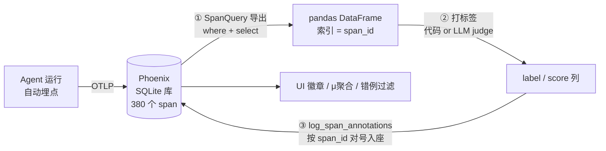

# L7 补充：把 trace 当数据集——SpanQuery 导出与评估回写实操

> L7 正文讲了"导出 → 打标签 → 回写"三步，但"trace 不只是看的"这件事光看 UI 没有体感。
> 本篇是在本地 Phoenix（`evaluating-agent` 项目，380 个 span）上实跑的记录，配套两个可跑脚本：
>
> - `code/L7/demo_span_query.py` —— 同一批 span 的四种查法
> - `code/L7/demo_writeback.py` —— 现场发明一个课程里没有的评估并回写
>
> 运行（注意 `NO_PROXY` 前缀，原因见文末坑记录）：
>
> ```bash
> cd code/L7
> NO_PROXY="localhost,127.0.0.1" no_proxy="localhost,127.0.0.1" ../.venv/bin/python demo_span_query.py
> NO_PROXY="localhost,127.0.0.1" no_proxy="localhost,127.0.0.1" ../.venv/bin/python demo_writeback.py
> ```

## 核心认知：UI 只是数据库的一个只读窗口

Phoenix 把每次 agent 运行拆成 span 存进磁盘 SQLite（本课的库在 `code/.phoenix/phoenix.db`）。UI 走 GraphQL 展示它；而 `SpanQuery` DSL 走 REST API 把它**当数据表查**。评估、实验、监控全部建立在这条程序化读写通道上——这是 Phoenix 区别于普通日志系统的地方。



## 实验 1：同一批 span，换个条件就是另一张表

`demo_span_query.py` 对同一个项目连查四把：

| 查询 | 条件 | 结果 |
|---|---|---|
| ① 全貌 | `span_kind in ('AGENT','CHAIN','LLM','TOOL')` + select `span_kind` | 380 行：CHAIN 166 / LLM 135 / TOOL 55 / AGENT 24 |
| ② 问答对 | `span_kind == 'AGENT'` + select `input.value`, `output.value` | 24 行两列，即 Response Clarity 评估的原料 |
| ③ 画图代码 | `name == 'generate_visualization'` + select `output.value` | 4 行，内容开头就是 `import matplotlib...` |
| ④ SQL 生成 | `span_kind == 'LLM' and 'Generate an SQL query' in input.value` | 31 行 |

这正呼应 L7 正文那句"设计评估最难的一步是过滤出正确的那批 span"——`where` 可组合 span_kind、name、任意属性、字符串包含。

## 关键机制：DataFrame 的索引就是 span_id

导出的 DataFrame 索引是 `context.span_id`（如 `02bff35fa00dc45b`）。**这就是回写不神奇的原因**：每行自带身份证，打完标签把 `label`/`score` 两列交回去，Phoenix 按索引把标签贴回对应 span，全程不需要手写任何匹配逻辑。

```
                  chars    label  score
context.span_id
1f442b466be930d1     75  concise      1
819ea2deee58b887   1117  verbose      0
```

## 实验 2：三步发明一个新评估（Answer Brevity Demo）

`demo_writeback.py` 用纯 pandas（不涉及 LLM）造了一个课程里不存在的评估——回答超 800 字算 verbose：

```python
# ① 导出
q = SpanQuery().where("span_kind == 'AGENT'").select("output.value")
df = client.spans.get_spans_dataframe(query=q, project_name=PROJECT, timeout=120)

# ② 打标签
df["label"] = df["response"].str.len().map(lambda n: "concise" if n < 800 else "verbose")
df["score"] = (df["label"] == "concise").astype(int)

# ③ 回写
client.spans.log_span_annotations_dataframe(
    dataframe=df[["label", "score"]],
    annotation_name="Answer Brevity Demo",
    annotator_kind="CODE",
)
```

实跑结果：21 个 AGENT span，简洁率 0.81；唯一的 verbose 正是"画柱状图"那条 1117 字的长回答。刷新 UI 后每个 AgentRun 的注解徽章从 1 个变 2 个：`Response Clarity` 旁边多了 `Answer Brevity Demo`。

核心代码约 15 行——**写一个新评估器的边际成本就这么低**，这也是为什么 L7 结尾鼓励"给每个部位都配评估器"。

## UI 里注解徽章在哪（新版 Phoenix）

- **Spans/Traces 列表**的 annotations 列：每行的小胶囊（多条时折叠成 `+2`）
- **span 详情面板**：Info 标签下第一行 `Annotations N [徽章...]`，点徽章看 label/score/author 明细
- **项目聚合**：Spans 页右侧 Project Info → Stats → SPAN ANNOTATIONS，显示 `μ 平均分`。注意它**跟随当前过滤条件**——默认 `parent_id is None`（只看根 span）时，挂在子 span 上的评估会显示 `--`，清掉过滤才能看到全部四项
- **错例过滤**：过滤框输入 `annotations['Tool Calling Eval'].label == 'incorrect'` 即可只看 judge 判错的 span
- 徽章只挂在**被评估的那个 span** 上：`Tool Calling Eval` 在 LLM 的 ChatCompletion 上，外层 `router_call`（chain）的 Annotations 是 0

## 坑记录

1. **系统代理截胡 localhost（本次最大坑）**：Mac 开着系统级代理（127.0.0.1:1082）时，Python httpx（phoenix client 底层）会读 **macOS 系统代理设置**（即使 `env | grep proxy` 为空！），把发往 `localhost:6006` 的请求交给代理，全量 503。诊断特征：响应头带 `proxy-connection: close` + Phoenix 服务端日志无请求记录 + UI 一切正常（浏览器有自己的绕行规则，极具迷惑性）。解法：脚本加 `NO_PROXY` 前缀（临时）或在代理工具绕过列表加 localhost（根治）。`main.py` 同样受影响，会随代理开关"时好时坏"。
2. **空条件 SpanQuery 会打挂服务端**：`SpanQuery()` 不带 where 拉全量直接 503/超时，导出永远带过滤条件；全库大了之后（本库 936MB）宽查询还要配大 `timeout` 和窄 `select`。
3. **误判不要急着重启**：503 时先看服务端日志有没有收到请求，再决定是不是服务问题。Phoenix 数据在磁盘 SQLite，重启不丢——但本次的 503 根本不是服务问题。
4. **tool span 的 Info 页渲染 bug**：`generate_visualization` 的详情 Info 标签白屏（React error #31，渲染 tool JSON schema 触发），切 Attributes 标签看原始属性即可，数据无损。
