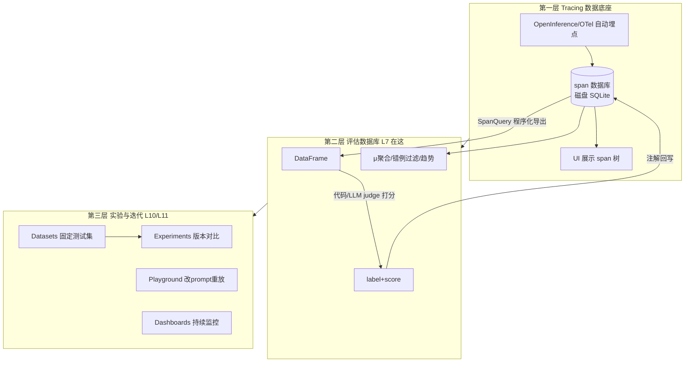

# L7 补充 2：学习路径、错例判读与 Phoenix 定位

> 2026-08-06 结合本地 Phoenix（`evaluating-agent` 项目）实操 L7 的对话沉淀。
> 姊妹篇：《L7-补充-把trace当数据集-SpanQuery导出与评估回写实操》（SpanQuery 四种查法、回写 demo、坑记录）。
> 配套脚本：`code/L7/demo_span_query.py`、`code/L7/demo_writeback.py`。

## L7 的推荐学习路径（五步）

1. **先看"评估前"的裸 trace**：跑评估之前，在 UI 里点开一条 trace 认清 span 树的四类角色——顶层 AGENT（input=问题/output=最终回答）、LLM（Router 决策，`llm.output_messages` 里有 tool_calls）、tool span（如 `generate_visualization`）、SQL 生成类 LLM span。刻意记属性名（`input.value`/`output.value`），**UI 里的属性名 = SpanQuery DSL 里的字符串**，这个对应关系建立了这节课就通了。
2. **跑 `main.py`**：6 个问题产 trace → 四个评估 → 回写。本地版只评当次运行的 span（`start_time=run_started_at`），历史 trace 没注解是正常的。
3. **UI 逐层验证**：项目聚合 μ 值 ↔ 终端打印的正确率对数；单 span 看徽章明细；按注解过滤看错例。
4. **错例判读**（见下文）：先审 judge 再动 agent。
5. **自己加第五个评估**：照 SQL 评估那 20 行模板走一遍"过滤 → 打分 → 回写"，能独立完成说明三步流程内化了（Answer Brevity Demo 即为示例，纯 pandas 约 15 行）。

## 错例判读实战：μ0.74 的真相

Router 的 `Tool Calling Eval` 只有 0.74，过滤 `annotations['Tool Calling Eval'].label == 'incorrect'` 出来 10 条错例，点开第一条：

- 问题 "What was the average transaction value?" 的**第二轮** Router 决策：第一轮已查到 19.018132，第二轮调 `analyze_sales_data(data="...19.018132", prompt=...)`——**行为本身合理**（先查数、再分析）。
- 但 judge 的 rubric 写着"工具参数包含问题中没有的信息就算 incorrect"，`data` 参数里的数字不来自问题本身，于是被判错。

结论：**分数低不是 agent 差，而是 judge 的 rubric 按"单轮问题→单个工具调用"设计，不适配多轮场景。**

由此得出 L7 最重要的一课：**拿到评估分数后，第一件事不是优化 agent，而是抽查错例、先审 judge。** 修法是改 `TOOL_CALLING_PROMPT`（如声明"工具参数可来自对话历史中的工具结果"）再重跑对比 μ 值。

## Phoenix 到底是什么：三层定位

"Phoenix 就是收 trace 然后展示"只说对了地基。它是完整的 LLM 可观测 + 评估平台：

- **UI 只是这个数据库的一个只读窗口（走 GraphQL）**；真正的生产资料是 REST API 这条程序化读写通道，评估、实验、监控全建在它上面。
- 课程标题是 "Evaluating AI Agents" 而不是 "Tracing"——tracing 只是为评估闭环供数。

## 注解回写到底啥意思、起什么作用

**一句话：把"批改结果"钉在"考卷原件"上，而不是记在自己的小本本里。**

不回写时，评估结果只活在脚本内存的 DataFrame 里——脚本退出就没了，顶多 print 一个"正确率 0.74"；分数和证据是断开的，"哪几条错、错时现场什么样"答不上来。回写（`log_span_annotations_dataframe`）把每行 label/score 作为注解记录写进 Phoenix 数据库，靠 DataFrame 索引里的 span_id 挂回当初被评估的那个 span，从此判定与完整现场永久绑定。

绑定解锁四个能力：

1. **从分数下钻到证据**：μ0.74 → 过滤错例 → 看现场 → 定位是 judge rubric 问题。链路每一步都依赖注解和 span 长在一起。
2. **聚合与趋势**：UI 的 μ 值、时间范围质量曲线、Dashboards 都是对注解表的聚合；改 prompt 前后两批数据一对比就知道有没有变好。
3. **单一事实源**：同事打开同一条 trace 看到同样的判定；L9 人工标注（详情页铅笔图标）写进同一张表，机器判与人判并存互校。
4. **喂给下一环**：注解本身可查询——把 incorrect 的 case 攒成 Dataset，之后每版 prompt 跑实验回归对比（L10/L11 的入口）。

反过来记：**不回写，评估是一次性 print；回写了，评估才是可下钻、可聚合、可对比、可共享的资产。** 类比：代码 review 评论必须写在 PR 的具体行上才落地。

## 新版 Phoenix UI 寻宝图（与课程视频差异）

- **评估聚合不在页面顶部横条**（旧版 UI），在 Spans 页**右侧 Project Info → Stats → SPAN ANNOTATIONS**，形式为 `μ 平均分`。
- **聚合跟随当前过滤条件**：默认 `parent_id is None`（只看根 span）时，挂在子 span 的评估显示 `--`；清掉过滤四项才全出来。
- 注解徽章两个位置:列表 annotations 列的小胶囊（多条折叠成 `+N`）；span 详情 Info 首行 `Annotations N`，点徽章看 label/score/author。
- 徽章只挂在**被评估的 span 那一层**：`Tool Calling Eval` 在 LLM 的 ChatCompletion 上，外层 `router_call`(chain) 是 0——找不到徽章先确认点的层级对不对。
- 过滤框一点开就有 `annotations[...]` 字段自动补全，错例过滤直接写 `annotations['Tool Calling Eval'].label == 'incorrect'`。

## 环境坑速查（详见姊妹篇坑记录）

- **系统代理截胡 localhost**：Shadowrocket 开系统代理时，Python httpx 读 macOS 系统代理但**读不到例外列表**（系统 bypass 里加了 localhost 也没用，httpx 不消费它），phoenix client 全 503。特征：响应头 `proxy-connection: close` + Phoenix 日志无请求 + UI 正常。解法：shell 配置 `export no_proxy="localhost,127.0.0.1"`（有任何 `*_proxy` 环境变量时 Python 就完全忽略系统代理），或脚本前缀 NO_PROXY、httpx `trust_env=False`。
- **503 别急着重启**：先看服务端日志有没有收到请求。Phoenix 数据在磁盘 SQLite（`code/.phoenix/phoenix.db`），重启虽不丢数据但多半治不了标。
- **空条件 SpanQuery 打挂服务端**；tool span Info 页有渲染 bug 切 Attributes 看。
