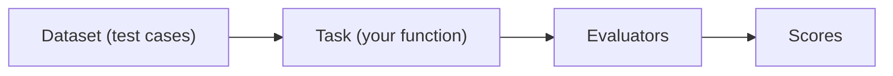

# L9：用 Phoenix Experiments 实现 Convergence 评估

要计算 Convergence，需要把 **多次运行** 放在一起比较。Phoenix 的 **Experiments（实验）** 正是为此设计——本节首次接触它，下节会用它做大规模评估。

## 导入与基础

```python
import phoenix as px
from phoenix.evals import OpenAIModel
from phoenix.experiments import run_experiment, evaluate_experiment
from phoenix.experiments.types import Example
from phoenix.experiments.evaluators import create_evaluator
from phoenix.otel import register
from utils import run_agent

px_client = px.Client()
```

## Phoenix Experiments 的三要素



- **Dataset**：一组测试用例（每条有 input，可选 expected output）
- **Task**：要运行的函数，接收一条 example，返回某种 output
- **Evaluators**：针对每条 example 的输出打分

## 第 1 步：构造 Convergence 数据集

挑一组**意思相近的同类问题**：

```python
convergence_questions = [
    "What was the average quantity sold per transaction?",
    "What is the mean number of items per sale?",
    "Calculate the typical quantity per transaction",
    "What's the mean transaction size in terms of quantity?",
    # ... 共 17 条
]
convergence_df = pd.DataFrame({"question": convergence_questions})

dataset = px_client.upload_dataset(
    dataframe=convergence_df,
    dataset_name=f"convergence_questions-{now}",
    input_keys=["question"],
)
```

上传后，在 Phoenix 的 **Datasets** Tab 能看到这份数据集。

## 第 2 步：定义 Task，统计路径长度

不能直接用原始 `run_agent`，需要稍作修改以**返回步数**：

```python
def format_message_steps(messages):
    """把 messages 转成更易读的步骤列表（便于查看）。"""
    ...

def run_agent_and_track_path(example):
    messages = [{"role": "user", "content": example.input["question"]}]
    response_messages = run_agent_messages(messages)  # 返回 messages 列表而非最终字符串
    return {
        "path_length": len(response_messages),
        "messages": format_message_steps(response_messages),
    }
```

> path_length 是消息列表的长度（含 system / user 消息）。**只要所有样本都用相同的计数口径**就 OK。

## 第 3 步：跑实验

```python
experiment = run_experiment(
    dataset=dataset,
    task=run_agent_and_track_path,
    experiment_name="Convergence Eval",
    experiment_description="Evaluating the convergence of the agent",
)
```

17 条问题逐一跑过智能体，得到 17 个 output。Phoenix UI 的数据集下出现一条新的 **Experiment** 记录。

## 第 4 步：实现 Convergence Evaluator

实验跑完后，先**从结果里算出最优路径长度**：

```python
outputs = experiment.as_dataframe()["output"].tolist()
optimal_path_length = min(o["path_length"] for o in outputs)
print(f"Optimal path length: {optimal_path_length}")
```

然后定义评估器——可以用 `@create_evaluator(...)` 装饰器命名它：

```python
@create_evaluator(name="Convergence Eval", kind="CODE")
def evaluate_path_length(output) -> float:
    if output and output.get("path_length"):
        return optimal_path_length / output["path_length"]
    return 0.0

evaluate_experiment(experiment, evaluators=[evaluate_path_length])
```

## 看结果

Phoenix UI 中该数据集下的 Experiment 现在多了一列 `Convergence Eval`，分数 1.0 表示该条运行走了最优路径。

> **同样的 17 条查询每次跑结果可能不同**——LLM 的非确定性会让某些运行多兜一圈。多跑几次取平均能拿到更稳定的 Convergence 数字。

## 小结

至此你掌握了 Phoenix Experiments 的最小闭环（Dataset / Task / Evaluator），并把它用在了 Convergence 评估上。下节会把这套机制用到**所有评估器的统一编排**上，做"评估驱动开发"的大实验。
