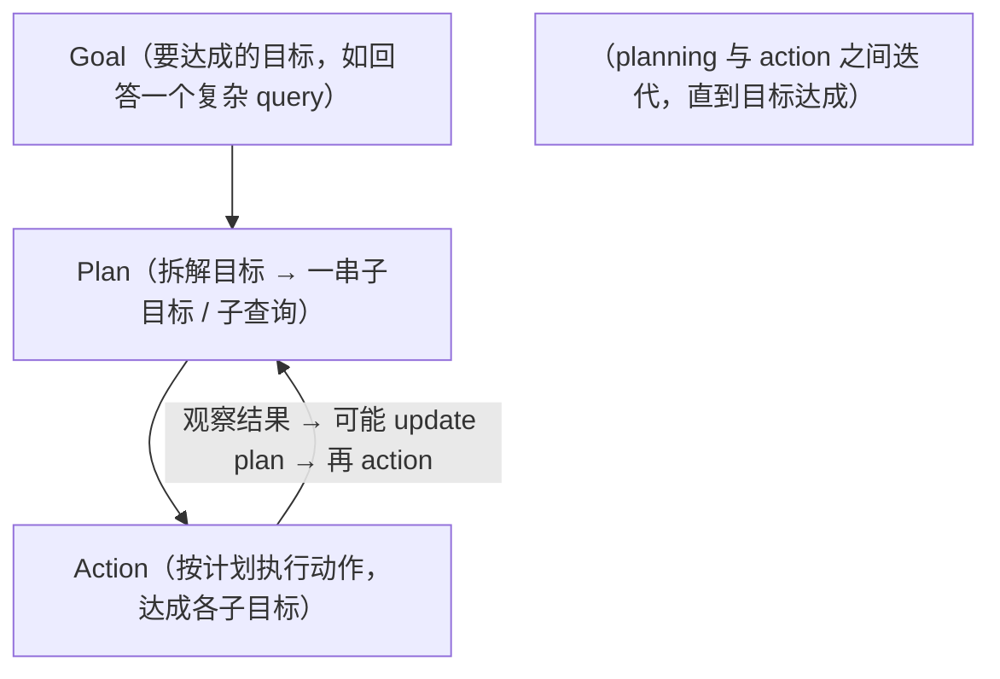
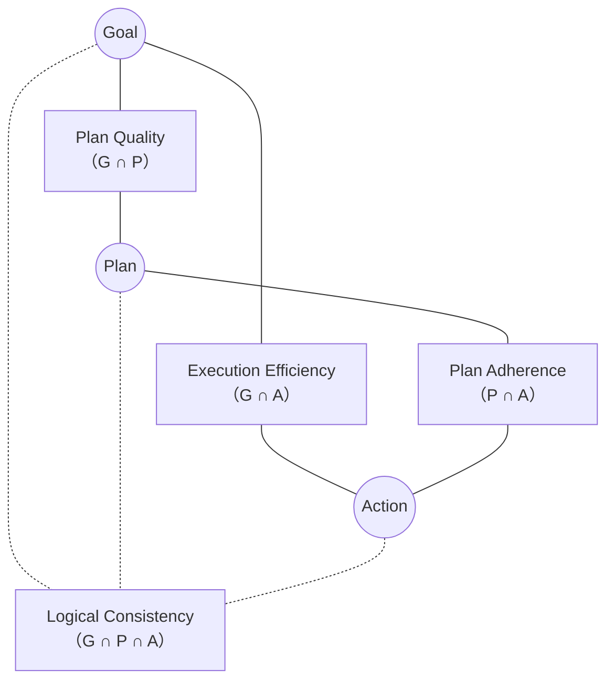

# L1 · 什么是 Data Agent，以及 GPA 评测框架

> 课程：Building and Evaluating Data Agents（DeepLearning.AI × Snowflake）
> 本课任务：定义 data agent、讲清它怎么工作，并给出贯穿全课的可信度评测框架 **GPA（Goal / Plan / Action）**。纯概念课，无代码。

## 1. Data Agent 的定义

> **Data agent 是一个自主或半自主的系统，由 LLM 驱动，连接各类数据源，理解自然语言或代码表达的 query，执行 query 分解 / 数据检索 / 分析 / 可视化等动作，最后基于数据给出洞见或做出决策。**

- **数据源**：数据库、API、文件、流、传感器、web API……
- **动作**：query decomposition、data retrieval、analysis、visualization；
- **收尾**：给洞见或做决策（例如发一封总结结果的邮件报告）。

两个现成例子：

| 系统 | 为什么算 data agent | 数据源范围 |
|---|---|---|
| ChatGPT **Deep Research** | 对开放问题做多步检索、综合回答 | 只用 **web 数据** + 模型内部参数化知识 |
| **Snowflake Intelligence** | 企业场景，回答需要内部数据 | web + 内部**结构化**（数据库表）+ **非结构化**（文档、多模态） |

企业场景的关键差异：光靠 web 数据不够，还要用内部专有数据——既有 database 表里的结构化数据，也有文档等非结构化数据。

## 2. 一个逐步加难的例子（贯穿全课）

课程用一个查询逐层加码，演示 data agent 如何随复杂度增加而调用更多子 agent：

| 版本 | 查询 | 需要的能力 |
|---|---|---|
| ① | 找出金融服务业的监管变化 | **web search** 子 agent（找公开趋势） |
| ② | 找出**正在经历监管变化的行业里的 pending deals** | ① 的 web search + **text-to-SQL** 子 agent（查内部专有表拿 pending deals） |
| ③ | ……并结合这些 deal 的会议记录，为每个 deal **重新定位价值主张** | ①② + **内部文档搜索**子 agent（读 meeting notes） |

到版本 ③，顶层 agent 要**编排三个子 agent**（text-to-SQL / web search / 内部文档搜索），把三路结果 synthesize 成一个答案。绿色部分（pending deals）走内部结构化数据，蓝色部分（监管变化）走 web，最后一段走内部非结构化文档。

> **对比 Microsoft《Building Your Own Database Agent》**：那门课聚焦单一能力——把 NL 翻成 SQL 打到一个数据库上。本课把 text-to-SQL 降格为**众多子 agent 中的一个**，真正的难点上移到"顶层 agent 如何拆解 query、决定调哪些子 agent、按什么顺序、如何合成"。NL→SQL 从"主菜"变成"一道配菜"，这就是从 database agent 到 data agent 的跃迁。

## 3. Agent 怎么工作：Goal → Plan → Action 的迭代

回到版本 ③ 的例子：

- **Goal**：回答这个三段式复杂 query；
- **Plan**：query decomposition，拆成三个子查询（pending deals / 行业监管变化 / 重定位价值主张）；
- **Action**：依次调 text-to-SQL agent → web search agent → 内部搜索 agent，信息集齐后合成回答。

计划**不是静态的**：新信息进来时可以 replan，但 replan 步骤本身也必须"有充分理由"（given 当前信息和观察）。

## 4. GPA 评测框架：可信 = Goal / Plan / Action 三者对齐

> **可信的 agent，执行时 Goal、Plan、Action 三者对齐。我们希望 agent 有高 GPA（Goal-Planner-Action alignment）。**

先给 agent **设定目标**（对 data agent 而言，常指向最终回答的质量——是否 relevant、是否 grounded；也含沿途的子目标——检索是否取回了相关结果）。然后用一组 **LLM judge** 检查三个维度两两之间、以及三者共同的对齐度。用一个 Venn 图（Goal / Plan / Action 三个圆）来定位每个评测指标：

| 评测指标 | 位于 | 检查什么 |
|---|---|---|
| **Plan Quality**（计划质量） | Goal ∩ Plan | 计划是不是达成目标的好计划？（replan 也要有正当理由） |
| **Plan Adherence**（计划遵循度） | Plan ∩ Action | agent 的实际动作是否遵循了它的计划？偏离往往是 failure mode 的信号 |
| **Execution Efficiency**（执行效率） | Goal ∩ Action | 走过的执行路径是不是达成目标的高效路径？能揪出冗余步骤 |
| **Logical Consistency**（逻辑一致性） | Goal ∩ Plan ∩ Action | 计划/子目标之间、planning 与 replanning 之间、planning 与 action 之间有没有互相矛盾 |

这四个指标都用 **LLM judge** 实现。它们不是给用户看的分数，而是给**开发者**用来定位失败模式、驱动迭代改进的诊断信号。

> **架构师视角**：GPA 把"agent 好不好"这个模糊问题**结构化**成了 Venn 图上的四个可测量交集。它的威力在于**归因**——只看最终答案对错，你无法区分"计划错了"还是"计划对但没照做"还是"都对但绕了远路"。Plan Quality / Plan Adherence / Execution Efficiency 分别对应这三种病因。这与课程 21 的 trajectory 评测同源，但 GPA 给了一个更锋利的坐标系：**先分维度，再分交集**。

> **对比《Evaluating AI Agents》（已学课程 21）**：课程 21 的 final-response 评测（relevance / groundedness）对应 GPA 里的 **Goal 维度**；而 Plan Quality / Adherence / Efficiency / Consistency 是 21 的"agent trajectory 评测"在多 agent 规划场景下的细化命名。本课把它们钉在 Venn 图的具体交集上，比"评 trajectory"这个笼统说法更可操作。

## 5. 课程路线图（讲师给的 lesson plan）

| 课 | 内容 | 落在 GPA 的哪块 |
|---|---|---|
| L2 | 用 LangGraph 搭 data agent，含 web search 子 agent | 构建 |
| L3 | 扩展 text-to-SQL + 内部非结构化搜索 → 完整 agent | 构建 |
| L4 | 加 tracing（OpenTelemetry 兼容）+ 用 **TruLens** 设 goal 相关评测 | Goal 维度 |
| L5 | 扩到 plan quality / plan adherence / logical consistency / execution efficiency；展示 agent 如何失败、这些 eval 能抓住哪些 failure mode | Plan + Action 全维度 |
| L6 | 依据 L5 的评测结果，引入改进 agent GPA 的具体机制 | 改进 |

L2 + L3 合起来在一个 notebook 里搭出能回答第 2 节例子的完整 agent。框架用开源的 **LangGraph**，但概念可迁移到别的框架。

## 本课总结

| 要点 | 一句话 |
|---|---|
| Data agent 定义 | LLM 驱动、连数据源、理解 NL/代码、执行检索分析可视化、给洞见 |
| 逐步加难例子 | web → +text-to-SQL → +内部文档搜索，子 agent 越加越多 |
| 工作方式 | Goal → Plan → Action 的迭代，计划可 replan 但要有理由 |
| GPA 框架 | 可信 = G/P/A 三者对齐，用 4 个 LLM-judge 指标度量 |
| 四指标定位 | Plan Quality(G∩P) / Plan Adherence(P∩A) / Execution Efficiency(G∩A) / Logical Consistency(G∩P∩A) |

> **记忆点（引出 L2）**：L1 只是把 data agent 和 GPA 讲成概念。L2 立刻动手——用 **LangGraph** 把 planner / executer / web researcher / chart / synthesizer 这些 GPA 里的角色实现成一张真实可跑的多 agent 图，先跑通"web search → 画图/合成"这条最短链路，为后续接内部数据和挂评测打好骨架。

## 与我的资产映射

- 观测与评测层：`agent/skills/agent-selection/5-observability-eval.md`（GPA 四指标是 LLM-judge 类评测的具体实例，可作为多 agent 规划评测的模板）
- 设计模式层：`agent/skills/agent-selection/11-design-patterns.md`（Planner-Executor 模式 + 子 agent 编排 + replan 回路）
- 已学课程 21《Evaluating AI Agents》——Goal 维度评测的方法论出处
- Microsoft《Building Your Own Database Agent》——NL→SQL 的单能力版本，本课把它降格为一个子 agent
- [[project_selection_matrix]]
