# L2 · 用 LangGraph 搭多 Agent 工作流

> 课程：Building and Evaluating Data Agents（DeepLearning.AI × Snowflake）
> 本课任务：用 **LangGraph** 把 data agent 实现成一个**层级式多 agent 工作流**——planner 拆解目标、executor 逐步调度、专职子 agent（web researcher / chart generator / chart summarizer / synthesizer）干活。先跑通"web 检索 → 画图 / 合成"这条链路。

## 0. 目标架构

```mermaid
flowchart TB
  UQ["user query"] --> START["START"] --> planner["planner"] --> executor["executor"]
  executor --> web_researcher["web_researcher"]
  executor --> chart_generator["chart_generator"]
  executor --> synthesizer["synthesizer"]
  web_researcher -.->|"每个子 agent 干完回到 executor 重选"| executor
  synthesizer -.->|"每个子 agent 干完回到 executor 重选"| executor
  chart_generator --> chart_summarizer["chart_summarizer"] --> END1["END"]
  synthesizer --> END2["END"]
```



两种典型流程：

- **直线流**：planner 出计划 → executor 调 web_researcher 取数 → 回 executor → chart_generator 画图 → chart_summarizer 配文字 → 返回用户。
- **replan 流**：executor 拿到 web_researcher 的结果后发现应该改计划 → 回 planner 调整 → executor 拿新计划继续。

核心机制：**每个子 agent 执行完都回到 executor**，由 executor 根据计划选下一个动作。executor 是这张图的中枢路由。

## 1. Agent State：跨节点的共享记忆

State 给所有节点一块**共享、随执行演进的记忆**。自定义 `State` 继承 LangGraph 的 `MessagesState`（自带 `messages` 键，记录子 agent 之间的对话历史）：

```python
from langgraph.graph import MessagesState

class State(MessagesState):
    user_query: Optional[str]          # 用户原始 query
    enabled_agents: Optional[List[str]] # 本次启用哪些子 agent（让系统模块化）
    plan: Optional[List[Dict[...]]]    # 计划：达成目标的步骤列表
    current_step: int                  # 当前执行到计划的第几步
    agent_query: Optional[str]         # 「收件箱便条」：告诉下一个 agent 这一步具体干什么
    last_reason: Optional[str]         # executor 选择的理由，保证可追溯
    replan_flag: Optional[bool]        # executor 置位，通知 planner 该重规划
    replan_attempts: Optional[Dict]    # 按步号记录 replan 次数（防止无限重规划）
```

> **架构师视角**：`agent_query` 这个字段是多 agent 系统的隐形关键。子 agent 不该看到整个用户 query 和全部历史，只该拿到 executor 为它这一步量身写的**独立指令**（standalone question）。这就是"上下文隔离"——把编排层的复杂度挡在子 agent 之外，子 agent 只需回答一个干净、自足的问题。`enabled_agents` 则让整套系统对"这次允许用哪些 agent"可配置，是模块化的抓手。

## 2. Planner 节点

Planner 用**推理模型 o3**（要求 JSON 输出），把用户 query 拆成有编号的步骤，每步指定 `agent` + 动作描述。Prompt 关键点（在 `prompts.py` 的 `plan_prompt`）：拆成**最小可答的子查询**（每个子查询能被单一数据源回答）；给出 agent 清单和期望的 JSON 格式；若在 replan，要给出 replan 的理由，并被引导"优先解除阻塞、选更简单可行的替代方案，而非追求完美路径"。

```python
reasoning_llm = ChatOpenAI(model="o3",
    model_kwargs={"response_format": {"type": "json_object"}})

def planner_node(state: State) -> Command[Literal['executor']]:
    llm_reply = reasoning_llm.invoke([plan_prompt(state)])   # 1. 调推理模型
    parsed_plan = json.loads(llm_reply.content)              # 2. 校验是期望的 JSON
    replan = state.get("replan_flag", False)
    return Command(
        update={                                             # 3. 写回 state
            "plan": parsed_plan,
            "messages": [HumanMessage(content=llm_reply.content,
                          name="replan" if replan else "initial_plan")],
            "user_query": state.get("user_query", state["messages"][0].content),
            "current_step": 1 if not replan else state["current_step"],
            "replan_flag": state.get("replan_flag", False),  # 保留：让 executor 先跑一次再重新考虑
            "last_reason": "", "enabled_agents": state.get("enabled_agents"),
        },
        goto="executor",   # 每个节点返回 Command(update=..., goto=...)：更新状态 + 指定下一节点
    )
```

**LangGraph 惯用法**：每个节点都返回 `Command(update=..., goto=...)`——`update` 改 state，`goto` 指定下一个节点。planner 永远 `goto="executor"`。

## 3. Executor 节点：中枢路由 + replan 记账

Executor 是最复杂的节点。它决定：当前计划是否要改、下一个调哪个 agent、以及为那个 agent 写具体的 `query`。Prompt 要求它返回含 `replan / goto / reason / query` 四个键的 JSON，并被引导"优先向前推进"。

```python
MAX_REPLANS = 3

def executor_node(state) -> Command[Literal["web_researcher","chart_generator","synthesizer","planner"]]:
    plan, step = state.get("plan", {}), state.get("current_step", 1)

    # 0) 刚 replan 完：先无条件跑一次这一步的计划 agent，再重新考虑
    if state.get("replan_flag"):
        planned_agent = plan.get(str(step), {}).get("agent")
        return Command(update={"replan_flag": False, "current_step": step+1},
                       goto=planned_agent)

    # 1) 调推理模型，解析出 replan / goto / reason / query
    parsed = json.loads(reasoning_llm.invoke([executor_prompt(state)]).content)
    replan, goto, reason, query = parsed["replan"], parsed["goto"], parsed["reason"], parsed["query"]
    updates = {"messages":[HumanMessage(content=..., name="executor")],
               "last_reason": reason, "agent_query": query}

    # 2) replan 决策：按步号记账，未超上限就回 planner；超了就跳过本步
    step_replans = (state.get("replan_attempts") or {}).get(step, 0)
    if replan:
        if step_replans < MAX_REPLANS:
            replans[step] = step_replans + 1
            updates.update({"replan_attempts": replans, "replan_flag": True, "current_step": step})
            return Command(update=updates, goto="planner")
        else:  # 触顶：跳过本步，交给下一步或 synthesizer 收场
            next_agent = plan.get(str(step+1), {}).get("agent", "synthesizer")
            updates["current_step"] = step + 1
            return Command(update=updates, goto=next_agent)

    # 3) 正常路径：跑选中的 agent；只有当它就是计划里的 agent 时才推进 step
    planned_agent = plan.get(str(step), {}).get("agent")
    updates["current_step"] = step + 1 if goto == planned_agent else step
    updates["replan_flag"] = False
    return Command(update=updates, goto=goto)
```

`MAX_REPLANS = 3` 是关键护栏——防止 agent 陷入无限重规划。`replan_attempts` **按步号**记账，每步独立计数。

> **对比《Evaluating AI Agents》（已学课程 21）的 GPA 归因**：executor 这段代码正是 L1 讲的 GPA 四指标要评的对象。`goto == planned_agent` 才推进 step——这一行就是 **Plan Adherence**（动作是否遵循计划）的代码级体现；`MAX_REPLANS` 触顶跳步，则是 **Execution Efficiency** 想抓的"冗余/绕路"的源头。换句话说，L5 的评测不是凭空打分，而是对 executor 这些分支决策的事后审计。写 agent 时就想清楚"哪些分支会被 judge 盯上"，是可评测性（evaluability）的前置设计。

## 4. 专职子 agent

### 4.1 Web Researcher —— ReAct agent + Tavily 搜索

用 LangGraph 预制的 `create_react_agent`，绑定 Tavily 搜索工具（`max_results=5`）：

```python
tavily_tool = TavilySearch(max_results=5)
web_search_agent = create_react_agent(
    llm,                     # gpt-4o
    tools=[tavily_tool],
    prompt=agent_system_prompt("""You are the Researcher. You can ONLY perform research
        by using the provided search tool. When you have found the necessary information,
        end your output. Do NOT attempt to take further actions."""),
)

def web_research_node(state) -> Command[Literal["executor"]]:
    result = web_search_agent.invoke({"messages": state.get("agent_query")})  # 只喂这一步的子 query
    # 末条包成 HumanMessage：有些 provider 不允许输入 messages 末位是 AI message
    result["messages"][-1] = HumanMessage(content=result["messages"][-1].content, name="web_researcher")
    return Command(update={"messages": result["messages"]}, goto="executor")
```

**为什么用 ReAct agent 而不是直接调工具**？工具原始返回是一大堆 URL/标题/正文，全塞回主系统太吵。ReAct agent 会**只把回答子问题所需的干净信息**提炼出来返回。两个细节：① 只喂 `agent_query`（不是整个历史）；② 末条消息包成 `HumanMessage`（部分 provider 不允许输入消息列表末位是 AI message）。

### 4.2 Chart Generator —— ReAct agent + Python REPL

```python
chart_agent = create_react_agent(
    llm, [python_repl_tool],   # ⚠️ 任意代码执行，未沙箱时不安全
    prompt=agent_system_prompt("""You can only generate charts... 
        1) Print the chart first. 2) Save it to a file in cwd.
        3) At the very end output EXACTLY two lines so the summarizer can find them:
           CHART_PATH: <relative_path>
           CHART_NOTES: <one sentence summarizing the main insight>"""))

def chart_node(state) -> Command[Literal["chart_summarizer"]]:
    result = chart_agent.invoke(state)
    result["messages"][-1] = HumanMessage(content=..., name="chart_generator")
    return Command(update={"messages": result["messages"]}, goto="chart_summarizer")
```

用 `python_repl_tool` 让 LLM 写并执行 Python 画图。**约定 `CHART_PATH:` / `CHART_NOTES:` 两行**作为与下游 summarizer 的接口契约。代码里明确标注：REPL 是任意代码执行，未沙箱时不安全。

### 4.3 Chart Summarizer —— 给图配文

无工具的 ReAct agent，任务是为图生成≤3 句的独立摘要（路径由 chart_generator 提供）。`goto=END`，并写入 `final_answer`。

### 4.4 Synthesizer —— 不画图时的文字合成

当用户不要图、只要文字回答时走这条路。它**从消息历史里筛出关键 agent 的产出**（web_researcher / chart_generator / chart_summarizer——注意排除 planner 和 executor 的"内部对话"），配上用户原问题和一段风格指令，直接调 gpt-4o 合成：

```python
def synthesizer_node(state) -> Command[Literal[END]]:
    relevant_msgs = [m.content for m in state.get("messages", [])
        if getattr(m, "name", None) in ("web_researcher","chart_generator","chart_summarizer")]
    user_question = state.get("user_query", ...)
    synthesis_instructions = """You are the Synthesizer... Do not invent facts not
        supported by the context... Start with the direct answer... include Citations if any..."""
    summary_prompt = [HumanMessage(content=(
        f"User question: {user_question}\n\n{synthesis_instructions}\n\n"
        f"Context:\n\n" + "\n\n---\n\n".join(relevant_msgs)))]
    answer = llm.invoke(summary_prompt).content.strip()
    return Command(update={"final_answer": answer,
        "messages":[HumanMessage(content=answer, name="synthesizer")]}, goto=END)
```

指令里"**不要编造 context 不支持的事实**"——这正是 groundedness 的 prompt 级防线（L4 会用 judge 正式度量它）。

## 5. 组图 + 试跑

```python
workflow = StateGraph(State)
for name, node in [("planner",planner_node), ("executor",executor_node),
    ("web_researcher",web_research_node), ("chart_generator",chart_node),
    ("chart_summarizer",chart_summary_node), ("synthesizer",synthesizer_node)]:
    workflow.add_node(name, node)
workflow.add_edge(START, "planner")   # 唯一显式边：永远从 planner 开始
graph = workflow.compile()
```

注意：图里**只有一条显式 edge**（START → planner）。其余跳转全靠各节点 `Command.goto` 动态决定——这是 LangGraph 的"命令式路由"，比预连死边更灵活。`graph.get_graph().draw_png()` 可画出与设计图一致的架构。

两个试跑 query：

| Query | 期望路径 | 实际观察 |
|---|---|---|
| "Chart 美国前 5 大银行的市值" | web → chart_generator → chart_summarizer | 出了图（JPMorgan 居首），但 summarizer 只给了路径没给文字——**这就是待评测的缺陷** |
| "找出美国金融服务业的监管变化" | web → synthesizer（走文字路线） | 给出 SEC/美联储等详细回答，还带引用 |

**同一 query 多次运行结果可能不同**：第一个 query agent 有时会选 synthesizer 而非 chart_generator，结果就没有图——这种"答案与用户 query 不完全相关"正是后续要学着评测的对象。

## 本课总结

| 要点 | 一句话 |
|---|---|
| 层级式多 agent | planner 拆解 → executor 路由 → 专职子 agent 干活 → 都回 executor |
| State 是共享记忆 | 继承 MessagesState，`agent_query` 给下游子 agent 独立指令 |
| Command 路由 | 每节点返回 `Command(update, goto)`，图里只有 START→planner 一条死边 |
| ReAct 子 agent | web/chart 用 create_react_agent 绑工具，只回传提炼后的干净信息 |
| replan 护栏 | `MAX_REPLANS=3` 按步记账，防无限重规划；触顶跳步 |
| 缺陷可见 | summarizer 偶尔漏文字、路由偶尔走错——为 L4/L5 的评测埋下靶子 |

> **记忆点（引出 L3）**：L2 的 agent 只会 web search，还答不了"我们的 pending deals 是哪些"这种要**内部专有数据**的问题。L3 加一个 **cortex_researcher** 子 agent，接入 Snowflake Cortex——用 Cortex Analyst 做 text-to-SQL 查结构化 CRM 数据、用 Cortex Search 查非结构化会议记录，让 agent 能跨内外部数据源回答 L1 里那个三段式复杂 query。

## 与我的资产映射

- 设计模式层：`agent/skills/agent-selection/11-design-patterns.md`（Planner-Executor + 子 agent 编排 + 命令式路由 + replan 护栏，可直接作为多 agent 规划的参考实现）
- 观测与评测层：`agent/skills/agent-selection/5-observability-eval.md`（executor 的分支决策 = GPA 评测的审计对象；synthesizer 的"不编造"指令 = groundedness 的 prompt 级防线）
- 工具层：`agent/skills/agent-selection/4-tools.md`（ReAct agent 包裹工具、只回传提炼信息的"降噪"模式；python_repl 的沙箱安全提示）
- [[project_selection_matrix]]
