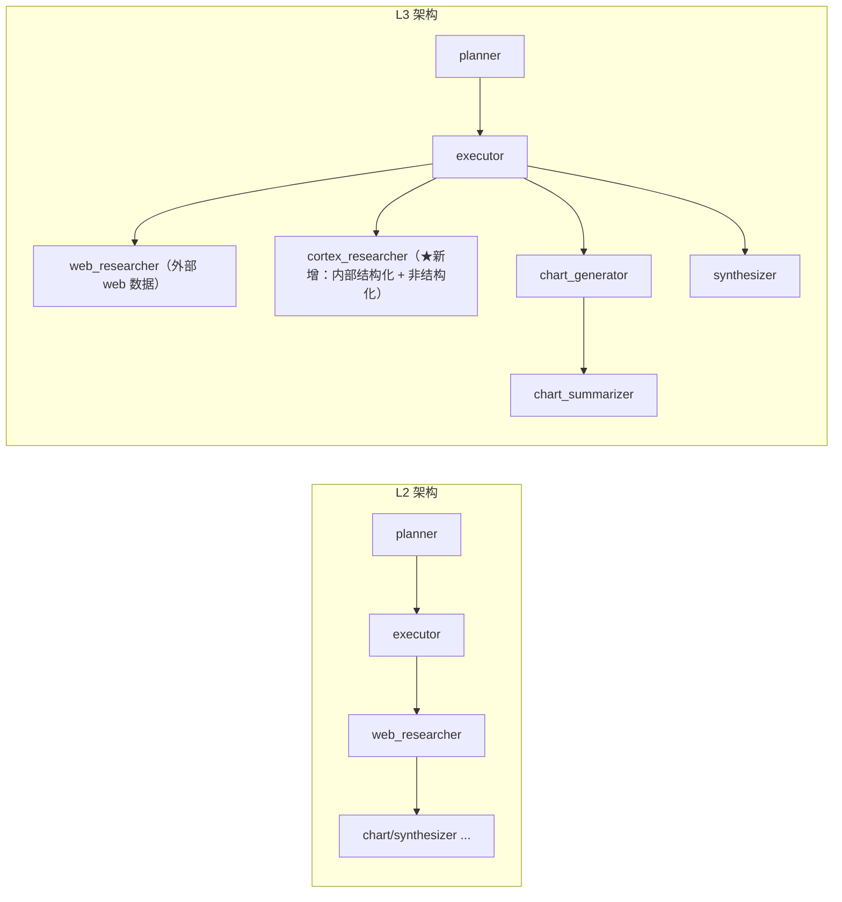

# L3 · 用 Cortex 接入内部结构化与非结构化数据

> 课程：Building and Evaluating Data Agents（DeepLearning.AI × Snowflake）
> 本课任务：给 L2 的多 agent 图加一个 **cortex_researcher** 子 agent——通过 Snowflake **Cortex Agents** 服务，用 **Cortex Analyst（text-to-SQL）** 查结构化 CRM 数据、用 **Cortex Search（混合检索）** 查非结构化会议记录，让 agent 能跨内外部数据源回答复杂 query。

## 0. 这一课加了什么

L2 的架构只有 web 检索能力。L3 只改一件事：加一个 cortex_researcher 节点。



加上这个 agent 后，系统能"跨所有数据推理"——回答那些需要**组合内外部数据源**的深度问题（如 L1 例子里那个"pending deals + 监管变化 + 会议记录"的三段式 query）。

## 1. 两类内部数据（预置在 Snowflake）

课程已把数据预装进 Snowflake，用 Snowpark session 连接、直接跑 SQL 探查：

| 数据 | 存储 | 内容 | 检索方式 |
|---|---|---|---|
| **结构化** CRM/deal 数据 | `sales_intelligence.data.sales_metrics` 表 | 客户名、deal 金额、日期、是否成交、销售代表、产品线 | Cortex **Analyst**（text-to-SQL） |
| **非结构化** 会议记录 | `sales_intelligence.data.sales_conversations` 表（`transcript_text` 列） | meeting notes（如"与 TechCorp 的 discovery call，讨论集成时间线、Q2 预算……") | Cortex **Search**（混合检索服务） |

```python
from helper import snowpark_session
snowpark_session.sql("USE WAREHOUSE SALES_INTELLIGENCE_WH").collect()  # 指定计算仓库
pd.DataFrame(snowpark_session.sql(
    "select * from sales_intelligence.data.sales_metrics limit 5").collect())
```

`.collect()` 才真正触发 SQL 执行（否则是惰性的）。warehouse 是 Snowflake 里执行查询的"计算"。

## 2. 两个预建工具

Cortex Agents 服务背后挂两个工具，都已在 Snowflake 侧建好，代码里只需**指向它们**：

| 工具 | 类型 | 依赖 | 干什么 |
|---|---|---|---|
| **Cortex Analyst** | text-to-SQL | **semantic model 文件**（`.yaml`） | 把 NL query 翻成 SQL 查结构化表 |
| **Cortex Search** | 混合检索 | 预建的 search service | 在会议记录上做**语义 + 关键词 + rerank**，返回相关 chunk |

```python
SEMANTIC_MODEL_FILE   = "@sales_intelligence.data.models/sales_metrics_model.yaml"
CORTEX_SEARCH_SERVICE = "sales_intelligence.data.sales_conversation_search"
```

**semantic model 是 text-to-SQL 的灵魂**：它描述"每张表/每列到底是什么意思、值是什么含义、有哪些常用别名/注释"。有了它，Analyst 才知道该怎么把用户的口语翻成正确的 SQL。Cortex Search 则是"语义搜索 + 关键词搜索 + Reranking"的 **hybrid retriever**。

> **对比 Microsoft《Building Your Own Database Agent》**：那门课手把手教你自己搭 NL→SQL（写 schema 描述、调 LLM 生成 SQL、跑、纠错）。本课把这一整套**托管化**成 Cortex Analyst——你只提供一个 semantic model YAML，text-to-SQL 变成一次服务调用。取舍很清晰：托管服务省掉了 prompt 工程和 SQL 纠错的重活，代价是绑定 Snowflake 生态、且 semantic model 的质量成了新的瓶颈。架构师要判断的是"NL→SQL 是不是你的核心差异化"——如果不是，托管；如果是，自建。

## 3. CortexAgentTool：包裹 Cortex Agents 服务

Cortex Agents 是一个**无状态服务**，输入 query、内部自主决定调 Analyst 还是 Search，流式返回事件。工具类三步走：`_build_request`（组请求）→ `_consume_stream`（消费流）→ `run`（跑 + 执行 SQL）。

```python
class CortexAgentTool:
    name = "CortexAgent"
    description = "answers questions using sales conversations and metrics"

    def __init__(self, session):
        self._session = session
        self._agent_service = Root(session).cortex_agent_service

    def _build_request(self, query):        # 组装一次 Cortex Agents 调用
        return AgentRunRequest.from_dict({
            "model": "claude-3-5-sonnet",   # 服务内部编排用的模型
            "tools": [
                {"tool_spec": {"type": "cortex_analyst_text_to_sql", "name": "analyst1"}},
                {"tool_spec": {"type": "cortex_search", "name": "search1"}},
            ],
            "tool_resources": {             # 给每个工具喂它需要的资源
                "analyst1": {"semantic_model_file": SEMANTIC_MODEL_FILE},
                "search1":  {"name": CORTEX_SEARCH_SERVICE, "max_results": 10,
                             "id_column": "conversation_id"},
            },
            "messages": [{"role": "user", "content": [{"type": "text", "text": query}]}],
        })

    def _consume_stream(self, stream):      # 从事件流里抽 text / sql / citations
        text, sql, citations = "", "", []
        for evt in stream.events():
            delta = ...                      # 解析每个 delta
            for item in delta.get("content", []):
                if item.get("type") == "text":            # 非结构化 → 直接是回答文本
                    text += item.get("text", "")
                elif item.get("type") == "tool_results":  # 结构化 → 带回 SQL + 检索命中
                    for result in item["tool_results"].get("content", []):
                        j = result["json"]
                        text += j.get("text", "")          # 被改写过的 query 文本
                        sql = j.get("sql", sql)            # ★ SQL 还没执行，服务只生成不执行
                        citations.extend(... for s in j.get("searchResults", []))
        return text, sql, str(citations)

    def run(self, query, **kwargs):
        stream = self._agent_service.run(self._build_request(query))
        text, sql, citations = self._consume_stream(stream)
        results_str = ""
        if sql:                              # ★ 拿到 SQL 后由我们自己执行
            self._session.sql("USE WAREHOUSE SALES_INTELLIGENCE_WH").collect()
            df = self._session.sql(sql.rstrip(";")).to_pandas()
            results_str = df.to_string(index=False)
        return text, citations, sql, results_str
```

**关键分工**：Cortex Agents 服务只**生成** SQL，不执行；SQL 的实际执行由我们在 `run()` 里用 Snowpark session 完成（先 `USE WAREHOUSE` 再跑）。这样：

- **非结构化路径**：流里直接返回 `text`（回答）+ `citations`（引用来源）；
- **结构化路径**：流里返回改写后的 query 文本 + 待执行的 `sql`，我们执行后拿到 `results_str`。

## 4. 包成 ReAct agent 再包成图节点

和 L2 的子 agent 一样，把工具包成 ReAct agent（gpt-4o），再包成 LangGraph 节点：

```python
cortex_agent = create_react_agent(
    llm,                                  # gpt-4o
    tools=[cortex_agent_tool.run],
    prompt=agent_system_prompt("""You are the Researcher. You can answer questions
        using customer deal data along with meeting notes. Do not take any further action."""))

def cortex_agents_research_node(state) -> Command[Literal["executor"]]:
    query = state.get("agent_query", state.get("user_query", ""))
    agent_response = cortex_agent.invoke({"messages": query})
    new_message = HumanMessage(content=agent_response['messages'][-1].content,
                               name="cortex_researcher")
    return Command(update={"messages": [new_message]}, goto="executor")  # 干完回 executor
```

组图时只需在 L2 的基础上**多加一个节点**（其余节点从 `helper` 复用），其它一行不改：

```python
workflow.add_node("cortex_researcher", cortex_agents_research_node)  # ← 唯一的新增
```

## 5. 三个试跑 query：从成功到失败

| Query | 需要的数据 | 结果 |
|---|---|---|
| "前 3 大客户 deal？并给每个 deal 金额画图" | 结构化（Analyst）→ 画图 | ✅ 出图（FastTrack 居首、SecureBank、HealthTech Solutions）+ 文字描述 |
| "找出 pending deals → 查监管变化 → 结合会议记录给每个新价值主张"（L1 那个三段式 query） | 结构化 + web + 非结构化，三源组合 | ❌ **失败**：agent 没能真正推理这个复杂请求，只说了它"打算怎么做"，给不出关键细节 |
| "会议记录里有没有共同主题？" | 非结构化（Search） | ✅ synthesizer 给出主题："会议聚焦于把销售努力与客户需求对齐" |

第二个 query 的失败是**故意暴露**的：它正是 L1 开头 Anupam 演示的那个复杂例子，这里 agent 栽了跟头。讲师明确说："下一课会学到这里到底哪里出了错。"

> **对比《Evaluating AI Agents》（已学课程 21）**：L3 结尾这个"看得到失败、却说不清为什么失败"的状态，正是评测的起点。课程 21 讲过——没有 tracing 和分维度 eval，你面对一个复杂 agent 的错误答案是**抓瞎**的：是计划没拆对？是选错了工具（该用 Analyst 却用了 Search）？还是检索到了但没 grounded？L4 马上引入 tracing + RAG triad（context relevance / answer relevance / groundedness）把这个黑盒打开。本课到此为止，agent 已"能跑但不可信"——评测就是把"不可信"变成"可诊断"。

## 本课总结

| 要点 | 一句话 |
|---|---|
| 新增能力 | 加 cortex_researcher 一个节点，接入内部结构化 + 非结构化数据 |
| 两工具 | Cortex Analyst（text-to-SQL，靠 semantic model）+ Cortex Search（混合检索 + rerank） |
| 服务分工 | Cortex Agents 只**生成** SQL，执行由我们用 Snowpark session 完成 |
| 复用式扩展 | 图只加一个节点，其余从 helper 复用，改动极小 |
| 故意的失败 | 三段式复杂 query 失败——给 L4 的评测埋下诊断靶子 |

> **记忆点（引出 L4）**：agent 现在"能跑但不可信"——复杂 query 会失败，你却说不清失败在哪一步。L4 给 agent 加 **tracing**（追踪每一步到底发生了什么），并用 **TruLens** 跑出**首批评测**：以 **RAG triad** 的三个指标——**context relevance（检索是否切题）、answer relevance（答案是否切题）、groundedness（答案是否有据可依）**——来衡量 agent 的 goal completion。评测正式登场。

## 与我的资产映射

- 检索层：`agent/skills/agent-selection/3-retrieval.md`（托管 text-to-SQL vs 自建、hybrid retriever = 语义+关键词+rerank 的组合式检索）
- 观测与评测层：`agent/skills/agent-selection/5-observability-eval.md`（"能跑但不可诊断" → 引出 tracing + RAG triad，L4 正式落地）
- 工具层：`agent/skills/agent-selection/4-tools.md`（把托管服务包成 ReAct 工具、"生成 SQL 与执行 SQL 分离"的职责边界）
- Microsoft《Building Your Own Database Agent》——自建 NL→SQL 的对照版本，本课用 Cortex Analyst 托管化
- [[project_selection_matrix]]
