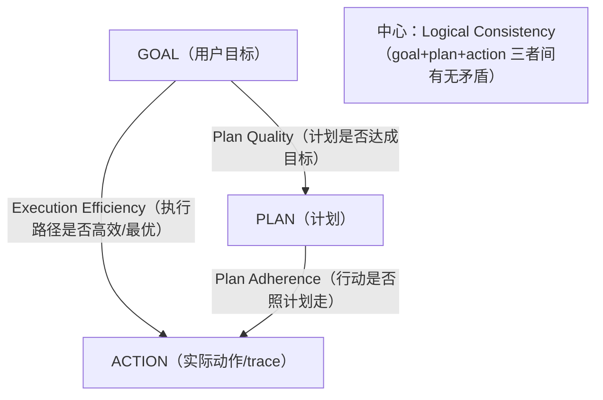

# L5 · 用 GPA 评测诊断"目标-计划-行动"对齐（Plan Quality / Adherence / Efficiency / Consistency）

> 课程：Building and Evaluating Data Agents（DeepLearning.AI × Snowflake）
> 本课任务：RAG Triad 只判"答案对不对"，本课加 **GPA（Goal-Plan-Act alignment）四把尺子**，深入 agent 的**过程健康度**——计划好不好、执行照不照计划、走得冤不冤、前后自不自洽——并用故意构造的"坏样本"演示每把尺子怎么抓到病。

## 0. GPA 是什么：三角形上的四条评测

L4 的 RAG Triad 卡的是 goal completion（目标完成度）。但 agent 可能"答案凑巧对了、过程一塌糊涂"，也可能"过程严谨、就是没答对"。GPA 把 agent 拆成 **Goal / Plan / Action** 三个顶点，四条评测正好落在三角形的各条边和中心：



| 评测 | 落在哪 | 判什么 | 抓的失败模式 |
|---|---|---|---|
| **Plan Quality** | Goal ∩ Plan | 计划有多好地达成目标 | 选择标准含糊、无优先级逻辑、输出无 schema |
| **Plan Adherence** | Plan ∩ Action | 行动有多贴合它自己定的计划 | 漏步、乱序、拿没计划的动作顶替 |
| **Execution Efficiency** | Goal ∩ Action | 执行 trace 是不是达成目标的最优/高效路径 | 冗余检索、重复过滤、过度防御 |
| **Logical Consistency** | Goal+Plan+Action | 推理链有无矛盾/无据假设 | 计数前后矛盾、自相矛盾、ungrounded assumption |

**判官换成 GPT-4.1**——因为 GPA 要把**整条执行 trace** 喂进去评判，trace 很长，需要长上下文支持：

```python
gpa_eval_provider = OpenAI(model_engine="gpt-4.1")   # 长上下文，吃整条 trace
```

四个 feedback function **结构完全一样**：都用 `..._with_cot_reasons`（给分+理由），输入都是 `Selector(trace_level=True)`（整条 trace），差别只在调的评判方法名。

> **架构师视角**：RAG Triad 评的是"**输出**"，GPA 评的是"**过程**"。这是评测体系成熟度的分水岭——只测输出，你能知道 agent 错了却不知道错在决策链哪一环；测过程，你能把"answer 不对"归因到"plan 就没规定优先级"或"action 压根没照 plan 走"。对多步 agent 而言，**过程可评估性 = 可调试性**。GPA 用一个三角形把"可改进的抓手"结构化了。

## 1. Plan Quality：计划是不是好计划（Goal ∩ Plan）

先立个 query 和一份**故意含糊**的计划，让 judge 打分：

```python
goal_and_plan = """
User Query: Which sales leads should we prioritize this week,
and what specific action items should we take for each?
Plan:
1. Pull all sales leads from the past 12 months from the CRM.
2. For the largest 20 leads, compile notes, call logs, tasks.
3. Summarize each lead's current pipeline stage.
4. Present summary and recommendations in a single table.
"""

f_plan_quality = Feedback(
    gpa_eval_provider.plan_quality_with_cot_reasons, name="Plan Quality"
).on({"trace": Selector(trace_level=True)})       # 整条 trace 作输入

score, reason = f_plan_quality(goal_and_plan)      # → 0.66
```

判官给 **0.66（约理想计划的 2/3）**，并给出**评分标准 + 支撑证据**：计划总体结构清晰、大部分步骤有理由，但——

- **选择标准含糊**："过去 12 个月所有 leads"没绑目标的紧迫性约束；
- **优先级弱**："最大的 20 个"忽略了 lead score、阶段紧迫度、临近截止日；
- **可落地性缺失**：没要求生成具体 next action 或负责人；
- **输出不具体**："单张表"没规定必需字段；
- **无 replanning**。

按这些短板改出 **better plan**（加显式过滤阈值 `deal value > $10k or high lead score`、按 `deal stage urgency` 排序、每个 lead 出 `Next Action / Due Date / Owner`、输出定义列 schema），重跑 → **1.0**：结构良好、最优、直接对齐 query、步骤清晰有序。

**关键提醒**：跑真实 agent 时，plan 和 trace 都由 agent 自己产生，开发者**不能直接手改** plan——只能通过改 prompt / 其它手段引导（正是 L6 的主题）。这里手改是为了教学演示尺子的灵敏度。

## 2. Plan Adherence：行动照没照计划走（Plan ∩ Action）

用上面的 better plan 当基准，构造一串**故意跑偏**的 agent actions：

```python
agent_actions = """
[STEP 1] Pulled all open opportunities WITHOUT the next-action-date filter.
[STEP 2] Applied deal value filter only; SKIPPED lead score filter.
[STEP 3] Sorted by deal value only（丢了 urgency/close 风险维度）.
[STEP 4] Got notes+contacts but SKIPPED blockers.
[STEP 5] Listed CRM 现有 next action 字段，没 review/update.
[STEP 6] 输出表只有 Lead Name/Value/Stage/Next Action（缺 Urgency/Due Date/Owner）.
"""
plan_and_agent_actions = goal_and_better_plan + agent_actions   # plan+trace 拼一起喂进去
score, reason = f_plan_adherence(plan_and_agent_actions)        # → 0
```

判官给 **0**，且逐条抓出违背：STEP 1 漏了 date filter、STEP 2 只做了一半过滤、输出字段对不上……高层小结（criteria 段）："多个计划步被省略/乱序/被计划外动作顶替，没有对计划变更做任何解释或记录，计划基本被无视——**还不如没做计划**"。换成 `better_agent_actions`（每步都对齐）重跑 → **1.0**，无遗漏无乱序。

> **对比 11-design-patterns.md 的 Plan-and-Execute 模式**：设计模式篇讲了 planner/executor 分离的好处（可控、可复用计划），但没讲**怎么验证 executor 真的忠于 planner**。Plan Adherence 正是补上这个盲区——plan-execute 架构如果没有 adherence 评测，"计划"就是个摆设，executor 悄悄跑偏你根本不知道。判官同时看 plan 和 action 在同一条 trace 上的对应关系，这是纯输出评测做不到的。

## 3. Execution Efficiency：走得冤不冤（Goal ∩ Action）

即使动作合逻辑、也照了计划，agent 仍可能**过度防御**导致低效。这条尺子专抓冗余/重复/多余。trace 里额外**汇总了每步结果数**（如 STEP1 检回 96 个 lead，STEP2 过滤后 54 个）：

```python
f_execution_efficiency = Feedback(
    gpa_eval_provider.execution_efficiency_with_cot_reasons, name="Execution Efficiency"
).on({"trace": Selector(trace_level=True)})
score, reason = f_execution_efficiency(agent_actions)          # → 0.66
```

判官给 **0.66**，抓到三类浪费：

| 低效类型 | trace 里的证据 | 代价 |
|---|---|---|
| 重复劳动 | 同一个 filter 应用了两次 | 白烧算力、无新信号 |
| 冗余检索 | 同一份 notes 从 CRM API + 缓存导出**各拉一遍**"double-check" | 无谓 IO，一个源就够 |
| 多余输出 | 表同时导出 XLSX + CSV，只要一种 | 违反 YAGNI，添乱 |

"Good"范式对照：每个 filter 一次过、复用缓存不重取、只出被要求的格式、错误按比例处理（warn→继续；error→修一次继续）。

## 4. Logical Consistency：前后自洽吗（Goal+Plan+Action 中心）

抓矛盾、无据假设、推理硬伤。构造一条埋了逻辑洞的 trace：

```python
agent_actions = """
[STEP 1] ... → 检回 96 个 leads.
[STEP 2] 过滤 deal value>$10k OR high lead score → 结果 113 个 leads.   # ← 过滤后反增！
[STEP 3] 排序 → 近期几乎没互动的 lead 因 Q3 close date 排到很高.
[STEP 4] → 多个 lead decision-maker 是 "TBD"，却仍分配了 active next steps.  # ← 前提缺失
[STEP 5] ...
[STEP 6] Due dates 从上周到本月底.
"""
score, reason = f_logical_consistency(agent_actions)           # → 0.33
```

判官给 **0.33**，点名两处硬伤：

- **计数矛盾**：96 → 113，过滤只会减不会增，数值不自洽；
- **动作与状态错位**：decision-maker 还是 "TBD"（前提未知），却已经派了明确 next step——**无据假设**。

"Good"范式：过滤后计数只减不增、next step 匹配已知上下文、论断与前序步骤一致。这类不一致会**直接侵蚀最终回答的准确性**。

> **对比 L4 的 Groundedness**：groundedness 判"最终回答"对不对得上检索 context（外部证据），是**输出层**的一致性；logical consistency 判"执行过程内部"步与步之间自不自洽（96 vs 113、TBD vs 已派活），是**过程层**的一致性。两者互补——一个 agent 可能每步都引了真 context（groundedness OK）但步间计数自相矛盾（consistency 崩）。data agent 尤其要 consistency，因为数值型中间结果的矛盾很隐蔽、judge 比人更擅长逐步核对。

## 5. 套回真实 data agent：GPA 与 RAG Triad 同场跑

把四个 GPA function **加进 L4 的 feedback 列表**（RAG Triad + GPA 共 7 个指标），重建图、重注册、连发同样三条 query：

```python
tru_recorder = TruGraph(
    graph, app_name="Sales Data Agent", app_version="L5: Base",
    feedbacks=[f_answer_relevance, f_context_relevance, f_groundedness,   # RAG Triad
               f_plan_quality, f_plan_adherence,                          # GPA
               f_execution_efficiency, f_logical_consistency],
)
```

> ⚠️ 课程说明：GPA 评测**极耗 token**（要吃整条长 trace），受限学习环境里 notebook 直接给出了录制时的结果，不用现场等。

**Leaderboard 聚合**（三条 query 平均）读数：

| 指标族 | 表现 | 读数含义 |
|---|---|---|
| Plan Quality | 好 | 计划本身质量不错 |
| Logical Consistency | 好 | 过程基本自洽 |
| **Plan Adherence** | **有待改进** | 行动没照计划走 |
| **Execution Efficiency** | **有待改进** | 执行路径不够优 |
| Context Relevance / Groundedness | 不高 | 检索步仍是短板 |

Examine Records 逐条下钻能看到分化：**Q2（pending deals）** GPA 四项全满分、但 context relevance/groundedness 偏低（检索层待修）；**Q1（largest deal）** plan quality + consistency 尚可，但 **plan adherence = 0**、efficiency 差——判官解释："多个计划步被省略/未按预期完成，除了'能力受限'的说辞外没解释变更，step 1 之后计划基本被丢弃"。可点 planner node 看它定的计划、再对执行 trace 逐步核对判官的判断。

> **架构师视角**：7 个指标一起看，才拼出完整诊断——**Q1 是"执行病"（plan 好但没执行到位）**，**Q2 是"检索病"（过程健康但取材不准）**。这两种病的**修法完全不同**：执行病改 prompt/加约束（L6 做的），检索病调 retriever/换 embedding。如果只有一个总分，你会把两种病开成同一副药。这就是"多指标解耦评测"对架构决策的直接价值——**评测的粒度决定了改进的精准度**。

## 本课总结

| 要点 | 一句话 |
|---|---|
| GPA 四评测 | Goal-Plan-Act 三角上的 plan quality / adherence / efficiency / consistency |
| 判官用 GPT-4.1 | 要吃整条长 trace，需长上下文；输入统一 `Selector(trace_level=True)` |
| 输出→过程 | RAG Triad 评答案，GPA 评过程；过程可评估性 = 可调试性 |
| 坏样本演示 | 每把尺子先用故意构造的漏步/反增/重复 trace 验证灵敏度 |
| 诊断分型 | Q1 执行病（adherence=0）、Q2 检索病（context/groundedness 低）→ 修法不同 |
| 不能手改 | 真实 agent 的 plan/action 自产，只能改 prompt 等间接引导 |

> **记忆点（引出 L6）**：L5 只做了**诊断**——知道了 Q1 的病根是 plan adherence。L6 转向**治疗**：两招靶向改进——① **inline evaluation**（实时把评分反馈进 agent 的 memory，让它当场 replan）；② **改 planning prompt**（给每步加 precondition/postcondition/goal）。再用 `app_version` 把新旧版本摆一起对比，验证改进是否真的奏效。

## 与我的资产映射

- 观测·eval 层选型：`agent/skills/agent-selection/5-observability-eval.md`（GPA 作为多步 agent 的"过程评测集"，补齐 RAG Triad 的输出评测盲区）
- 设计模式：`agent/skills/agent-selection/11-design-patterns.md`（Plan-and-Execute 模式必须配 Plan Adherence 评测才能验证 executor 忠于 planner）
- 面试包：`09-eval-driven-development`（GPA 四指标 = 过程级 eval 集）、`01-agent-run-loop-and-orchestration`（planner/executor 对齐的可验证性）
- 对比锚点：课程 21 Evaluating AI Agents、L4 RAG Triad（输出评测 vs 过程评测）
- [[project_selection_matrix]]
</content>
