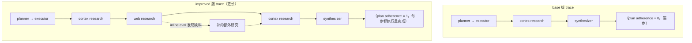

# L6 · 用 Inline Evaluation 与 Prompt 改写提升 GPA（收官篇）

> 课程：Building and Evaluating Data Agents（DeepLearning.AI × Snowflake）
> 本课任务：L5 诊断出病根（plan adherence 低）后，本课做**靶向治疗**——两招改进（inline evaluation + 改 planning prompt），再用版本对比**验证改进真的奏效**，并直面"效率换目标完成度"的取舍。末尾收全课。

## 0. 从诊断到治疗：改进 GPA 的通用套路

L5 停在"知道 agent 病在哪"（Q1 的 plan adherence = 0，行动没照计划走）。本课开场给出改 GPA 的**常见手段清单**：

| 手段 | 做法 | 治哪种病 |
| --- | --- | --- |
| **调 planning prompt** | 给每步加显式 subgoal + pre/post condition | 计划含糊、执行不知每步该干嘛 |
| **inline evaluation** | 运行中实时给 agent 反馈分数+解释 | 检索漏关键信息、无法当场纠偏 |
| 调 retriever / 换模型 | 调检索参数、试不同 LLM | 检索病、生成病 |
| **离线评测验证** | 每次改完都用 offline eval 回归 | 防止"改了以为好了实则更差" |

本课重点做前两招，最后强调**任何改进都要用离线评测验证**。

> **架构师视角**：这套路的本质是把 agent 开发变成**闭环的 eval-driven development**——L4 建观测、L5 做诊断、L6 靶向改 + 回归验证。关键纪律是"**改进必须可证伪**"：不是凭感觉调 prompt，而是每改一版就换 `app_version`、用同一组 query 回归、在 dashboard 里逐指标对比。没有这个闭环，prompt 调优就是玄学。

## 1. 招式一：Inline Evaluation（把评测塞进 agent 的决策回路）

L4/L5 的评测都是**离线/事后**的——跑完才评。**inline evaluation** 把评测搬到**运行时**：某步（如一次 research）跑完**立刻**评一次，把分数+解释**写回 agent 的 memory（state）**，让 agent 据此判断"这步检索够不够、要不要 replan"再决定下一动作。

概念是通用的，但因为要和 LangGraph state 交互，本课用 TruLens 的 **LangGraph 专用 inline 装饰器**。做法：给**已埋点**的 node 再叠一个 inline 装饰器，传入要跑的 feedback function（这里用 context relevance）：

```python
# 概念示意（据课程讲述重构）：在已 @instrument 的 research node 上再叠 inline eval
from trulens.apps.langgraph import inline_evaluation   # langgraph 专用

@inline_evaluation(f_context_relevance)   # ① 该 node 跑完立刻用 context relevance 评它
@instrument(span_type=RETRIEVAL, attributes=...)        # ② L4 那层埋点原样保留
def cortex_agents_research_node(state: State) -> Command[...]:
    ...
# 评测跑在 feedback function 声明的 span 属性上；
# 分数+解释随后被写回 state 的 messages，供 agent 后续步骤读取、必要时 replan。
# web research node 同款处理。
```

要点：

- inline eval **直接跑在** node 声明的 span attributes 上（复用 L4 埋点，不重复造轮子）；
- 评完的 **score + explanation 追加进 state 的 messages**——这就是"反馈进 memory"的落地方式；
- 效果：agent 做完一次 research 能"看见"自己检索得好不好，**缺料就补检索、必要就 replan**，而不是一条道走到黑。

> **对比 5-observability-eval.md 的"评测即旁路"默认认知**：多数观测方案把 eval 当成**离线旁路**（跑完打分、不影响这次运行）。inline evaluation 打破了这个边界——**评测成为 agent 控制流的一部分**，分数回流进 state 直接改变下一步决策。这把"observability"升级成了"self-correction"。代价是每步多一次 judge 调用（延迟+token），所以要挑关键步（research）加、而非无脑全加。

## 2. 招式二：改 Planning Prompt（给每步装上 pre/post condition）

L5 诊断的病根是 plan adherence（计划遵循度）——executor 不知道每步到底要达成什么，就容易跑偏。对症下药：**扩展 planning prompt 的输出模板**，逼 planning LLM 给每步显式写出 **precondition / postcondition / goal 描述**：

```python
# 概念示意（据课程讲述重构）：patch 掉原 plan prompt 的输出模板
# 原模板每步只有：agent 名 + action
# 新模板每步追加：precondition（前置条件）+ postcondition（后置条件）+ goal（该步目标）
patched = "... For each step, additionally output: precondition, postcondition, goal. ..."
plan_prompt = plan_prompt.replace(old_step_template, patched)
```

原理：让计划**对"每步要完成什么"极其明确**，executor 拿到 pre/post condition 后**更懂每步目标**，既改善 tool calling 也改善决策。模板在 planning node 运行时被填充。

## 3. 重建 + 版本化 + 回归对比

两招改完，重建图、连回**同一个 SQLite 库**（里面已存着 L5 base 版的结果，便于直接对比），**换个描述性 version 名**注册：

```python
graph = workflow.compile()                       # 用改造后的 research node + 新 plan prompt
tru_recorder = TruGraph(
    graph, app_name="Sales Data Agent",
    app_version="L6: inline evals + plan prompt with pre/post conditions",  # ← 描述性版本名
    feedbacks=[... 7 个指标同 L5 ...],
)
# 复用同样三条 query 重跑
```

**描述性 version 名**很关键——对比时一眼想起"这版改了什么"。

**Leaderboard 对比**（新版 vs base 版）：

| 指标 | 变化 | 解读 |
| --- | --- | --- |
| Answer Relevance | ↑ 提升 | 答得更切题 |
| Groundedness | ↑ **提升明显** | 补检索让论断更有据 |
| Context Relevance | ≈ 持平 | 检索相关性没动 |
| **Plan Adherence** | ↑ 提升 | 主攻目标，达成 |
| Execution Efficiency | ↓ 小幅下降 | 多做了检索 |
| Logical Consistency | ↓ 小幅下降 | 同上副作用 |

## 4. Compare 视图与"效率换完成度"的取舍

Dashboard 的 **Compare** 把两版摆一起（base 在左、improved 在右），按"版本间差异最大"的 record 排序。点差异最大的那条 → 两条 trace **并排看**：



improved 版右侧**多出的 web/cortex research 调用**，正是 **inline evaluation 发现缺口后补的**，同时对齐了 plan 里新列的 subgoal。plan adherence 从 **0 → 1**：判官解释"每步（含 replan 的每步）都执行并完成，任何偏离都明确以外部数据访问限制为由做了说明，无跳过无忽略"。

**这里有个诚实的取舍**（课程原话）：

> "Are we making a trade-off? We're sacrificing some execution efficiency for higher goal completion."

——**用一点执行效率换更高的目标完成度**。多出来的检索步拉低了 efficiency/consistency，但把 adherence、groundedness、answer relevance 都抬了上去。这是**基于评测数据做出的主动选择**，不是意外。

> **对比 L5 的"四指标齐涨"幻想**：L5 演示坏样本→好样本时,每把尺子都能从低分修到满分,容易让人以为"改进 = 所有指标一起涨"。L6 的真实数据打破了这个幻想——**指标之间会打架**（多检索↑adherence/groundedness 但↓efficiency）。成熟的 agent 工程不是追求单指标满分，而是**在评测面板上做明牌的加权取舍**。这正是"架构师 vs 工程师"的分野：工程师修指标，架构师权衡指标。

## 全课收官

### ① Conclusion 要点

课程总结用户完成了什么：**设计并评估了一个 data agent**——它会**制定 plan、执行、并根据 state 更新调整**；用 **RAG Triad** 评了它的 goal completion；最重要的是**测量并改进了它的 GPA（Goal-Plan-Act alignment）**。收尾金句（L6 讲师原话）："evaluation、tracing 和 careful iteration 能让 agent 更可靠。"

### ② L1-L6 全课回顾表

| 课 | 主题 | 交付物 / 核心动作 | 引入的关键概念 |
| --- | --- | --- | --- |
| L1 | Data agent 是什么 | 定义 + 何时可信 | LLM 驱动、连数据源、query 分解→检索→分析→可视化 |
| L2 | 搭多 agent workflow | 用 LangGraph 实现分层 agent | planner→executor→子 agent（web researcher / chart generator / chart summarizer / synthesizer） |
| L3 | 接企业数据 | 加 cortex researcher | Snowflake Cortex Analyst（text-to-SQL）+ Cortex Search（会议纪要） |
| L4 | 观测 + 目标评测 | 加 tracing + RAG Triad | OTel span、@instrument 埋点、TruGraph、context relevance / groundedness / answer relevance、LLM-as-judge(GPT-4o)、app_version |
| L5 | 过程诊断 | 加 GPA 四评测 | plan quality / adherence / efficiency / consistency、判官 GPT-4.1、`Selector(trace_level=True)` |
| L6 | 靶向改进 + 收官 | inline eval + 改 plan prompt + 版本对比 | 运行时评测回流 state、pre/post condition、Compare 视图、效率↔完成度取舍 |

**一条主线贯穿全课**：`搭得出（L2-L3）→ 看得见（L4 trace）→ 判得准（L4 RAG Triad + L5 GPA）→ 改得动（L6 inline+prompt）→ 验得实（L6 版本回归）`。

### ③ 架构师的裁决

> **架构师的裁决**：
>
> **① data agent 何时值得上多 agent 架构？** 当任务需要**跨异构数据源做 query 分解 + 多步研究 + 合成**（本课：Snowflake 结构化 deal 数据 + 非结构化会议纪要 + web 新闻三源汇聚）时,单体 agent 的 prompt 塞不下也调不动,分层 planner/executor + 专职子 agent 才划算。反过来,若查询只是单表 text-to-SQL(如 Q1"top 3 deals"),多 agent 是过度设计——一个 Cortex Analyst 调用就够,多出的 planner/executor 只会拉低 execution efficiency。**判据:数据源是否异构 + 是否需要跨源合成 + 步骤是否需要动态 replan。**
>
> **② data agent 的评测该测什么?** 两层缺一不可,且**必须解耦成多指标**:
>
> - **输出层(RAG Triad)** 回答"答得对不对"——context relevance(检索准不准)、groundedness(有没有编)、answer relevance(切不切题)。三者解耦才能区分"检索病"与"生成病"。
> - **过程层(GPA)** 回答"过程健不健康"——plan quality/adherence/efficiency/consistency。对多步 agent,过程可评估性 = 可调试性;只测输出你永远不知道错在决策链哪环。
>
> **裁决要点**:① 评测要**绑在 trace 上**(Selector 挑 span),每个分数能下钻回具体那步,否则只是无根的总分;② 评测要**版本化**(app_version),让每次改进可回归对比,把 prompt 调优从玄学变成工程;③ 接受**指标会打架**——inline eval 提 adherence 却降 efficiency,成熟做法是在面板上做明牌加权取舍,而非追单指标满分。关键 data agent 上生产前,inline eval(实时自纠)值得为高价值查询付那次额外 judge 调用的延迟与 token。

## 本课总结

| 要点 | 一句话 |
| --- | --- |
| Inline evaluation | 运行时评某步、把分数+解释写回 state，让 agent 当场补检索/replan |
| 改 planning prompt | 每步加 pre/post condition + goal，executor 更懂每步目标→改善 adherence |
| 版本化回归 | 换描述性 app_version、复用同组 query、Compare 视图并排对比 trace 与指标 |
| 明牌取舍 | 新版牺牲 efficiency/consistency 换 adherence/groundedness/answer relevance 提升 |
| 全课闭环 | 搭得出→看得见→判得准→改得动→验得实 |

## 与我的资产映射

- 观测·eval 层选型：`agent/skills/agent-selection/5-observability-eval.md`（inline evaluation = 评测从"离线旁路"升级为"运行时自纠"的样例，纳入 eval 支柱的"在线/离线"二分）
- 设计模式：`agent/skills/agent-selection/11-design-patterns.md`（Reflection/自纠模式的具体实现：eval 分数回流 state 驱动 replan；pre/post condition 强化 plan-execute）
- 面试包：`09-eval-driven-development`（搭→看→判→改→验闭环，可直接做 STAR 素材）、`06-full-link-trace-and-observability`（版本回归对比）
- 决策资产：多 agent vs 单体的判据、多指标解耦评测——可沉淀进 `project_selection_matrix` 的"data agent 专题"
- 对比锚点：课程 21 Evaluating AI Agents、L4/L5（输出评测 vs 过程评测的完整两层）
- [[project_selection_matrix]] · [[project_asset_reuse]]
</content>
