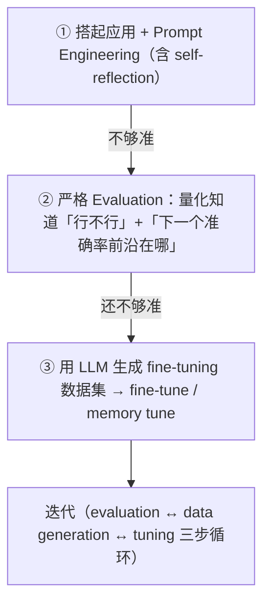

# L0 · 课程介绍：把 LLM 应用准确率推到「几个 9」

> 课程：Improving Accuracy of LLM Applications（DeepLearning.AI × Lamini × Meta）
> 讲师：Sharon Zhou（Lamini CEO，返场讲师）+ Amit Sangani（Meta Llama 团队 Director of Partnerships）+ Andrew Ng 开场
> 一句话：LLM 应用「有的地方很行、有的地方很拉」，本课给一套**系统性开发流程**把它从 ~30% 拉到 95%+，主线案例是 **Text-to-SQL**。

## 为什么需要这门课

LLM 应用能做过去计算机很难做的事（例如给数据库套一层自然语言接口），但表现极不均衡——**同一个应用在某些场景很好，在另一些场景反复出错**。原因在 L1 会技术性拆解：LLM 是高度概率化（highly probabilistic）的系统，从概率分布里采样，天然不确定；而准确率要求高的场景（下游打 API、对 ID、报表里的营收数字）容不得「差不多对」。

基础模型（如 Llama 3）在公开数据、公开任务上训练，**遇到专有数据（financial / customer / legal）或没专门训过的任务就掉链子**。Meta 把 Llama 开源，正是让开发者能针对自己的应用去 fine-tune。

## 核心方法论：一条「由简到繁」的准确率提升流水线

课程反复强调的原则：**fine-tuning 不是第一步，而是穷尽了更简单的选项之后才动用的手段**（Andrew 的话）。推荐顺序：

各技术的经验准确率天花板（L1 给出的数字，Text-to-SQL 场景）：

| 手段 | 大致能到 |
|---|---|
| Prompt engineering | 20–30% |
| + Self-reflection | ~40% |
| + RAG | ~50% |
| Instruction fine-tuning | 结果参差，RAG 上下浮动 |
| **Lamini memory tuning** | **95%+** |

## 两个反直觉的点

1. **「我数据不够」是个 myth**：你手上的数据大概率已经够了，而且可以用 LLM 自己去**放大（amplify）**已有数据——课程后半会做。
2. **fine-tuning 不再慢和贵**：靠参数高效微调 PEFT（如 **LoRA**，Low Rank Adaptation）时间和成本已大幅下降；Lamini **memory tuning** 更进一步，把事实直接嵌进权重，在单张 A100 / MI250 上几分钟教模型上千条新事实。

## 主线案例的量化目标

用一个 **128 条样本**的小数据集，把 Llama-3-8B 生成特定 schema SQL 的准确率**从 ~30% 拉到 95%**，约 30 分钟、花几美元；进一步用 memory tuning 可把单次流程压到 6–7 秒且准确率更高。

> **架构师视角**：这门课真正的资产不是「memory tuning 这个技术」，而是**「先便宜后昂贵、每一步都用 evaluation 卡住」的决策纪律**。很多团队一上来就 fine-tune，跳过了 prompt/RAG 能解决的 80%，既烧钱又难维护。把「准确率天花板 vs 手段成本」做成一张可复用的选型表，才是架构师该沉淀的东西。

> **对比课程 21 Evaluating AI Agents**：那门课讲「怎么评估一个 agent 的行为轨迹」；本课把 evaluation 放在**流水线的控制阀**位置——不是评完就完，而是评估结果直接驱动「要不要进入下一个更贵的手段」。评估在这里是决策依据，不是验收报告。

> **记忆点（引出 L1）**：本课把提升准确率定义成一个**迭代流程**而非一次到位。L1 会先补齐地基——Llama 3 的 prompt 格式与内建能力，并从概率分布的角度解释「幻觉到底为什么发生」，为什么 prompt/RAG 有天花板，以及 memory tuning 凭什么能把采样分布逼到「只剩正确答案」。

## 与我的资产映射

- 观测与评估：`agent/skills/agent-selection/5-observability-eval.md`（evaluation 作为准确率提升流水线的控制阀，而非事后验收）
- 选型矩阵：`[[project_selection_matrix]]`（「prompt → RAG → fine-tune → memory tune」是模型/微调层的成本-收益选型主线）
