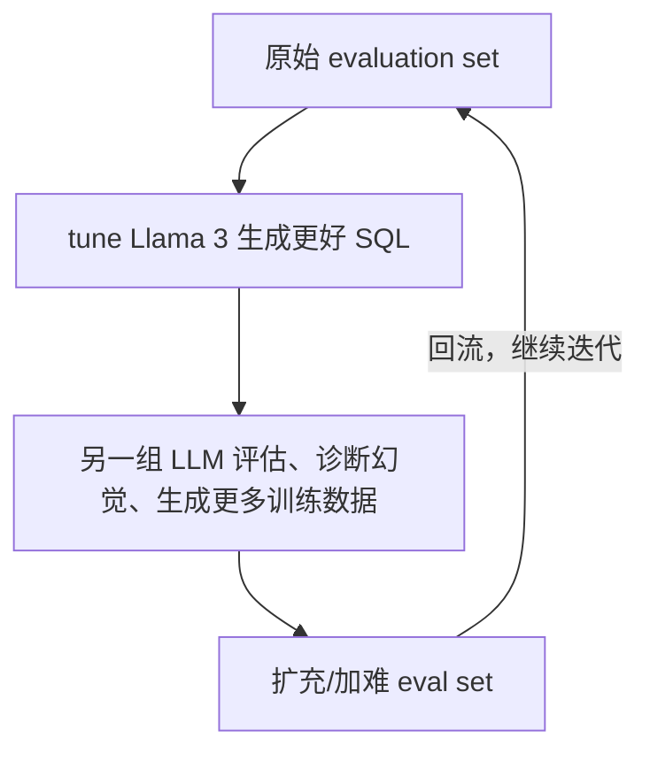

# L1 · 从概率分布看幻觉：Llama 3 基础与准确率提升路线图

> 课程：Improving Accuracy of LLM Applications（DeepLearning.AI × Lamini × Meta）
> 本课任务：① 掌握 Llama 3 的 prompt 格式和内建能力；② 从**概率采样**的底层视角理解幻觉为什么发生、为什么各种手段有天花板；③ 建立贯穿全课的「evaluation ↔ data generation ↔ tuning」迭代心智模型。
> 说明：本课 notebook 是 Meta 官方 **Llama recipes** 的一部分。

## 0. 本课定位

Sharon 开场先立一个基调：**LLM 应用是「另一种动物」（their own beast）**——因为它高度概率化（highly probabilistic），从概率分布里采样，输出天然不可预测，这和「给定输入必得固定输出」的确定性系统完全不同。推论直接影响开发方式：

> 你不可能像搭确定性系统那样「把所有 best practice 拼一次就对」；提升 LLM 准确率**本质是迭代**，把这个迭代过程内化，才有可能把准确率抬到 95%。

## 1. Llama 3 模型全景（Amit 部分）

| 维度 | 内容 |
|---|---|
| 架构 | 基于 transformer 的大语言模型 |
| 规模 | Llama 3 有 **8B** 和 **70B** 两档；越大学习容量越强，但训练/部署越贵 |
| Base vs Instruct | base 模型再跑一轮 **instruction tuning** → **Llama Instruct**，更会听「summarize this / tell me a joke」这类人类指令 |
| 本课选型 | **Llama-3-8B-Instruct**——小到能跑在笔记本上、低延迟，且开源可自由 fine-tune |
| 开源意义 | 可针对专有任务/数据继续 fine-tune，这是本课后半的前提 |

## 2. Llama 3 的 prompt 格式：特殊标签拼出来的对话结构

Llama 3 Instruct 用一套特殊标签把 system / user / assistant 三段拼进一个字符串。手写长 prompt 易错，所以课程封装了一个贯穿全课的工具函数：

```python
import lamini
llm = lamini.Lamini(model_name="meta-llama/Meta-Llama-3-8B-Instruct")

# 原始形态：特殊标签手工拼接
prompt = """\
<|begin_of_text|><|start_header_id|>system<|end_header_id|>

You are a helpful assistant.<|eot_id|><|start_header_id|>user<|end_header_id|>

Please write a birthday card for my good friend Andrew\
<|eot_id|><|start_header_id|>assistant<|end_header_id|>

"""
```

标签速查：`<|begin_of_text|>` 文本起始 → `<|start_header_id|>…<|end_header_id|>` 角色头（system/user/assistant）→ 角色消息 → `<|eot_id|>` end of turn。**结尾放一个空的 assistant header，等于告诉模型「轮到你答了」**。

课程还演示了 PEP 8 的括号折行技巧——把长字符串拆成多段并列，好处是**能给每段字符串加行内注释**：

```python
prompt2 = (
    "<|begin_of_text|>"                                 # 文本起始
    "<|start_header_id|>system<|end_header_id|>\n\n"    # system 角色头
    "You are a helpful assistant."                      # system 消息
    "<|eot_id|>"                                        # end of turn
    "<|start_header_id|>user<|end_header_id|>\n\n"      # user 角色头
    "Please write a birthday card for my good friend Andrew"
    "<|eot_id|>"
    "<|start_header_id|>assistant<|end_header_id|>\n\n" # assistant 角色头（等模型接话）
)
# prompt == prompt2  → True，两种写法等价
```

最终固化成全课复用的 `make_llama_3_prompt`：

```python
def make_llama_3_prompt(user, system=""):
    system_prompt = ""
    if system != "":                      # 有 system 才拼 system 段
        system_prompt = (
            f"<|start_header_id|>system<|end_header_id|>\n\n{system}"
            f"<|eot_id|>"
        )
    prompt = (f"<|begin_of_text|>{system_prompt}"
              f"<|start_header_id|>user<|end_header_id|>\n\n"
              f"{user}"
              f"<|eot_id|>"
              f"<|start_header_id|>assistant<|end_header_id|>\n\n")
    return prompt
```

## 3. Llama 3 天生会写 SQL（内建能力）

Llama 训练语料里有大量 SQL，因此**开箱即可生成 SQL**，甚至相当复杂的查询：

```python
question = ("Given an arbitrary table named `sql_table`, "
            "Can you calculate the p95 `height` "
            "where the `age` is above 20? Use sqlite.")
print(llm.generate(make_llama_3_prompt(question), max_new_tokens=200))
```

本课**只探索模型能生成什么、不执行**（后续 lab 才连库执行）。但这里已埋下伏笔——注意上面刻意加了 `Use sqlite`，因为不同方言差异会引出下一节的幻觉。

## 4. 幻觉：不是「胡说」，而是「差不多对当成对」

Sharon 给幻觉（hallucination）下的定义：**模型把「slightly right」误当成「right」**。有些场景无所谓（你说 hi 它回 hello），但下面这些场景「差不多对 ≠ 对」是致命的：

- **关键事实**：生日、财报里的营收数字；
- **需要精确性**：打下游 API、对具体 ID、对格式。

一个具体的 SQL 幻觉：Llama 3 生成一条用 `percentile_cont` 的漂亮查询——**在 MySQL 里能跑，但 SQLite 根本没这个函数**，直接失败。这就是「slightly right」害人的地方。

### 4.1 为什么各种手段都有天花板（概率分布视角）

问「Dave Aguilar 哪一年爬的金门大桥」，即便 RAG 灌进维基百科文章，模型答「He climbed it in ___」时是在**日期这一小簇概率空间里采样**：

```
概率空间示意（采样点分布）
   cat  ······ (边缘，几乎不采)      ← 不会答成 cat
   1981 ██████ (正确)
   1970 ███    (接近、可信→被采到 = 幻觉)
   1979 ██
```

- 它不会答「cat」（离得太远）；
- 但会在 1981 附近采到 1970——**这种「看起来合理的错」比答 cat 更有害**，因为你和它都不知道错了。

这解释了为什么 prompt / self-reflection / RAG 都压不死幻觉：**它们没有改变采样分布本身**，只是挪了挪概率质量。

### 4.2 SQL 幻觉的两种类型

| 类型 | 含义 | 例子 |
|---|---|---|
| **Invalid SQL** | 语法/函数错，压根跑不起来 | `percentile_cont` 在 SQLite 不存在；错列名、错 ID、错格式 |
| **Malformed SQL** | 语法合法但**语义全错**或返回 null | 薪资是 `"$9,945,830"` 文本，直接按字符串 `ORDER BY` 排序，选出的不是最高薪的人 |

NBA 薪资这个例子后面 L2 会亲手复现：把 `SALARY`（带 `$` 的文本）当数字排序 → 得到错误答案。

## 5. 幻觉的解药：memory tuning 把「loss 打到 0」

各手段的经验准确率天花板（Text-to-SQL）：

```
prompt engineering        20–30%
+ self-reflection         ~40%
+ RAG                     ~50%
instruction fine-tuning   参差（RAG 上下浮动，难逼模型「认定」正确答案）
Lamini memory tuning      95%+
```

- **instruction fine-tuning**（最常见的 fine-tuning 形式）**并不擅长消除幻觉**，还偏贵；
- **memory tuning**（Lamini 发明）：把事实**直接嵌进模型权重**，让模型能精确 recall，往这个高度概率化的过程里**注入一点确定性**。做法是把这些事实上的 **loss 逼近 0**——采样分布从「1981 附近一小簇」坍缩成「几乎只有 1981」。

关键取舍——**不是把模型 overfit 到所有东西上**：

> 目标是在**关键事实上极度精确**，同时**不牺牲**模型的泛化和 instruction following——否则就丢了「一开始为什么用 LLM」的意义。

## 6. 主线应用：SQL agent，以及贯穿全课的迭代循环

SQL agent 的工作流：**用户提问 → 模型生成 SQL → 对数据库执行 → 用户看到结果**。它为什么有价值（Sharon 调研的三个高频答案）：

1. **更好的用户体验**：业务/分析人员自然语言直接问数，不必排队等数据团队；
2. **运营效率**：数据团队不再被简单问题当瓶颈；
3. **可靠性**：调好的模型比业务用户自己手写 SQL（不懂全部数据模型）更可靠、覆盖更广。

全课的迭代闭环（每一步都是 LLM 调用，可规模化）：



三件事缺一不可：**评估模型、诊断幻觉+生成更多数据、扩充并提高 eval set 的 gold standard 难度**。

> **架构师视角**：这一课最值钱的不是标签语法，是**「幻觉 = 采样分布问题」这个归因框架**。一旦接受「prompt/RAG 只是搬概率质量、没改分布」，你就能预判它们的天花板，避免在 prompt 上无限打磨。架构决策变成：这个字段/事实**要不要确定性**？要 → 上 memory tuning 把 loss 打到 0；不要（欢迎创造性）→ 保持概率采样。**按「是否容忍差不多对」给每个输出分类，是选型的第一刀。**

> **对比 GuardrailsAI 的幻觉检测**：Guardrails 在**输出侧事后拦截**幻觉（生成完再校验/重试），是外挂护栏；memory tuning 在**权重侧从源头压低**幻觉概率。两者不互斥且互补——本课改分布、Guardrails 兜底残余错误。判断：能拿到训练数据、错误模式稳定 → 优先改分布（更省 token、延迟低）；错误长尾、无法穷举 → 加输出侧护栏。

> **对比 DSPy 的自动优化**：DSPy 把 prompt/few-shot 当可优化参数、用 metric 自动搜；但它仍在**概率采样层面**优化，天花板受本课第 4.1 节约束。memory tuning 动的是权重与 loss——是 DSPy 够不到的那一层。二者可叠：DSPy 榨干 prompt 空间，仍不达标再进 fine-tune/memory tune。

> **记忆点（引出 L2）**：本课在概念层讲清了「幻觉为什么发生」，并把 NBA 薪资排序当成活靶子。L2 动手搭出这个 SQL agent，连上 SQLite 真库，用 **structured output** 逼模型只吐 SQL，并**亲手复现**把 `$` 薪资当字符串排序的 malformed 幻觉——看着 Saddiq Bey 被错选成「最高薪」，再看正确查询选出 Steph Curry。

## 本课总结

| 要点 | 一句话 |
|---|---|
| LLM 是概率化系统 | 从分布采样 → 输出不确定 → 提升准确率本质是迭代 |
| Llama 3 选型 | 本课用 8B-Instruct：能上笔记本、低延迟、开源可微调 |
| prompt 格式 | 特殊标签拼 system/user/assistant，封装 `make_llama_3_prompt` 复用 |
| 幻觉本质 | 「slightly right 当成 right」；分 invalid（跑不了）/ malformed（语义错）两类 |
| 天花板归因 | prompt/RAG 只搬概率质量、不改分布，故 ~50% 见顶 |
| memory tuning | 把事实嵌进权重、关键事实 loss→0，注入确定性，达 95%+ 且不伤泛化 |

## 与我的资产映射

- 观测与评估：`agent/skills/agent-selection/5-observability-eval.md`（「幻觉归因 → 决定用哪层手段」的决策链）
- 选型矩阵：`[[project_selection_matrix]]`（模型层 Llama-3-8B 选型理由；微调层 instruction FT vs memory tuning 的分工）
- 幻觉治理路线：改分布（memory tuning）× 输出侧护栏（GuardrailsAI）× prompt 自动优化（DSPy）三条线的互补边界
