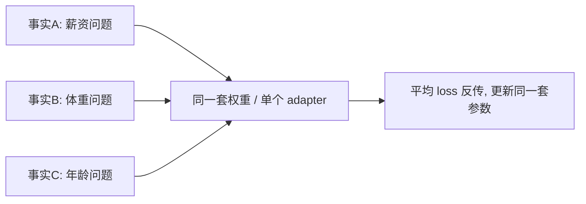
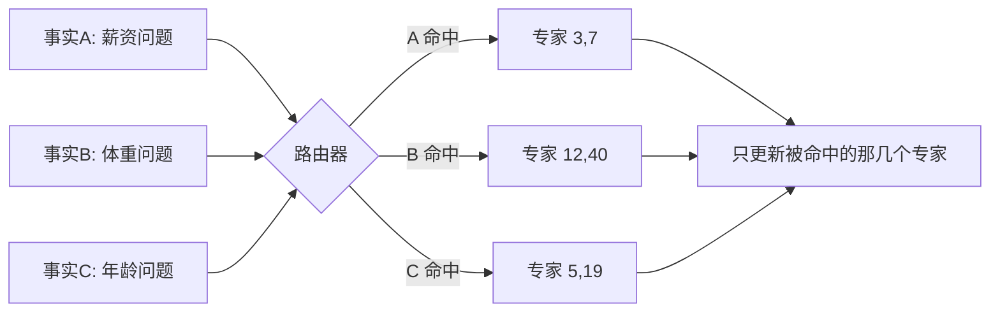

# L4 补充 · Fine-tuning 与 Memory Tuning 在训练层的异同

> 这篇是做完本地复现项目 `projects/nba_sql_tuner` 后回头补的。项目里我一度把两者的差
> 说成「学风格 vs 背事实」,后来用受控实验推翻了这个说法。这里把最终搞清楚的、**训练层
> 面**的异同蒸馏下来。核心结论:**训练方法相同,被训练的结构不同。**

## 一句话结论

> **同样的训练方法(LoRA + 梯度下降),训练的是不同的结构(一个共享 adapter vs 路由式多专家)。**

**MoME 到底长啥样(准确版)**:

> **memory tuning = 一个 base 模型 + 海量极小的记忆专家(LoRA);路由器按输入点亮其中几个、
> 和 base 叠加;最适合「大量独立、要精确记忆又互不干扰的查表事实」。**

注意两个常被说错的点:①**不是「好几个完整模型」**,是一个 base + 海量小 LoRA 补丁(存储/部署便宜);
②路由**不是切换整模型**,是选中少数几个专家和 base **叠加**。

memory tuning **是** fine-tuning 的一个子类,不是另一种学习范式;它的「本质区别」住在**模型架构**里,不在训练循环/优化器里。

---

## 一、共同点(训练方法层面 —— 完全相同)

在 Lamini 的实现里,fine-tuning 和 memory tuning:

- 都用 **LoRA**(低秩权重更新),不是全参数微调;
- 都是 **fine-tuning**——memory tuning 就是它的一个子类;
- **训练的「原子操作」一模一样**:
  - 同样的目标函数:next-token 交叉熵
  - 同样的反向传播、同样的优化器(AdamW 之类)
  - 同样的流程:`forward → loss → backward → 更新 LoRA 权重`

所以问「优化器 / 训练循环 / 学习规则有没有本质区别」——**没有,一模一样**。

---

## 二、不同点(架构层面 —— 唯一的真区别)

区别不在训练方法,在**被训练的结构**:更新的是「**一个**共享 adapter」还是「**一堆**专家 + 路由器」。

| | fine-tuning | memory tuning（Lamini MoME） |
|---|---|---|
| adapter 数量 | 1 个(共享) | 海量(可到百万级)极小专家 |
| 有没有路由 | 无,每条数据都更新同一个 adapter | 有,路由器按输入选中少数专家 |
| 每条数据更新哪些参数 | **所有事实共享的同一套** | **该事实专属**的稀疏子集(input-routed) |
| 能否把单条事实 loss→0 而不伤别的 | **不能**(共享参数互相打架/遗忘) | **能**(专家隔离,互不覆盖) |
| 记忆 ↔ 泛化 | 二者相互挤压,是取舍 | 用路由**分到不同参数**上,绕开取舍 |

MoME = **Mixture of Memory Experts**(记忆专家混合)。

### fine-tuning 的训练数据流

每条事实的梯度都灌进**同一套参数**,优化器只能找一个「平均最优」的折中。想把事实 A 的 loss
压到 0,那次更新会顺带**破坏** B、C 和通用能力——这就是「记忆↔泛化」取舍:**不可能既把具体
事实背到 loss=0、又不伤泛化**。

### memory tuning 的训练数据流

每条事实先被路由到**它专属**的几个专家,反向传播**只更新那几个**。后果:

- 背事实 A 只动专家 {3,7},背事实 B 只动 {12,40}——**互不覆盖**,所以每条事实都能**独立地把
  loss 逼到 ~0**(采样分布塌成「只剩正确答案」,呼应 L1 从概率分布看幻觉那条);
- 通用能力活在 base 模型和通用路径里,专家只在被命中时才发声,**不冲刷泛化**。

---

## 三、和普通 MoE 的区别

memory tuning 常被类比成 MoE,但目的不同:

| | 普通 MoE | MoME(memory tuning) |
|---|---|---|
| 专家为什么存在 | 分摊算力 / 扩容量 | **隔离记忆** |
| 专家数量与大小 | 少而大 | 极多而极小 |
| 训练目标 | 泛化 | 把各自那撮事实**训到过拟合**(loss→0) |

一句话:**MoME 相当于「为记忆而设计的 MoE」。**

---

## 四、怎么给它定性

- **不是**营销包装的普通 fine-tuning:它有真东西——路由 + 专家隔离,解决了「背事实就遗忘」的干扰问题;
- **也不是**新的学习范式:它是**在普通 fine-tuning 之上加了一层架构**;
- 创新点在**架构工程**,不在梯度下降本身。价值是真的,但要放对位置。

---

## 五、本地项目的实证与诚实边界

`projects/nba_sql_tuner` 用**单个** LoRA adapter 做了两档训练(finetune vs memory 预设)。因为
只有一个 adapter、**没有路由和多专家**,我的「memory 预设」退化成「fine-tune 得更狠」——结构
没变,所以训练上看不出本质区别。两个受控实验证明了这点:

- **受控实验(容量相同只变 epoch)**:memory_light(r32/3ep,loss 0.066)和 memory(r32/15ep,
  loss 0.0004)在 gold 上准确率都是 66.7% ——**把 loss 逼到 0 对准确率几乎没帮助**,领先靠的是
  容量,不是「loss→0」。
- **泛化探针(matched pairs)**:只有训到 loss≈0 的 memory 出现 seen 100% > unseen 83% 的
  **过拟合缺口**;finetune、memory_light 的 seen=unseen(完美泛化)。→ 单 adapter 下,把记忆
  往 loss→0 推,**迟早以泛化为代价**。

**这恰恰反证了 MoME 的价值**:真正的 memory tuning 用「多专家 + 路由」把记忆和泛化分到不同
参数上,才能**既把事实背到 loss→0、又不牺牲泛化**——而这一层(多专家+路由)本地单 adapter
复现不了,是项目最重要的诚实边界。要在训练层真看到区别,得搭一个「最小 MoME」(K 个独立专家
+ 简易路由器)。

---

## 六、常见误解:单个 adapter ≠ 一个 MoME 专家

做完项目容易生出一个直觉:「我训的这个 NBA-SQL 适配器,不就相当于 MoME 里那几个专家中的
一个(SQL 专家)吗?」——方向对(它确实是**任务专化**的),但会埋一个误解,要拧清楚。

**它其实不是「一个 MoME 专家」,而是「缩小到一个领域的 fine-tuning」**,两点关键区别:

1. **粒度不对**。MoME 的专家不是「一个任务一个专家」那么粗,而是**海量、极小、事实级**的——
   一个专家只兜**几条事实**,路由在**事实**层面发生。而我那**一个** adapter 是把**全部 22 条
   事实塞进同一个桶**,粒度差了好几个量级。
2. **专家的定义性质是「隔离」,单 adapter 没有隔离**。一个东西之所以叫专家,前提是有**路由器**
   把它和别的专家隔开(更新它不碰别人)。单 adapter 始终在线、和谁都不隔离;更要命的是,**桶内
   那 22 条事实仍共享同一套参数、互相打架**——泛化探针已把这个「打架」量化出来(训到 loss→0 就
   seen 100% > unseen 83%)。

> 所以单 adapter 不是「一个干净的专家」,而是**「把整个 fine-tuning 的干扰问题,缩到一个领域里」**,
> 内部照样有 fine-tuning 的老毛病。

**把心智模型拧准**:memory tuning 的价值不是「有一个 SQL 专家」,而是——

> **专家多到、每个只兜几条事实,于是两条会打架的事实永远不共享参数。**

**一个专家单独存在 ≠ memory tuning**。价值是从「大量互相隔离的专家 + 路由」里**涌现**的;把这套
东西塌回成一个桶,就又变回 fine-tuning 了。要让那个 adapter 名副其实地成为「一个专家」,还得再
具备:(1) 一堆兄弟专家各管各的;(2) 一个路由器只在 NBA-SQL 输入时点亮它、其余时候不碰它。
这正是 `08_mini_mome.py`(K 个独立专家 + 简易路由器)要补的东西。

---

## 七、两个容易踩的坑(源自「要不要搭 mini-MoME」的讨论)

设想把项目里那 22 条 NBA-SQL 事实**按类型聚成 K 组、每组一个独立 LoRA 专家 + 路由器**
(即 `08_mini_mome.py` 的构想)。「分得更细、隔离更好、互不干扰」——机制上对,但有两个坑。

### 坑一:隔离不是越碎越好(隔离的粒度)

- 「互不干扰」只到**组**的粒度:组与组之间不共享参数、不干扰;但**同一组内的事实仍共享那个
  专家的参数**。
- 而组内共享**恰恰是好事**:正因为薪资三条(Lakers/Celtics/Warriors)挤在一起,模型才学到
  「薪资要 REPLACE」这个**规律**、并能迁移到没训过的新队(泛化探针里 memory_light 对 Suns/Nets
  也对,就是这么来的)。
- 隔离到极致(**一条事实一个专家**):干扰归零,但**规律也不共享**了,换个新实体就不会——泛化
  没了。
- 所以 MoME 的手艺不是「全隔离」,而是**「把会打架的分开,把该共享规律的留在一起」**。

### 坑二:memory tuning 不是所有场景的菜(适用边界)

这是最该拿走的选型判断。关键分野是——**你要背的是「技能/模式」还是「独立的查表事实」**:

| 你要的东西 | 例子 | 该用什么 |
|---|---|---|
| **技能 / 模式**(要泛化) | SQL 怎么写、翻译、风格、格式 | 普通 **fine-tune + 早停**(甚至 prompt/RAG) |
| **大量独立、会打架的查表事实**(要精确记忆且互不污染) | 每个球员的确切薪资、每条合规条款、每个产品参数 | 才轮到 **memory tuning(MoME)** |

- 本项目那 22 条,本质是**一个技能(SQL 生成)的若干实例**,不是互不相干的独立事实。对技能要的是
  泛化,不是死记——而看到的那点过拟合(memory 把 unseen 从 100% 拉到 83%),**早停就解决了**
  (`memory_light` 3 epoch,unseen 满分)。**这里根本不需要 MoME,需要的是「别训过头」。**
- 推论:在这种**同质、pattern-instance** 的数据上搭 mini-MoME,只能演示**机制**(路由把参数分开),
  **演示不出真收益**(干扰本就轻、早停已解决)。要打出真实差距,得**换一批「独立会打架的查表事实」**
  数据(如把每个球员的确切薪资当独立事实塞进去,背住 A 不能扰动 B)。

---

## 八、架构师视角 / 选型含义

- 「prompt → RAG → fine-tune → memory tune」这条成本-收益主线里,**memory tune 是最贵的一级**,
  贵在它需要多专家+路由的架构与工程,不是「多训几轮」就能到;
- **要不要上 memory tuning,先做坑二那道判断**:是「技能/模式」还是「大量独立会打架的查表事实」。
  只有后者(企业问答、合规、产品目录这类**必须零幻觉的精确事实库**)才值得为「背事实不遗忘」这个
  架构付费;是技能就用 fine-tune+早停,别买错工具;
- 选型主线见 [[project_selection_matrix]];评估作为「便宜→昂贵」每一级控制阀的纪律见 L0 与
  `agent/skills/agent-selection/5-observability-eval.md`。
