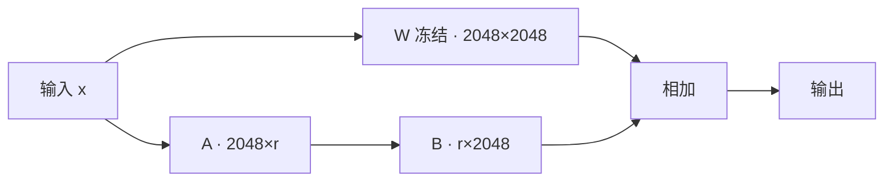

# L4 补充 2 · LoRA 是什么

> 承接 [[L4补-Fine-tuning与Memory-Tuning训练层的异同]]:那篇里反复出现的「LoRA / rank / adapter / 专家」
> 都建立在 LoRA 这一个技巧上。这里把它单独讲清。

## 一句话

> **LoRA(Low-Rank Adaptation,低秩适配)= 冻结原模型,只在旁边贴一小片可训练的「补丁」,
> 用极少参数完成微调。**

memory tuning 的「专家」,就是海量这种小补丁 + 路由。

---

## 一、要解决的问题

全参数微调 = 更新模型**全部**权重。SmolLM2-360M 有 3.6 亿参数,全更新一遍:算力、显存、存储
都吃不消,还容易把原模型学傻(灾难性遗忘)。

## 二、核心技巧:把「权重的改动」用两个小矩阵近似

关键观察(LoRA 论文,Hu et al. 2021):微调时权重的**改动量 ΔW** 信息很稀,可以用两个又瘦又小
的矩阵相乘来近似。

- 原权重 `W`(如 2048×2048,四百万个数)**冻结不动**;
- 旁边挂一条低秩支路:`ΔW = A · B`,其中 `A` 是 2048×**r**、`B` 是 **r**×2048,`r` 很小(8/16/32);
- 前向:`输出 = W·x + (A·B)·x`。**只训练 A、B,原 W 一动不动。**

`r` 从 2048 压到 8,参数量从 `2048×2048` 降到 `2×2048×8`——**少两个数量级**。

## 三、用本项目的真实数字感受

| | 训练的参数量 | 占 base 比例 |
|---|---|---|
| 全参数微调 | 360,000,000 | 100% |
| finetune 预设(r=8,只调 q/v) | 819,200 | 0.2% |
| memory 预设(r=32,调全 7 层) | 17,367,040 | 4.6% |

这就是训练日志里「可训练参数=819,200 / 17,367,040」的来历。

## 四、`r`(rank)= 一直在调的「容量」旋钮

- `r` 越大 → 支路能表达的改动越丰富 → **容量越大**(能学/记更多),参数也越多;
- 本项目 finetune(r8)vs memory(r32)的差,一大半就是这个 `r`。**受控实验证明:准确率主要
  来自 r 这个容量,不是「训到 loss→0」**(见 [[L4补-Fine-tuning与Memory-Tuning训练层的异同]] 第五节);
- `alpha`(lora_alpha)是给这条支路加的**缩放系数**(实际缩放 = alpha/r),控制 LoRA 影响强度。

## 五、为什么到处都用它

1. **省**:只训 0.2%~5% 参数,普通显卡甚至 CPU 就能跑(本项目 360M 在 CPU 上几分钟);
2. **小**:产物就是 A、B 两个小矩阵,存成几 MB 的 adapter 文件(`adapters/finetune/`);
3. **可插拔**:base 不变,adapter 想挂就挂、想合就合(`merge_and_unload`)——**这正是 MoME 能挂
   「海量小专家」的前提**:每个专家就是一个极小的 LoRA;
4. **不易遗忘**:原权重冻结,通用能力保住。

---

## 记忆点

> **LoRA 让「微调」从「重训整个模型」变成「给模型旁边贴一小片可训练补丁」。**
> rank `r` = 补丁的容量;memory tuning 的专家 = 海量这种补丁 + 路由。
