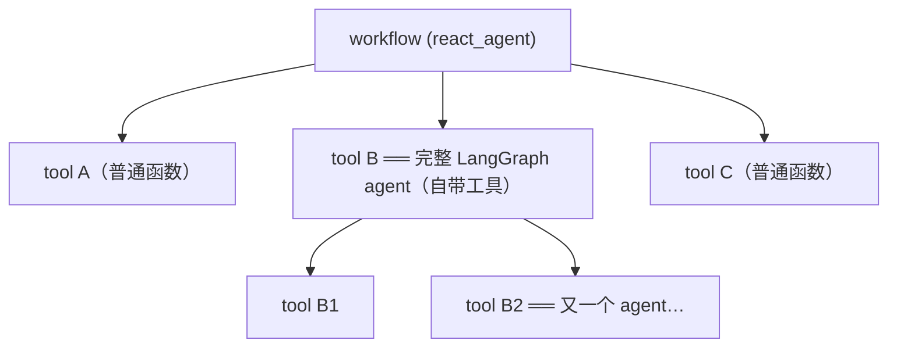

# 课程总结 · Nvidia's NeMo Agent Toolkit: Making Agents Reliable

> 课程:DeepLearning.AI × Nvidia,讲师 Brian McBrayer(Nvidia Solutions Architect)
> 贯穿项目:一个分析 NOAA 真实气候数据(1210 条记录、1950–2025、10 国)的 climate agent,从"会聊天的裸 LLM"一路长成"多框架组合、可观测、可评测、带生产 API 和 UI"的完整系统。

## 一句话定位

**NAT 不是又一个 agent 框架,而是压在既有框架(LangGraph/CrewAI/裸 Python)之上的"生产化外壳"**——用一份 YAML config 统一解决 Day 2 三件事:observability、evaluation、deployment。Day 1 的框架选型和 Day 2 的生产化选型由此解耦。

## 核心论点(全课骨架)

### 1. Day 2 Problems:建完 Agent 之后的五类麻烦

Day one is building the agent, **day two is everything else**:集成复杂度 / 可重复性 / 代码复用 / 性能与成本 / 生产要求。五项全是横切关注点,不依赖具体框架——这决定了 NAT 做"框架之上的统一接口层"而非替代框架。

### 2. Config-driven:一份 YAML 是单一事实源

agents、tools、LLM 选择、telemetry、eval 全部声明在 config 里,不硬编码进代码。CLI 五动词共享同一份配置:

| 命令 | 作用 | 对应环节 |
|---|---|---|
| `nat run` | 单输入跑一遍 | 开发 |
| `nat serve` | 起 OpenAI 兼容 API(FastAPI:WebSocket + OpenAPI docs + 健康检查) | 上线 |
| `nat eval` | 对数据集跑评测(内置 Ragas,可插拔) | 回归 |
| `nat optimize` | Optuna + 遗传算法自动调参 | 调优 |
| `nat validate` | 校验配置 | 保障 |

红利:换 LLM / 加工具 / 改重试上限,**改配置不改代码**;每份 config 是可版本化、可对照实验的 artifact。代价:config schema 是 NAT 私有的(软锁,写进 ADR)。

### 3. 一切皆函数:耦合最低的多 agent 组合

NAT 的组合原语只有 `FunctionInfo`——普通 Python 函数、LangGraph agent、外部服务,注册进来一律坍缩成"函数",组合天然递归:

注册三要素:Pydantic 输入 schema + Config 类(YAML 通道)+ `@register_function` 装饰器。**面向模型的契约(schema + description)和面向运维的契约(Config)从第一行代码就分开**。包完整 agent 时多两样:`framework_wrappers`(让观测/评测穿透进子 agent)和 `builder.get_llm`(把硬编码 LLM 抬进配置)。

### 4. 可靠性三件套:围栏 → 观测 → 评测

- **围栏**(L3):`max_iterations` / `max_retries` 做成一等配置项,先防 ReAct 循环失控烧 token;
- **观测**(L4):config 加 `general.telemetry.tracing` 一节,OTel 数据流向 Phoenix(埋点层认标准、后端可换)。**Observability 回答 how**;
- **评测**(L6):config 加顶层 `eval` 节 + QA 数据集,`nat eval` 打分。**Evaluation 回答 if**。

> Without observability, we don't know **how** our agent arrived at a correct answer.
> Without evaluations, we don't know **if** our agent arrived at a correct answer.

## 三个实战案例(面试可直接引用)

| 案例 | 症状 | 诊断与修复 | 教训 |
|---|---|---|---|
| **正确但低效**(L4) | 一条查询答案对,但 trace 里 15 次工具调用 / 3000 tokens / 8 秒 | 缺 station 工具,agent 用现有工具低效模拟;加工具后延迟拉平 | 工具集完备性靠 trace 形状验收,不靠答案对错:健康的 trace 短而直,缺工具的 trace 长而绕 |
| **会检索不会算数 → 幻觉**(L5) | 数据取对了,数学推算环节 thrash 后编了个结果 | 把现成 LangGraph 计算器 agent 包成 NAT 工具 | agent 不会报错说"我缺能力",而是幻觉补位;能力缺口用组合补,不用重写 |
| **自信的错答案**(L6) | 问 1980 年均温,agent 自信地答了 1950–2025 全区间均值(9.574 vs 6.8) | eval 0/1 → 读推理步骤发现没传 year 参数 → 收紧指令 → 1/1 | 人眼查不出"语气自信、数字不离谱"的错;grounded evals 是回归门禁,不是上线仪式 |

## L0–L7 路线

| 课 | 一句话 |
|---|---|
| L0/L1 | 问题框架:60% 可靠的 demo → 生产,隔着 Day 2 五类难题;NAT = 框架之上的统一接口层,config driven |
| L2 | 最小 YAML(llms + workflow 两节)→ `nat run` 跑通 → `nat serve` 变 OpenAI 兼容 API |
| L3 | Python 函数注册为工具(Pydantic schema + Config + 装饰器),workflow 换 `react_agent`,加围栏 |
| L4 | 几行 config 接 Phoenix tracing,trace 定位"正确但低效",补工具、换 project 名做前后对照 |
| L5 | LangGraph 计算器 agent 包成 NAT 工具,LLM 抬进配置,多框架 agent 组队 |
| L6 | 顶层 `eval` 节 + Ragas AnswerAccuracy,抓住并修复"自信的错答案" |
| L7 | `nat serve` 生产 API(WebSocket/OpenAPI/健康检查)+ 独立开源 UI,API-first 收官 |

## 架构师裁决(选型结论)

**选 NAT 当**:团队多框架混用、需要统一编排与观测出口;想要"改 config 不改代码"的实验与回归工作流;serving 环节想一并解决;认同 NVIDIA 生态。

**选替代当**:深度单栈 LangChain 且要托管协作平台 → LangSmith;只缺 tracing + 代码式实验、要开源自托管 → Phoenix/Arize(注意 NAT 的 trace 本就外发给 Phoenix,常是互补);组织已有 ML 平台 → MLflow。

**两条核心判据**:① 缺的是"观测/评测单点"还是"观测+评测+部署一体化"——缺单点别引入整个工具包;② agent 栈是单框架还是多框架——单框架用原生生态摩擦更小,**多框架才是 NAT 统一层价值最大的地方**。

**锁定成本**:双层软锁——NAT 私有 config schema + 被包框架本身;埋点层因认 OTel 标准可换后端,eval 表达力受限于 input/output pair 范式(超出要写 wrapper)。

## 与我的资产映射

- 可观测/评测层:`agent/skills/agent-selection/5-observability-eval.md`(埋点层 vs 后端分层;声明式 vs 代码式评测;裁决块可回填)
- 部署层:`agent/skills/agent-selection/9-serving-deployment.md`(框架自带 serving vs 手写服务层;进程内组合 vs 服务化组合)
- 工具层:`agent/skills/agent-selection/4-tools.md`(FunctionInfo 与 MCP、LangChain `@tool` 的工具契约对照)
- 框架层:`agent/skills/agent-selection/2-framework/`(NAT = 元编排层,不参与 Day 1 框架选型)
- 方法论对照:课程 21《Evaluating AI Agents》(评什么怎么评 ↔ NAT 把评估变成流水线基建)
- [[project_selection_matrix]]
