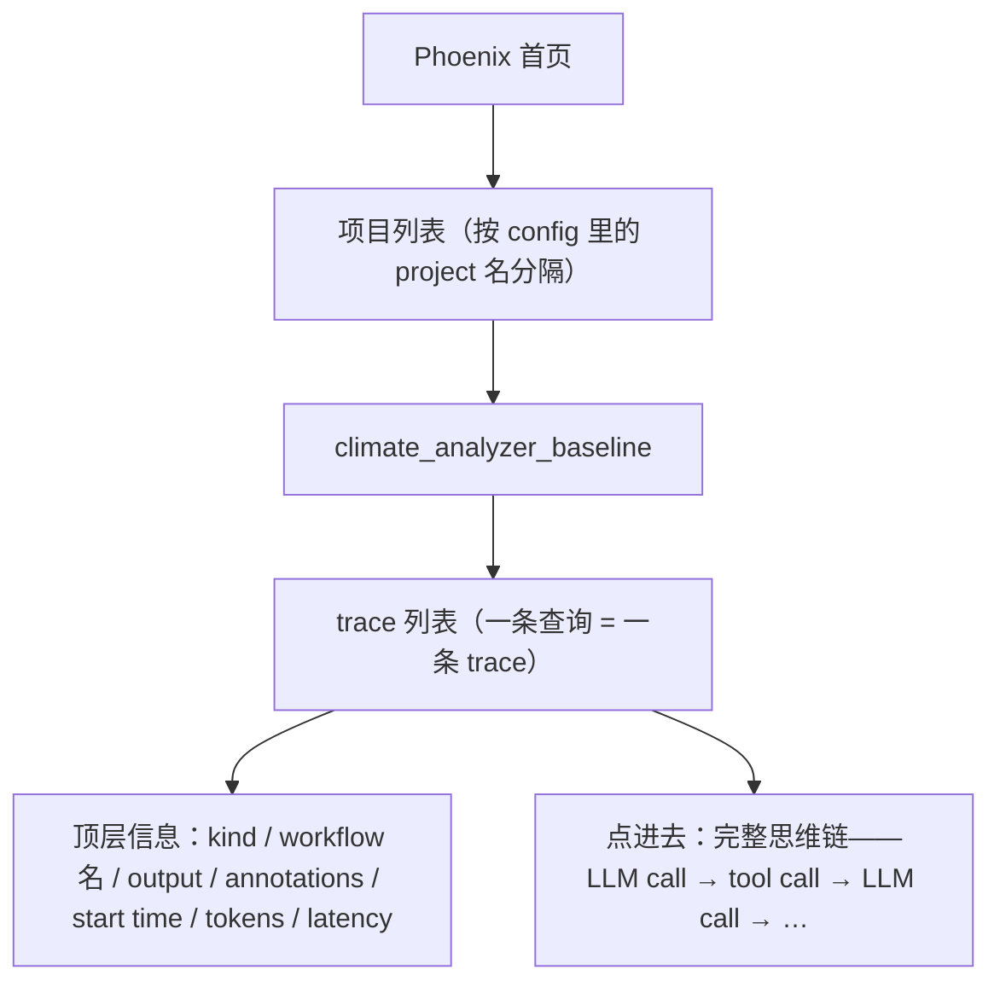
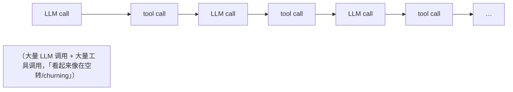

# L4 · 用 Phoenix 追踪定位并修复"正确但低效"的工具循环

> 课程：Nvidia's NeMo Agent Toolkit: Making Agents Reliable（DeepLearning.AI × Nvidia）
> 本课任务：只改**几行配置**，给 L3 的气候 agent 接上 OpenTelemetry tracing → Phoenix，实地演示一个完整的观测驱动优化闭环：**看 trace → 发现某条查询在空转 → 加一个缺失的工具 → 前后对比验证延迟骤降**。

## 0. 本课目标与路线

1. 起一个 Phoenix server，看观测数据流入；
2. 分析 trace 定位性能瓶颈，优化工具使用；
3. 改 config 前后**对比 workflow 性能**；
4. 理解 NAT 的统一观测流（unified observation stream）。

## 1. 什么是 observability，NAT 的独特之处在哪

**Observability = 通过检视输出来理解 AI workflow 内部发生了什么**。在单个函数层面做到这点不难；NAT 的能力在于**对所有函数统一启用**——无论那个"函数"是：

- 一个自带工具、自身已做观测埋点的复杂 **sub-agent**，还是
- 一个简单 Python 函数，

NAT 都把它们的观测数据统一送往你指定的 observability server。

为什么值得做——口播给的例子：用户问"哪个国家气象站最多？"

| 无观测 | 有观测 |
|---|---|
| 等一会儿，"最终"拿到正确答案 | 看到这个正确答案背后是 **15 次工具调用、3000 tokens、8 秒延迟** |
| 没有任何优化线索 | "这可能是以后可以优化的点" |

**正确 ≠ 高效**——这是本课反复敲打的一句话。

## 2. 配置 tracing：真的只有几行 YAML

在 L3 那份已有 llms / functions / workflow 的 config 里加一个 `general` 节：

```yaml
general:                    # NAT 全局配置节（与 llms/functions/workflow 平级）
  telemetry:                # telemetry 下有多种类型：logging、tracing…
    tracing:
      phoenix:              # target 名，可任意起；可同时配多个 target
        _type: phoenix      # 目标类型
        endpoint: http://localhost:6006/v1/traces   # 指向已启动的 Phoenix server
        project: climate_analyzer_baseline          # 项目名，Phoenix 用它分隔数据
```

要点：

- **可插拔**：NAT 能发出 OpenTelemetry 或其他多种观测数据；缺哪种就写个 adapter 插进去；
- **多 target**：可以同时挂多台 Phoenix、再挂一台 Prometheus——tracing 下就是一个 target 列表；
- 这几行**就是全部**——agent 代码零改动，数据开始流向 Phoenix。

> **对比 5-observability-eval.md 的"埋点层 ≠ 后端层"**：NAT 在这张分层图里扮演的是**埋点层**（类似框架原生 callback），自动为每个 function/LLM call 织出 span；`_type: phoenix` 那行选的才是**后端**。因为发出的是标准 OTel 数据，后端理论上可换——这是选型页说的"埋一次、后端任意换"路线；而 target 类型由 NAT adapter 生态决定，属于同页"软锁"清单要写进 ADR 的一项。

## 3. Phoenix：Arize 出品的观测 UI + server

Phoenix 平时一条 `phoenix serve` 就能起（notebook 环境里要多跑几条命令让它后台运行）。UI 侧的心智模型：



示例截图里一眼能看到某次 agentic workflow 的 LLM 调用、agent 决定调的工具、工具结果，以及**这一次调用花了 26 秒**——"这就是 observability 的真正威力"。

## 4. 实战：三条查询，一条明显异常

装好 `climate_analyzer` 包，跑三条查询（config 用 baseline 项目名）：

1. 加拿大的升温速率？
2. 第二冷的年份是哪年？
3. **哪个国家的气象站最多？**

切到 Phoenix：项目 `climate_analyzer_baseline` 下出现 **3 条 trace**，一一对应。看列表页的 latency 列——**有一条比其他两条慢得多**。钻进去看思维链：



**诊断结论**（分析各次调用后得出）：agent 在找**气象站（station）数据**，但我们**没有给它一个专门取站点数据的工具**——于是它绕着圈子，从其他工具里东拼西凑各种信息碎片来凑站点答案。答案最后是对的，代价是海量的迭代。

> **架构师视角**：这是"工具集设计缺口"的标准症状——agent 不会报错说"我缺工具"，而是**用现有工具低效地模拟缺失的工具**，表现为 trace 里的长尾延迟和 token 暴涨。所以工具集是否完备，不能靠答案对错来验收，要靠 trace 的形状来验收：**健康的 trace 短而直，缺工具的 trace 长而绕**。这也解释了为什么观测要在 eval 之前进课程——eval 只告诉你对没对，trace 告诉你为什么慢。

## 5. 修复与前后对比：加一个工具，换一个项目名

修复动作全部发生在**新的 config 文件**里（复制旧 config 再改）：

```yaml
functions:
  # …原有工具不变（省略）…
  station_statistics:            # ① 新增：专门的站点统计工具
    _type: climate_analyzer/station_statistics

workflow:
  _type: react_agent
  tool_names: [ …, station_statistics ]   # ② 注册进 react_agent

general:
  telemetry:
    tracing:
      phoenix:
        project: climate_analyzer_improved  # ③ 换项目名→新旧 trace 分开对比
```

换 project 名是个小而实用的习惯：旧调用、新调用在 Phoenix 里各占一个项目，**天然形成 before/after 对照组**。

用新 config 重跑同样三条查询，回 Phoenix 看新项目：三条 trace **latency 变得彼此接近**——说明 agent 用上了新的 station 工具，那条异常查询的延迟被大幅砍掉。

**结语（口播原话意译）**：没有观测，agent 也在返回正确信息；有了观测，我们才能砍掉多余的 token、多余的 LLM 调用和系统延迟。

> **对比 DSPy 课的 MLflow tracing 与课程 21 的 Phoenix**：三者是同一件事的三个入口——DSPy 用 `mlflow.autolog()` 在**优化循环**里看 trace（服务于 MIPROv2 调 prompt），课程 21 用 Phoenix 做 **experiments/eval**（服务于版本对比打分），本课用 Phoenix 做**运行时性能诊断**（服务于工具集补缺）。平台可以是同一个 Phoenix，问的问题不同：*prompt 好不好 / 答案对不对 / 过程贵不贵*。选型时别按平台分，按你要回答哪个问题分——见 5-observability-eval.md 的"平台 vs eval 分开选"。

## 6. 本课总结

| 要点 | 一句话 |
|---|---|
| 统一观测流 | NAT 对所有函数（sub-agent 或普通函数）统一发观测数据到任意 server |
| 接入成本 | config 加 `general.telemetry.tracing` 一节即可，代码零改动；可插拔、可多 target |
| Phoenix | Arize 的 UI + server；project 分隔数据，trace 里能看 LLM/tool 调用链、tokens、latency |
| 诊断模式 | 正确 ≠ 高效；长尾 latency + 高频 tool call = 疑似工具缺口 |
| 修复闭环 | 加 `station_statistics` 工具 + 换 project 名 → 重跑对比 → 三条查询延迟拉平 |

> **记忆点（引出 L5）**：本课补工具的方式还是"再写一个 Python 函数"。但如果 agent 缺的不是一个函数，而是一整块能力——比如复杂数学计算——而你手里恰好有一个现成的 **LangGraph agent** 呢？L5 展示 NAT 的杀手锏：把任何框架写的完整 agent **当成一个普通函数注册进来**，让多框架 agent 组成一支协作团队。

## 与我的资产映射

- 观测·eval 层选型：`agent/skills/agent-selection/5-observability-eval.md`（埋点层/后端分层——NAT=埋点层、Phoenix=后端；软锁写 ADR）
- 课程 21 Evaluating AI Agents：同一个 Phoenix，L9 用于 experiments/convergence 评估，本课用于运行时诊断——平台复用、问题不同
- DSPy 课：MLflow tracing 服务于 MIPROv2 优化循环，与本课"trace 驱动工具集补缺"互为镜像
- 面试素材："正确但低效"案例（15 次工具调用/3000 tokens/8 秒）是讲"为什么 agent 必须上观测"的现成故事
- [[project_selection_matrix]]
