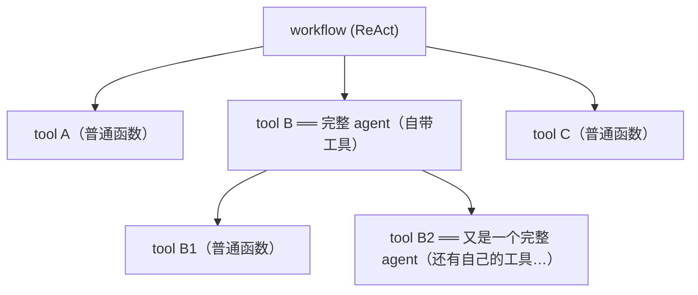

# L5 · 跨框架组合：把 LangGraph 智能体包成 NAT 工具

> 课程：Nvidia's NeMo Agent Toolkit: Making Agents Reliable（DeepLearning.AI × Nvidia）
> 本课任务：气候 agent 不会做数学、遇到计算题会**幻觉**。手里恰有一个现成的 LangGraph 计算器 agent——把它注册成 NAT 工具（对 NAT 来说"只是又一个 Python 函数"），顺手把硬编码的 LLM 抬进配置，见识 NAT 的**统一编排层**如何让多框架 agent 组队干活。

## 0. 本课目标与路线

1. 把任意框架写的**现成 agent** 集成为 NAT 工具（agentic composition 扩展 workflow 能力）；
2. 把 agent 里**硬编码的 provider（如 LLM）抬进配置**，方便后续实验迭代；
3. 看 NAT 如何编排多个 agent 框架协同工作。

## 1. 动机：有时候工具不够用（tools just aren't enough）

当前 Climate Analyzer 能取气温数据、算基础统计、画图，但这三类问题它**做不了**：

| 问题 | 缺什么 |
|---|---|
| 气温的复合年增长率（CAGR） | 复杂数学 |
| 人口加权平均 | 多步计算 |
| 可再生能源何时达到 X 吉瓦 | 复杂推算/projection |

**失败演示**：问它印度气温统计 + 数学推算，跑 workflow 看它失败——

- 它正确取到了印度的气温数据（检索没问题）；
- 然后**反复调用 `calculate_statistics`**，试图对各种年份算统计，**包括数据集里根本不存在的年份**；
- 空转（thrash）一阵之后，**为了给出我们想要的答案而幻觉了一个结果**。

诊断：数据它拿到了、需要的数值它知道，**但它不会做数学**——于是大概率幻觉。它是个好气候 agent，但不是数学 agent。

## 2. 现成资产：LangGraph 计算器 agent

另有一个**完全独立、与 NAT 毫无关联**的 agent：LangGraph 写的多步计算器 agent，已建好、battle-tested、开箱即用，自带一组数学工具：

- basic math（基础运算）
- `percentage_change`（百分比变化）
- `compound_growth_rate`（复合增长率）
- 及其他数学工具

单独试跑：把某国的排放数据与逐年降幅塞进 prompt，要它做推算——能看到它逐年推理排放量，最终给出 2025 年的计算结果。数学能力没问题。

## 3. 集成：对 NAT 来说，一个 agent 就是又一个函数

集成方法与 L3 注册普通 Python 函数**完全同一套样板**，只有两处变化（按口播摘录简化）：

```python
@register_function(
    config_type=CalculatorAgentConfig,
    framework_wrappers=[LLMFrameworkEnum.LANGCHAIN])  # 变化①：声明被包的是
async def calculator_agent(config, builder):          #   LangChain 系 agent
    # 变化②：L3 里没用过的 builder 这次派上用场——
    # 不再把 LLM 硬编码在 LangGraph agent 里，而是向 builder 要
    llm = await builder.get_llm(
        "calculator_llm",                              # YAML 里定义的 LLM 名
        wrapper_type=LLMFrameworkEnum.LANGCHAIN)       # 包成 LangChain 可用的适配器

    agent = create_calculator_agent(llm)               # 用配置来的 LLM 建 agent

    async def _wrapper(question: str) -> str:
        return await agent.ainvoke(question)           # 调 agent 本体，返回结果

    yield FunctionInfo.create(fn=_wrapper,
                              description="多步数学计算 agent")  # 老朋友 FunctionInfo
```

两处变化各自的意义：

1. **`framework_wrappers=LANGCHAIN`**：告诉 NAT 被包的是 LangGraph（因而是 LangChain 系）agent——NAT 借此把 **observability 和 evaluation 工具更深地织进这个被包 agent 内部**（L4 的 trace、L6 的 eval 都能穿透到子 agent）；
2. **`builder.get_llm(...)`**：LLM 从硬编码变成 YAML 可配——这就是"lift hard-coded providers up out of the agent into configuration"。

## 4. 配置：给计算器 agent 一个专属 LLM

```yaml
llms:
  climate_llm: ...              # 原有 LLM 不变
  calculator_llm:               # 新增：计算器专属 LLM（也是 NIM）
    _type: nim
    # …参数与 climate_llm 类似…
    max_tokens: 1024            # 数学计算输出短，单独约束 token 上限

functions:
  # …气候工具全部不变（此处省略）…
  calculator_agent:             # 整个 LangGraph agent = 一个普通函数
    _type: climate_analyzer/calculator_agent

workflow:
  _type: react_agent
  tool_names: [ …全部气候工具…, calculator_agent ]   # agent 只是又一个工具
  llm_name: climate_llm
```

专属 LLM **不是必须的**（多个工具可共用一个 LLM），单独定义是为了独立约束 `max_tokens`；其他被包 agent 可能需要单独调 temperature 等参数——**每个子 agent 的 LLM 参数独立可调**，全在配置层完成。

## 5. Agentic composition：工具可以是 agent，递归组合



原本一堆 agent 各自独立运行，现在能组合到一起——**agent 与 agent 通信、互相借用能力**。集成前问不了"对气候数据做数学计算"；集成后气候 agent 的检索能力 × 计算器 agent 的数学能力 = 更好的答案与分析。

这就是**统一编排（unified orchestration）**：LangGraph agent、CrewAI agent、自定义 FastAPI 服务——都能包一层、交给 NAT 的统一编排层去调度。

> **架构师视角**：NAT 的组合原语只有一个——`FunctionInfo`。普通函数、LangGraph agent、外部服务，进了 NAT 一律坍缩成"函数"这一种抽象，于是组合天然递归、编排器无需知道工具背后是不是 agent。对照 crewAI（组合原语是 crew/task 层级）和 AutoGen（原语是对话），**"一切皆函数"是耦合最低的多 agent 组合方式**——子 agent 换实现、换框架，父 workflow 的 YAML 一个字都不用改。代价是父 agent 只能看到 description，看不到子 agent 的内部规划能力，任务切分粒度要靠 description 写清楚。

> **对比 9-serving-deployment.md**：本课的组合是**进程内**的——LangGraph agent 被 import 进同一个 Python 进程，以函数调用通信，零网络开销、但同生共死。选型页的另一条路是把子 agent 各自 serve 成服务（L2 已看到 `nat serve` 一条命令出 REST API），跨进程组合、独立伸缩/部署，代价是网络与运维复杂度（再往上是 A2A 这类跨组织协议）。判据：子 agent 归同一团队、生命周期一致 → 进程内包装；异构团队/独立发布/需独立伸缩 → 服务化。

## 6. 验证：同一个问题，从幻觉到正确

用新 config 重跑第 1 节那个让 agent 幻觉的印度问题：

1. agent 先取印度气候信息（气候工具，同前）；
2. 到该算数的环节，**决定调用 `calculator_agent`**；
3. 计算器 agent 运行、输出结果；
4. 最终给出**非幻觉**的答案：印度 2050 年气温约 **25.24°C**。

收尾复盘（口播）：本课做的事——①把 LangGraph agent 里硬编码的 LLM 移进 NAT config（不硬编码、可配置）；②告诉 NAT 它是 LangChain agent（获得更深的兼容/观测/评估集成）；③注册本身对 NAT 而言就是又一个工具、又一个任何 NAT workflow 都能调的 Python 函数。NAT 的 **config-driven development 得以贯穿所有 agent**。

## 7. 本课总结

| 要点 | 一句话 |
|---|---|
| 失败模式 | 会检索不会算数的 agent 不报错，而是 thrash 后幻觉答案 |
| 集成方法 | 与注册普通函数同一套样板：`register_function` + wrapper + `FunctionInfo` |
| 两处新东西 | `framework_wrappers=LANGCHAIN`（深度集成观测/评估）+ `builder.get_llm`（LLM 抬进配置） |
| 专属 LLM | `calculator_llm` 单独限 `max_tokens: 1024`——每个子 agent 参数独立可调 |
| 统一编排 | 工具可以是完整 agent，递归组合；LangGraph/CrewAI/FastAPI 服务皆可包装 |
| 验证 | 印度 2050 ≈ 25.24°C，从幻觉到非幻觉 |

> **记忆点（引出 L6）**：本课"从幻觉到正确"的验证，靠的还是**跑一条查询、肉眼看输出**——样本量 = 1。改 config、换 LLM、加子 agent 之后，怎么确信整个系统没在别处回归？L6 进入 NAT 的 **evaluation 框架**：构建带 ground truth 的数据集，系统化地度量 agent 与 workflow 表现，用数据驱动的方式放心迭代。

## 与我的资产映射

- 框架层选型：`agent/skills/agent-selection/2-framework/`（NAT 定位是框架之上的**元编排层**——不替换 LangGraph/CrewAI，而是包装它们；scorecard 的"软锁"维度在此变成双层锁：NAT config + 被包框架）
- 部署层：`agent/skills/agent-selection/9-serving-deployment.md`（进程内组合 vs 服务化组合的分野，见上文对比块）
- 课程 A2A：进程内函数组合 → 服务化 → 跨组织协议，三级 agent 组合光谱的第一级在本课
- 面试素材："会检索不会算数 → 幻觉"是讲 **agent 能力边界与组合必要性**的现成案例；"LLM 从硬编码抬进配置"对应 config-driven 迭代实践
- [[project_selection_matrix]]
