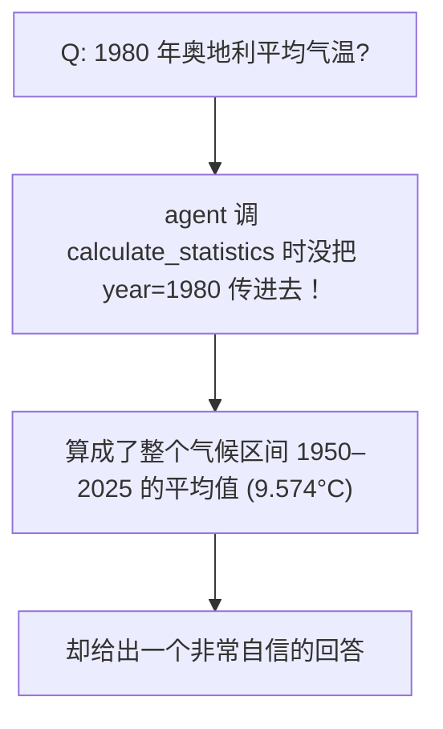

# L6 · 用 nat eval 评测工作流并修复"自信的错答案"

> 课程：Nvidia's NeMo Agent Toolkit: Making Agents Reliable（DeepLearning.AI × Nvidia）
> 本课任务：用 NAT 内置的评测框架，给 climate_analyzer 工作流建 ground truth 数据集、跑 `nat eval` 打分——并借此**在"生产"工作流里真实地揪出并修复一个 bug**。

## 0. 前课衔接与本课目标

L5 把一个现成的 LangGraph calculator agent 封装成 NAT tool 组合进了 climate agent——工作流已经"够强"。但强不等于**对**：本课回答"agent 给的答案到底对不对"。路线：建 QA 数据集（含 ground truth）→ 在 config 里声明 evaluator → `nat eval` 打分 → 从评测输出里定位 bug → 修复 → 重跑评测确认。

## 1. 为什么要评测：drift 不会自己报警

讲师给的动机非常工程化：**我们经常把东西发上生产，它也确实能工作——但之后某些东西会 drift，而我们抓不到**。比如换了个模型、改了个 prompt。**Evaluations help keep our agents honest（评测让 agent 保持诚实）**。

课程里最值得抄下来的一句对仗：

> Without **observability**, we don't know **how** our agent arrived at a correct answer.
> Without **evaluations**, we don't know **if** our agent arrived at a correct answer.

可观测性回答"怎么得出的"，评测回答"得出的对不对"——两者缺一不可。

> **架构师视角**：这就是 5-observability-eval.md 里"trace 是解释器、eval 是裁判"的分工在具体工具链上的落地。更重要的是把 eval 定位成**回归门禁**而非一次性验收：模型升级、prompt 修改、函数替换，任何一次变更后重跑同一套 grounded evals，才是"敢改配置"的底气来源——评测集是变更管理的基础设施，不是上线前的仪式。

## 2. NAT 的评测流程与可插拔设计

NAT 评测流程极简：**给它一个"输入 + 期望输出"列表的数据集 → NAT 拿数据集对你的 agentic 系统跑一遍 → 打分：多少对、多少错**。

两层可插拔：

| 层 | 说明 |
|---|---|
| 内置框架 | NAT 内置多个评测框架，本课用 **Ragas**（有 groundedness、AnswerAccuracy 等多种 metric，详见文档） |
| 自定义框架 | 如果你的评测框架无法表达成 input/output pair，NAT 的 eval 系统是 pluggable 的——**给自己的框架写一层 wrapper** 即可接入 |

而接入方式延续全课主线：**只需在 YAML config 里加一段 eval 属性，然后跑 `nat eval`**——不写评测驱动代码。

## 3. eval 配置：config 里新增的顶层节

配置文件的 LLMs（climate_llm / calculator_llm）、functions（climate + calculator）、workflow 都是前几课写过的，本课只新增一个**顶层 `eval` 节**：

```yaml
eval:
  general:                       # 通用配置
    output_dir: ./eval_output    # 评测结果输出到哪、跑完是否清理
    dataset:
      file_path: simple_eval.json  # 数据集从哪加载
  evaluators:                    # 可配置一个或多个 evaluator
    answer_accuracy:             # 自己起的名字
      _type: ragas               # 用内置的 Ragas 框架
      metric: AnswerAccuracy     # Ragas 众多 metric 里选这个
      llm_name: climate_llm      # 该 metric 需要一个 LLM 来判分，复用已配置的
```

数据集就是 QA pair 的 JSON：

```json
{
  "question": "What was the average temperature in Austria in 1980?",
  "answer": "The average temperature in Austria in 1980 was 6.8 degrees Celsius."
}
```

然后第三条 CLI 命令登场（前两条是 `nat run`、`nat serve`）：

```bash
nat eval --config_file configs/eval_config.yml   # 按 config 对 workflow 跑评测
```

讲师强调这是 **Config-Driven Development 的威力**：不用改代码、不用重写一堆 Python 再祈祷没改坏——**实验在 config 里做**（换 function、换 LLM），只要 eval 建设到位，改完跑一遍评测就能确信改动是对的。评测还能和已有特性**叠加**：比如评测并行跑着、同时接着 Phoenix，看 trace 数据随评测实时流入。

> **对比课程 21（Evaluating AI Agents）**：课程 21 用 Phoenix 的 datasets + experiments **以代码方式**编排评测（自己写 task 函数、evaluator 函数、run_experiment），灵活但每个实验都是 Python 工程；NAT 把同样的事压缩成**一段 YAML + 一条 CLI**，代价是表达力受限于"input/expected output pair"范式（超出的要自己写 wrapper）。判据和 5-observability-eval.md 一致：评测逻辑越定制（多步骤裁判、轨迹级断言）越偏代码式框架，评测越标准（答案准确率、groundedness）越适合声明式配置。两者底座还可以是同一个——Ragas 在两边都能用。

## 4. Notebook 实战：0/1——评测抓到一个隐形 bug

流程：安装 climate_analyzer 包 → 查看数据集（就一条 QA：奥地利 1980 年平均气温 6.8°C）→ **先用气候数据手工算一遍均值确认 ground truth 确实是 6.8°C** → `nat eval` 跑评测 → evaluator 按 config 指定位置写出 `answer_accuracy_output.json`。

结果：**average score = 0 / 1**——唯一一道题答错了。期望 6.8°C，agent 给的是 **9.574°C**。

关键在下一步：查看评测输出里记录的**推理步骤**（evaluator 输出的 JSON 又大又啰嗦，notebook 里用一段解析代码整理后阅读）。真相是：



讲师点题：**如果不跑 eval，这个 bug 大概率就漏过去了**——答案不是明显错的，agent 的语气还很自信。只有手里有 grounded evals，才能看穿"自信的错答案"。

## 5. 修复与复验：改 config，不改代码

修复方式依旧是 config-driven：换一个**更直接地告诉 agent 要带上正确年份去调用工具**的 config（收紧指令），重跑 `nat eval`，再加载评测结果：**1/1，正确给出 6.8°C**。修完即可把 agent 重新推回生产。

本 notebook 的完整闭环：**建评测数据集 → 对 agentic workflow 跑评测 → 发现真实世界的"自信错答"案例 → 修 bug → 复验通过**。

## 6. 本课总结

| 要点 | 一句话 |
|---|---|
| 评测动机 | 模型/prompt 变更会 drift，evals 让 agent 保持诚实 |
| 名句对仗 | observability 答 how，evaluation 答 if |
| 接入方式 | config 顶层 `eval` 节（general + evaluators）+ `nat eval` 一条命令 |
| 内置框架 | Ragas（本课用 AnswerAccuracy metric，判分需挂一个 LLM），可插拔接自定义框架 |
| 实战闭环 | 0/1 → 读推理步骤发现没传 year、算了 1950–2025 全区间 → 改 config → 1/1 |
| 核心教训 | "自信的错答案"人眼难查，只有 grounded evals 能系统性拦截 |

> **记忆点（引出 L7）**：到这里，climate agent 已经"能干活（L3/L5）、看得见（L4）、测得准（L6）"——可靠性三件套集齐。L7 是收官：`nat serve` 把 workflow 变成带 WebSocket/OpenAPI/健康检查的生产 API，再接上 NeMo Agent Toolkit UI，让人真正用自然语言和这个 agent 对话。

## 与我的资产映射

- 可观测/评测层选型：`agent/skills/agent-selection/5-observability-eval.md`（trace/eval 分工；声明式 vs 代码式评测的取舍新增一个数据点：NAT eval）
- 课程 21（Evaluating AI Agents）：Phoenix experiments 是代码式评测的对照组，Ragas 是共享底座
- 面试素材：「自信的错答案」+ 0/1→修复→1/1 是讲"评测为什么是回归门禁"的最佳小案例
- [[project_selection_matrix]]
