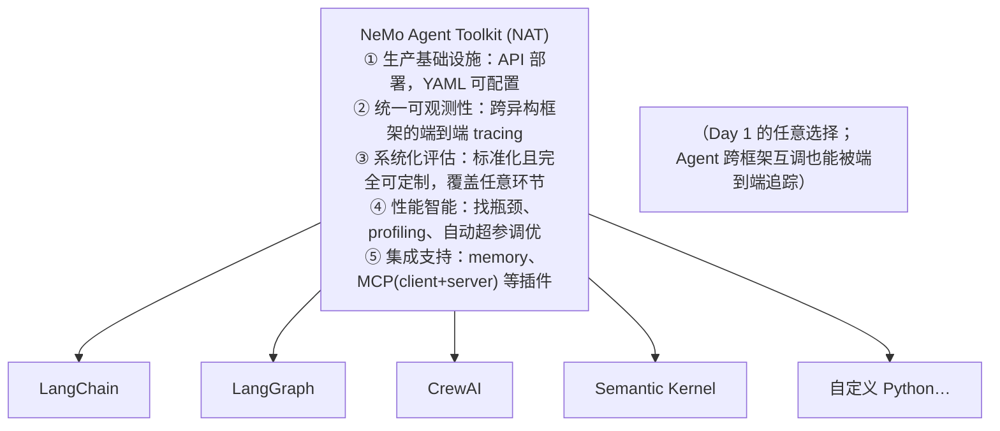

# L1 · Day 2 难题与 NAT 配置驱动全景

> 课程：Nvidia's NeMo Agent Toolkit: Making Agents Reliable（DeepLearning.AI × Nvidia）
> 本课任务：建立全课的问题框架——**Day 1 是把 Agent 建出来，Day 2 是其余一切**；然后看 NAT 作为"统一接口层"如何用**配置驱动**的方式逐一回应 Day 2 Problems。纯理念课，无代码。

## 0. 本课目标

课程终点：一个完整的 agentic 应用——带 observability、API 部署、evaluation，以及连着可用 Agent 的前端 UI。起点是你我都熟悉的状态：本地原型 Agent 在自己跑过的实验里给出预期答案，**但 shipping to production is where reality hits**——不管你用的是 LangChain、LlamaIndex、CrewAI 还是自定义 Python，交到别人手里才暴露真问题；而且众多优秀的 agentic 框架**彼此并不无缝协作**。

## 1. Day 2 Problems：五类"建完之后"的麻烦

Day one is building the agent. **Day two is everything else**：

| 问题 | 内容 |
|---|---|
| **集成复杂度** | 多 Agent 系统建在异构组件上，Agent 内含任意嵌套的 tools 和 sub-agents，管理难度随之陡增 |
| **可重复性** | Agentic 系统是非确定性的，没有一致性其价值就打折；一个小参数变动或换一个 LLM 就能剧烈影响表现——"It worked on my machine" 在生产里不成立 |
| **代码复用** | 各团队做出了好 Agent 好工具，但跨框架共享往往意味着重新实现；碎片化让开发者重复造轮子，而不是复用组织的集体成果 |
| **性能与成本** | 大部分计算发生在外部系统（昂贵的 LLM 调用），瓶颈藏在复杂度里——时间花在哪？token 烧在哪？混合负载让优化无从下手 |
| **生产要求** | 把 Agent 暴露为 API、监控内部发生了什么、保证边界情形不打垮生产、从反馈中持续学习并保护数据隐私、建立能快速定位问题的 evaluation |

> **架构师视角**："Day 2"这个词把"生产化"从一句空话拆成五个可枚举的工程问题，本身就是很好的面试语言。注意五项几乎都不依赖具体框架——这解释了 NAT 的站位：不做"又一个编排框架"，而做**框架之上的横切层**，因为 Day 2 问题天然是横切关注点（cross-cutting concerns）。

## 2. NAT 是什么：框架之上的统一接口层

NeMo Agent Toolkit 是**开源 Python 库**，桥接"原型 Agent"与"久经考验、可部署的产品"（battle-hardened deployable products）。三个立场性特征：

- **开源 = 无 vendor lock-in**：可审代码、可贡献改进、可部署在任何地方；
- **不替换你的 Day 1 选择**：无需拆掉既有框架或重写应用——LangChain / LangGraph / CrewAI / Semantic Kernel / Google ADK / LlamaIndex 或任何你在用的东西，NAT 都**增强（augment）**而非取代；开源可插拔，没列到的库也容易接入，官方还在持续新增；
- **安装一条命令**：`pip install nvidia-nat`，特定框架的插件按需可选安装。

作为"统一接口层"（unified interface layer），NAT 提供五块能力：

## 3. 关键差异点：config driven（配置驱动）

NAT 与典型库的不同之处：**不把 agents / tools / workflows 硬编码进代码，而是定义在一个 YAML 配置文件里**——工具变成可组合的函数，LLM 选择在 config 里声明，workflow 结构也定义在同一份 config 里。

为什么重要？配置文件比代码**更容易改、可以版本控制、更方便做实验**：

- 换一个 LLM，**不碰 Python**；
- 加一个新工具，只需在 YAML 里加几行；
- 对不同的 workflow 配置分别跑 evaluation，看哪个最好——全程不改代码。

> **对比 DSPy 课 L3 的 MLflow tracing**：DSPy 那边一行 `mlflow.dspy.autolog()` 把埋点写进代码，快但埋点选择与代码耦合；NAT 把 telemetry sink、eval、workflow 结构全部推到 YAML——**同一份代码，多份配置各自成为可版本化、可对照实验的 artifact**。这正是 5-observability-eval.md 子决策 3（prompt/agent 版本化与配置管理）强调的"eval 可复现底座"：配置即实验单元。

## 4. 生产化的四个具体问题（NAT 逐一给工具）

把 Agent 推向生产时会浮现四个具体问题：

1. **看得见发生了什么**：Agent 收进输入、吐出输出，中间发生了什么？调用了几个工具？顺序如何？出错了错在哪？没有这层可见性，调试生产问题就是猜谜；
2. **部署为服务**：本地脚本对其他应用毫无用处；必须把 Agent 暴露成某种 API，让其他服务、dashboard、应用能查询它——这需要结构化的部署；
3. **知道它是否在正常工作**：测试期看着正确，上线后才冒出 edge cases、幻觉、错误的工具选择——必须有系统化 evaluation 在影响用户之前抓住它们；
4. **理解性能与成本**：LLM 调用花钱、工具调用花时间；生产环境需要细粒度地知道时间和钱花在哪，才能聪明地优化。

## 5. 可观测性：telemetry 进 config，不进代码

如何从 agentic 系统里拿到 telemetry 和性能数据？三种做法的分野：

| 做法 | 问题 |
|---|---|
| 根本不考虑 | 生产出事只能靠猜 |
| 把 telemetry sink 硬编码进代码 | 业务逻辑与日志/telemetry 交织，改一处动全身 |
| **NAT：经 config 文件加 instrumentation** | 产出 OpenTelemetry 数据交给你的可观测团队/系统，逻辑与埋点解耦 |

结果是一块 **unified single pane of glass**（统一的单一视窗）：完整可见性，团队用他们已经熟悉信任的工具去管理和调试复杂系统。收益：生产出问题时你有 execution trace，可以判断问题是**慢工具、token 超耗、选错工具，还是完全别的东西**。

> **对比 5-observability-eval.md 的埋点/后端分层**：NAT 在这张分层图里同时占两个位置——它是**埋点层**（以 config 声明方式产出 OTel 标准数据），且刻意**不绑定后端**（数据"pass it on to your observability team system"，Phoenix 只是本课选的一个后端）。这与选型笔记的结论一致：埋点层认标准（OpenTelemetry）、后端可替换，才不会被单一观测平台锁死。

## 6. Observability vs Evaluation：相似但不同

- **Observability 告诉你发生了什么**——让你看进正在运行的系统；
- **Evaluation 告诉你发生的事对不对**——对错的标准由你定义：给定输入，你知道正确输出应当是什么。

NAT 允许你构建这些输入/输出对组成的 **evaluation set**，以自动化方式反复运行来测试系统；然后你可以放开手改配置文件，跑 evals 看改动对 Agent 的影响。这很重要，因为 **Agent 是自适应系统**：不走预定代码路径——这正是其强大之处，但也意味着 edge cases 会冒出来，evaluation 帮你**系统性地**发现它们。本课程里你会真的遇到一个**部署后才出现的 bug**（随手测试根本测不出来），用 evaluation 系统性地抓住它，并理解成因。

## 7. 更进一步：Optimizer 与 Profiler（本课不实操）

- **Optimizer**：基于 **Optuna + 遗传算法**自动调优 workflow。你声明哪些参数可调（LLM temperature、模型选择、重试逻辑、工具参数），声明你在乎的指标（accuracy / latency / token cost），optimizer 用不同参数组合跑测试用例，找出最优设置。案例：优化器发现一串**顺序工具调用可以并行化**，并行后 workflow 耗时大幅下降；另一个 agentic 应用只是跑了一遍 optimizer 就获得巨大改进；
- **Profiler**：洞察 workflow 性能——同一 workflow 跨多个模型测试 prompt/completion token，细看 token 用量、工具执行时长、workflow 模式。

两者共同消除 Agent 调优里的猜测成分；课程不实现它们，属于掌握基础后可自行探索的能力。

## 8. 课程项目预告

要建的是**真实系统**：一个气候科学 chatbot，能抓取、分析、可视化真实 NOAA 气候数据——不是 demo：自己写代码、自己部署、看它实时工作（有时失败）。路线：从独立 Python 函数构建的基础 **ReAct agent** 出发，逐步叠加真实能力——API 部署 → 可观测性集成 → 互操作性 → 系统化评估 → 最后加 UI，每步都建立在前一步之上；期间会观察 token 用量、连接 API、组合多个 Agent、调试意外行为，还会用评估工具发现并修复一个真实 bug。

## 9. 本课总结

| 要点 | 一句话 |
|---|---|
| Day 2 Problems | 集成复杂度 / 可重复性 / 代码复用 / 性能成本 / 生产要求，五类"建完之后"的麻烦 |
| NAT 站位 | 开源 Python 库，框架之上的统一接口层，augment 而非替换 Day 1 选择 |
| Config driven | agents/tools/LLM/workflow 全在 YAML：可版本控制、可实验、换模型不碰代码 |
| 可观测性做法 | telemetry 经 config 声明产出 OpenTelemetry，不与业务逻辑交织 |
| Observability ≠ Evaluation | 前者看发生了什么，后者判断对不对（eval set 自动化反复跑） |
| Optimizer/Profiler | Optuna+遗传算法自动调参、token/耗时画像——进阶能力，本课不实操 |

> **记忆点（引出 L2）**：本课反复出现的词是 **config**——工具、LLM、workflow、telemetry、eval 全部进 YAML。L2 就从这份 YAML 落地：写一个最小配置（llms + workflow 两段），用 **NAT CLI** 的 `nat run` 跑通、`nat serve` 变成 OpenAI 兼容 API，再接上 UI。

## 与我的资产映射

- 可观测/评估层：`agent/skills/agent-selection/5-observability-eval.md`（埋点层 vs 后端分层；子决策 3 的配置版本化 = NAT config driven 的理论对应）
- 部署层：`agent/skills/agent-selection/9-serving-deployment.md`（"本地脚本 → 暴露为 API"的形态跃迁）
- 方法论：课程 21 Evaluating AI Agents（observability vs evaluation 的分野、eval set 构建）
- [[project_selection_matrix]]
