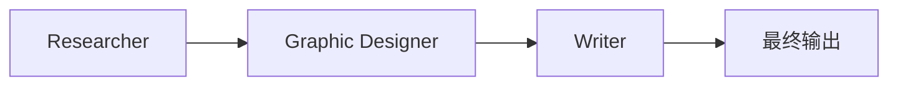

# L4 多智能体工作流（Multi-Agent Workflow）

## 为什么要多个 agent

第一次听到"多智能体"很容易问：底层都是同一个 LLM、同一台机器，为什么要分多个 agent？

讲者给出两个类比：

1. **单机但多进程/多线程**：即使一台 CPU，把工作拆成多个进程也更便于推理和组织代码。
2. **雇人做事**：复杂任务可以雇一个全能选手，但更常见的是**雇一个团队**，让不同角色分工。

把"我该雇几个不同角色的人？"这个思维框架搬到 agent 设计上，是把复杂任务拆成子任务的另一条有效路径。

## 几个典型分工场景

| 任务 | 团队成员 |
|---|---|
| 制作营销资料 | 调研员、平面设计师、文案 |
| 写研究文章 | 调研员、统计员、主笔、编辑 |
| 准备法律案件 | 律师助理、资深律师、调查员 |

人类社会本来就这么干——把它映射到 agent 上很自然。

## 案例：太阳镜营销资料生成

三个 agent，各自的职责 + 所需工具：

| Agent | 职责 | 工具 |
|---|---|---|
| **Researcher（调研员）** | 分析市场趋势、研究竞品 | web search |
| **Graphic Designer（平面设计师）** | 生成图表和图像 | 图像生成 API / 代码执行（画图） |
| **Writer（文案）** | 把调研和图像整合成最终文案 | 不需要额外工具，LLM 写字够用 |

### 怎么"造一个 agent"

很朴素：**用 prompt 让 LLM 扮演那个角色**。例：

> 你是一名调研 agent，擅长分析市场趋势与竞品。请就 [太阳镜产品] 做一次在线调研，总结当前市场趋势以及竞品在做什么。

平面设计师、文案 agent 同理——角色 prompt + 对应工具 = 一个 agent。

> 课程后续用紫色框表示 agent，绿色框表示工具——这个视觉约定下一讲还会用到。

## 通信模式之一：线性流水（Linear）

三个 agent 串成一条链：

- Researcher 写出趋势 + 竞品报告。
- 报告交给 Graphic Designer 生成可视化和图像素材。
- 全部素材交给 Writer 撰写最终营销手册。

### 优势

- **关注点分离**：可以专心打磨某一个 agent；多人协作时，不同人甚至能并行开发不同 agent。
- **可复用**：今天给营销手册做的平面设计 agent，可能稍加通用化就能给社交媒体帖子、网页插图都用上。

## 通信模式之二：经理协调（Hierarchical / Manager）

之前讲 tool use 时，给 LLM 的是一组**工具**；现在把它们换成一组**agent**——让一个上层 LLM 决定**调用哪个 agent 完成哪一步**。

### prompt 大致

> 你是一名营销经理。你有以下团队成员可以分派任务：……
> 请就用户请求返回分步骤计划。

经理（Marketing Manager）的计划可能是：

1. 让 Researcher 调研当前太阳镜趋势 → 拿回报告。
2. 让 Graphic Designer 出图 → 拿回素材。
3. 让 Writer 写报告 → 拿回稿件。
4. 经理自己再做一轮 **reflection**，对最终稿件做一次审阅与改进。

### 一个有意思的视角

经理本身**也是一个 agent**——所以整个系统其实是 **4 个 agent**：经理 + 三个执行者。这是把 planning 模式直接搬到多 agent 场景的产物：**让一个 LLM 规划，调用对象不是工具而是其他 agent**。

## 这一讲里出现的两种模式

1. **线性**：A → B → C，逐棒传递。
2. **经理调度**：一个 manager agent 协调多个下属 agent。

## 下一讲

多 agent 系统里最重要的设计决策之一就是：**agent 之间怎么通信**。下一讲展开常见的几种通信模式。
